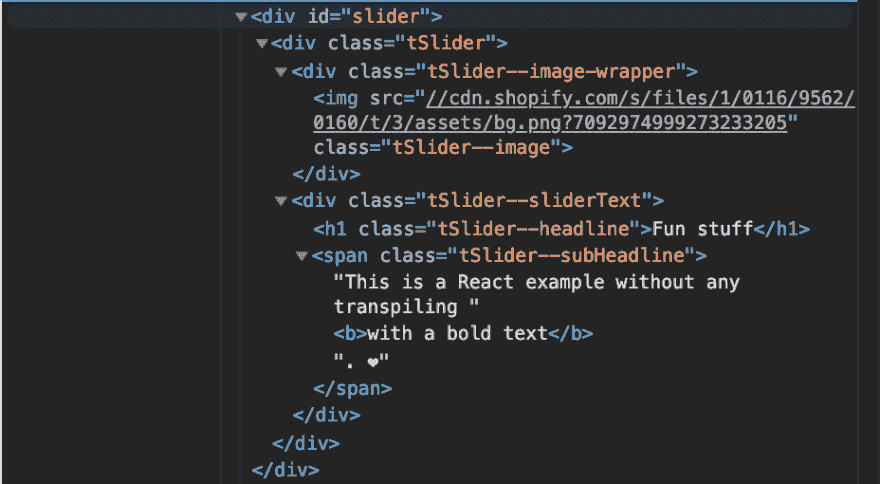

# 对 React 的误解

> 原文：<https://dev.to/saifadin/misconceptions-aboutreact-5a8h>

我们都知道，戏剧和框架迷永远不会消失，而且对某些技术有许多误解。这个帖子不是为了说服任何人使用 [React](https://reactjs.org/) ，而是为了消除误解。没有什么比阅读一条推文和一篇博客文章更糟糕的了，这显然是理解上的错误。

让我们开始吧。

* * *

## 1。React 需要传输

这个很有趣。您可以使用 [`babel`](https://babeljs.io/) 或 [`webpack`](https://webpack.js.org/) 完全不需要任何转换步骤就可以使用 React。这甚至是医生教给你的第一件事。我为客户做了许多小部件和工具，集成到 Shopify 商店、Wordpress 页面甚至运行在其他框架上的应用程序中，只需加载 react 和 react-dom 库并添加一个`script`标签。

```
<script src="https://unpkg.com/react@16/umd/react.production.min.js"></script>
<script src="https://unpkg.com/react-dom@16/umd/react-dom.production.min.js"></script>

<script>
  const e = React.createElement;
  function SliderImage() {
    return e('div', { className: 'tSlider--image-wrapper' }, e('img', { src: '//cdn.shopify.com/s/files/1/0116/9562/0160/t/3/assets/bg.png?7092974999273233205', className: 'tSlider--image' }));
  };
  function Text() {
    return e(
      'div',
      { className: 'tSlider--sliderText' },
      e('h1', { className: 'tSlider--headline' }, 'Fun stuff'),
      e(
        'span',
        { className: 'tSlider--subHeadline' },
        'This is a React example without any transpiling ',
        e('b', null, 'with a bold text'),
        '. ❤️'
      )
    );
  };
  function TeduschSlider() {
    return e(
      'div',
      { className: 'tSlider' },
      e(SliderImage),
      e(Text)
    );
  }
  const domContainer = document.getElementById('slider');
  ReactDOM.render(e(TeduschSlider), domContainer);
</script> 
```

这将呈现一个带有图像和少量文本的标题。我们在这里使用的是`React.createElement('div')`函数，它相当于`<div></div>`格式的 JSX。

没有 transpilers 也很有可能编写 React。

免责声明:因为许多人向我提到过这一点，所以这当然不是编写 React 组件的好方法。这是一个有效的方法，但是写 JSX，也就是合成糖，更有效。

* * *

## 2。React 不可检查/不是真正的 HTML

#1 中示例的结果是从浏览器中复制出来的 HTML 代码:

```
<div class="tSlider">
  <div class="tSlider--image-wrapper">
    
  </div>
  <div class="tSlider--sliderText">
    <h1 class="tSlider--headline">Fun stuff</h1>
    <span class="tSlider--subHeadline">
      This is a React example without any transpiling <b>with a bold text</b>. ❤️
    </span>
  </div>
</div> 
```

这是 Chrome DevTools 中元素标签的显示方式。

[](https://res.cloudinary.com/practicaldev/image/fetch/s--gNb6kooD--/c_limit%2Cf_auto%2Cfl_progressive%2Cq_auto%2Cw_880/https://thepracticaldev.s3.amazonaws.com/i/3moyq2d9xew5uhxpco0y.png)

对我来说看起来很像 HTML，并且可以像普通的 HTML 一样检查。

* * *

## 3。React 促进内联样式

我做过很多应用程序，和很多客户合作过，我很少看到有人在 React 中使用内联样式。在极少数情况下，动态添加背景图像或根据特定动作改变颜色，尽管有更好的解决方案。

React 确实有很多 CSS-in-JS 解决方案，这里仅列举几个:[情感](https://emotion.sh/)、[风格化组件](https://www.styled-components.com/)等等。其中的每一个都有自己的 CSS 编写风格。有些甚至有多种有效的推荐方式。

React 团队最流行的启动 React 项目的方式是 [`create-react-app`](https://github.com/facebook/create-react-app) 。它有三个开箱即用的选项:css、SCSS 和 CSS 模块(许多人会认为这只是普通的 CSS)。

如果你使用的是 webpack 这样的捆绑器，你只需要导入一个 CSS 文件，样式就会自动添加。简单的`import './styles.css`就够了。

* * React 中处理样式的方式使其多样化，每个团队/个人都可以自己决定什么是正确和最佳的方法。没有教条化。**

* * *

## 4。React 不使用 web 标准

这是我最喜欢的，也是最难支持或反对的。web 标准这个术语很随意，但是大多数人指的是 HTML、CSS 和 JS。

这就是事情变得奇怪的地方。React 只使用 JS，ReactDom 协调器将它转换成 HTML 节点，如果需要的话，CSS 被注入到浏览器中，或者在开始时加载。

在我看来，这是纯粹的网络标准。

* * *

## 5。React 不可访问

这种误解来自于许多开发人员对编写可访问的应用程序不感兴趣。这种行为存在于所有的框架和技术中。这是当前 web 开发的一个普遍问题。

资源和培训的缺乏，以及来自不关心可访问性的产品管理或首席执行官的压力导致了这种情况的发生。这似乎是 React 的问题，因为 React 是目前使用最多的库。

React 生态系统中值得一提的项目尤其是由伟大的肯特·c·多兹和瑞安·弗洛伦斯设计的[降档](https://github.com/downshift-js/downshift)和[到达](https://ui.reach.tech/)。他们在这些领域教育开发者的努力是巨大的。如果你正在使用 eslint，将 [eslint-plugin-jsx-a11y](https://dev.toeslint-plugin-jsx-a11y) 添加到你的配置中会大大提高你的可访问性。

我们需要在 web 开发领域就可访问性进行更广泛的讨论。

* * *

## 6。React 太难学了

如果您想在 React APIs 中使用每一个概念，那么是的，您可能是对的。但是这些 API 中的许多对于许多开发人员来说并不是必需的。React 生态系统中最后一个显著改变我们编写代码方式的是 React v16.8.0 中的钩子更新，但它并没有消除以旧方式编写代码的可能性(例如，用类)。

React 引入了一个新的上下文 API，一种使用`refs`的新方式，并且改变了生命周期挂钩。老实说，去年我一直在开发类似于[的应用程序](https://app.thehomelike.com/)，这三个我都没用过。直到一个月前，我第一次在一个内部应用程序中添加了一个上下文，所以我不必在应用程序中添加 Redux。

如果你只是想写 React，那就去上课吧。想使用函数，使用 React.createElement. React 让你可以随心所欲地写。

* * *

欲了解更多信息，请访问开发平台上的 React 类别。

## # [反应过来](/t/react)

Official tag for Facebook's React JavaScript library for building user interfaces

最后，我希望每个人都能以应有的尊重对待其他技术。所有这些项目都存在，因为人们对它们充满热情。如果你不想用它们，那是你自己的事。但是不要因为别人的决定而激怒他们。