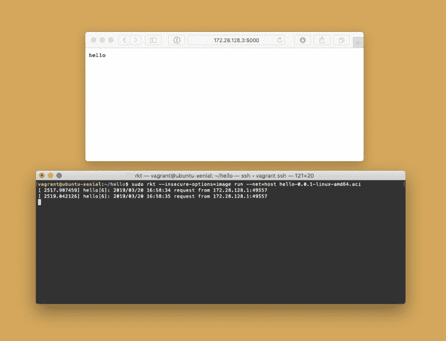

# 我的 rkt 入门之旅

> 原文：<https://dev.to/avery/my-adventure-getting-started-with-rkt-3pio>

我构建了一个想要容器化的应用程序。Docker 似乎是最受欢迎的容器化选项，所以我从他们的网站上学习了如何构建 docker 图像。唯一的问题是 Docker 的社区版不能在 RHEL 上运行，我不认为我能说服我们的 IT 部门为我的一次性项目投资 Docker enterprise，这个项目没有它也能很好地工作。(我还应该指出，我们不是软件或 IT 咨询公司。除了这个项目，这里没有多少人会发现 Docker enterprise 的价值。)也许我可以找到一个免费的、开源的替代品。

在我搜索 [Docker 替代选项](https://alternativeto.net/software/docker/)时，我找到了 [RKT](https://github.com/rkt/rkt/) (发音为“火箭”)，这将我带到了[应用容器(appc)规范](https://github.com/appc/spec/)，它定义了[应用容器图像(ACI)格式](https://github.com/appc/spec/blob/master/spec/aci.md#app-container-image)。显然，appc 规范不再作为一个独立的协议被开发，因为它已经融入了[开放容器倡议(OCI)](https://www.opencontainers.org/) 。以下是 appc 的 github 页面中的免责声明:

> 随着[开放容器倡议(OCI)](https://www.opencontainers.org/) 的形成，业界聚集在一个地方来定义应用程序容器的规范。
> OCI 旨在整合现有容器(如 appc)的最佳元素，一些 appc 维护者作为维护者和技术监督委员会(TOB)成员参与了 OCI 项目。
> 因此，自 2016 年末起，除了为支持现有实施而进行的小调整外，不再积极开发 appc。
> 
> 非常鼓励对集装箱规范感兴趣的团体加入 OCI 社区。
> 
> *   App 容器图像格式(ACI)或多或少直接映射到 [OCI 图像格式规范](https://github.com/opencontainers/image-spec)，除了签名和依赖关系。
> *   App Container Executor (ACE)规范在概念上与 [OCI 运行时规范](https://github.com/opencontainers/runtime-spec)相关，其显著区别在于后者不支持 pods，并且通常在较低的规范级别上运行。
> *   在 OCI 项目中，应用程序容器映像发现还没有一个等效的规范(尽管它已经被[讨论过](https://groups.google.com/a/opencontainers.org/forum/#!msg/dev/OqnUp4jOacs/ziEwxasyFQAJ)并且被[提议过](https://groups.google.com/a/opencontainers.org/forum/#!msg/tob/oaEza4cu25M/gBLeHm5NFAAJ)
> 
> 更多信息，请看 [OCI 常见问题](https://www.opencontainers.org/)和最近 [CoreOS 宣布 OCI 图像格式的博客文章](https://coreos.com/blog/oci-image-specification.html)。

换句话说，我下面用的工具是**过时的**。我在这里记录我的冒险经历，但是你不应该把这看做是一个推荐或者一个最佳实践。在我完成了下面的“入门”练习后，我意识到 OCI 维护了几个官方工具，像 [`runc`](https://github.com/opencontainers/runc) 和 [`oci-image-tool`](https://github.com/opencontainers/image-tools) 可能更适合这个任务。我改天再研究那些工具。

让我们跳进来。

# rkt 入门

先说 [rkt 的入门指南](https://github.com/rkt/rkt/blob/master/Documentation/getting-started-guide.md)。乍一看，该指南非常简单:创建一个 go 应用程序并为其构建一个 ACI。但是，我无法在我的开发机器上直接做到这一点(我运行的是 MacOS，指南声称这只能在 Linux 上做到)。相反，我首先需要使用 vagger 启动一个 linux VM。

该指南掩盖了一些先决知识，如围棋和流浪。当我第一次使用它时，我遇到了一些障碍，因为我以前从未使用过这两种工具。我将一步一步地浏览指南，并在适当的地方添加上下文和注释。

## 用 vagger 设置一个虚拟的 linux 主机

安装好[流浪汉](https://www.vagrantup.com)后，我们就可以按照说明启动 rkt VM 了，从[这里](https://github.com/rkt/rkt/blob/master/Documentation/trying-out-rkt.md)。简单地说，这里有一些说明:

```
git clone https://github.com/rkt/rkt
cd rkt
vagrant up # this step takes a while
vagrant ssh 
```

对`vagrant ssh`的最后一次调用是您登录虚拟机的原因。

rkt `Vagrantfile`设置了一个预装 rkt 的 Ubuntu VM，但是它没有附带 go 编译器，或者说`acbuild`。由于安装 Go 和 acbuild 不在本文的讨论范围之内，所以我将省去您亲自安装的麻烦。如果您将下面的命令粘贴到您的流浪虚拟机的外壳，您将启动和运行。

```
# Install the golang compiler
GO_VERSION=1.12.1
GO_OS=linux
GO_ARCH=amd64
GO_TARBALL=go$GO_VERSION.$GO_OS-$GO_ARCH.tar.gz
wget https://dl.google.com/go/$GO_TARBALL
sudo tar -C /usr/local -xzf $GO_TARBALL
rm $GO_TARBALL
export PATH=$PATH:/usr/local/go/bin

# Install acbuild
ACBUILD_VERSION=0.4.0
ACBUILD_TARBALL=acbuild-v$ACBUILD_VERSION.tar.gz
wget https://github.com/containers/build/releases/download/v$ACBUILD_VERSION/$ACBUILD_TARBALL
sudo tar -C /usr/local -xzf $ACBUILD_TARBALL
rm $ACBUILD_TARBALL
export PATH=$PATH:/usr/local/acbuild-v$ACBUILD_VERSION 
```

既然已经处理了先决条件，我们应该能够继续学习入门教程了。

## 编译样例 Go 应用程序

你应该还在你的流浪虚拟机里。创建一个名为`hello`的空文件夹(文件夹的名称很重要，因为它将成为编译后的可执行文件的名称)，并在其中创建一个名为`hello.go`的文件，内容如下。

```
package main

import (
    "log"
    "net/http"
)

func main() {
    http.HandleFunc("/", func(w http.ResponseWriter, r *http.Request) {
        log.Printf("request from %v\n", r.RemoteAddr)
        w.Write([]byte("hello\n"))
    })
    log.Fatal(http.ListenAndServe(":5000", nil))
} 
```

从这里开始，您应该能够使用以下命令编译静态链接的二进制文件:

> **注**:我不清楚为什么二进制文件静态链接比动态链接重要，但是指南似乎强调二进制文件应该静态链接。

```
CGO_ENABLED=0 go build -ldflags '-extldflags "-static"' 
```

如果你想测试 go 应用程序，你可以用`./hello`运行它。它将在端口`5000`上侦听传入的 HTTP 请求，并用`hello`进行响应。在虚拟机上运行`ip address`,看看它绑定到什么 IP 地址。

## 用 actool 创建图像

下一步是使用`acbuild`创建图像。根据单据，`acbuild`不再维护，并且

> **注**:我第一次到这一步的时候，`acbuild`一直告诉我它想以 root 身份运行，但是当我重新开始写这篇文章的时候，它没有 root 也能愉快地工作。我不确定我第一次做错了什么，但是你*应该*能够在你的虚拟机
> 中作为默认`vagrant`用户运行这些命令

```
acbuild begin
acbuild set-name example.com/hello
acbuild copy hello /bin/hello
acbuild set-exec /bin/hello
acbuild port add www tcp 5000
acbuild label add version 0.0.1
acbuild label add arch amd64
acbuild label add os linux
acbuild annotation add authors "Carly Container <carly@example.com>"
acbuild write hello-0.0.1-linux-amd64.aci
acbuild end 
```

## 用 rkt 运行镜像

```
rkt --insecure-options=image run hello-0.0.1-linux-amd64.aci 
```

一旦容器开始运行，你必须输入三次`^]`才能杀死容器。

这个命令将从您的新映像创建一个新容器，但是您将无法从您的主机环境轻松访问它，因为它运行在一个包含*的*网络中。如果您希望容器内的端口向运行它的机器(在本例中是我们的 VM)公开，我们必须指定`--net=host`选项。

```
rkt --insecure-options=image run --net=host hello-0.0.1-linux-amd64.aci 
```

# 跑步！

[](https://res.cloudinary.com/practicaldev/image/fetch/s--MyKCMmcp--/c_limit%2Cf_auto%2Cfl_progressive%2Cq_auto%2Cw_880/https://thepracticaldev.s3.amazonaws.com/i/xn41qrp43d4l704ftj8p.png)

这样，我就有了一个运行自定义代码的容器！对我来说，这是一次有趣的、有教育意义的经历。我希望你也学到了一些东西！