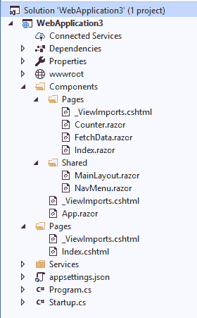
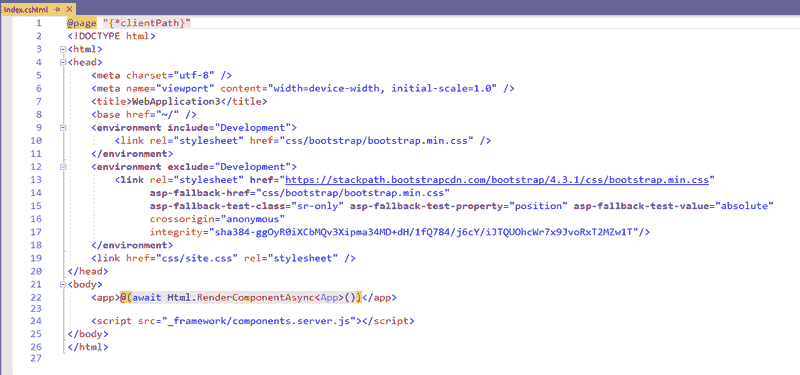
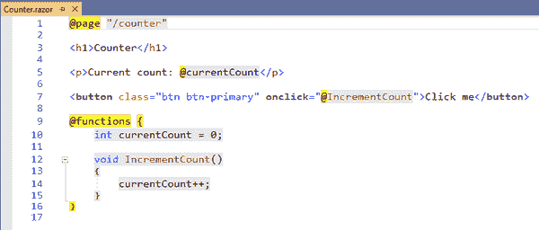
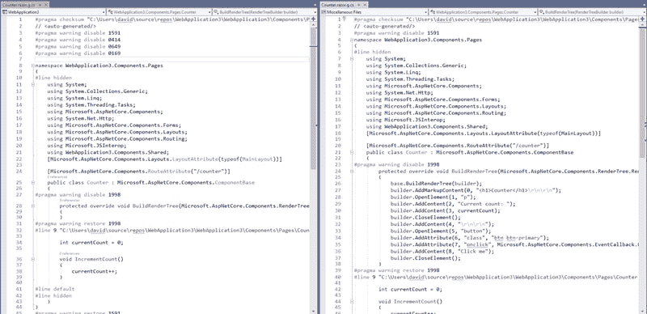
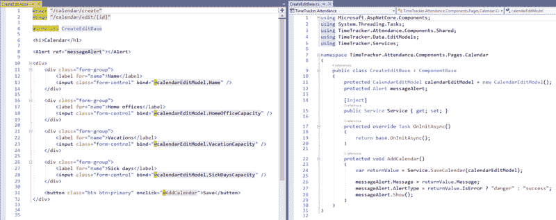

# 我对剃须刀组件的第一印象

> 原文：<https://dev.to/davidsonsousa/my-first-impressions-of-razor-components-40kl>

首先，我要说的是 [Scott Hanselman](https://twitter.com/shanselman) 对[什么是 Blazor，什么是剃须刀组件](https://www.hanselman.com/blog/WhatIsBlazorAndWhatIsRazorComponents.aspx)做了一个很棒的解释。如果你不知道我在说什么，你应该检查一下，因为在这里，我将只谈论我到目前为止的经历，而不进入定义。

去年年底，我开始听说对 **Blazor** 的支持越来越多，这是一个实验框架，将 C#和 HTML 编译成 [Web Assembly](https://webassembly.org/) (Wasm)。但在同一时期，我也听说了服务器端的 Blazor——后来更名为**剃须刀组件**。

在我写这篇文章的时候, [Blazor 仍然是实验性的(版本 0.9.0)](https://devblogs.microsoft.com/aspnet/blazor-0-9-0-experimental-release-now-available/) ,用它制作的应用程序不应该在生产中使用。另一方面，剃须刀组件应该会在今年与新款一起发布。网芯。由于两者的工作方式几乎相同，我决定尝试一下剃须刀组件。

## 工装

截至目前，我正在使用:

*   SDK:。网芯 3.0.100 预览版 3 (010431)
*   运行时:。网络核心 3.0.0 预览版 3(27503-5)/ASP.NET 核心 3.0.0 预览版 3 (19153-02)
*   IDE: Visual Studio 2019 RC.2

SDK 和运行时可以在[这里](https://dotnet.microsoft.com/download/dotnet-core/3.0)下载，而 Visual Studio 2019 RC 可以在[这里](https://visualstudio.microsoft.com/downloads/#2019rc)下载。

安装 VS 2019 后，我需要做的第一件事就是让它使用预览库。我是通过进入选项->项目和解决方案->来完成的。NET Core 并启用*使用预览。网芯 SDK* 。直到那时，我才能够创建我的第一个 Razor 组件应用程序。

创建应用程序后，有几件事需要注意:

*   文件结构，只包含**组件**、**页面**及其各自的子文件夹；
*   **。razor** 文件，这让我想起了旧的 ASP 3(或 PHP)文件。但我稍后会更多地谈到它们；
*   Startup.cs、Program.cs 和 appsettings.cs 文件，这些文件与在常规 ASP.NET 核心网站上看到的相同

## 项目

如前所述，文件结构很简单——只包含**组件**、**页面**及其各自的子文件夹。对于 ASP.NET 开发人员来说，Pages 文件夹看起来很熟悉，因为它包含 _ViewImports.cshtml 和 index . cs html——这两个文件在以前版本的 MVC 中都可以看到。我们必须记住，Razor Components 的工作方式类似于 SPA，这意味着我们的 Index.cshtml 将包含整个 web 应用程序。

Components 文件夹在其各自的文件夹中包含多个 _ViewImports.cshtml 文件，但也有多个。剃刀锉。这些文件是我们应用程序的“页面”。它们可能包含标记(HTML 和 Razor)和 C#代码。

## 编译

我在创建我的小原型时注意到的一件事是，这些文件是如何被编译成扩展名为 **.g.cs** 的 C#类，并放置在 **/Razor** 和 **/RazorDeclaration** 文件夹中，这两个文件夹都在 **/obj/Debug/netcoreapp3.0** 中。虽然我以前见过这样的扩展(不记得在哪里了),但它帮助我们了解 Razor 文件是如何转换成 C#类的，以及标签是如何设置的。

我的理论是,/RazorDeclaration 文件夹中的文件是为了确保它们存在，因为它们唯一的方法是覆盖 **BuildRenderTree** ，后者是空的。至于/Razor 文件夹中的文件，你可以看到同样的方法(BuildRenderTree)用它的元素和绑定器构建整个 html 页面。也许这是一种不同类型的。NET 项目，他们决定将其引入 Razor Components。我不知道，我需要做一些研究，以了解那里到底发生了什么。

另外，添加到 *@functions* 中的内容也在那个类中。

## 如果你愿意，可以说是代码隐藏

如果你不想混合 C#语法和 Razor 标记，你可以创建一个单独的 C#文件并从 **ComponentBase** 类继承。然后在你的。razor 文件中，您应该添加一行来明确说明您将使用该类作为代码隐藏。台词是*@ inherits YourCodeBehindClass*。我个人的约定是用 *Base* 结束 C#类。这意味着:如果我的。razor 文件是 *CreateEdit* 我的 C#类会被叫做 *CreateEditBase* 。

这有助于使您的代码更有条理，并在那里创建一个真正的分离，这样您就可以让其他人来处理您的标记。

## 问题(至今)

我认为我遇到的最烦人的问题发生在我试图添加一个. razor 文件来创建一个日历列表的时候。我做了通常的事情:添加一个. razor 文件，给它命名并开始工作。当我试图编译它时，我得到一个错误，声称我的类不存在。我只能通过添加一个. cshtml 文件，编译项目，然后将其重命名为. razor 来解决这个问题。

另一个烦恼是，如果你想改变标记，你必须重新构建整个应用程序。这是可以理解的，当你记得这一切。剃刀和。cshtml 文件在编译过程中被转换成. g.cs 文件。也许将来他们会允许。剃刀文件触发建筑，就像我们现在做的。cs 文件。

## 结论

任何。至少对 MVC 有一点了解的. NET 开发人员会发现很容易理解发生了什么。毕竟，这里还是 ASP.NET。算是吧。此外，微软有一个非常好的文档，很快，一些书籍可能会开始出现。

我可以想象出一些可以使用 Razor 组件的场景，比如内部网或任何小规模使用的内部 web 应用程序。尽管如此，可能性是无穷无尽的。

但是要做好生产准备，还有很多工作要做。一旦完成，它就会刺，我要用它。可能还会支持这一点。