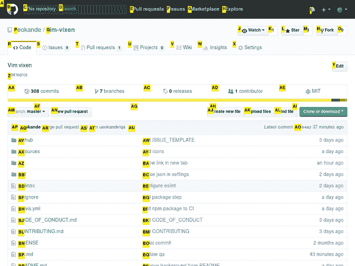
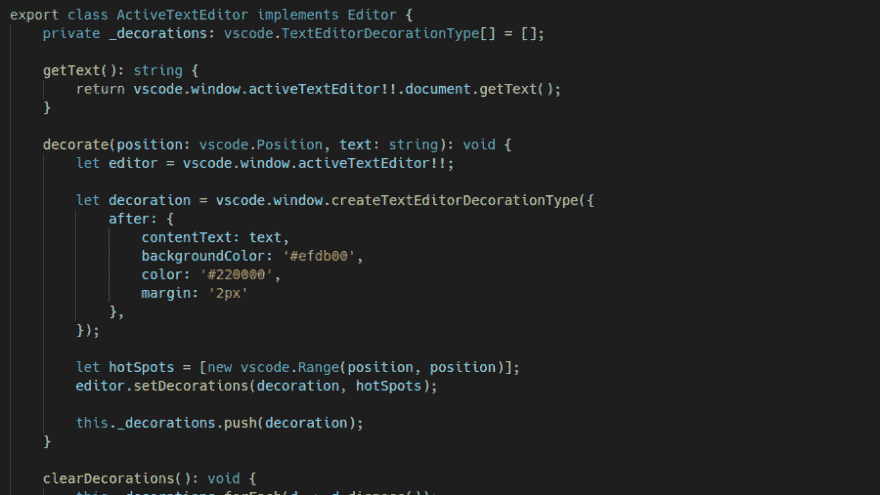

# 我的第一个 Visual Studio 代码扩展

> 原文：<https://dev.to/goyo/my-first-visual-studio-code-extension-3c92>

大约两天前，我在思考如何优化我通过键绑定导航代码的方式，我有了这个想法:如果我可以将编辑器“指向”正确的位置，而不需要弄清楚如何到达那里会怎么样？

我的第一个想法是将可视编辑器的区域划分成一个网格，其中每个单元格都有一个指定的键绑定。如果需要更高的精度，可以有第二个更小的网格，仅由您之前选择的单元格组成。

当我在脑海中思考这个想法时，我认为它并没有那么好，也不容易以一种可用的方式实现。但是后来我想到了别的事情...

几个月前，当我还在研究键盘导航和按键时，我使用了一个浏览器扩展，它允许我点击基于 1-3 个字母代码的东西，每当我想去某个地方时就会弹出来。

这种导航方式更符合我内心的发展，对于像我这样的新手来说，似乎更容易实现。

当然，我开始时试图寻找其他人已经实现的类似的东西，但我真的不知道我应该搜索什么，所以在几次尝试后我放弃了。

所以，昨天和今天，我疯狂地编码，在这上面花了太多时间，但是我有基本的想法:

你只需按下`Alt+A`，一个“组合”列表就会在你代码的不同位置弹出。一旦您键入了字符组合，您将被带到代码中的所需位置。在“导航模式”下，您还可以分别使用`f`和`j`键上下滚动。

我不得不承认代码远非完美，它可能并不总是正确地工作。尽管如此，同时我也超级好奇其他人(也就是你！)想想我也够现实，知道大概永远不会完美。

这就是我的第一个 Visual Studio 代码扩展:
[https://github.com/goyozi/visual-nav](https://github.com/goyozi/visual-nav)

让我知道你们的想法！