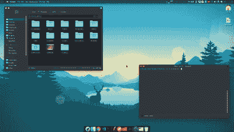
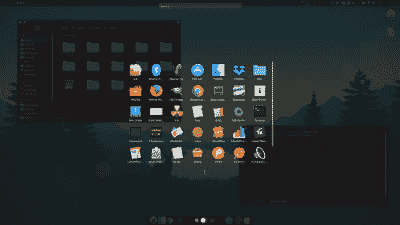

# 我的(k)Ubuntu (OSX 看起来像)桌面设置

> 原文：<https://dev.to/uf4no/my-kubuntu-osx-look-alike-desktop-setup-219g>

本文原载于[我的网站](http://www.antonioufano.com)。如果你喜欢它，请随时访问我，并在[我的博客](http://www.antonioufano.com/blog)中查看其他文章。

2018 年期间，我一直在我的个人笔记本电脑上运行 Ubuntu，尽管总体上我喜欢运行 Linux，但我并不完全喜欢 Gnome。动画很慢，有时我的桌面不像我认为的那样流畅，它应该在英特尔 i7 8550u，16GB 内存和一个非常快的 NVMe 固态硬盘上。此外，我有一半的时间在工作中使用 OS X，在它们之间切换有点痛苦。在尝试了不同的桌面环境，比如 Mate，甚至不同的 Linux 发行版之后，我想我终于找到了一个让我非常舒服的设置。看起来是这样的:

T3】

是的，我基本上在 Linux 上克隆了 OS X 的样子。我是这样做的。

### 操作系统

我运行的是 Kubuntu 18.04。这是一个 LTE 版本，它和 Ubuntu 的主要区别在于它使用 KDE 而不是 Gnome 作为桌面环境。KDE 的主要特点是它在默认情况下是非常可配置的(窗口外观，图标，光标...)并且您可以通过安装小部件来扩展它。如果你更喜欢运行 Ubuntu，有很多教程只需要在上面安装 KDE 就可以了，比如这个。

### KDE 构型

在系统设置中选择:

工作空间主题

*   观感:弧形黑色
*   桌面主题:Aex Dark -你必须使用“获取新主题”来下载它按钮。
*   光标主题:卡皮塔恩光标-你必须使用“获得新的主题...”来下载它按钮。

颜色:微风暗

字体:默认-我不喜欢摆弄字体配置，因为它很容易搞得一团糟。

图标:MAC OS X 印象-你必须使用“获取新主题”来下载它们按钮。

应用程序风格

*   小部件样式:微风
*   窗口装饰>主题:Breezemite dark -你必须使用“获取新主题...”来下载它按钮。
*   窗口装饰>主题>边框大小:非常大-这在使用触控板时非常有用，因为选择边框来调整窗口大小可能很困难。
*   窗口装饰>按钮:你可以重新排列按钮来关闭/最小化/最大化，并根据你的意愿添加其他按钮。我已经删除了最大化一个，并把它们安排在左边，并在右上角添加了一个菜单按钮。

桌面行为

*   锁屏>外观:选择壁纸。
*   虚拟桌面>桌面数量:3

窗口管理

*   任务切换器:掩护开关/网格-我不确定我更喜欢哪一个，但肯定不是 KDE 默认的那个。

启动和关闭

*   登录屏幕>主题:等离子辣椒-你必须使用“获取新主题...”来下载它按钮。
*   登录屏幕>高级>光标主题:Capitaine 光标

要更改桌面壁纸，只需右键单击桌面，然后转到配置桌面。您还可以在这里配置图标对齐、鼠标操作(如在桌面之间切换)等...

### 主面板部件

对于小部件，我做的第一件事是将主面板移动到屏幕顶部，并按此顺序(从左到右)添加以下小部件:

*   应用程序启动器:这是一个典型的菜单，包含了所有的系统应用程序，关机快捷方式等..我很少使用它，但它有时很有用。我换了一个更微妙的图标。
*   应用程序标题:这只是用来在全局菜单之前将应用程序的名称放在焦点上。在配置中，我将“无活动窗口标签”改为“自定义文本”，将“无活动自定义文本”改为“桌面”。然后我选择了粗体选项，这样这个名字就会弹出来一点。
*   全局菜单:复制 OS X 中的菜单项。它将包含典型的文件/编辑/查看...每个程序的选项。
*   面板间隔:只是在部件之间增加一个空间。
*   寻呼机:这些增加了在你的桌面之间移动的按钮。
*   数字钟:只是一个钟
*   系统托盘:Wifi、蓝牙、电池、更新、键盘布局(如果你有不止一个)等的典型菜单...您可以将其配置为显示/隐藏不同的选项。
*   面板间隔:小部件之间的小空间。
*   搜索:这将打开系统搜索。我已经配置了 Win+Space 的快捷方式，所以我可以从 OS X 获得类似 Spotlight 的东西。

### 码头

码头是拿铁码头。安装它最简单的方法是使用 KDE 软件中心(搜索 Latte ),如果你运行的是不同的 Linux 发行版，你可以在下面的文章中查看如何安装它。安装完成后，只需打开程序，在应用程序启动器的实用程序部分进行搜索。它有很多选项，但我只是配置它出现在底部中心，并调整图标的大小。你可以添加应用程序到它只是拖动图标。

对于应用程序启动器，我将 widget U Launcher 添加到 dock(您必须从 Add Widgets > Get new widgets 菜单安装它),并将其图标配置为带有火箭的图标。一旦打开，启动菜单看起来像这样:

T3】

### 其他人

使用上面的配置，您将获得与 OS X 非常相似的外观，但除此之外，您还可以获得其他功能:

*   像 Spotlight 一样搜索:使用搜索工具和快捷方式，你可以很快打开应用程序。您也可以输入一个 URL，它会在您的默认浏览器中打开它。默认情况下，它不会搜索您的文档，但我相信它可以配置为索引它们。
*   窗口排列:您可以将窗口拖动到屏幕边缘，以自动调整大小和排列它们。这在使用小屏幕和默认情况下不包含在 OS X 中的东西时非常有用。
*   触控板手势:我已经能够使用 libinput 添加基本的多点触控手势(指南[此处](https://devhub.io/repos/bulletmark-libinput-gestures))来改变桌面、水平和垂直滚动等..它工作起来非常流畅，你可以根据自己的意愿配置手势。
*   KDE 连接:如果你在你的手机(安卓)上安装了 KDE 连接应用程序，你的笔记本电脑和手机将会完美的结合在一起。你可以收到通知，回复通知，传输文件，多媒体控制，甚至可以用手机运行命令或作为远程输入(你可以移动鼠标和使用虚拟键盘)。太牛逼了！

### 结论

这种设置肯定不是完美的，但对于像我这样的人来说，我真的很喜欢 OS X 的外观和感觉，但不喜欢苹果笔记本电脑了(键盘，缺少端口，比需要的触控板大...)，它会非常有用。此外，如果您必须在 Mac 和 Linux 机器之间切换，它可以使过渡更容易。

希望你喜欢:)