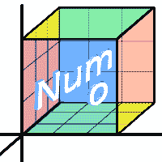
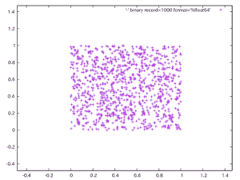
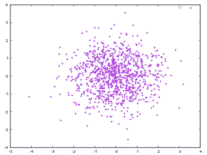

# NumPy 的 NArray - Ruby 等价物

> 原文：<https://dev.to/kojix2/narray-ruby-equivalent-of-numpy-30ji>

|  |  |
| --- | --- |

想用 Ruby 做快速计算？纳瑞是你的朋友！

# NArray & Cumo

### Numo::NArray

[GitHub](https://github.com/ruby-numo/numo-narray)

NArray 是 Ruby 中用于科学计算的强大的 N 维数组库。机器学习库如 [Rumale](https://github.com/yoshoku/rumale) 和 [Red Chainer](https://github.com/red-data-tools/red-chainer) 使用 NArray。

### Cumo

[GitHub](https://github.com/sonots/cumo)

> Cumo(发音为“koomo”)是一个支持 CUDA、GPU 优化的数值库，它提供了比 Ruby Numo 更大的性能提升，同时(大部分)保持了插件兼容性。

## 数组数据类型

| 整数 | 无符号整数 | 浮动 | 复数 |
| --- | --- | --- | --- |
| Numo::Int8 | Numo::UInt8 | Numo::SFloat | 编号::scomplex |
| Numo::Int16 | Numo::UInt16 | 编号::dfloat | 数字::dcomplex |
| Numo::Int32 | Numo::UInt32 |  |  |
| Numo::Int64 | Numo::UInt64 |  |  |

## 导入库

```
gem install numo-narray 
```

Enter fullscreen mode Exit fullscreen mode

```
require 'numo/narray'
include Numo 
```

Enter fullscreen mode Exit fullscreen mode

## 创建数组

```
Int32[1,2,3] 
```

Enter fullscreen mode Exit fullscreen mode

[1，2，3]

```
Int32.new(3,3).seq 
```

Enter fullscreen mode Exit fullscreen mode

[[0，1，2]，
，[3，4，5]，
，[6，7，8]]

```
a = [[0, 1], [2, 3]]
Int32[*a] 
```

Enter fullscreen mode Exit fullscreen mode

[[0，1]，
[2，3]]

```
Int32[1..5] 
```

Enter fullscreen mode Exit fullscreen mode

[1，2，3，4，5]

```
Int32[1...5] 
```

Enter fullscreen mode Exit fullscreen mode

[1, 2, 3, 4]

## 初始占位符

创建一个零数组

```
x = Int32.zeros(3,3) 
```

Enter fullscreen mode Exit fullscreen mode

[[0，0，0]，
[0，0，0]，
[0，0，0]]

创建一个 1 的数组

```
x = Int32.ones(3,3) 
```

Enter fullscreen mode Exit fullscreen mode

[[1，1，1]，
[1，1，1]，
[1，1，1]]

创建一个二进制数组

```
z = y.fill 2 
```

Enter fullscreen mode Exit fullscreen mode

[[2，2，2]，
[2，2，2]，
[2，2，2]]

创建一个 3x3 的单位矩阵

```
y = Int32.eye(3,3) 
```

Enter fullscreen mode Exit fullscreen mode

[[1，0，0]，
[0，1，0]，
[0，0，1]]

创建一个等距值数组

```
f = DFloat.linspace(-20,20,11) 
```

Enter fullscreen mode Exit fullscreen mode

[-20, -16, -12, -8, -4, 0, 4, 8, 12, 16, 20]

## 算术运算

```
require 'numo/narray'
include Numo 
```

Enter fullscreen mode Exit fullscreen mode

```
a = Int32.new(3,3).seq 
```

Enter fullscreen mode Exit fullscreen mode

[[0，1，2]，
，[3，4，5]，
，[6，7，8]]

```
b = Int32.new(3,3).seq + 1 
```

Enter fullscreen mode Exit fullscreen mode

[[1，2，3]，
，[4，5，6]，
，[7，8，9]]

```
a + b 
```

Enter fullscreen mode Exit fullscreen mode

[[1，3，5]，
，[7，9，11]，
，[13，15，17]]

```
b - a 
```

Enter fullscreen mode Exit fullscreen mode

[[1，1，1]，
[1，1，1]，
[1，1，1]]

```
a * b 
```

Enter fullscreen mode Exit fullscreen mode

[[0，2，6]，
，[12，20，30]，
，[42，56，72]]

```
a * 2 
```

Enter fullscreen mode Exit fullscreen mode

[[0，2，4]，
，[6，8，10]，
，[12，14，16]]

```
a * 0.1 
```

Enter fullscreen mode Exit fullscreen mode

[[0，0.1，0.2]，
，[0.3，0.4，0.5]，
，[0.6，0.7，0.8]]

## 类型转换

```
a = UInt8[1,2,3]
SFloat.cast(a)
# => Numo::SFloat#shape=[3] 
```

Enter fullscreen mode Exit fullscreen mode

## 点积

```
c = Int32.new(2,2).seq

# [[0, 1], 
#  [2, 3]]

d = Int32.new(2,1).seq

# [[0], 
#  [1]]

c.dot d

# [[1], 
#  [3]] 
```

Enter fullscreen mode Exit fullscreen mode

安装 Numo::Linalg

```
Numo::Linalg.dot(c,d)
Numo::Linalg.matmul(c,d)
# [[1], 
#  [3]] 
```

Enter fullscreen mode Exit fullscreen mode

## 视察 NArray

```
e = DFloat.new(3,4).seq

# Array dimensions
e.shape              # => [3, 4]

# Length of array
e.size               # => 12

# Number of array dimensions
e.rank               # => 2
e.ndim               # => 2

# Byte size
e.byte_size          # => 96 
```

Enter fullscreen mode Exit fullscreen mode

## 将数组转换为字符串

```
s = UInt8.ones(2,2).to_string
# => "\x01\x01\x01\x01"
# [[1, 1], 
#  [1, 1]]

UInt8.from_string(d)
# => Numo::UInt8#shape=[4]
# [1, 1, 1, 1] 
```

Enter fullscreen mode Exit fullscreen mode

## 将 NArray 转换为 Ruby 数组

使用`to_a`

```
a = UInt8[1,2,3]

a.to_a 
```

Enter fullscreen mode Exit fullscreen mode

## NMath

`sin` `cos` `tan` `log`等。

```
f = DFloat.linspace(-20,20,11)
# [-20, -16, -12, -8, -4, 0, 4, 8, 12, 16, 20]

NMath.sin(f)
# [-0.912945, 0.287903, 0.536573, -0.989358, 0.756802, 0, -0.756802, ...]

NMath.cos(f)
# [-0.912945, 0.287903, 0.536573, -0.989358, 0.756802, 0, -0.756802, ...]

NMath.tanh(f)
# [-1, -1, -1, -1, -0.999329, 0, 0.999329, 1, 1, 1, 1]

NMath.log(f)
# [nan, nan, nan, nan, nan, -inf, 1.38629, 2.07944, 2.48491, 2.77259, ...]

NMath.log10(f)
# [nan, nan, nan, nan, nan, -inf, 0.60206, 0.90309, 1.07918, 1.20412, ...]

NMath.sqrt(f)
# [-nan, -nan, -nan, -nan, -nan, 0, 2, 2.82843, 3.4641, 4, 4.47214] 
```

Enter fullscreen mode Exit fullscreen mode

## 子集化、切片、索引

```
a = Int32.new(10,10).seq
# [[0, 1, 2, 3, 4, 5, 6, 7, 8, 9], 
#  [10, 11, 12, 13, 14, 15, 16, 17, 18, 19], 
#  [20, 21, 22, 23, 24, 25, 26, 27, 28, 29], 
#  [30, 31, 32, 33, 34, 35, 36, 37, 38, 39], 
#  [40, 41, 42, 43, 44, 45, 46, 47, 48, 49], 
#  [50, 51, 52, 53, 54, 55, 56, 57, 58, 59], 
#  [60, 61, 62, 63, 64, 65, 66, 67, 68, 69], 
#  [70, 71, 72, 73, 74, 75, 76, 77, 78, 79], 
#  [80, 81, 82, 83, 84, 85, 86, 87, 88, 89], 
#  [90, 91, 92, 93, 94, 95, 96, 97, 98, 99]]

a[0,true]
# [0, 1, 2, 3, 4, 5, 6, 7, 8, 9]

a[true, 0]
# [0, 10, 20, 30, 40, 50, 60, 70, 80, 90]

a[1..3, 2..4]
# [[12, 13, 14], 
#  [22, 23, 24], 
#  [32, 33, 34]]

a[1]
# 1

a[-1]
# 99

a.diagonal
# [0, 11, 22, 33, 44, 55, 66, 77, 88, 99]

a.transpose
# [[0, 10, 20, 30, 40, 50, 60, 70, 80, 90], 
#  [1, 11, 21, 31, 41, 51, 61, 71, 81, 91], 
#  [2, 12, 22, 32, 42, 52, 62, 72, 82, 92], 
#  [3, 13, 23, 33, 43, 53, 63, 73, 83, 93], 
#  [4, 14, 24, 34, 44, 54, 64, 74, 84, 94], 
#  [5, 15, 25, 35, 45, 55, 65, 75, 85, 95], 
#  [6, 16, 26, 36, 46, 56, 66, 76, 86, 96], 
#  [7, 17, 27, 37, 47, 57, 67, 77, 87, 97], 
#  [8, 18, 28, 38, 48, 58, 68, 78, 88, 98], 
#  [9, 19, 29, 39, 49, 59, 69, 79, 89, 99]]

a.reverse
# [[99, 98, 97, 96, 95, 94, 93, 92, 91, 90], 
#  [89, 88, 87, 86, 85, 84, 83, 82, 81, 80], 
#  [79, 78, 77, 76, 75, 74, 73, 72, 71, 70], 
#  [69, 68, 67, 66, 65, 64, 63, 62, 61, 60], 
#  [59, 58, 57, 56, 55, 54, 53, 52, 51, 50], 
#  [49, 48, 47, 46, 45, 44, 43, 42, 41, 40], 
#  [39, 38, 37, 36, 35, 34, 33, 32, 31, 30], 
#  [29, 28, 27, 26, 25, 24, 23, 22, 21, 20], 
#  [19, 18, 17, 16, 15, 14, 13, 12, 11, 10], 
#  [9, 8, 7, 6, 5, 4, 3, 2, 1, 0]]

a.reshape(4,25)
# [[0, 1, 2, 3, 4, 5, 6, 7, 8, 9, 10, 11, 12, 13, 14, 15, 16, 17, 18, 19, ...], 
#  [25, 26, 27, 28, 29, 30, 31, 32, 33, 34, 35, 36, 37, 38, 39, 40, 41, 42, ...], 
#  [50, 51, 52, 53, 54, 55, 56, 57, 58, 59, 60, 61, 62, 63, 64, 65, 66, 67, ...], 
#  [75, 76, 77, 78, 79, 80, 81, 82, 83, 84, 85, 86, 87, 88, 89, 90, 91, 92, ...]

a.max
# 99

a.min
# 0

a.minmax
# [0, 99]

a.sum
# 4950

a.sum 0 
# [450, 460, 470, 480, 490, 500, 510, 520, 530, 540]

a > 49
# => Numo::Bit#shape=[10,10]
# [[0, 0, 0, 0, 0, 0, 0, 0, 0, 0], 
#  [0, 0, 0, 0, 0, 0, 0, 0, 0, 0], 
#  [0, 0, 0, 0, 0, 0, 0, 0, 0, 0], 
#  [0, 0, 0, 0, 0, 0, 0, 0, 0, 0], 
#  [0, 0, 0, 0, 0, 0, 0, 0, 0, 0], 
#  [1, 1, 1, 1, 1, 1, 1, 1, 1, 1], 
#  [1, 1, 1, 1, 1, 1, 1, 1, 1, 1], 
#  [1, 1, 1, 1, 1, 1, 1, 1, 1, 1], 
#  [1, 1, 1, 1, 1, 1, 1, 1, 1, 1], 
#  [1, 1, 1, 1, 1, 1, 1, 1, 1, 1]]

bit = (a > 49)
bit.where
# => Numo::Int32#shape=[50]
# [50, 51, 52, 53, 54, 55, 56, 57, 58, 59, 60, 61, 62, 63, 64, 65, 66, 67, ...]

a.eq 33
# [[0, 0, 0, 0, 0, 0, 0, 0, 0, 0], 
#  [0, 0, 0, 0, 0, 0, 0, 0, 0, 0], 
#  [0, 0, 0, 0, 0, 0, 0, 0, 0, 0], 
#  [0, 0, 0, 1, 0, 0, 0, 0, 0, 0], 
#  [0, 0, 0, 0, 0, 0, 0, 0, 0, 0], 
#  [0, 0, 0, 0, 0, 0, 0, 0, 0, 0], 
#  [0, 0, 0, 0, 0, 0, 0, 0, 0, 0], 
#  [0, 0, 0, 0, 0, 0, 0, 0, 0, 0], 
#  [0, 0, 0, 0, 0, 0, 0, 0, 0, 0], 
#  [0, 0, 0, 0, 0, 0, 0, 0, 0, 0]]

(a.eq 33).where
# => Numo::Int32#shape=[1]
# [33]

a[a > 90]
# [91, 92, 93, 94, 95, 96, 97, 98, 99] 
```

Enter fullscreen mode Exit fullscreen mode

```
a = Int32.new(10).seq - 5
# [-5, -4, -3, -2, -1, 0, 1, 2, 3, 4]

a.abs
# a = Int32.new(10).seq - 5
# [5, 4, 3, 2, 1, 0, 1, 2, 3, 4]

b = Int32.new(10).seq

b.cumsum
# [0, 1, 3, 6, 10, 15, 21, 28, 36, 45] 
```

Enter fullscreen mode Exit fullscreen mode

## Rnadom 值

```
x = DFloat.new(1000).rand
y = DFloat.new(1000).rand 
```

Enter fullscreen mode Exit fullscreen mode

[](https://res.cloudinary.com/practicaldev/image/fetch/s--hgN-ZNJr--/c_limit%2Cf_auto%2Cfl_progressive%2Cq_auto%2Cw_880/https://qiita-image-store.s3.ap-northeast-1.amazonaws.com/0/144608/d723b401-a8e6-4f91-1c2e-d94d6177f4d1.png)T3】

```
x = DFloat.new(1000).rand_norm
y = DFloat.new(1000).rand_norm
# rand_norm([mu,[sigma]]) 
```

Enter fullscreen mode Exit fullscreen mode

[](https://res.cloudinary.com/practicaldev/image/fetch/s--Gniq18Gz--/c_limit%2Cf_auto%2Cfl_progressive%2Cq_auto%2Cw_880/https://qiita-image-store.s3.ap-northeast-1.amazonaws.com/0/144608/d0635052-13b7-4aab-3275-2b937134ed43.png)

## 统计数据

```
a = DFloat.new(100,100).rand_norm(1, 2)
# => Numo::DFloat#shape=[100,100]

a.size
# => 10000

a.mean
# => 0.9941970100670163

a.median
# => Numo::DFloat#shape=[]
# 1.0030267444162986

a.var
# => 3.9539947182922974

a.stddev
# => 1.9884654179271757

a.rms
# => 2.223067028599605 
```

Enter fullscreen mode Exit fullscreen mode

## 排序数组

```
na = Int32[1, 10, 2, 5, 9, 8, 12, 11, 3, 7, 4, 6]

na.sort

#=> Numo::Int32#shape=[12]
#[1, 2, 3, 4, 5, 6, 7, 8, 9, 10, 11, 12]

na.max_index
# => 6

na.min_index
# => 0

na.sort_index
=> Numo::Int32#shape=[12]
[0, 2, 8, 10, 3, 11, 9, 5, 4, 1, 7, 6] 
```

Enter fullscreen mode Exit fullscreen mode

## 视图

```
a = Int8[1,2,3,4,5]
# [1, 2, 3, 4, 5]
b = a.view
# => Numo::Int8(view)#shape=[5]
# [1, 2, 3, 4, 5]

a[0] = 0
b
# => Numo::Int8(view)#shape=[5]
# [0, 2, 3, 4, 5]

b[1] = 0
a
# => Numo::Int8#shape=[5]
# [0, 0, 3, 4, 5] 
```

Enter fullscreen mode Exit fullscreen mode

## 保存&装载

```
a = Int32.new(2,2).seq

# save
s = Marshal.dump(a)
File.binwrite("data", s)

# load
b = Marshal.load(File.read("data"))
a == b
# true 
```

Enter fullscreen mode Exit fullscreen mode

## 组合数组

```
a = Int32[1,2,3]
b = Int32[4,5,6]

a.append b
# [1,2,3,4,5,6]

a.concatenate b
# [1,2,3,4,5,6]

a.hstack b

Int32.hstack [a,b]
# [1,2,3,4,5,6]

Int32.dstack [b,b]
# => Numo::Int32#shape=[2,3,2]
# [[[1, 1], 
#  [2, 2], 
#  [3, 3]], 
# [[4, 4], 
#  [5, 5], 
#  [6, 6]]] 
```

Enter fullscreen mode Exit fullscreen mode

## 单据

这只是 NArray 的一些特性。如果你想知道更多，请参考这些网页。

*   [https://www.rubydoc.info/gems/numo-narray](https://www.rubydoc.info/gems/numo-narray)

*   [数对 numpy](https://github.com/ruby-numo/numo-narray/wiki/Numo-vs-numpy)

*   [100 个纳瑞练习](https://github.com/ruby-numo/numo-narray/wiki/100-narray-exercises)

祝您愉快！