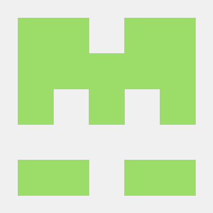

# 原生 HTML: Lazyloading 再探

> 原文：<https://dev.to/link2twenty/native-html-lazyloading-revisited-2080>

几个月前，我发表了一篇关于规范中一个令人兴奋的新属性的文章，它允许本地 lazyloading，如果你想先阅读这篇文章，你可以在这里找到它。

[](/link2twenty) [## 原生 HTML: Lazyloading

### 安德鲁·伯恩 1 月 11 日 194 分钟阅读

#html #css #lazyloading #whatwg](/link2twenty/native-html-lazyloading-3ai4)

## 为什么要重温这个？

在过去的两个月里，这个提议有了很大的改变，我们中的一些人认为`lazyloading='auto|on|off'`有点笨拙，WebKit 工程师@othermaciej 提出了一个新的语法`load='auto|eager|lazy'`，这就是这个提议现在所建议的。

你可以在这里阅读完整的讨论。

# [# 3752](https://github.com/whatwg/html/pull/3752)

[](https://github.com/bengreenstein) **[bengreenstein](https://github.com/bengreenstein)** posted on [<time datetime="2018-06-08T23:27:22Z">Jun 08, 2018</time>](https://github.com/whatwg/html/pull/3752)

@domenic

这是支持 iframe 和 img 元素中 lazyload 属性的规范更改草案。

* * *

问题:#2806 测试:[https://chromium-review . Google source . com/c/chromium/src/+/1417117](https://chromium-review.googlesource.com/c/chromium/src/+/1417117)([wpt 导出](https://github.com/web-platform-tests/wpt/pull/14914))

* * *

[/embedded-content . html](https://whatpr.org/html/3752/embedded-content.html "Last updated on Feb 7, 2020, 3:03 PM UTC (8bac3c8)")([diff](https://whatpr.org/html/3752/2793ee4...8bac3c8/embedded-content.html "Last updated on Feb 7, 2020, 3:03 PM UTC (8bac3c8)"))[/images . html](https://whatpr.org/html/3752/images.html "Last updated on Feb 7, 2020, 3:03 PM UTC (8bac3c8)")([diff](https://whatpr.org/html/3752/2793ee4...8bac3c8/images.html "Last updated on Feb 7, 2020, 3:03 PM UTC (8bac3c8)"))[/index . html](https://whatpr.org/html/3752/index.html "Last updated on Feb 7, 2020, 3:03 PM UTC (8bac3c8)")([diff](https://whatpr.org/html/3752/2793ee4...8bac3c8/index.html "Last updated on Feb 7, 2020, 3:03 PM UTC (8bac3c8)"))[/indexes . html](https://whatpr.org/html/3752/indices.html "Last updated on Feb 7, 2020, 3:03 PM UTC (8bac3c8)")([diff](https://whatpr.org/html/3752/2793ee4...8bac3c8/indices.html "Last updated on Feb 7, 2020, 3:03 PM UTC (8bac3c8)"))[/media . html](https://whatpr.org/html/3752/media.html "Last updated on Feb 7, 2020, 3:03 PM UTC (8bac3c8)")([diff](https://whatpr.org/html/3752/2793ee4...8bac3c8/media.html "Last updated on Feb 7, 2020, 3:03 PM UTC (8bac3c8)"))[/rendering . html](https://whatpr.org/html/3752/rendering.html "Last updated on Feb 7, 2020, 3:03 PM UTC (8bac3c8)")

[View on GitHub](https://github.com/whatwg/html/pull/3752)

## 提案现在进展如何？

> 根据属性的当前状态，属性向用户代理提供提示，以帮助决定是立即加载元素，还是推迟加载，直到元素可见。
> 
> **懒惰**
> 表示强烈倾向于推迟获取元素的资源，直到它可以被查看
> 
> **急切**
> 表示必须立即获取元素的资源，不管是否可见
> 
> **自动** *默认*
> 表示用户代理可以决定抓取策略
> 
> 属性的缺失值默认值和无效值默认值都是自动的。

## 那实际上看起来如何？

我更新了前一篇文章中的例子，以反映新的情况。

```
<!-- 
  this image will not be fetched until it 
  is in the viewport, meaning the page loads
  faster and uses less data.
-->


<!-- 
  this image will be fetched as soon as the
  page opens, this is how website work currently
-->


<!-- 
  this image will probably work the same as eager
  but there is space for interpretation
-->


<!-- 
  If the load value is invalid or missing
  the attribute will default auto
-->

 
```

Enter fullscreen mode Exit fullscreen mode

## 关闭

我觉得重新审视这一点很重要的原因是为了向你表明，无论你在职业生涯的哪个阶段，你对平台的未来都有发言权，whatwg 的人希望得到正确的规范，而你独特的视角可能正是他们所缺少的。不要害怕看未来的规格，提出问题和建议。

感谢您的阅读，您是否更喜欢 lazyloading 的这一次迭代？
❤🧠🦄🦄🧠❤🧠