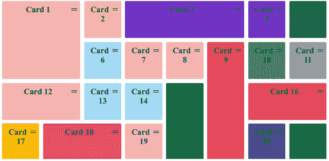

# 你不知道存在的新的棱角特征

> 原文：<https://dev.to/bnevilleoneill/new-angular-features-you-didn-t-know-existed-2038>

[](https://res.cloudinary.com/practicaldev/image/fetch/s--BCruBoMv--/c_limit%2Cf_auto%2Cfl_progressive%2Cq_auto%2Cw_880/https://cdn-images-1.medium.com/max/512/1%2AMwMRtHXZpGrBCI85yXM87Q.png)

> TL；DR:在这篇文章中，你将会看到一些你可能不知道的新的角度特征。我们将看看它们背后的思维过程，甚至一些如何开始使用它们的例子。

### 棱角分明

Angular 是一个 JavaScript 框架(GitHub 上有近 44，000 颗星)，是一个可以轻松构建 web 应用程序的平台。Angular 结合了声明性模板、依赖注入、端到端工具和集成的最佳实践来解决开发挑战。Angular 使开发人员能够构建基于 web、移动或桌面的应用程序。它还有最有用的 CLI 工具，让初学者轻松入门。

在本文中，将向您介绍每个 Angular 开发者都应该了解的一些 Angular 特性。Angular 目前在[第七个版本](https://angular.io/guide/releases)，下一个版本预计在 2019 年 5 月的任何时候发布。在这篇文章中，你将回顾激动人心的特性，并预览 8.0 版中即将出现的特性。

[](https://res.cloudinary.com/practicaldev/image/fetch/s--vS2OxqGl--/c_limit%2Cf_auto%2Cfl_progressive%2Cq_auto%2Cw_880/https://cdn-images-1.medium.com/proxy/1%2AP9KNnvZUy456eY35D1yTxQ.png)

[](https://logrocket.com/signup/)

### 角元素

[在去年大约这个时候发布的第六个版本](https://blog.angular.io/version-6-of-angular-now-available-cc56b0efa7a4)中，Angular Elements 被发布给开发者使用。 [Angular Elements](https://angular.io/guide/elements) 是一个新的 Angular 包，通过将角度组件注册为自定义元素，您可以使用它在现有的角度应用程序中引导角度组件。Angular 通过将 Angular 组件编译成 web 组件来实现这一点。

随着 web 组件在 JavaScript 社区得到广泛接受，这是在 Angular 项目中开始使用它们的绝佳时机。Angular 元素是可重用的，因为你可以在其他框架中使用它们，如 [React](https://reactjs.org/) 和 [Vue](https://vuejs.org/) ，也可以在项目的服务器端使用它们。

[在版本 7](https://blog.angular.io/version-7-of-angular-cli-prompts-virtual-scroll-drag-and-drop-and-more-c594e22e7b8c?source=collection_home---4------5---------------------) 中，Angular 团队使用 web 标准为自定义 HTML 元素添加了对内容投影的支持，比如 Angular 元素:

```
@Component({
  selector: 'bla-bla',
  template: `
    <header>
      <slot name="bla-header"></slot>
    </header>
    <slot></slot>`,
  encapsulation: ViewEncapsulation.ShadowDom,
  styles: []
})
export class BlaComponent {
} 
```

有了这个声明，现在可以像这样使用 slot:

```
<bla-bla>
  <span slot="bla-header">Angular rocks!</span>
<bla-bla> 
```

### 库支持

由于普遍的需求，Angular 团队添加了 schematics 支持，因此您现在可以创建和发布新的库来扩展 Angular 功能。如果您发现您需要在多个应用程序中解决同一个问题，或者您希望以可重用的方式与其他开发人员共享您的解决方案，您应该对此感到兴奋:

```
ng generate library <name> 
```

[](https://res.cloudinary.com/practicaldev/image/fetch/s--geUJfx1b--/c_limit%2Cf_auto%2Cfl_progressive%2Cq_66%2Cw_880/https://cdn-images-1.medium.com/proxy/1%2A6uz18nxGzAtk5ftoDZv_iQ.gif)

此命令将在您的 CLI 工作区内创建一个库项目，并提供配置该项目以进行测试和构建的选项。点击此处，您可以了解更多关于使用 Angular CLI 创建库的信息。

### CLI 升级:ng 添加和 ng 更新

为了从根本上使 CLI 工具更易于使用和更直观，在第 6 版的[Angular CLI 中引入了更多的 CLI 命令。这些命令非常有用，如果您的 Angular 版本是版本 6 或更高版本，您应该开始使用它们。](https://blog.angular.io/version-6-of-angular-now-available-cc56b0efa7a4)

1.  ng add :这个 CLI 命令旨在通过一个命令帮助您轻松地通过包和特性向项目添加新功能。语法是:

```
ng add <package> 
```

它使用您的默认包管理器(yarn 或 npm)来下载新的依赖项，并激活安装脚本来安装它们，这样您就可以随时使用它们。

*   受 [*Vue CLI 3.0*](https://blog.logrocket.com/getting-started-with-the-new-vue-cli-3-43bcbe1ae759?source=your_stories_page---------------------------) 中 ng add 的启发，Vue 等其他 JavaScript 框架也实现了类似的 CLI add 命令功能

**2。ng update** :这个 CLI 命令进入您的 package.json 文件，对其进行分析，并使用其内置的 Angular 版本推荐系统来更新您指定的特定包。语法如下所示:

`ng update <package>`

其中包是您的首选包的名称。更新命令不仅仅是更新你的包，它还保持你的依赖关系同步，并使用 yarn 或 npm 对你的项目进行必要的转换。

### 数据保护程序更新

在版本 7 中，引入了一个效率特性，现在当您运行 build 命令时，当您的包大小超过 2MB 时，您会得到警告。当您的包达到 5MB 大小时，它会进一步显示错误消息。但是，您可以通过修改 Angular.json 文件:
将这些错误和警告设置调整到您自己的包大小限制

```
"budgets": [
  {
    "type": "initial",
    "maximumWarning": "2mb",
    "maximumError": "5mb"
  }
] 
```

这些预算设置与谷歌 chrome 用户可以看到的类似，因此可以获得 Chrome 的[数据保存器](https://support.google.com/chrome/answer/2392284)功能。这是一个非常好的方法，让你既遵守纪律，又对设定的捆绑包大小目标负责。

### 棱角分明的 CDK

[Google 的 Material.io](https://material.angular.io) 平台在 Angular 第六版发布的时候进行了更新，这个平台是用来用材料设计来构建网页体验的。它现在包含一个组件开发工具包。组件开发工具包(CDK)是一套工具，它实现了常见的交互模式，同时对它们的表现形式没有偏见。它代表了 Angular Material 库中核心功能的抽象，没有任何特定于材料设计的样式。可以把 CDK 想象成一个空白状态，在这个状态下，你可以开发你自己的定制组件。可以使用命令行将材质设置添加到角度项目中:

`ng add @angular/material`

以下特征源自 CDK。

### 起动机部件

几个开箱即用的启动组件被添加到 CDK，如在第六角版本。这些组成部分是:

1.  **素材侧边导航**:这里我们看到一个由工具栏和侧边导航组成的 starter Angular 应用。所有的组件都是完全响应的，当然是按照材料设计建造的:`ng generate @angular/material:material-nav — name=my-nav`

**2。材料仪表板**:这里你可以用一个命令生成一个起始仪表板模板。这个仪表板包含动态网格列表卡，所有设计根据材料设计原则。都是有求必应:`ng generate @angular/material:material-dashboard --name=my-dashboard`

**3。材料数据表**:这里可以生成一个已经配置了数据源的数据表组件，既可以排序也可以分页:`ng generate @angular/material:material-table --name=my-table`

[你可以在这里](http://material.angular.io/guide/schematics)了解更多可用的角材示意图。

### 虚拟卷轴

Angular 版本 7 在 CDK 上增加了更多闪亮的元素。添加虚拟滚动功能有助于以这样一种方式构建您的用户界面，即当您必须显示具有长列表项的组件时，您可能不必使用分页选项。虚拟滚动模块正是通过在滚动时将元素加载到 DOM 中，并通过列表的可见部分从 DOM 中卸载元素来实现这一点的，这反过来又为构建更酷、更快的用户体验提供了一个很好的平台

```
import {ChangeDetectionStrategy, Component} from '@angular/core';

/** @title Basic virtual scroll */
@Component({
  selector: 'cdk-virtual-scroll-overview-example',
  styleUrls: ['cdk-virtual-scroll-overview-example.css'],
  templateUrl: 'cdk-virtual-scroll-overview-example.html',
  changeDetection: ChangeDetectionStrategy.OnPush,
})
export class CdkVirtualScrollOverviewExample {
  items = Array.from({length: 100000}).map((_, i) => `Item #${i}`);
} 
```

**打字稿**

```
.example-viewport {
  height: 200px;
  width: 200px;
  border: 1px solid black;
}

.example-item {
  height: 50px;
} 
```

**CSS**

[你可以在这里阅读更多关于虚拟滚动的信息](https://material.angular.io/cdk/scrolling/overview)。

### 拖拽

[](https://res.cloudinary.com/practicaldev/image/fetch/s--26Q14PEp--/c_limit%2Cf_auto%2Cfl_progressive%2Cq_66%2Cw_880/https://cdn-images-1.medium.com/max/640/1%2Ai30ZQdBC7CKbXXdOrUNQcg.gif) 

<figcaption>拖拽到一个示例仪表板上</figcaption>

添加到虚拟滚动模块的是另一个用户界面游戏规则改变者，称为拖放。这个模块为用户界面设计带来了令人兴奋的交互性。通过拖放，您可以让列表项变得非常具有交互性，让用户能够在单个列表中甚至在两个列表之间拖放列表项。这是一个非常有创意的功能，你应该去看看。列表项的渲染、重新排序和重新洗牌都是自动动态完成的，你也可以将这个过程做成动画:

```
<div class="example-box" cdkDrag>
  Drag me around
</div> 
```

**HTML**

```
import {Component} from '@angular/core';

/**
 * @title Basic Drag&Drop
 */
@Component({
  selector: 'cdk-drag-drop-overview-example',
  templateUrl: 'cdk-drag-drop-overview-example.html',
  styleUrls: ['cdk-drag-drop-overview-example.css'],
})
export class CdkDragDropOverviewExample {} 
```

**打字稿**

```
.example-box {
  width: 200px;
  height: 200px;
  border: solid 1px #ccc;
  color: rgba(0, 0, 0, 0.87);
  cursor: move;
  display: flex;
  justify-content: center;
  align-items: center;
  text-align: center;
  background: #fff;
  border-radius: 4px;
  position: relative;
  z-index: 1;
  transition: box-shadow 200ms cubic-bezier(0, 0, 0.2, 1);
  box-shadow: 0 3px 1px -2px rgba(0, 0, 0, 0.2),
              0 2px 2px 0 rgba(0, 0, 0, 0.14),
              0 1px 5px 0 rgba(0, 0, 0, 0.12);
}

.example-box:active {
  box-shadow: 0 5px 5px -3px rgba(0, 0, 0, 0.2),
              0 8px 10px 1px rgba(0, 0, 0, 0.14),
              0 3px 14px 2px rgba(0, 0, 0, 0.12);
} 
```

**CSS**

个人认为，想到的常见用例有:游戏和项目板。

### 结论:角 8 来了！

在等待下一个版本的时候，我们已经看到了最新最闪亮的角度特征。[根据推测的 Angular 发布时间表](https://blog.angular.io/a-plan-for-version-8-0-and-ivy-b3318dfc19f7)，Angular 版本 8 的可选预览版将于今年 5 月发布，这将是一个非常具有象征意义的发布，因为 Angular 渲染器将被更改为一个名为 Ivy 的新版本。Ivy 承诺带来更快的重新构建时间、类型检查的改进、更简单的调试平台，最重要的是大大减小了包的大小。你第一次遇到这些角度特征中的哪一个？

* * *

### Plug: [LogRocket](https://logrocket.com/signup/) ，一款适用于网络应用的 DVR

[](https://logrocket.com/signup/)

<figcaption>[https://logrocket.com/signup/](https://logrocket.com/signup/)</figcaption>

LogRocket 是一个前端日志工具，可以让你回放问题，就像它们发生在你自己的浏览器中一样。LogRocket 不需要猜测错误发生的原因，也不需要向用户询问截图和日志转储，而是让您重放会话以快速了解哪里出错了。它可以与任何应用程序完美配合，不管是什么框架，并且有插件可以记录来自 Redux、Vuex 和@ngrx/store 的额外上下文。

除了记录 Redux 操作和状态，LogRocket 还记录控制台日志、JavaScript 错误、堆栈跟踪、带有头+正文的网络请求/响应、浏览器元数据和自定义日志。它还使用 DOM 来记录页面上的 HTML 和 CSS，甚至为最复杂的单页面应用程序重新创建像素级完美视频。

[免费试用](https://logrocket.com/signup/)。

* * *

帖子[你不知道存在的新棱角特征](https://blog.logrocket.com/new-angular-features-you-didnt-know-existed-7f292a6e7afc/)首先出现在[博客](https://blog.logrocket.com)上。