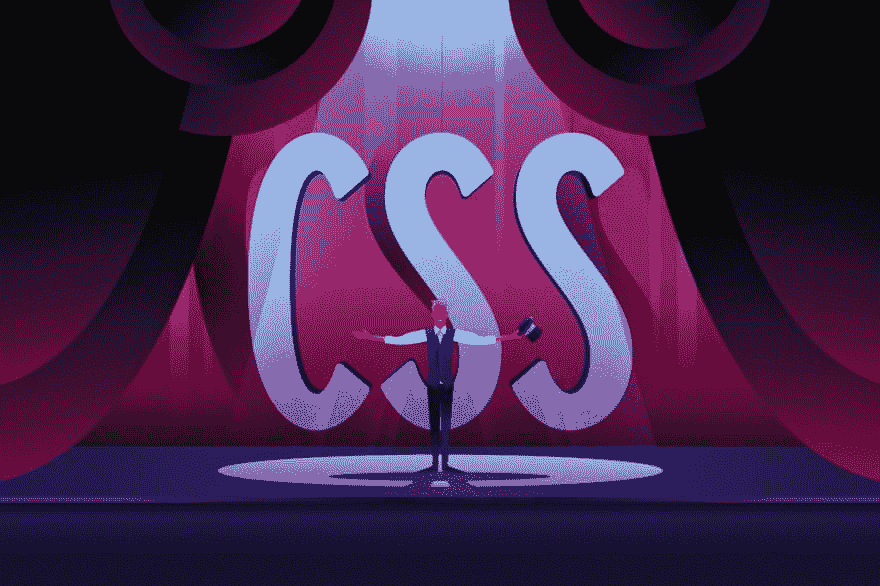
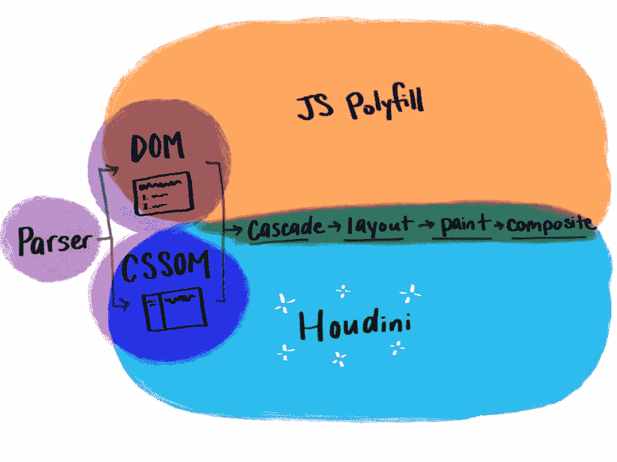
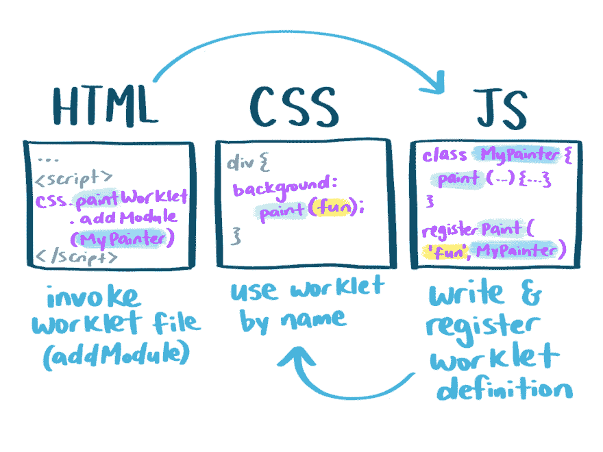
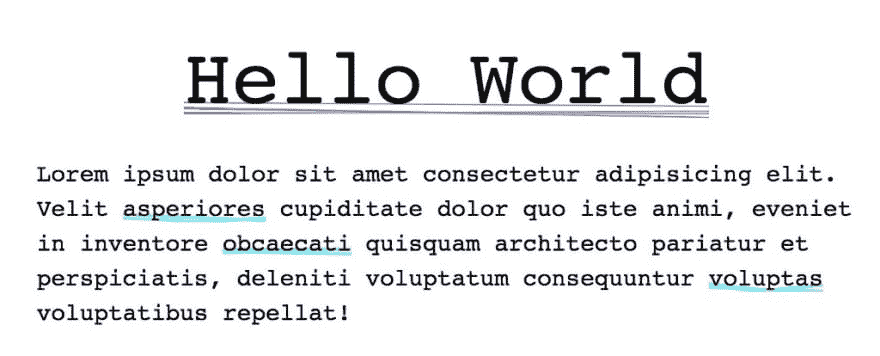

# CSS 中的新视野:胡迪尼和绘画 API

> 原文：<https://dev.to/bnevilleoneill/new-horizons-in-css-houdini-and-the-paint-api-55ok>

[](https://res.cloudinary.com/practicaldev/image/fetch/s--GKFTZ2rr--/c_limit%2Cf_auto%2Cfl_progressive%2Cq_auto%2Cw_880/https://cdn-images-1.medium.com/max/1024/1%2Aq2Aqml8ioC-Tpe-AtzeNiA.png)

我们编写 CSS 的方式即将改变。不，我不是说你必须改变你的写作风格，但是我们作为开发者将会得到更多的控制。

我在说什么？那将是 CSS 胡迪尼规范和作为其一部分的新浏览器 API。

[](https://logrocket.com/signup/)

### 胡迪尼 101

那么什么是胡迪尼？很高兴你问了。Houdini 让开发者第一次接触到 CSS 对象模型(CSSOM)。开发人员可以编写浏览器能够理解并解析为 CSS 的代码，而不是用 JavaScript 更新样式！

[](https://res.cloudinary.com/practicaldev/image/fetch/s--h-J7j9ba--/c_limit%2Cf_auto%2Cfl_progressive%2Cq_auto%2Cw_880/https://cdn-images-1.medium.com/max/1024/0%2AHNqL3GBfuZq7lh5E.jpg) 

<figcaption>[Dev 涂鸦](https://www.instagram.com/p/Bh9AiWlBSe-/)</figcaption>

现在，当我们想要应用不作为 CSS 属性存在的样式时，我们需要使用 JavaScript 来覆盖现有的 CSS。这意味着浏览器在需要再次经历布局、绘制和复合过程*以呈现 JavaScript 样式更新之前，会经历整个层叠、布局、绘制和复合过程*(当然，这取决于您正在更新的内容)。

有了 Houdini，我们可以编写浏览器理解的代码，并将其应用到循环的开始，在这里 CSS 被标记化和理解。这意味着:

*   更快的复杂样式解析时间(因为样式化发生在 CSS 步骤)
*   开发人员不再需要等待 web 浏览器供应商添加 CSS 功能——他们可以直接填充它(当所有浏览器都支持 Houdini 时会发生这种情况——每个 Houdini 小工具可以在浏览器之间互换工作，就像 CSS 插件一样)
*   聚合填充的性能更高，因此页面渲染速度更快
*   更好地分离逻辑和风格(风格保存在 CSS 中，逻辑保存在 JS 中)
*   更多定制的样式和设计系统(因为这种方法允许我们添加目前无法用 CSS 创建的样式，还允许我们在可视系统中创建默认值和回退)

使用 Houdini，您可以用 JavaScript 编写您的样式，调用将它们注册到浏览器的文件，然后在您的 CSS 中应用这些样式。

该过程如下所示:

[](https://res.cloudinary.com/practicaldev/image/fetch/s--RA7h9Lwo--/c_limit%2Cf_auto%2Cfl_progressive%2Cq_auto%2Cw_880/https://cdn-images-1.medium.com/max/1024/0%2AKdKUU9uMOspvRXP2.png) 

<figcaption>查看更多 Dev 涂鸦:</figcaption>

完整的胡迪尼规范是相当庞大的，包含了许多不同的元素，是一项正在进行中的工作。要查看一个很棒的概述，请查看 ishoudinireadyyet.com 的。这是一个伟大的资源，概述了每个胡迪尼 API 的进展，包括相关链接。

在这篇文章中，我只想关注其中一个功能——虽然仍处于草稿状态，但 CSS Painting API 是在撰写本文时开发和支持得最多的一个。

### 油漆 API

[画图 API](https://drafts.css-houdini.org/css-paint-api/) 让我们写入 DOM 渲染引擎的画图进程。我们可以创造独特的风格，如文本上的火花，独特的角落，或风格化的边界。可能性真的是无穷无尽的，一个很好的地方来看看这些例子是由[文森特德奥利维拉](http://iamvdo.me/en)的 [CSS 胡迪尼岩石](https://css-houdini.rocks/)网站。Paint API 使用一个类，并接受上下文(我们应用样式的元素)和大小(该元素的物理边界大小)。它还接受静态属性的参数 props 和输入参数 args。

```
registerPaint(‘redBackground’, class {
  paint(ctx, size) {
    ctx.fillStyle = ‘red’;
    ctx.fillRect(0, 0, size.width, size.height);
  }
}) 
```

这个 worklet 文件代码将创建一个红色矩形。如果您熟悉 HTML Canvas，您可能会注意到代码看起来与 Canvas 相似——确实如此。这里的上下文(ctx)是画布，我们使用类似画布的语法来应用样式(如宽度和颜色)并绘制这些样式——在本例中，我们使用 fillStyle 来设置填充颜色，使用 fillRect 来填充矩形，指定从(0，0)开始并填充元素的宽度和高度。

如果我们想使用上面的小工具，我们需要在我们的 HTML 中用:
调用锻炼

```
 if ('paintWorklet' in CSS) {
    CSS.paintWorklet.addModule('./worklet.js');
  } 
```

而在 CSS:

```
.element {
  background: paint(redBackground);
} 
```

前面的例子没有向我们展示简单的背景色:红色不能做到的事情，但是关于胡迪尼令人兴奋的事情是这里有如此多的可能性！

### 我们来画画吧

要使用画图 API，您必须从安全网站(https)或本地提供文件。这是因为 Houdini worklets 类似于服务人员，它们是位于浏览器和网络之间的一层，需要时运行，需要时关闭。

因此，要在不设置整个开发环境的情况下开始，我建议使用如下命令运行本地服务器:python -m SimpleHTTPServer 8000，它在端口 8000 上启动并运行服务器。

我们将查看一个名为超级下划线:D 的例子，在这里我们可以为我们的文档指定和创建多种下划线(这只是一个简单的入门例子，但世界是你的，尤其是如果你知道 HTML canvas！).看起来是这样的:

[](https://res.cloudinary.com/practicaldev/image/fetch/s--cfeecN_H--/c_limit%2Cf_auto%2Cfl_progressive%2Cq_auto%2Cw_880/https://cdn-images-1.medium.com/max/1024/0%2A1HHIHYdQk8frx1-l.jpg)

在这个例子中，我们已经为每个元素随机生成了下划线，同时我们指定了我们想要的数量(下划线的数量)、下划线的颜色、下划线的粗细以及它们应该分布的距离(它们的角度)。要设置好一切，我们需要 3 个文件:一个用于注册锻炼的 HTML 文件，一个用于定义油漆的 worklet 文件，以及一个用于使用 worklet 的 CSS 文件(如前面的图表所示)。

HTML 代码的主体看起来像这样:

```
<h1>Hello World</h1> <!— check if paint workout is supported in the browser and register a file called `worklet.js` if it is —>  if ('paintWorklet' in CSS) {
    CSS.paintWorklet.addModule('./worklet.js');
  } 
```

然后，我们想要开始构建我们的工作流文件，同时检查浏览器中的支持:

```
if (typeof registerPaint !== 'undefined') {
  class SuperUnderline {
    paint(ctx, size) {
      // paint instructions will go here
    }
  }
}
registerPaint('superUnderline', SuperUnderline)
} 
```

我们需要确保我们也将它包含在 CSS 中，同时我们再次检查支持:

```
@supports (background: paint(something)) {
  h1 {
    background: paint(superUnderline);
  }
} 
```

现在，在这一点上什么也不会发生，所以让我们在我们的工作包中指定一些要绘制的东西。在类内部，我们可以使用 ctx 和 size 参数来挂钩我们的元素:

```
// random function can live outside of the class
const getRandom = (min, max) => {
  return Math.floor(Math.random() \* (max - min + 1)) + min
}

// values to set for the paint
const numUnderlines = 3
const spread = 20
ctx.lineWidth = 3
ctx.strokeStyle = ‘red’

for (let i = 0; i < numUnderlines; i++) {
  ctx.beginPath()
  ctx.moveTo(0, getRandom(0, spread) + size.height/1.4)
  ctx.lineTo(size.width, getRandom(0, spread) + size.height/1.4)
  ctx.stroke()
} 
```

在上面的代码中，我们在 div 的底部绘制了 3 条随机的红线(1.4 是一个有点随机的数字，因为我们不能真正走出画布，否则这些线就不会出现，就像真正的下划线)。跨页设置为 20，线条宽度为 1。

我们的示例目前如下所示:

[](https://res.cloudinary.com/practicaldev/image/fetch/s--mvnOPmJe--/c_limit%2Cf_auto%2Cfl_progressive%2Cq_auto%2Cw_880/https://cdn-images-1.medium.com/max/916/0%2Abu_C1zSD4NEIZqkx.jpg)

> **附注:**如果你看不到任何东西或任何变化，首先确保你使用的浏览器支持画图 API。然后，打开您的开发工具，并在开发工具打开的情况下禁用缓存。现在，用胡迪尼开发有点棘手

回到我们的例子:我们可以做得比这更好！我们应该让这段代码更灵活一点，这样用户就可以更新宽度、范围、颜色和下划线的数量。我们可以用 CSS 自定义属性做到这一点！

### CSS 自定义属性

如果你在 CSS 中使用了变量，这些变量是在根(或本地范围)上设置的，那么它们就是自定义属性。但是现在在 CSS 中有大量的控件来设置自己的自定义属性，指定默认值，并给它们一个语法(！idspnonenote)。)!我在那里加了两个感叹词，因为这太酷了！现在，当您使用这些自定义属性并覆盖其中一个属性时，您可以进行一些健全性和错误处理。例如，如果它不匹配一个定义的语法，它将退回到一个预定义的值，而不是像 CSS 目前所做的那样完全忽略该行。

关于 CSS 自定义属性，我可以滔滔不绝地讲下去，但我将在这里切入正题。让我们创建一个`properties.js`文件，并设置一些我们将在示例中使用的新变量:

```
CSS.registerProperty({
  name: '--underlineNumber',
  syntax: '<number>',
  inherits: false,
  initialValue: 3
});

CSS.registerProperty({
  name: '--underlineColor',
  syntax: '<color>',
  inherits: true,
  initialValue: 'black'
});

CSS.registerProperty({
  name: '--underlineSpread',
  syntax: '<number>',
  inherits: false,
  initialValue: 20
});

CSS.registerProperty({
  name: '--underlineWidth',
  syntax: '<number>',
  inherits: false,
  initialValue: 2
}); 
```

现在我们需要记住，如果这个文件是单独的，就要把它包含在 JS 中，或者把它导入到我们的 worklet 文件中。在上面的例子中，我们已经设置了一些从数字语法继承的属性(underlineNumber、underlineSpread 和 underlineWidth)，以及一个从 color 继承的属性(underlineColor)。这很方便，因为如果我们更新了值，现在我们可以动画我们的下划线，浏览器将知道如何插入这些值。这就是为什么有了胡迪尼，我们现在可以创建动画渐变。

在 CSS 中，我们可以这样设置这些值:

```
@supports (background: paint(something)) {
  h1 {
    /* 
      Optionally set property values. 
      This can be done at root or local scope 
    */
    --underlineNumber: 5; /* default: 3 */
    --underlineColor: #8266ff; /* default: black */
    --underlineSpread: 15; /* default: 20 */
    --underlineWidth: 1; /* default: 2 */
background: paint(superUnderline);
    line-height: 1.5;
  }
} 
```

现在让我们回到我们的 worklet，以确保我们将这些自定义属性传递到 paint 函数中，以便我们可以使用它们。我们将使用静态 get inputProperties()并包含一个属性数组，然后我们将能够使用 properties.get 并传入属性来将该数组拉入我们的函数中。总的来看是这样的:

```
const getRandom = (min, max) => {
  return Math.floor(Math.random() * (max - min + 1)) + min
}
if (typeof registerPaint !== 'undefined') {
  class SuperUnderline {
    static get inputProperties() {
      return ['--underlineNumber', '--underlineColor', '--underlineSpread', '--underlineWidth']
    }
paint(ctx, size, properties) {
      const numUnderlines = properties.get('--underlineNumber')
      const lineWidth = properties.get('--underlineWidth')
      const color = properties.get('--underlineColor')
      const spread = properties.get('--underlineSpread')
ctx.lineWidth = lineWidth
      ctx.strokeStyle = color
for (let i = 0; i < numUnderlines; i++) {
        ctx.beginPath()
        ctx.moveTo(0, getRandom(0, spread) + size.height/1.4)
        ctx.lineTo(size.width, getRandom(0, spread) + size.height/1.4)
        ctx.stroke()
      }
    }
  } 
```

```
registerPaint('superUnderline', SuperUnderline)
} 
```

我们已经成功地创建了自定义属性，并从 CSS 传递到我们的 Houdini worklet 中，并使用 CSS 从我们的 worklet 中提取可视指令！正如我前面提到的，您可以按照自己的意愿制作这些动画并更新属性。当您调整浏览器窗口大小时，也要注意元素可能会重画，因为它的大小在变化，并且每次重画时看起来都很不同，因为这个例子使用了随机化来创造奇迹。

[](https://res.cloudinary.com/practicaldev/image/fetch/s--jfSCtRC7--/c_limit%2Cf_auto%2Cfl_progressive%2Cq_66%2Cw_880/https://cdn-images-1.medium.com/max/800/0%2AslvczSVb73kvkWdA.gif)

### 一句警告的话

对于一个网页开发者来说，这是一个激动人心的时刻，胡迪尼将会给那些喜欢在网页上进行可视化设计和构建的人们带来巨大的力量。我们对 CSS 的抱怨可以得到解决，我们可以定义自己的风格。虽然还为时过早，但已经有这么多胡迪尼的伟大[范例](http://css-houdini.rocks)和[演示](https://github.com/GoogleChromeLabs/houdini-samples)在发挥作用。

然而，请记住，胡迪尼是一个实验性的技术，还没有准备好生产。在使用这种技术实现任何样式之前，您应该始终检查浏览器支持。此外，我们在性能上取得的胜利很容易被过度兴奋的开发人员所掩盖，因为这项技术给了我们如此大的力量。你还是要小心不要过度，尤其是动画效果。请记住，这项技术正在迅速变化，但在此期间，请尽情体验胡迪尼吧！

### 进一步资源

*   @iamvdo 的实验
*   [Chrome 实验室胡迪尼样品](https://github.com/GoogleChromeLabs/houdini-samples)
*   胡迪尼准备好了吗？
*   萨姆·理查德的胡迪尼互动介绍
*   [Chrome 开发峰会胡迪尼状态谈](https://www.youtube.com/watch?v=lK3OiJvwgSc)
*   [Houdini 上的 Toolsday 播客](https://spec.fm/podcasts/toolsday/215273)* * * * # # # Plug:[LogRocket](https://logrocket.com/signup/)，一个用于网络应用的 DVR

[](https://logrocket.com/signup/)

<figcaption>[https://logrocket.com/signup/](https://logrocket.com/signup/)</figcaption>

LogRocket 是一个前端日志工具，可以让你回放问题，就像它们发生在你自己的浏览器中一样。LogRocket 不需要猜测错误发生的原因，也不需要向用户询问截图和日志转储，而是让您重放会话以快速了解哪里出错了。它可以与任何应用程序完美配合，不管是什么框架，并且有插件可以记录来自 Redux、Vuex 和@ngrx/store 的额外上下文。

除了记录 Redux 操作和状态，LogRocket 还记录控制台日志、JavaScript 错误、堆栈跟踪、带有头+正文的网络请求/响应、浏览器元数据和自定义日志。它还使用 DOM 来记录页面上的 HTML 和 CSS，甚至为最复杂的单页面应用程序重新创建像素级完美视频。

免费试用。

* * *

CSS 中的[新视野:胡迪尼和画图 API](https://blog.logrocket.com/new-horizons-in-css-houdini-and-the-paint-api-8b307cf387bb/) 首先出现在 [LogRocket 博客](https://blog.logrocket.com)上。