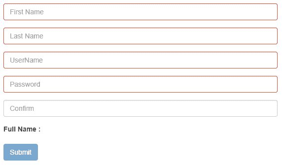

# 验证角反应形式的新方法

> 原文：<https://dev.to/ajayojha/new-way-to-validate-the-angular-reactive-form-32lg>

交叉张贴到[medium.com](https://medium.com/@oojhaajay/new-way-to-validate-the-angular-reactive-form-2c4fe4f13373)

这里，我们将讨论基于模型对象的反应式表单验证，它克服了角度反应式表单的当前挑战。

## 高层挑战？

当您在处理一个更加面向数据的高级反应式表单时，您会注意到您验证的不仅仅是您的输入，一些验证器和一些常见的东西在 angular 框架中是不容易得到的。然后设计自定义验证并订阅 FormControl 的值更改，以实现应用程序的功能需求。这在代码中引入了额外的噪声，以便在大多数情况下反复做同样的事情。

一些当前的反应式表单验证挑战被记录下来。

*   因此，没有简单的模型对象，我们可以根据各自的数据类型定义属性，并直接将其映射为反应形式。
*   在创建表单组时，我们不能通过验证将模型对象值直接映射到反应式表单。*在每个相应的属性(FormControl)上手动配置验证器。
*   如果有一个特定的需要来执行一些其他的基于相应的 FormControl 值变化的操作，那么我们必须订阅 FormControl 的相应的值变化并做进一步的活动，这在大的表单中有点难以管理。
*   如果在相应的 FormControl 上有多个验证器，则编写太多代码来管理跨字段验证和条件验证。

为了研究新的方法并克服当前的挑战，我们将使用[**@ rx web/reactive-form-validators**](https://www.npmjs.com/package/@rxweb/reactive-form-validators)进行角反应形式。

## 为什么要@ rx web/reactive-form-validators？

如果我说的是 typescript，那么 typescript 编程语言高度依赖于面向对象的编程实践，这使得编写干净的代码更加方便。这是设计该框架以提供基于模型对象的反应式表单的主要原因。因为当应用程序表单的复杂性增加和应用程序增长时，这为您提供了更多的灵活性，您不会陷入组装验证器和其他价值订阅的繁琐活动中。

现在，让我们用基于 Decorator 的验证来创建基于模型对象的反应式表单。

## 什么是基于装饰器的验证？

比方说，您希望对用户名字段进行一些验证，如 alpha、minLength 和 required。然后，您可以在用户模型的 userName 属性上以 validation decorator 的形式设置这些验证。在创建 userName 属性的 FormControl 时，[**@ rx web/reactive-form-validators**](https://www.npmjs.com/package/@rxweb/reactive-form-validators)将添加所有已配置的验证装饰器。代码示例如下:

```
export class User {
    @alpha()
    @minLength({ value: 5 })
    @required()
    userName: string;
} 
```

# 功能需求

认识一下 Mike，Mike 正在开发社交媒体应用程序，想要创建用户注册表单。注册表样机，功能需求，验证规则如下:

用户注册表单的模型。

[](https://res.cloudinary.com/practicaldev/image/fetch/s--pfTlMwRV--/c_limit%2Cf_auto%2Cfl_progressive%2Cq_auto%2Cw_880/https://thepracticaldev.s3.amazonaws.com/i/ti1binnt8udg96sisgu0.png)

*   所有红色标记的字段都是必填的。
*   仅当密码和确认字段值相同时，确认字段才有效。
*   fullName 属性是只读的，它是 firstName 和 lastName 的组合值，每当用户在各自的 FormControl 中输入值时，fullName 更新后的值将立即反映在 UI 上。

现在，Mike 开始构建基于模型对象的反应式表单。

在开发表单之前，麦克安装了[**@ rx web/reactive-form-validators**](https://www.npmjs.com/package/@rxweb/reactive-form-validators)的包。包安装命令如下:

> npm 安装@ rx web/反应式表单验证器

一旦安装了这个包，Mike 就在根模块中注册“RxReactiveFormsModule ”,以利用这个框架的服务。下面是代码示例:

```
import { NgModule } from '@angular/core';
import { BrowserModule } from '@angular/platform-browser';
import { FormsModule,ReactiveFormsModule } from '@angular/forms';

import { AppComponent } from './app.component';

import {  RxReactiveFormsModule } from "@rxweb/reactive-form-validators"
@NgModule({
  imports:      [ BrowserModule, FormsModule,ReactiveFormsModule,RxReactiveFormsModule ],
  declarations: [AppComponent],
  bootstrap:    [ AppComponent]
})
export class AppModule { } 
```

一旦注册了“RxReactiveFormsModule ”, Mike 就创建了一个具有相应属性的用户模型，如实体模型所示，并且还根据注册表单的需要在属性上应用了验证装饰器。

```
export class User {
    @required()
    firstName: string;

    @required()
    lastName: string;

    @required()
    userName: string;

    @required()
    password: string;
} 
```

按照上面的代码，Mike 已经在各自的字段上应用了所需的验证装饰器，但是错过了第二个和第三个场景。

现在我们来看看，如何实现第二个和第三个场景。

第二种情况是比较两个控件的值，以满足需求。Mike 正在使用比较装饰器来比较交叉字段 FormControl 值。
confirm password 的唯一属性和应用的验证装饰如下:

```
@compare({fieldName:'password'})
confirmPassword:string; 
```

现在，为了实现第三个场景，Mike 不会订阅 ValueChanges 属性，也不会在“名字”或“姓氏”中的值发生变化时设置“全名”字段中的值。Mike 在已经定义的 firstName 和 lastName 属性中做了一些更正。Mike 对 firstName 和 lastName 使用了 [getter/setter 类型脚本特性](https://www.typescriptlang.org/docs/handbook/classes.html)。下面是一些变化:

```
 private _firstName: string = '';
    private _lastName: string = '';

    fullName: string;

    @required()
    set firstName(value: string) {
        this._firstName = value;
        this.setFullName();
    }

    get firstName(): string {
        return this._firstName;
    }

    @required()
    set lastName(value: string) {
        this._lastName = value;
        this.setFullName();
    }

    get lastName(): string{
       return this._lastName;
    }

    setFullName() {
        this.fullName = `${this.firstName}  ${this.lastName}`;
    } 
```

因为 Mike 在 firstName 和 lastName 属性上应用了 getter/setter，并创建了 setFullName 方法来更新值 FullName。现在出现了一个问题:

## 为什么 Mike 使用了 getter/setter 属性？

每当用户在 firstName 或 lastName FormControl 中输入值时，firstName 和 lastName 属性 setter 函数将使用最新的值调用。在 setter 函数中，Mike 已经在私有属性中设置了相应公共属性的值。这为应用程序提供了更好的灵活性，因为同一模型将在多个组件中使用。Mike 不需要在多个组件中编写相同的代码，也不需要订阅 ValueChanges。请参见下图:

[](https://res.cloudinary.com/practicaldev/image/fetch/s--0z5fwtfo--/c_limit%2Cf_auto%2Cfl_progressive%2Cq_66%2Cw_880/https://thepracticaldev.s3.amazonaws.com/i/kmf112zzzs13wjstx0bo.gif)

现在让我们看看，完整的用户模型。

```
import { required,compare } from "@rxweb/reactive-form-validators";

export class User {
    private _firstName: string = '';
    private _lastName: string = '';

    fullName: string;

    @required()
    set firstName(value: string) {
        this._firstName = value;
        this.setFullName();
    }

    get firstName(): string {
        return this._firstName;
    }

    @required()
    set lastName(value: string) {
        this._lastName = value;
        this.setFullName();
    }

    get lastName(): string{
       return this._lastName;
    }

    @required()
    userName: string;

    @required()
    password: string;

    @compare({fieldName:'password'})
    confirmPassword:string;

    private setFullName() {
        this.fullName = `${this.firstName}  ${this.lastName}`;
    }
} 
```

现在，Mike 从组件中的用户模型对象创建了一个 FormGroup。Mike 使用 RxFormBuilder 的“formGroup”方法来创建表单组。下面是代码:

```
import { Component, OnInit } from '@angular/core';
import { FormGroup } from "@angular/forms"

import { RxFormBuilder } from '@rxweb/reactive-form-validators';

import { User } from '../user.model';

@Component({
    selector: 'app-user-add',
    templateUrl: './user-add.component.html'
})
export class UserAddComponent implements OnInit {

    userFormGroup: FormGroup
    user:User;
    constructor(
        private formBuilder: RxFormBuilder
    ) { }

    ngOnInit() {
        this.user = new User();
        this.userFormGroup = this.formBuilder.formGroup(this.user);
    }
} 
```

现在，Mike 按照角度反应式格式标准编写 HTML。但 fullName 属性不是 FormControl。Mike 使用用户对象来显示全名值。参见下面的代码:

```
<div class="form-group">
    <label>Full Name : {{user.fullName}}</label>
</div> 
```

以下是完整的 HTML 代码:

```
<h1 class="bd-title" id="content">Model Object based reactive form</h1>
<br/>
<form *ngIf="userFormGroup" [formGroup]="userFormGroup">

<div class="form-group">
    <input type="text" formControlName="firstName" placeholder="First Name" class="form-control"  />

</div>
<div class="form-group">
    <input placeholder="Last Name" type="text" formControlName="lastName" class="form-control"  />

</div>
<div class="form-group">
    <input placeholder="UserName" type="text" formControlName="userName" class="form-control"  />

</div>
<div class="form-group">
    <input placeholder="Password" type="text" formControlName="password" class="form-control"  />

</div>
<div class="form-group">
    <input placeholder="Confirm" type="text" formControlName="confirmPassword" class="form-control"  />

</div>
  <div class="form-group">
    <label>Full Name : {{user.fullName}}</label>
  </div>
<button [disabled]="!userFormGroup.valid" class="btn btn-primary">Submit</button>
</form> 
```

请在栈上签出 [**完整的工作示例代码**](https://stackblitz.com/edit/complete-rxweb-required-validation-add-angular-reactive-8cbwss?embed=1&file=src/app/user/add/user-add.component.ts)

您可能会想到一个问题，为什么没有创建 fullName FormControl。因为这和其他属性一样也是公共属性(名字、姓氏等)。我将在下一篇文章中给出这个答案，并提供更多细节。

如果您喜欢这种方法，那么还会出现其他一些问题，比如:

*   如何创建嵌套窗体组？
*   嵌套的形式数组将如何创建？
*   如何用这种方法更新特定 FormControl 的值？
*   我如何用这种方法设置我的自定义验证？
*   不…nnn…..nnn 个问题？

有了模型对象反应式表单验证，一切皆有可能。我将在接下来的文章中分享一些亮点。

希望你喜欢这种反应式的新验证方法。如果您对此方法有任何建议，请在下面写下您的评论。