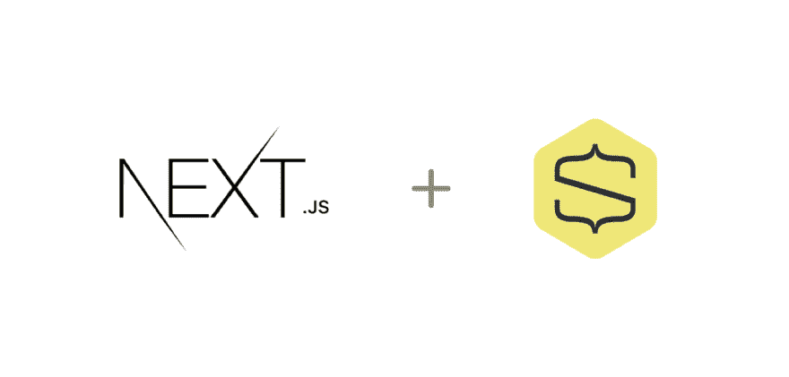

# Next.js 电子商务教程:快速购物车集成

> 原文：<https://dev.to/couellet/next-js-e-commerce-tutorial-quick-shopping-cart-integration-3kn4>

每次我回到博客上与 [React 相关的](https://snipcart.com/blog/node-js-react-strapi-tutorial)话题，它的生态系统似乎变得更大、更成熟、更高效。

如今，无论您是经验丰富的开发人员还是完全的初学者，使用 React 都可以做很多事情。

这主要是由于 Next.js 等工具的创建，它们成功地简化了 React 前端开发。

所以，今天我想**探讨一下 Next.js 能为电子商务做些什么。**

在下面的技术教程中，我将向您展示如何:

*   设置 Next.js 开发环境
*   创建新页面和组件
*   获取数据并导入组件
*   将购物车添加到 Next.js 应用程序
*   设计和部署应用程序

但是在我们讨论这个之前，让我们确保我们了解 Next.js 是什么，以及它如何改进您的下一个电子商务项目。

→点击阅读全文