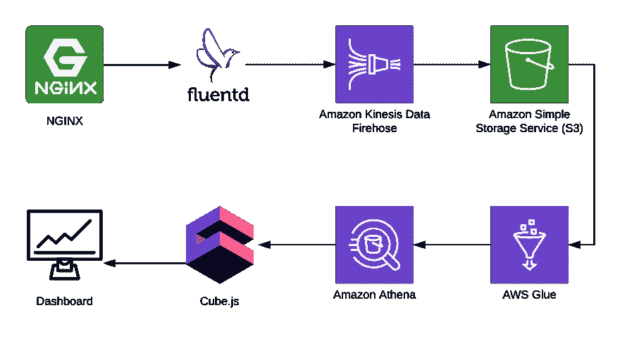
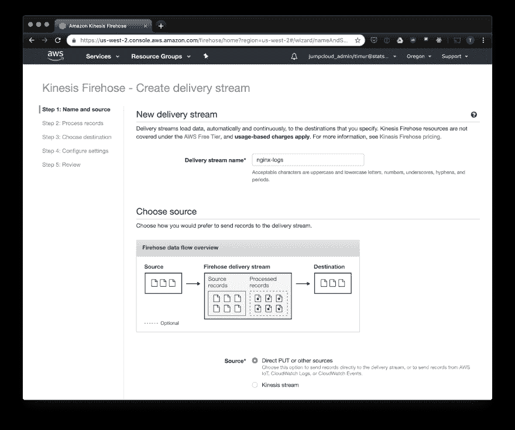
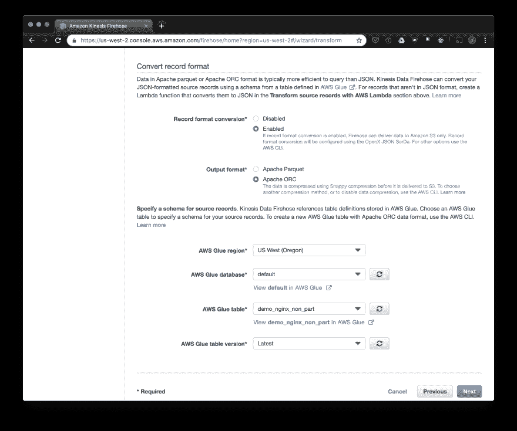
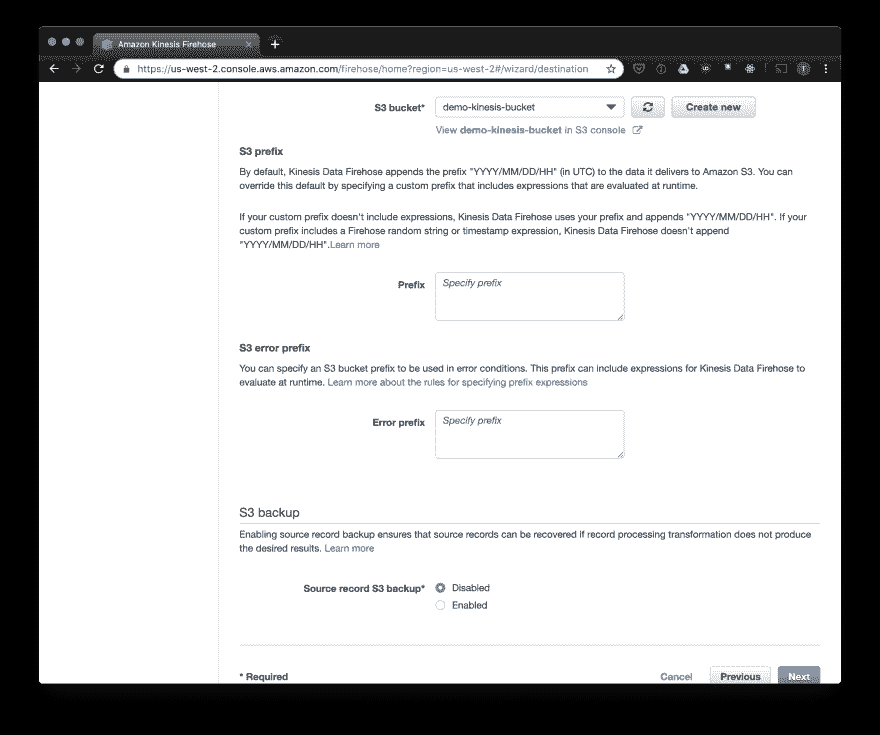
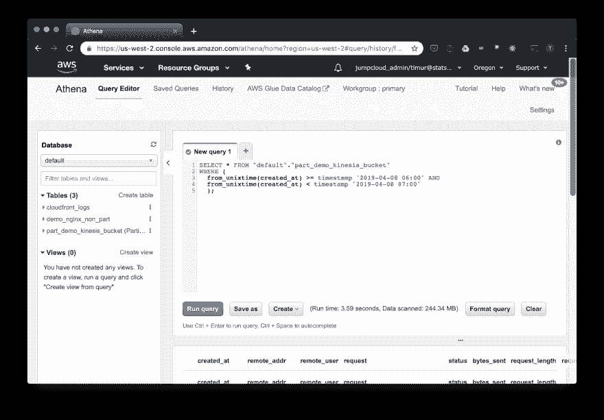
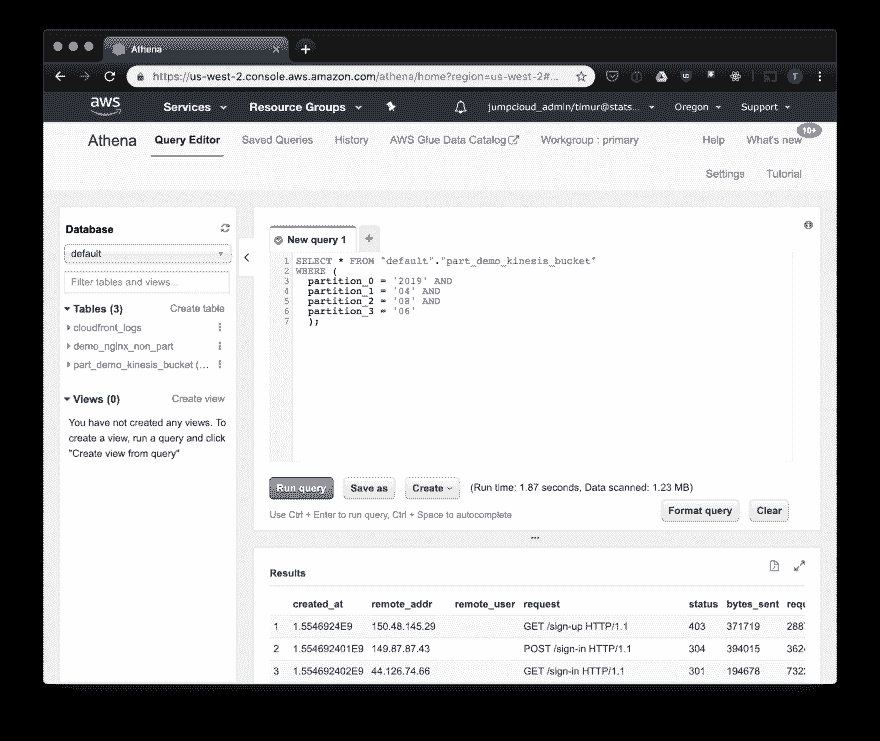

# 使用 AWS Athena 和 Cube.js 进行 Nginx 日志分析

> 原文：<https://dev.to/cubejs/nginx-log-analytics-with-aws-athena-and-cube-js-4b33>

有时，现有的商业或现成的开源工具，如 Grafana，并不适合 Nginx 日志分析的要求。无论是定价、隐私还是定制问题，知道如何在内部构建这样一个系统总是好的。

在下面的教程中，我将向你展示如何用 [Fluentd](https://www.fluentd.org/) 、 [Kinesis Data Firehose](https://aws.amazon.com/kinesis/data-firehose/) 、 [Glue](https://aws.amazon.com/glue/) 、 [Athena](https://aws.amazon.com/athena/) 和 [Cube.js](https://cube.dev) 构建你自己的 [Nginx](https://www.nginx.com/) 日志分析。这个堆栈还可以很容易地将其他来源的数据(如扫雪机事件)添加到同一个 S3 存储桶中，并在 Athena 中合并结果。我将向您介绍从数据收集到可视化的整个流程。

[这里是最终仪表板](https://statsbotco.github.io/cubejs/nginx-analytics-dashboard/)的现场演示。

下面是我们将要构建的应用程序的一个示例架构:
[](https://res.cloudinary.com/practicaldev/image/fetch/s--go91v15L--/c_limit%2Cf_auto%2Cfl_progressive%2Cq_auto%2Cw_880/https://thepracticaldev.s3.amazonaws.com/i/c6cncf437urln6cm5dwy.png)

## 收集 Nginx 日志

默认情况下，Nginx 以如下的纯文本格式编写日志:

```
4/9/2019 12:58:17 PM1.1.1.1 - - [09/Apr/2019:09:58:17 +0000] "GET /sign-up HTTP/2.0" 200 9168 "https://example.com/sign-in" "Mozilla/5.0 (Macintosh; Intel Mac OS X 10_14_4) AppleWebKit/537.36 (KHTML, like Gecko) Chrome/73.0.3683.86 Safari/537.36" "-"
4/9/2019 12:58:17 PM1.1.1.1 - - [09/Apr/2019:09:58:17 +0000] "GET /sign-in HTTP/2.0" 200 9168 "https://example.com/sign-up" "Mozilla/5.0 (Macintosh; Intel Mac OS X 10_14_4) AppleWebKit/537.36 (KHTML, like Gecko) Chrome/73.0.3683.86 Safari/537.36" "-" 
```

虽然我们可以解析它，但是将 Nginx 配置改为使用 JSON 格式会容易得多。

```
log_format json_combined escape=json '{ "created_at": "$msec", '
            '"remote_addr": "$remote_addr", '
            '"remote_user": "$remote_user", '
            '"request": "$request", '
            '"status": $status, '
            '"bytes_sent": $bytes_sent, '
            '"request_length": $request_length, '
            '"request_time": $request_time, '
            '"http_referrer": "$http_referer", '
            '"http_x_forwarded_for": "$http_x_forwarded_for", '
            '"http_user_agent": "$http_user_agent" }';

access_log  /var/log/nginx/access.log  json_combined; 
```

### 创建一个 S3 桶

为日志文件创建新的 S3 存储桶。请注意，日志应该放在存储桶的根中，不能在该存储桶中存储任何其他数据。此外，考虑使用与您的 Athena 相同的地区，因为 Athena 在某些地区不可用。

### 通过 Athena 控制台定义表格模式

打开 Athena 控制台，选择要使用的数据库。要创建一个表，您可以使用 AWS UI 或者只在控制台中运行 create 语句。

```
CREATE EXTERNAL TABLE `kinesis_logs_nginx`(
  `created_at` double, 
  `remote_addr` string, 
  `remote_user` string, 
  `request` string, 
  `status` int, 
  `bytes_sent` int, 
  `request_length` int, 
  `request_time` double, 
  `http_referrer` string, 
  `http_x_forwarded_for` string, 
  `http_user_agent` string)
ROW FORMAT SERDE 
  'org.apache.hadoop.hive.ql.io.orc.OrcSerde' 
STORED AS INPUTFORMAT 
  'org.apache.hadoop.hive.ql.io.orc.OrcInputFormat' 
OUTPUTFORMAT 
  'org.apache.hadoop.hive.ql.io.orc.OrcOutputFormat'
LOCATION
  's3://<YOUR-S3-BUCKET>'
TBLPROPERTIES ('has_encrypted_data'='false'); 
```

### 创建 Kinesis 消防水带流

打开 Kinesis 消防软管控制台，点击“创建交付流”输入流的名称，并将传送设置为`direct PUT`。

[](https://res.cloudinary.com/practicaldev/image/fetch/s--MtCzRzqz--/c_limit%2Cf_auto%2Cfl_progressive%2Cq_auto%2Cw_880/https://thepracticaldev.s3.amazonaws.com/i/y47j7gmt18zamq79h6wt.png)

单击下一步。选择`Record format conversion`到`Enabled`，选择`Output format`到`Apache ORC`，选择您创建的数据库作为模式源。

[](https://res.cloudinary.com/practicaldev/image/fetch/s--hKLxYrCg--/c_limit%2Cf_auto%2Cfl_progressive%2Cq_auto%2Cw_880/https://thepracticaldev.s3.amazonaws.com/i/6xw87sbp7s636qkp39rl.png)

选择 S3 作为存储格式。选择您为日志文件创建的 S3 桶，并将`S3 Prefix`留空。

[](https://res.cloudinary.com/practicaldev/image/fetch/s--KS4_2ST---/c_limit%2Cf_auto%2Cfl_progressive%2Cq_auto%2Cw_880/https://thepracticaldev.s3.amazonaws.com/i/sq4rmxjq6wtc3i3w35ao.png)

您可以根据您的负载更改其他选项，但我们将继续使用默认选项。S3 压缩不可用，因为 ORC 格式包括压缩。现在你已经创建了 Kinesis 消防水带流！

### Fluentd

安装和使用 [Fluentd](https://www.fluentd.org/) 有许多不同的方法。我们将坚持 Docker 版本。

首先，创建一个 fluent.conf 文件，并添加一个新的 Fluentd 源来收集日志:

```
<source>
  @type forward
  port 24224
  bind 0.0.0.0
</source> 
```

现在，我们可以使用这种配置运行 Fluentd 服务器。这是一个基本的配置。你可以在 [Docker Hub](https://hub.docker.com/r/fluent/fluentd/) 上查看其他选项。

```
$ docker run \
  -d \
  -p 24224:24224 \
  -p 24224:24224/udp \
  -v /data:/fluentd/log \
  -v <PATH-TO-FLUENT-CONF>:/fluentd/etc fluentd \
  -c /fluentd/etc/fluent.conf
  fluent/fluentd:stable 
```

这种配置使用缓存文件的`/fluentd/log`路径。您可以在 Docker 中运行 Fluentd，而无需挂载数据目录，但是在重启的情况下，您可能会丢失所有缓存的日志。此外，您可以将默认的`24224`端口更改为任何其他未使用的端口。现在，我们有了一个正在运行的 Fluentd 服务器，我们可以将 Nginx 日志流式传输到它。

由于我们在 Docker 中运行 Nginx，所以我们可以用内置的 docker Fluentd 日志驱动来运行它:

```
$ docker run \
--log-driver=fluentd \
--log-opt fluentd-address=<FLUENTD-SERVER-ADDRESS>\
--log-opt tag=\"{{.Name}}\" \
-v /some/content:/usr/share/nginx/html:ro \
-d \
nginx 
```

我们将使用[亚马逊 Kinesis 输出插件](https://github.com/awslabs/aws-fluent-plugin-kinesis)。它可以将从 Nginx 捕获的日志存储为 ORC 文件。

接下来，使用标记前缀匹配选择 Nginx 日志并解析 JSON:

```
<filter YOUR-NGINX-TAG.*>
  @type parser
  key_name log
  emit_invalid_record_to_error false
  <parse>
    @type json
  </parse>
</filter> 
```

我们使用 [kinesis_firehose](https://github.com/awslabs/aws-fluent-plugin-kinesis) 输出插件将解析后的日志发送到 Kinesis Firehose:

```
<match YOUR-NGINX-TAG.*>
    @type kinesis_firehose
    region region
    delivery_stream_name <YOUR-KINESIS-STREAM-NAME>
    aws_key_id <YOUR-AWS-KEY-ID>
    aws_sec_key <YOUR_AWS-SEC_KEY>
</match> 
```

## 雅典娜

现在可以用 SQL 在 Athena 中查询 Nginx 日志了。我们来找一些最近的错误:

```
SELECT * FROM "db_name"."table_name" WHERE status > 499 ORDER BY created_at DESC limit 10; 
```

### 对每个请求进行全扫描

现在，我们已经将日志解析并以 ORC 格式提交给 S3，这种格式是压缩的，可以高效地查询。此外，Kinesis Firehose 按日期和小时对日志进行分区，但查询和过滤它们需要 Athena 扫描所有文件。这是一个问题，因为您存储的日志越多，每个请求扫描的数据就越多。它既慢又贵，因为 Athena 的定价取决于扫描的数据量。

为了解决这个问题，我们将使用 AWS Glue Crawler，它从 S3 收集分区数据，并将其写入 Glue Metastore。一旦数据被分区，Athena 将只扫描选定分区中的数据。它使查询在时间和成本方面更加高效。

### 设置亚马逊胶水爬虫

Amazon Glue Crawler 可以扫描 bucket 中的数据，并为这些数据创建一个分区表。

创建一个胶水爬虫，并添加你用来存储来自 Kinesis 的日志的桶。每次运行时，您可以添加多个要扫描的存储桶，crawler 将为每个存储桶创建单独的表。请确保根据您的需要安排此 crawler 定期运行。我们通常每小时为所有的桶运行一个单独的爬虫。此外，为所有被爬网的表使用单独的数据库更容易。

### 分区表

打开 Athena 控制台，选择您在 crawler 配置中选择的数据库。在第一次运行爬虫程序后，您应该看到一个与所有日志文件所在的 S3 存储桶同名的表。您可以查询几个小时的结果，并按分区过滤数据。

```
SELECT * FROM "default"."part_demo_kinesis_bucket"
WHERE(
  partition_0 = '2019' AND
  partition_1 = '04' AND
  partition_2 = '08' AND
  partition_3 = '06'
  ); 
```

此查询将选择 2019 年 4 月 8 日早上 6 点到 7 点发生的所有事件。

有帮助吗？让我们在没有分区过滤器的情况下运行相同的请求。

[](https://res.cloudinary.com/practicaldev/image/fetch/s--rEcEMyyf--/c_limit%2Cf_auto%2Cfl_progressive%2Cq_auto%2Cw_880/https://thepracticaldev.s3.amazonaws.com/i/rcncnbdpwvtrbukwxre0.png)

您可以看到，该查询运行了 3.59 秒，处理了 244.34 兆字节的数据。让我们使用分区助手:

[](https://res.cloudinary.com/practicaldev/image/fetch/s--WmPBnAYR--/c_limit%2Cf_auto%2Cfl_progressive%2Cq_auto%2Cw_880/https://thepracticaldev.s3.amazonaws.com/i/3b4mlt6rohu8b42eftey.png)

这个查询稍微快一点，更重要的是，只需要 1.23 兆字节的扫描数据。在较大的数据集上，这种差异会显著增加。

## 用 Cube.js 构建仪表板

我们将使用 Cube.js 来查询 Athena 并构建一个仪表板。它有很多强大的特性，但是在这种情况下，我们希望使用它的主要原因是自动处理分区和预聚合。

Cube.js 可以动态生成 SQL，负责分区。它使用用 Javascript 编写的数据模式来生成 SQL。我们可以在数据模式中放置如何过滤分区的指令。

让我们使用无服务器部署选项创建一个新的 Cube.js 应用程序。因为我们使用 Athena，所以无服务器是最简单的部署方式。如果您喜欢其他部署环境，比如 Docker 或 Heroku，您可以在这里查看关于部署选项的文档。

```
$ npm install -g cubejs-cli
$ cubejs create nginx-log-analytics -t serverless -d athena 
```

Cube.js 使用环境变量作为数据库凭据。创建新应用程序时，CLI 会在项目目录中生成带有占位符的`.env`文件。用你的[雅典娜证书](https://cube.dev/docs/connecting-to-the-database#notes-aws-athena)装满它。

现在，我们可以创建一个[数据模式](https://cube.dev/docs/getting-started-cubejs-schema)文件，在这里我们将定义 Cube.js 应该如何查询 Athena 日志表，以及我们的仪表板的度量和维度。如果你刚刚开始使用 Cube.js，我建议查看[的这个](https://cube.dev/blog/cubejs-open-source-dashboard-framework-ultimate-guide/)或[的那个](https://cube.dev/docs/getting-started-cubejs-schema)教程，了解更多关于数据模式和 Cube.js 如何生成 SQL 的信息。

在`schema`文件夹中，创建`Logs.js`文件，内容如下:

```
const partitionFilter = (from, to) => `
    date(from_iso8601_timestamp(${from})) <= date_parse(partition_0 || partition_1 || partition_2, '%Y%m%d') AND
    date(from_iso8601_timestamp(${to})) >= date_parse(partition_0 || partition_1 || partition_2, '%Y%m%d')
    `

cube(`Logs`, {
  sql: `
  select * from part_demo_kinesis_bucket
  WHERE ${FILTER_PARAMS.Logs.createdAt.filter(partitionFilter)} `,

  measures: {
    count: {
      type: `count`,
    },

    errorCount: {
      type: `count`,
      filters: [
        { sql: `${CUBE.isError} = 'Yes'` }
      ]
    },

    errorRate: {
      type: `number`,
      sql: `100.0 * ${errorCount} / ${count}`,
      format: `percent`
    }
  },

  dimensions: {
    status: {
      sql: `status`,
      type: `number`
    },

    isError: {
      type: `string`,
      case: {
        when: [{
          sql: `${CUBE}.status >= 400`, label: `Yes`
        }],
        else: { label: `No` }
      }
    },

    createdAt: {
      sql: `from_unixtime(created_at)`,
      type: `time`
    }
  }
}); 
```

在`Logs`多维数据集的顶层`sql`表达式中，我们使用 Cube.js 的 [FILTER_PARAMS](https://cube.dev/docs/cube#context-variables-filter-params) 特性根据传递的过滤器参数动态生成 SQL。

我们还定义了将在仪表板中使用的度量和维度。构建前端之前要做的最后一件事是设置预聚合。Cube.js 预聚合引擎在运行时在数据库中构建一个聚合数据层，并使其保持最新。它可以显著提高性能，并且在 Athena 的情况下还可以减少计费。[本指南](https://cube.dev/blog/high-performance-data-analytics-with-cubejs-pre-aggregations/)详细介绍了预聚合的使用。

要将它添加到我们的模式中，请将下面的块添加到多维数据集定义的末尾。

```
preAggregations: {
  main: {
    type: `rollup`,
    measureReferences: [count, errorCount],
    dimensionReferences: [isError, status],
    timeDimensionReference: createdAt,
    granularity: `day`,
    partitionGranularity: `month`,
    refreshKey: {
      sql: FILTER_PARAMS.Logs.createdAt.filter((from, to) => 
        `select
           CASE WHEN from_iso8601_timestamp(${to}) + interval '3' day > now()
           THEN date_trunc('hour', now()) END`
      )
    }
  }
} 
```

我们正在预聚合我们将使用的所有度量和维度，并使这种预聚合按月划分。[划分预聚合](https://cube.dev/docs/pre-aggregations#rollup-time-partitioning)会显著增加后台刷新时间。

现在，我们准备构建我们的前端仪表板。

Cube.js 提供了 [REST API](https://cube.dev/docs/rest-api) 、一个 [Javascript 客户端](https://cube.dev/docs/@cubejs-client-core)，以及 React、Vue 等流行框架的绑定。客户端与可视化无关，负责 API 调用和数据格式化，允许开发人员使用任何可视化库。

Cube.js 服务器接受带有度量和维度的 [JSON 格式](https://cube.dev/docs/query-format)的查询。然后，它针对 Athena 生成并执行 SQL，并将结果发送回来。例如，要加载一天中有错误的请求数，我们可以使用下面的请求:

```
{  "measures":  ["Logs.errorCount"],  "timeDimensions":  [  {  "dimension":  "Logs.createdAt",  "dateRange":  ["2019-01-01",  "2019-01-07"],  "granularity":  "day"  }  ]  } 
```

可以安装 Cube.js Javascript 客户端，用 NPM 进行 React 绑定。

```
$ npm i --save @cubejs-client/core @cubejs-client/react 
```

然后导入`cubejs`和`QueryRenderer`组件，并使用它们来获取数据。在下面的例子中，我们使用 Recharts 来可视化数据。

```
import React from 'react';
import { LineChart, Line, XAxis, YAxis } from 'recharts';
import cubejs from '@cubejs-client/core';
import { QueryRenderer } from '@cubejs-client/react';

const cubejsApi = cubejs(
  'YOUR-CUBEJS-API-TOKEN',
  { apiUrl: 'http://localhost:4000/cubejs-api/v1' },
);

export default () => {
  return (
    <QueryRenderer
      query={{
        measures: ['Logs.errorCount'],
        timeDimensions: [{
            dimension: 'Logs.createdAt',
            dateRange: ['2019-01-01', '2019-01-07'],
            granularity: 'day'
        }]
      }}
      cubejsApi={cubejsApi}
      render={({ resultSet }) => {
        if (!resultSet) {
          return 'Loading...';
        }

        return (
          <LineChart data={resultSet.rawData()}>
            <XAxis dataKey="Logs.createdAt"/>
            <YAxis/>
            <Line type="monotone" dataKey="Logs.errorCount" stroke="#8884d8"/>
          </LineChart>
        );
      }}
    />
  )
} 
```

本教程详细介绍了如何使用 Cube.js 构建仪表板。

你可以在下面找到一个 CodeSandbox，里面有一个用 React 和 Cube.js 构建的演示仪表盘。

[https://codesandbox.io/embed/l5qyrzlw07](https://codesandbox.io/embed/l5qyrzlw07)