# Azure DevOps 上的 Node.js + AKS

> 原文：<https://dev.to/azure/node-js-aks-on-azure-devops-1462>

*我们选择了由[迈克尔·克伦普](https://twitter.com/mbcrump)创造的我们最喜欢的技巧和诀窍，并在整个四月在 Azure 上提供新的技术内容！错过一天(或更多)？[赶上系列](https://dev.to/t/azureapril)。*

**没有天蓝色？** [抢免费订阅](https://azure.microsoft.com/en-us/free?&WT.mc_id=azureapril_devto-blog-cxa)。

* * *

我想用 Node.js 带你快速浏览一下 Azure DevOps 和 Azure Kubernetes Service(AKS)

我们将使用 Azure DevOps 创建一个 AKS 集群，并深入了解如何开始使用 AKS。

> Azure 门户和 Azure DevOps 一直在发展和改进！如果截图和你看到的不完全吻合，那就是原因。我相信这些解释足以帮助你找到你的路。如果你遇到问题，请在下面评论，我们可以一起解决！

# [蔚蓝 DevOps](https://azure.microsoft.com/en-us/services/devops/?WT.mc_id=azureapril_devto-blog-cxa) 到底是什么东西？还有[AK](https://docs.microsoft.com/en-us/azure/aks/intro-kubernetes?WT.mc_id=azureapril_devto-blog-cxa)？！😅

Azure DevOps 是一个用于代码开发协作的云服务(正式名称为 VSTS)。它本质上为工程团队的整个软件交付生命周期提供了动力。您可以围绕以下方面为您和您的团队创建流程:

*   源代码控制
*   CD/CD
*   敏捷工具
*   测试
*   创建
*   放

你可以认为 Azure DevOps 是 Jenkins 或 CircleCI 的一个更啰嗦的表亲。

> **别等了！** [看看 Azure DevOps](https://azure.microsoft.com/en-us/services/devops/?WT.mc_id=azureapril_devto-blog-cxa) ，看看它有多强大。

Azure Kubernetes Service (AKS)管理您的托管 [Kubernetes](https://docs.microsoft.com/en-us/azure/aks/intro-kubernetes?WT.mc_id=azureapril_devto-blog-cxa) 环境，无需容器编排专业知识即可快速轻松地部署和管理容器化的应用程序。它还通过按需配置、升级和扩展资源，消除了持续运营和维护的负担，而无需让您的应用程序离线。

> Kubernetes 是**热**。[我们为您提供了您需要知道的一切](https://docs.microsoft.com/en-us/azure/aks/intro-kubernetes?WT.mc_id=azureapril_devto-blog-cxa)。

# 创建您的 DevOps 项目👩🏾‍💻

> 本教程中的一个常见陷阱是在 Azure 中创建您的组织之前创建项目。如果您遇到任何错误，请确保您的组织是在 Azure 中创建的。

1.  打开 [Azure 门户](https://azure.microsoft.com/en-us/features/azure-portal/?WT.mc_id=azureapril_devto-blog-cxa)。
2.  搜索“DevOps”，选择`DevOps Project`。
3.  点击`Add`按钮。
4.  选择 Node.js 应用程序，单击它，然后单击`Next`按钮。
5.  选择应用框架的`Express.js`，点击`Next`。
6.  部署应用程序时，选择`Kubernetes Service`并点击`Next`。
7.  现在只需给 DevOps 项目一个组织名和一个项目名。你可以把它做成你想要的任何东西。

提供订阅和集群名称，然后单击`Done`按钮。

**轰！**你做到了。说真的。这是*那*容易。

[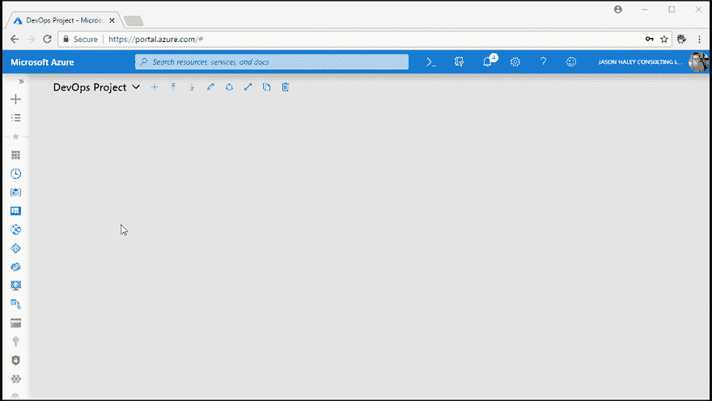](https://res.cloudinary.com/practicaldev/image/fetch/s--ufV6HxKj--/c_limit%2Cf_auto%2Cfl_progressive%2Cq_66%2Cw_880/https://microsoft.github.io/AzureTipsAndTricks/files/devops-k8s1.gif)

许多令人惊奇的工作正在后台进行，所以现在是时候喝杯咖啡或者读读另一篇文章(或者喝点酒)了...)然后单击 DevOps 项目列表上的刷新按钮。

[](https://res.cloudinary.com/practicaldev/image/fetch/s--foyOLdTA--/c_limit%2Cf_auto%2Cfl_progressive%2Cq_auto%2Cw_880/https://microsoft.github.io/AzureTipsAndTricks/files/devops-k8s2.png)

单击列表中您的 DevOps 项目名称，转到 DevOps 项目仪表板。这里有您访问源代码库和应用程序构建和发布管道所需的一切。这些管道自动化了获取您提交的代码、集成它、构建它并将其部署到一个真实的 Kubernetes 环境中所需的步骤。

此外，还提供了您的实时部署应用、Kubernetes 集群和[应用洞察](https://docs.microsoft.com/en-us/azure/azure-monitor/app/app-insights-overview?WT.mc_id=azureapril_devto-blog-cxa)(实时站点遥测)的链接。

[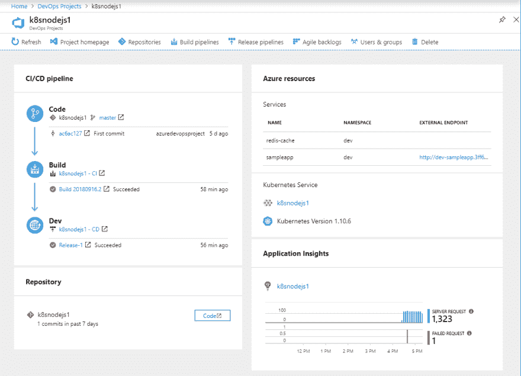](https://res.cloudinary.com/practicaldev/image/fetch/s--KBqwhZ1k--/c_limit%2Cf_auto%2Cfl_progressive%2Cq_auto%2Cw_880/https://microsoft.github.io/AzureTipsAndTricks/files/devops-k8s3.png)

您还应该收到了来自 Azure DevOps 的电子邮件或门户中的提醒，让您知道项目已经准备好了。如果您愿意，可以在您的项目中设置团队成员。

[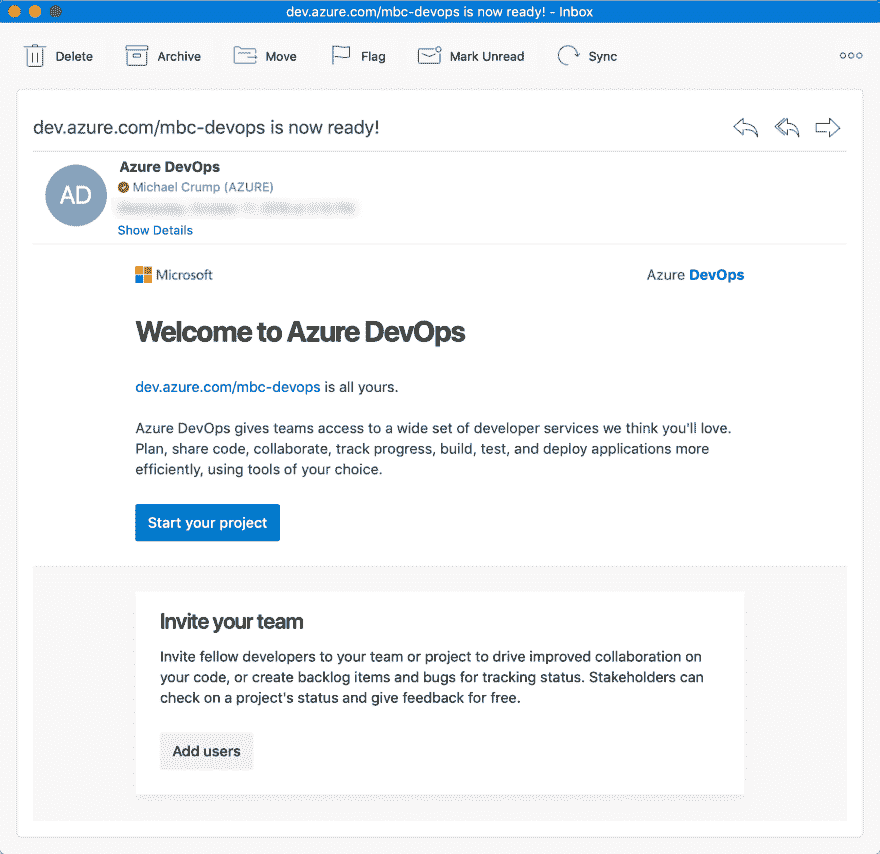](https://res.cloudinary.com/practicaldev/image/fetch/s--3I_2MEHH--/c_limit%2Cf_auto%2Cfl_progressive%2Cq_auto%2Cw_880/https://microsoft.github.io/AzureTipsAndTricks/files/devops-k8s20.png)

# 偷看代码🔍

在 [CI/CD 管道](https://azure.microsoft.com/en-us/services/devops/pipelines/)中，点击提交查看代码。您也可以点击`Master`进入完整的文件列表。

[](https://res.cloudinary.com/practicaldev/image/fetch/s--Z6KydfV6--/c_limit%2Cf_auto%2Cfl_progressive%2Cq_auto%2Cw_880/https://microsoft.github.io/AzureTipsAndTricks/files/devops-k8s4.png)

这将把您带到我们刚刚发布的包含已部署示例应用程序的 repo 的提交。

[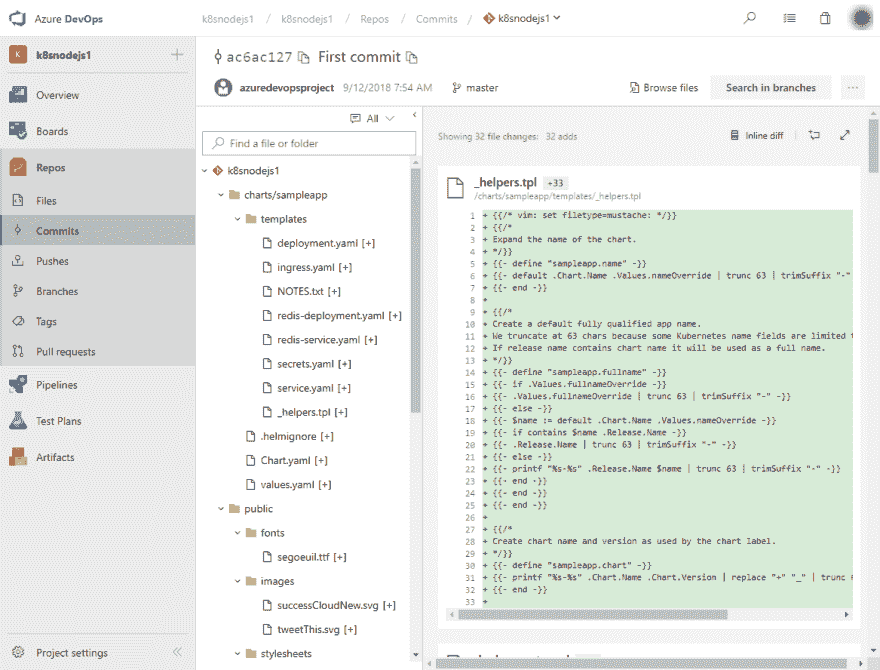](https://res.cloudinary.com/practicaldev/image/fetch/s--HmvpZbly--/c_limit%2Cf_auto%2Cfl_progressive%2Cq_auto%2Cw_880/https://microsoft.github.io/AzureTipsAndTricks/files/devops-k8s5.png)

当您创建 DevOps 项目时，它从`devops-project-samples` GitHub 项目中克隆了源代码，并将其添加到您的 DevOps 项目中，并为您做了大量的初始准备工作。*多酷啊？*

# 看看身材🤓

回到 DevOps 项目仪表板，单击带有成功构建号的`Build`链接。

[](https://res.cloudinary.com/practicaldev/image/fetch/s--EDCJaJ4s--/c_limit%2Cf_auto%2Cfl_progressive%2Cq_auto%2Cw_880/https://microsoft.github.io/AzureTipsAndTricks/files/devops-k8s6.png)

这将带您到为项目创建的新 Azure DevOps Pipelines 版本。现在点击顶部的`Edit`按钮。

[](https://res.cloudinary.com/practicaldev/image/fetch/s--eMlUWBP---/c_limit%2Cf_auto%2Cfl_progressive%2Cq_auto%2Cw_880/https://microsoft.github.io/AzureTipsAndTricks/files/devops-k8s7.png)

现在您可以看到为构建容器映像和 [Helm](https://docs.microsoft.com/en-us/azure/aks/kubernetes-helm?WT.mc_id=azureapril_devto-blog-cxa) 包而创建的步骤。Helm 用于将应用程序部署到 Kubernetes，并且是面向 Kubernetes 的 DevOps 项目中的默认选项。

> 微软正在解决真正困难的问题，让你的生活更轻松。

[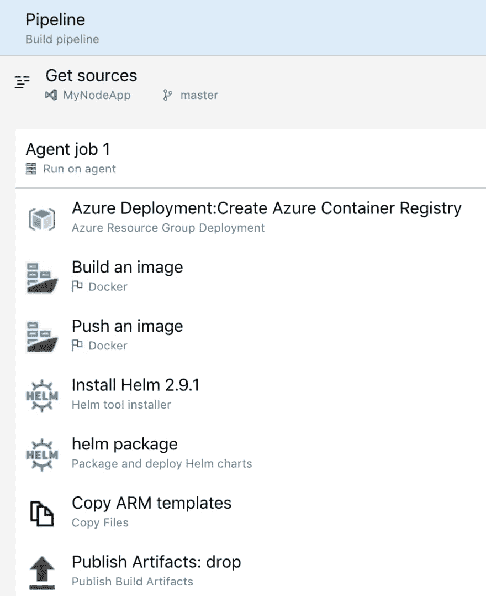](https://res.cloudinary.com/practicaldev/image/fetch/s--8tZPq7F0--/c_limit%2Cf_auto%2Cfl_progressive%2Cq_auto%2Cw_880/https://microsoft.github.io/AzureTipsAndTricks/files/devops-k8s8.png)

单击任何一个 Docker 任务都会显示 DevOps 项目创建的新的[Azure Container Registry(ACR)](https://azure.microsoft.com/en-us/services/container-registry/?WT.mc_id=azureapril_devto-blog-cxa)，以及映像名称和内部版本号。

[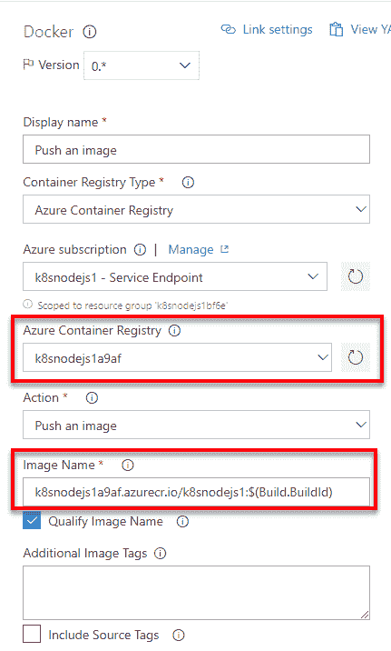](https://res.cloudinary.com/practicaldev/image/fetch/s--XTHOvaoU--/c_limit%2Cf_auto%2Cfl_progressive%2Cq_auto%2Cw_880/https://microsoft.github.io/AzureTipsAndTricks/files/devops-k8s9.png)

构建使用 Docker 创建 ACR 以及构建和推送映像。它会自动检查 Helm 是否正确安装，并开始打包和部署`charts/sampleapp`目录。它还创建了 [ARM 模板](https://docs.microsoft.com/en-us/azure/azure-resource-manager/resource-manager-quickstart-create-templates-use-the-portal?WT.mc_id=azureapril_devto-blog-cxa)，并最终发布了构建工件。

如果你切换回`Repos`，然后`Files`，然后`Applications`，你可以看到`charts/sampleapp`文件夹。

[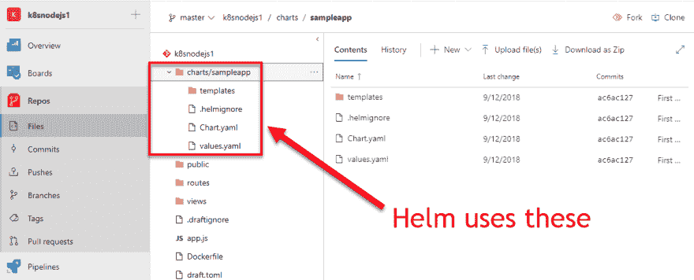](https://res.cloudinary.com/practicaldev/image/fetch/s--Ipj8T8Fq--/c_limit%2Cf_auto%2Cfl_progressive%2Cq_auto%2Cw_880/https://microsoft.github.io/AzureTipsAndTricks/files/devops-k8s10.png)

我们将通过查看`dev`和回顾`resources`部分来完成管道部分。

# 完成你的管道🔧

回到 DevOps 项目仪表板，点击带有数字的`Release`链接。

[](https://res.cloudinary.com/practicaldev/image/fetch/s--4rA-S7RE--/c_limit%2Cf_auto%2Cfl_progressive%2Cq_auto%2Cw_880/https://microsoft.github.io/AzureTipsAndTricks/files/devops-k8s11.png)

* * *

> 确保您选择的构件是绿色的。它标志着一个没有错误的成功构建。
> 
> 如果构建是红色的，点击它并找到错误。您可能会遇到的一个常见错误是`The subscription is not registered to use namespace 'Microsoft.ContainerService'`
> 
> 快速解决这个问题的一种方法是启动 Cloud Shell，选择 PowerShell 并运行以下命令:
> 
> 虽然这是为 PowerShell 设计的，但是如果您是 Bash 的狂热用户，您会在下面评论您使用的命令吗？

```
PS Azure:\> Register-AzureRmResourceProvider -ProviderNamespace “Microsoft.ContainerService” 
```

您将收到类似下面的输出。

```
ProviderNamespace : Microsoft.ContainerService
RegistrationState : Registering
ResourceTypes     : {containerServices, managedClusters, locations, locations/operationresults...}
Locations         : {Japan East, Central US, East US 2, Japan West...} 
```

* * *

如果一切顺利，你会看到基本的 Azure DevOps 发布管道。点击顶部的`Edit`释放按钮。

[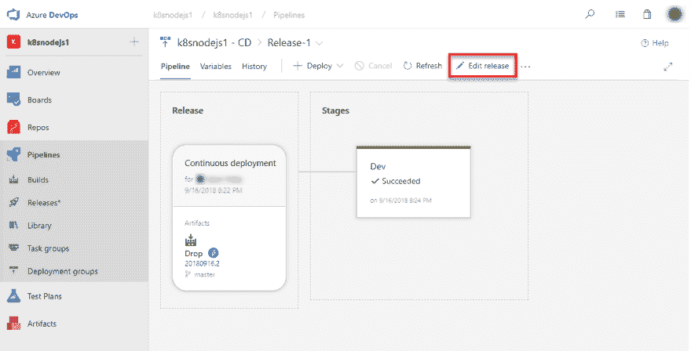](https://res.cloudinary.com/practicaldev/image/fetch/s--Qh8Rlj5r--/c_limit%2Cf_auto%2Cfl_progressive%2Cq_auto%2Cw_880/https://microsoft.github.io/AzureTipsAndTricks/files/devops-k8s12.png)

然后点击`Edit`任务链接。

[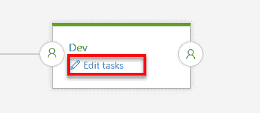](https://res.cloudinary.com/practicaldev/image/fetch/s--XO4fNmuH--/c_limit%2Cf_auto%2Cfl_progressive%2Cq_auto%2Cw_880/https://microsoft.github.io/AzureTipsAndTricks/files/devops-k8s13.png)

您现在可以看到需要运行的任务列表，例如创建 AKS 集群、运行 PowerShell 脚本以及打包和部署 Helm charts。

[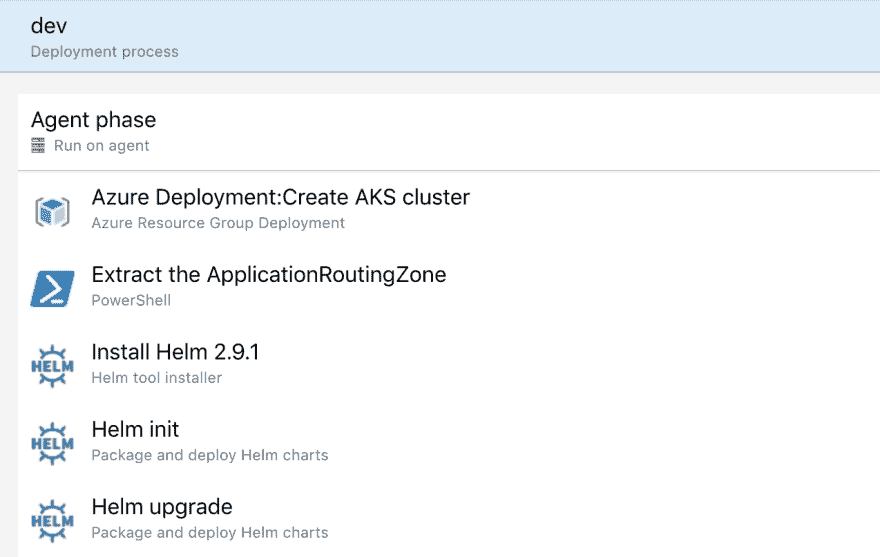](https://res.cloudinary.com/practicaldev/image/fetch/s--gXS_umxj--/c_limit%2Cf_auto%2Cfl_progressive%2Cq_auto%2Cw_880/https://microsoft.github.io/AzureTipsAndTricks/files/devops-k8s14.png)

# 天蓝色资源概括地说🥜

回到 DevOps 项目仪表板，让我们看看 Azure 资源和应用洞察。这些资源是您在 Kubernetes 上运行的实时站点的 URL 和一个到 AKS 集群的链接。最后一个链接将带您查看 Application Insights 为您的站点提供的实时遥测。

> 遥测只是一种奇特的说法，这就是你如何监控你的应用程序的健康。

[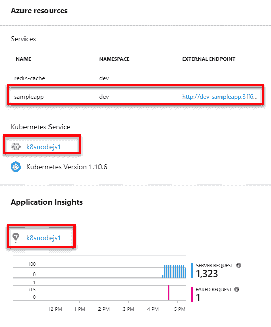](https://res.cloudinary.com/practicaldev/image/fetch/s--HZ3GFGM6--/c_limit%2Cf_auto%2Cfl_progressive%2Cq_auto%2Cw_880/https://microsoft.github.io/AzureTipsAndTricks/files/devops-k8s15.png)

### 直播 App

点击`External Endpoint`链接，进入已部署的应用程序。

[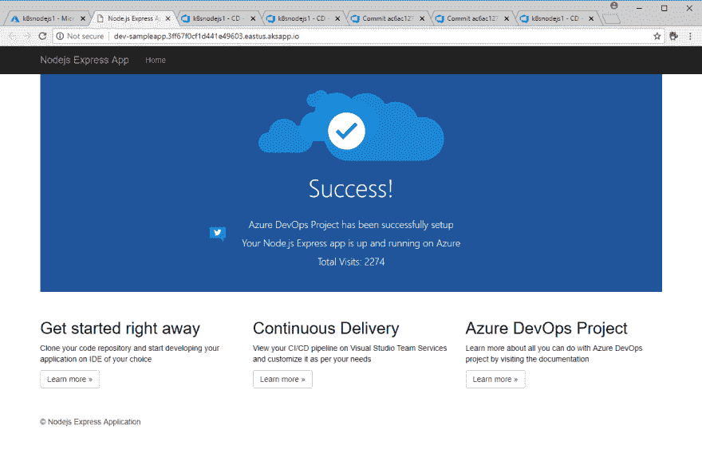](https://res.cloudinary.com/practicaldev/image/fetch/s--CkVB8gFF--/c_limit%2Cf_auto%2Cfl_progressive%2Cq_auto%2Cw_880/https://microsoft.github.io/AzureTipsAndTricks/files/devops-k8s16.png)

### AK

第二个链接是 Azure Kubernetes 服务。

[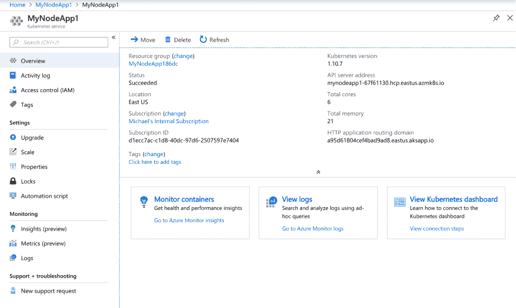](https://res.cloudinary.com/practicaldev/image/fetch/s--KMBII2Sd--/c_limit%2Cf_auto%2Cfl_progressive%2Cq_auto%2Cw_880/https://microsoft.github.io/AzureTipsAndTricks/files/devops-k8s17.png)

### 应用见解

最后一个链接显示了为该服务创建的应用洞察，其中包括强大的分析工具，可帮助您诊断问题并了解用户实际使用您的应用做了什么。它旨在帮助您不断提高性能和可用性，并与 Azure DevOps 无缝协作

[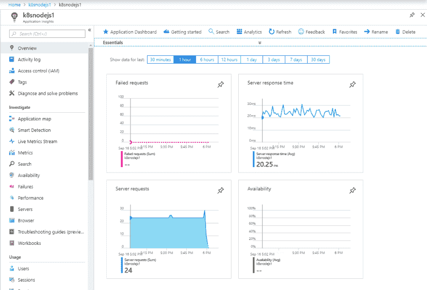](https://res.cloudinary.com/practicaldev/image/fetch/s--ELuzLxiN--/c_limit%2Cf_auto%2Cfl_progressive%2Cq_auto%2Cw_880/https://microsoft.github.io/AzureTipsAndTricks/files/devops-k8s18.png)

现在，如果你去 Azure 门户网站上的`Resource Groups`并搜索 DevOps 项目的名称，你会看到创建了三个资源组。

[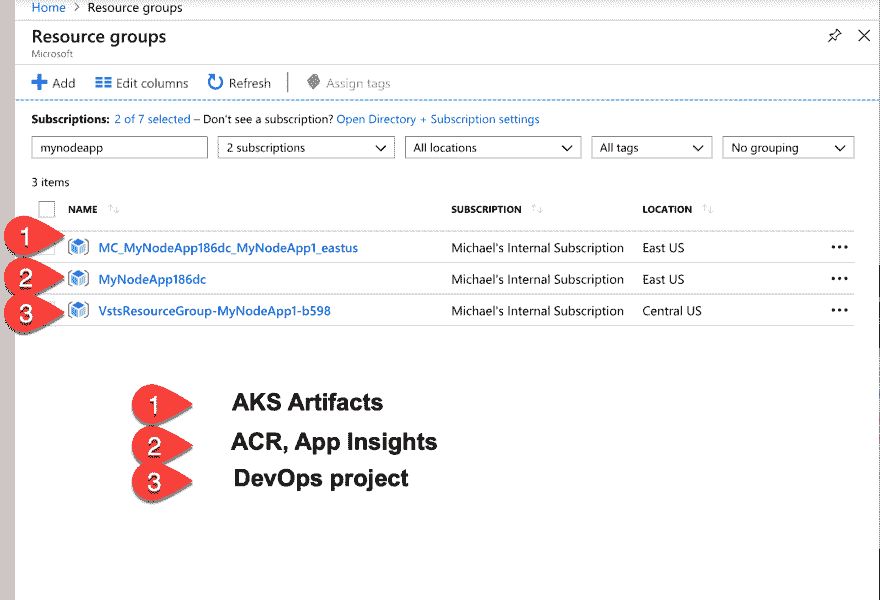](https://res.cloudinary.com/practicaldev/image/fetch/s--NEjTRCR5--/c_limit%2Cf_auto%2Cfl_progressive%2Cq_auto%2Cw_880/https://microsoft.github.io/AzureTipsAndTricks/files/devops-k8s19.png)

> 记住！通过删除创建的资源来避免与本教程相关的任何成本。

**想要更多？**不要等待。[继续了解 Azure DevOps](https://azure.microsoft.com/en-us/services/devops/?WT.mc_id=azureapril_devto-blog-cxa) 。

* * *

我们将在四月份每天发布文章，敬请关注！或者跳到前面，查看更多提示和技巧[现在](http://azuredev.tips?WT.mc_id=azureapril_devto-blog-cxa)。