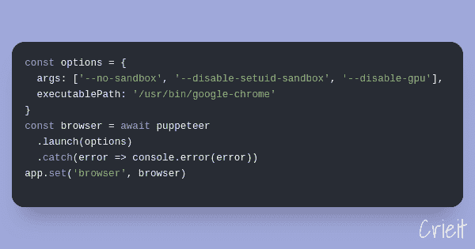

# 在 Node 上操作 Chrome，制作了生成 Twitter 共享用图像的服务器

> 原文：<https://dev.to/dala00/nodechrometwitter-a04>

Node.js 中有一个不显示 Puppeteer 画面就能处理 Chrome 的库。 利用它，我们创建了一个服务器 APP 应用程序，只要提供 URL 作为参数，屏幕快照就可以在浏览器中显示为图像。

实际上可以制作这样的图像。 例如，以下是在板内投稿中输入代码时显示的图像。

[](https://res.cloudinary.com/practicaldev/image/fetch/s--t4Dp5uys--/c_limit%2Cf_auto%2Cfl_progressive%2Cq_auto%2Cw_880/https://thepracticaldev.s3.amazonaws.com/i/rcq2nitt8602wdt78ozb.png)

以下是文章的图片。

[](https://res.cloudinary.com/practicaldev/image/fetch/s--Iujn9Ytd--/c_limit%2Cf_auto%2Cfl_progressive%2Cq_auto%2Cw_880/https://thepracticaldev.s3.amazonaws.com/i/84ncripwkyjk29mcj2pd.png)

因为是由 HTML、CSS 生成的，所以投影之类的也可以像这样简单地发挥作用。

因为是在 GitHub 上公开的，所以想先用看的人请跳过报道，使用最后的链接(一边用无法忍受的眼泪淋湿脸颊)

## 什么方便

只要在 Twitter 等上共享 Web 服务的 URL，不仅是 URL，在推特上也会经常看到图像。

这并不是上传图像，而是方便地在 SNS 端显示由该页面内的 HTML 中所写的元标签指定的图像，也就是所谓的 OGP。

### Web 服务中的难题

如果是普通的网站，只需指定图片，而 Web 服务有时会想根据发布的内容动态制作 OGP。

这种情况下必须动态制作图像，但这个很麻烦。

在服务器端进行的话，会增加负荷，而且原本描绘大多都是根据程序的指令构筑的，维护非常麻烦。 虽然可以在前台进行，但是根据浏览器的浏览环境不同，显示也会有差异。

### Solution decision

因此，通过提供使用专用 Puppeteer 的 OGP 生成服务器可以解决上述所有问题。

因为 OGP 只是指定 URL，所以也可以分开服务器，所以分开的话 APP 应用服务器端就没有任何负荷。 另外，由于在 OGP 服务器的浏览器上进行显示和截图，所以也不会依赖于用户的环境。

## 具体结构

这次制作的内容非常简单，只要指定了 URL，就会拍摄该 URL 的截图并显示为图像。

例如，如果是第一篇文章的图像，访问实际的[为什么想做 Crieit 的](https://crieit.net/posts/Crieit-5b91bd1569dbd)页面，看一下源就知道了，有以下这样的元标签。

```
 <meta property="og:image" content="https://ogp.crieit.net/posts/Crieit-5b91bd1569dbd/ogp.png">
    <meta name="twitter:card" content="summary_large_image">
    <meta name="twitter:image" content="https://ogp.crieit.net/posts/Crieit-5b91bd1569dbd/ogp.png"> 
```

Enter fullscreen mode Exit fullscreen mode

这个被指定为`og:image`和`twitter:image`的图像是按照这次介绍的结构制作的图像。

具体来说，就是拍摄 crieit.net 上完全相同路径的截图。 也就是说，如果是上述内容的话，我们正在拍摄下述 URL 的截图。 实际上也可以看到。 (尽量加上扩展名。 理由将在后面叙述)

[https://criit . net/posts/criit-5b 91 BD 1569 db/ogp](https://crieit.net/posts/Crieit-5b91bd1569dbd/ogp)

如果您访问的话就知道了，OGP 图像只是直接用 HTML 和 CSS 制作而成。 我只是在拍那一页的截图。 在这个例子中，我觉得字体不一样，但是因为它安装在 OGP 服务器内，所以在 OGP 服务器内的 Chrome 中可以用正确的字体显示。

顺便说一下，为了在浏览器中进行渲染，JavaScript 也会移动。 这次的代码显示示例也在移动 highlight.js。

### 扩展名为 URL

如上例所示，OGP 服务器端的 URL 可以有扩展名。 这样，通过 Cloudflare 这样的 CDN 时，就可以很好地进行缓存了。

也就是说，只要有人访问了该 URL，之后就会通过 CDN 进行发布，所以 OGP 服务器端就不会再访问。

实际上，如果打开前面提到的图像并重新加载，我想你会发现非常快。 即使不是什么大处理，本来只是需要在浏览器中打开页面的时间，所以完全不一样。

话虽如此，毕竟 OGP 一般都是在 SNS 端缓存的，所以好处并不大，但是经过改造后也可以用于其他用途，所以只要记住这个结构，我想就会有很多便利。

### Components

因为使用 Puppeteer，所以成为 Node.js 的服务器。

服务器是 Express，大多数使用 Express 命令创建的源代码保持不变。 因为没有做复杂的事，所以写了几十行左右就完成了。 (因此还剩下很多不必要的处理，制作本身很粗糙…)

### 放弃使用 functions 系统

虽然现在有各种各样的 Paas 和 functions 服务，但是经过调查和尝试后放弃了使用，最终决定简单地用基于 Express 的 Node.js 的服务器制作。

放弃的理由如下。

*   由于每次请求都必须启动浏览器，所以图像生成可能需要相当长的时间。 如果是 Express 的话，最初只需要启动一次就可以了
*   根据服务的不同，本来就不能使用
*   因为在服务上可能必须进行特殊的实现，所以在本地难以尝试的开发上可能会花费时间，很麻烦
*   根据服务的不同，进程的执行时间也会有限制

…等等。 如果有能很容易操作的服务的话，请一定要告诉我。

## 服务器

我来解说实际的服务器制作方法。

### 安装 Chrome

是做最重要的工作的东西。

也许是因为尝试 ChromeDriver 时的遗留，混入了一部分不需要的东西。 这和文档文件的内容一样。

```
apt-get update
apt-get install -y libappindicator1 fonts-liberation unzip
curl -O https://dl.google.com/linux/direct/google-chrome-stable_current_amd64.deb
dpkg -i google-chrome*.deb || apt update && apt-get install -f -y 
```

Enter fullscreen mode Exit fullscreen mode

### 安装字体

如果只用 Web 字体制作页面就不需要了，如果不是这样的话，或者可能有不足的字体的话，就安装好。

```
apt-get install fonts-ipafont-gothic fonts-ipafont-mincho 
```

Enter fullscreen mode Exit fullscreen mode

### 安装 Node.js

先放入 npm 和 yarn。 我觉得按照官网上写的顺序放进去就没问题了。

### npm 的模块安装

因为 Chrome 已经安装了，所以以跳过它的形式安装。 如果想以不同的模式安装，请适当更改。

```
PUPPETEER_SKIP_CHROMIUM_DOWNLOAD=true yarn 
```

Enter fullscreen mode Exit fullscreen mode

### 安装 Nginx

虽然这不是必需的，但是由于您想将在端口 3000 上运行的 Node.js 服务器代理到 80，并支持 SSL，因此您也想代理 Let's Encrypt 的 certbot 使用的 URL，以便在放置时更新证书 (这里也比较合适，请适当变更)

```
 listen 443 ssl default_server;
        ssl_certificate /etc/letsencrypt/live/ogp.example.net/fullchain.pem;
        ssl_certificate_key /etc/letsencrypt/live/ogp.example.net/privkey.pem;

        server_name ogp.example.net;

        proxy_redirect off;
        proxy_set_header X-Forwarded-For $proxy_add_x_forwarded_for;
        proxy_set_header Host $http_host;

        location ^~ /.well-known/ {
                root /var/www/html;
        }

        location / {
                proxy_pass http://localhost:3000/;
        } 
```

Enter fullscreen mode Exit fullscreen mode

### 用 Systemd 服务化

像以下这样设定了。

```
[Unit]
Description=ogp server
After=syslog.target network.target

[Service]
Type=simple
ExecStart=/usr/bin/npm start
WorkingDirectory=/path/to/puppeteer-ogp
KillMode=mixed
Restart=always
User=yourname
Group=yourgroup

[Install]
WantedBy=multi-user.target 
```

Enter fullscreen mode Exit fullscreen mode

所以，虽然理由还不太清楚，但是因为 APP 软件和 Chrome 的过程不能很好地结束，所以决定用`KillMode=mixed`来圆满地强制结束。

服务的有效化如下所示。

```
sudo systemctl enable ogp 
```

Enter fullscreen mode Exit fullscreen mode

之后，只要按下述方式启动就可以完全放置。

```
sudo service ogp start 
```

Enter fullscreen mode Exit fullscreen mode

顺便说一下，我使用的是可以免费移动的谷歌计算机引擎 f1-micro。

## 公开了

因为是相当什么都没做的水平的制作品，所以制作的东西在 GitHub 上公开了。 请一定要适当地尝试一下，或者改造后玩一下。

[dala 00/木偶师-ogp](https://github.com/dala00/puppeteer-ogp)

在下面写下重要的注意事项。 然后，我还会粗略地写下本地开发方法

## Pay attention

因为它还没启动多久，它能稳定运行多久还是个谜。 因为 Chrome 在 APP 软件之外还在运行，所以完全无法想象那一带的稳定性如何。 虽然最后调整之后好像没有问题，但是运转初期经常崩溃。

所以被使用的时候请自行负责。 我先记下采取了什么对策，以及可能会有什么问题。

### 加入错误处理

在浏览器崩溃的前提下，确保在打开页面时或遇到错误时重新启动。 但是，由于确认不充分，当前的错误处理本身有可能不正确。 已经确认了实际崩溃时过程会不断增加的问题。

虽然可能是这样，但如果是守护进程后确实能重新启动的状态，如果出现问题，就直接关掉 APP 屏幕会更安心。 (这样的话，在应该保证稳定性和高频率访问的 APP 应用中可能会很难。)

### 放入 URL 的过滤器

这是目前最大的改善。 这是因为，公开服务器后，有无差别地寻找. git 文件夹和 phpMyAdmin 来窃取数据的可疑访问。 因为这个会在一瞬间高频度地进行，所以对 Chrome 的负荷会增加，导致崩溃。

因此，按照以下所示，可以只过滤环境变量所需的 URL，其他 URL 时不使用 Chrome。 光是这样就不再发生崩溃了。

```
URL_FILTER=/articles,/posts 
```

Enter fullscreen mode Exit fullscreen mode

总之，我觉得如何不使用 Chrome 这一点变得很重要。 访问量较多的情况下，如果采取让其等待，不同时打开很多页面的形式，稳定性可能会提高。 (但是，如果响应变差的话，SNS 可能会无法识别 OGP。)

### 大概规格高的服务器看起来更好

因为 Chrome 本身并不是在低规格环境下顺利工作的东西，所以我觉得服务器的规格越高越好。 实际上，在现在使用的 Google Compute Engine 的 f1-micro 实例中，一直有关于最好升级机器类型的警报。

另外，我想大概规格越高崩溃的可能性也越低…。

### 作为参考的信息

我大概参考了下述内容。

*   [防止使用 Headless Chrome 的 PDF 转换服务器掉落的对策总结- GA 薄荷至上主义](https://uyamazak.hatenablog.com/entry/2019/01/30/150910)
*   [如何使 puppeteer 在永久化的 node.js APP 内稳定运行- Qiita](https://qiita.com/go_sagawa/items/4a368040fac6f7264e2c)
*   [Docker 上的 puppeteer 发生 Page crash 时怀疑 shm 大小- Qiita](https://qiita.com/windyakin/items/00b085902547570eebc6)

## 本地开发方法

基本上就和 GitHub 上列出的自述一样，但只要有 Docker 和 docker-compose，谁都可以马上尝试。 只要直接进行 Getting Started 和 Development 的操作就能动作。

## 总结

稍微改造一下就可以用一个服务器对应多个服务的 URL，特别是个人开发的人每个人都有一个 OGP 服务器的话会很方便。

如果可以的话，可以在下面发布各种各样的代码试试！

[尝试代码的 OGP 的板](https://crieit.net/boards/try-code-ogp)

如果有问题或拉式请求，请随时联系 GitHub。 (可能只有在空闲的时候才能看到…)