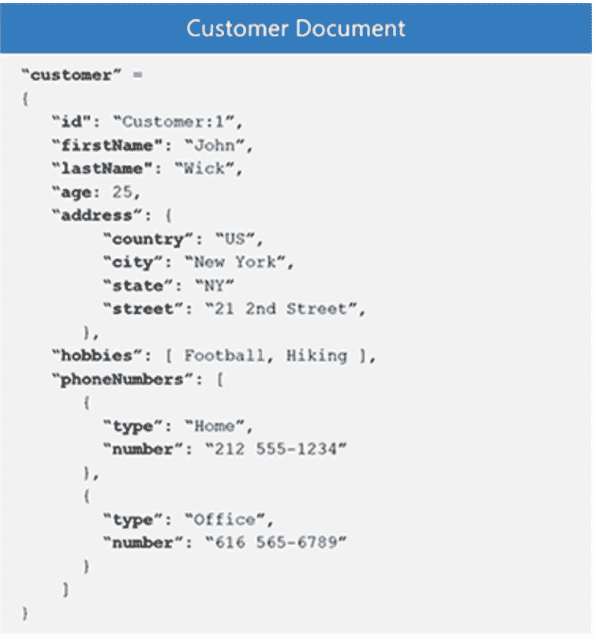
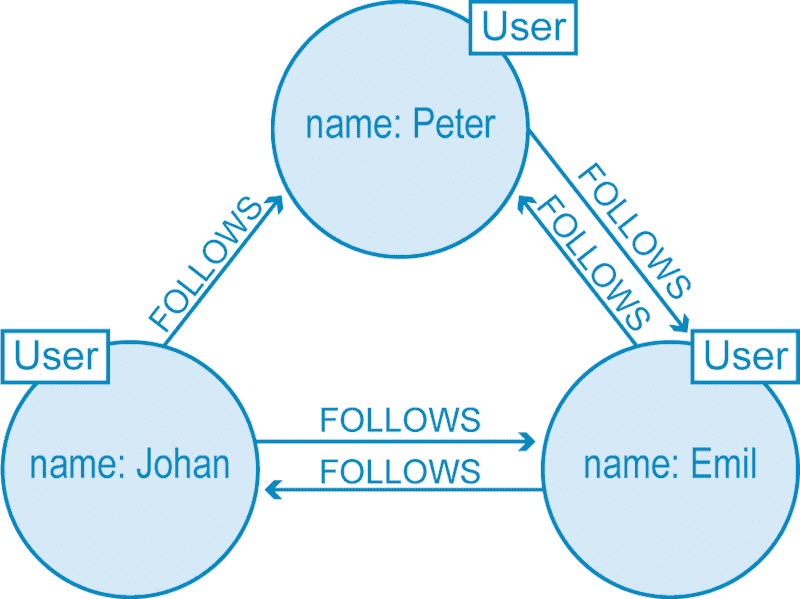

# NoSQL 数据库

> 原文：<https://dev.to/elimerrell/nosql-databases-1d9d>

在我的 web 开发和 GIS 项目中，我一直使用关系数据库。我们大多数人应该熟悉关系数据库。关系数据库将数据存储在由行和列组成的表中，每个数据条目被称为一条记录。数据库中的每个条目都有一个唯一的标识符，称为主键，不同的表可以通过引用另一个表中记录的主键(外键)来相互关联。关系数据库的组成使它们成为使用结构化查询语言(SQL)存储和查询大量互连数据的绝佳选择。

尽管关系数据库长期以来一直是数据存储的标准，但最近几年有一个(不那么)新的东西受到了广泛的欢迎；非关系数据库。非关系数据库，通常被称为 NoSQL 数据库，放弃了表的使用，而是以各种结构存储数据。虽然它们在 20 世纪 60 年代就已经出现，但直到最近几年才被广泛使用。

受欢迎程度上升的原因是，与关系数据库相比，NoSQL 数据库是存储大量数据的更快、更具可伸缩性的解决方案。像亚马逊、脸书和谷歌这样的大公司正在利用这些数据库来提高他们庞大的数据存储的速度和性能。

包括 MERN 和 MEAN stacks 在内的几个技术栈利用 NoSQL 数据库存储数据。随着非关系数据库的出现，我想将它们与关系数据库进行比较，并为未来的项目找到一个好的用例。

#### 非关系数据库到底是什么？

本质上，非关系数据库是一种存储典型表格格式之外的数据的数据库。有几种类型的非关系数据库，它们构造存储数据的方式不同。非关系数据库不与模式相关联，因此不会对数据类型和数据结构施加限制。

NoSQL 数据库越来越受欢迎，部分原因是它们比关系数据库更容易扩展。缩放主要有两种方式；向上或向外。纵向扩展意味着您增加了硬件处理不断增加的数据存储和操作的能力。横向扩展是指将数据存储分布在更多服务器上，从而将数据分散到更小的块中。

由于表之间的连接和关系，关系数据库很难扩展。当与关系数据库相关联的所有表都存在于单个服务器上时，关系数据库的效率要高得多。对于非关系数据库，数据是自包含的，不需要与其他数据片段交互，因此更容易跨多个系统分布。

有许多公司生产 NoSQL 数据库产品，包括 MongoDB、Oracle NoSQL、DynamoDB 等。NoSQL 数据库依赖于几种在不同用例中表现出色的数据模型。

##### 文档数据模型

非关系数据库最常见的“风格”之一是文档存储模型。存储在文档中的数据通常存储在 JSON 或类似的数据结构中。文档数据库非常有用，因为数据已经被格式化为类似 JSON 的结构，可以很好地与编程语言交互。文档数据库非常适合存储用户信息或与内容管理系统相关的数据。最流行的文档数据库平台之一是 MongoDB。

 

<figure>

<figcaption>
来源:
</figcaption>

</figure>

##### 图形数据库模型

图数据库用于存储关系，常用于存在大规模用户关系的社交媒体平台(即 Twitter)。图形数据库通过使用节点和边来连接数据。节点是可能连接到其他节点的实体(即用户)。节点通过边连接，边可以存储与关系相关的属性。边缘也有方向性。例如，用户可以选择跟随另一个用户，但是被跟随的用户可能不会跟随他们回来。这将是一种单向的关系。从图形数据库中检索关系数据可以非常快，因为图形数据库可以在搜索过程中忽略不相关的数据。一些常见的基于图的数据库系统包括 Amazon Neptune、Neo4j 和 OrientDB。

 

<figure>

<figcaption>
来源:[https://neo4j.com/blog/why-graph-databases-are-the-future/](https://neo4j.com/blog/why-graph-databases-are-the-future/)
</figcaption>

</figure>

##### 键值数据库模型

键值对数据模型非常类似于文档模型。键值数据库类似于一个字典，其中每个值都有一个惟一的键标识符。各种数据可以存储为该数据模型的值，包括整数、字符串、数组和对象。键值 NoSQL 数据库的一个例子是客户数据库，其中每个客户 ID 都映射到一个客户信息对象:

C1: {姓名:无名氏，
电话:800-444-5555，
电子邮件:【john@doe.com】，
地址:宾夕法尼亚大道 1600 号
}
C2: {姓名:无名氏，
电话:800-666-7777，
电子邮件:[jane@doe.com](mailto:jane@doe.com)，
地址:宾夕法尼亚大道 1600 号
}

一些常见的键值数据库系统包括 Amazon 的 DynamoDB、Oracle NoSQL 和 Riak KV。当大规模处理大量读写请求时，键值系统非常有用。它们通常用于管理大型 web 应用程序中的商店会话数据，以及存储购物车和电子商务信息。