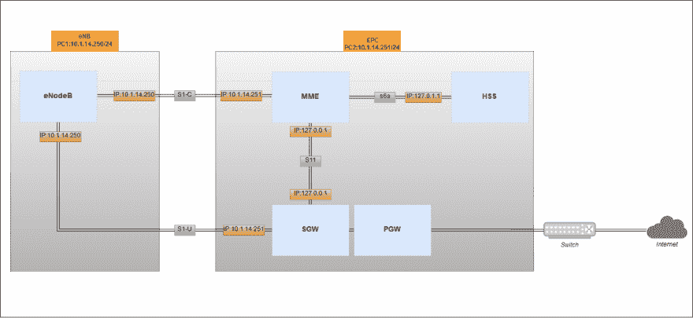

# 基于集装箱的 OAI 核心网络

> 原文：<https://dev.to/johnny_pravi/oais-core-network-based-on-containers---3jkd>

关于**OAI sim**:
OpenAirInterface(OAI)是一个用于无线通信系统的开源平台，由 Eurecom 的移动通信部门开发。它允许对 LTE 和 LTE-Advanced (Rel-10)系统进行原型设计和实验，以便对协议和算法解决方案进行评估、验证和预部署测试。OAI 允许人们进行链路级模拟、系统仿真和实时射频实验。因此，它被广泛用于设置 Cloud-RAN 和 Virtual-RAN 原型。它包括符合 3GPP 的 LTE 协议
堆栈，即 eNB 和 UE 的整个接入层以及 3GPP LTE 演进分组核心协议的子集。

OAI 可用于**两种模式**:第一种是实时模式，它提供了一个与商业终端互操作的 4G 系统的开放实现，以便允许实验。这需要使用软件定义的无线电前端(例如 USRP210 外部板)进行广播时间传输。第二种模式是仿真模式，其中仿真 enb 和 UE 的软件模块通过仿真的物理信道进行通信。在仿真模式中，场景是完全可重复的，因为信道仿真基于伪随机数生成。在仿真模式下，OAI 可以使用 oaisim 软件包仿真完整的 LTE 网络。几个 enb 和 UE 可以在同一台机器上虚拟化，或者在通过基于以太网的 LAN 通信的不同机器上虚拟化。PHY 和无线电信道或者被完全仿真(这是耗时的),或者被近似为 PHY 抽象模式，这要快得多。在这两种情况下，仿真模式运行整个协议栈，使用与实时模式相同的 MAC 代码。通过这种方式，oaisim 包可用于测试和验证新的实现或示例场景，免除了 SDR 前端广播时间传输可能带来的所有问题。由于在仿真和实时模式中使用了相同的代码，开发人员可以无缝地切换到实时环境。

**思路:**

我们在设置核心网的时候，通常是在虚拟机上配置。EPC(核心网络)的核心组件是 HSS、MME 和 SPGW，它们是必须按照我们所说进行配置的组件，因此可以在 S1 接口支持下执行模拟。

但是我认为这种建立 CN 的方式并不灵活和理想。HSS/MME/SPGW 目录的配置需要许多步骤和网络配置。

Docker Time:
主要想法是通过将 3 个组件分成 3 个不同的虚拟机来激发的，所以现在我们正试图将每个组件分成不同的容器，并根据将托管 eNB(天线)和 UE(用户设备)的主机系统来配置它们自己。这样，EPC(核心网络)的整个执行将更快、更容易，并且用户将不必参与网络过程。