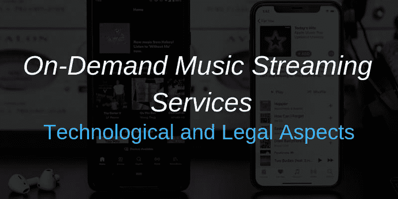

# 点播音乐流媒体服务:技术和法律问题

> 原文：<https://dev.to/appdevelopmentagency/on-demand-music-streaming-services-technological-and-legal-aspects-54ff>

 
音乐流媒体为音乐产业及其艺术家提供了一种与全球消费者分享和传播音乐的独特方式。这项技术是为了支持这些服务而开发的，预计这些服务将会增长，并成为美国最赚钱的数字音乐格式。根据 2017 年的统计数据，41%的美国人花在听音乐上的时间是通过流媒体。

**让我们来看看市场上可用的流媒体服务类型。**

## 流媒体服务市场

流媒体服务可以大致分为广播服务和点播服务。广播电台主要与音乐发现相关，并有许可协议限制它们播放点播音乐，这使得点播音乐流媒体服务成为更有吸引力的选择，让用户可以立即播放他们选择的歌曲。毫不奇怪，2017 年，点播流媒体占美国所有 R&B/嘻哈音乐消费的 69%，移动设备是最受欢迎的平台。让我们试着理解这些按需解决方案是如何工作的。

## 点播音乐流媒体服务

音乐流媒体服务阵容庞大，Spotify、Apple Music、Tidal、Pandora 和 Amazon Music 都是顶级竞争者。这些服务与广播服务一样，提供推荐和发现功能，以了解用户的偏好并生成推荐的播放列表。这些服务实现这一点的方式包括:

**1。用户入职流程:**对于一个新的应用程序，了解用户选择的简单方法是使用脸书的 API 来了解他们的好恶，或者在用户登录后立即填写一份简短的问卷。应用程序利用这一点来了解用户喜欢什么样的音乐，并相应地定制他们的产品。从长远来看，他们获得了足够的数据来理解用户的选择。

**2。挖掘用户行为:**公司随着时间的推移挖掘用户的行为，根据他们喜欢或听的歌曲、艺术家、专辑和流派，并根据他们在入职过程中做出的选择，创建用户档案。然而，让各种点播音乐流媒体服务脱颖而出的是应用程序设计选择、它们提供的内容和功能，最重要的是，它们生成的个性化播放列表能够满足用户的需求。这就需要一个更先进的系统来进行推荐和发现。

**3。使用算法进行更深入的分析:**生成个性化列表需要复杂的算法，这些算法可以捕捉和分析可用的轨迹，以进行更深入的行为分析。Spotify 和 Apple Music 等应用程序使用人工智能、机器学习和技术专业知识为用户提供他们喜欢的音乐。同样，Pandora 使用各种机器学习算法，结合音乐基因组的原始广播分析、过滤方法和内部编辑管理，来构建用户播放列表。

这只是流媒体服务如何工作的概述，然而，随着竞争的加剧和尖端技术的发展，流媒体市场越来越难以渗透。如果你打算发布你的应用，去找那些最好的应用开发公司，他们能以很少的费用为你提供高端技术和必要的专业知识。更复杂的是，法律也没什么帮助。让我们看看这些服务的法律方面。

## 阻碍流媒体服务的法律问题

要制作音乐流媒体应用程序，公司需要签署录音和作品的合同或许可协议，并为复制或制作录音和作品的副本支付版税。内容需要获得索尼音乐、环球音乐集团和华纳兄弟等主要唱片公司的许可；像梅林网络这样的独立聚合器；来自索尼/ATV 等出版商，他们根据收入百分比、每流费率、未来流预付款或股权提供许可证。问题在于音乐授权缺乏全球标准，大唱片公司不愿意与低利润的新兴服务签署协议。

## 结论

点播音乐流媒体服务已经成为美国音乐爱好者的热门选择，吸引了高额收入。这使得流媒体市场竞争激烈，涉及复杂的算法和尖端技术来分析用户行为并提供定制的播放列表。然而，全球音乐许可标准的缺乏以及主要玩家不愿意签署低利润协议，使得新玩家的日子不好过。