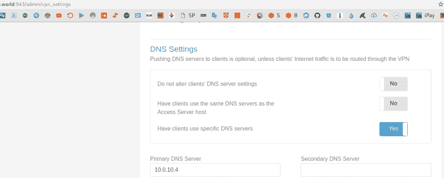

# OpenVPN: DNS 和 dnsmasq 配置

> 原文：<https://dev.to/setevoy/openvpn-dns-and-dnsmasq-configuration-225f>

[](https://res.cloudinary.com/practicaldev/image/fetch/s--wzHUWC0j--/c_limit%2Cf_auto%2Cfl_progressive%2Cq_auto%2Cw_880/https://rtfm.co.ua/wp-content/uploads/2014/07/openvpn-logo-1.png) 除了 [OpenVPN: OpenVPN 接入服务器设置和 AWS VPC 对等配置](https://rtfm.co.ua/en/openvpn-openvpn-access-server-set-up-and-aws-vpc-peering-configuration/)post-DNS 设置示例。

我们有*ci.example.com*域，如果从互联网请求，它必须被解析为它的公共 IP(AWS EC2 实例的),如果通过 VPN 连接请求，则必须被解析为它的私有 IP。

要实现这一点，您可以使用安装在 OpenVPN 上的`dnsmasq`服务作为主机。

安装它:

```
$ sudo apt -y install dnsmasq 
```

为必要的服务创建一个带有硬编码私有 IP 的`/etc/dnsmasq.hosts`文件:

```
10.0.5.10 ci.example.com 
172.31.36.107 nexus-repo.example.com 
10.0.3.105 rabbitadmin-production.example.com 
10.0.1.6 monitor.example.com 
```

下一步——更新`/etc/dnsmasq.conf`文件并添加 [`addn-hosts`](http://www.thekelleys.org.uk/dnsmasq/docs/dnsmasq-man.html) 选项，使其看起来如下:

```
listen-address=127.0.0.1
listen-address=10.0.10.4
bind-interfaces
log-queries
addn-hosts=/etc/dnsmasq.hosts 
```

重启`dnsmasq`服务:

```
root@openvpnas2:~# service dnsmasq restart 
```

本地检查:

```
root@openvpnas2:~# dig @localhost ci.example.com +short
10.0.5.10 
```

很好。

现在进入你的 OpenVPN 的管理页面=> *VPN 设置*并将*让客户端使用特定的 DNS 服务器*设置为*是*:

[](https://rtfm.co.ua/wp-content/uploads/2019/02/Screenshot_20190222_165429.png)

在*主 DNS 服务器*字段中设置您的 EC2 的私有 IP，您的 OpenVPN 服务器在哪里运行。

在工作站上重新启动 VPN 连接:

```
$ sudo openvpn --config vpnroot-client.ovpn
...
Fri Feb 22 16:53:58 2019 /usr/bin/ip link set dev tun0 up mtu 1500
Fri Feb 22 16:53:58 2019 /usr/bin/ip addr add dev tun0 172.27.240.25/20 broadcast 172.27.255.255
Fri Feb 22 16:53:58 2019 /etc/openvpn/update-resolv-conf tun0 1500 1553 172.27.240.25 255.255.240.0 init
dhcp-option DNS 10.0.10.4
... 
```

检查本地`resolv.conf` :

```
$ cat /etc/resolv.conf
# Generated by resolvconf
nameserver 10.0.10.4 
```

检查 DNS 解析:

```
$ dig ci.example.com +short
10.0.5.10 
```

还有其他的:

```
$ dig google.com +short
74.125.193.100
74.125.193.101
74.125.193.102 
```

完成了。

UPD:但是通过 AWS peering 使用 [DNS 解析有更正确的解决方案。](https://docs.aws.amazon.com/en_us/vpc/latest/peering/modify-peering-connections.html#vpc-peering-dns)

### 类似的帖子

*   <small>02/21/2019</small>[OpenVPN:OpenVPN 接入服务器设置和 AWS VPC 对等配置](https://dev.to/setevoy2/openvpn-openvpn-access-server-set-up-and-aws-vpc-peering-configuration-66b-temp-slug-8374150) <small>(0)</small>
*   <small>03/02/2019</small>[Arch Linux:OpenVPN–resolv . conf 未更新](https://rtfm.co.ua/en/arch-linux-openvpn-resolv-conf-not-updated/) <small>(0)</small>
*   <small>2019 年 2 月 22 日</small> [【开放 VPN:каоаоооооооооооооооооазоаоаоаоаоаоаоаоаоаоазо】](https://rtfm.co.ua/openvpn-nastrojki-dns-i-dnsmasq/)
*   <small>02/21/2019</small>[OpenVPN:настрокаOpenVPN 接入服务器и AWS VPC 对等](https://rtfm.co.ua/openvpn-nastrojka-openvpn-access-server-i-aws-vpc-peering/) <small>(0)</small>
*   <small>03/02/2019</small>[arch Linux:openvpn–необновляетсяresolv . conf](https://rtfm.co.ua/arch-linux-openvpn-ne-obnovlyaetsya-resolv-conf/)<small>(0)</small>