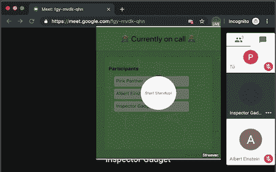
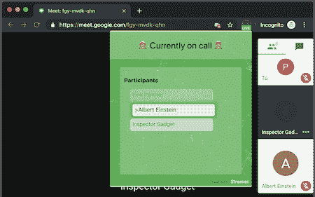

# 优化远程每日 scrum 会议

> 原文：<https://dev.to/flarra/optimizing-remote-daily-scrum-meetings-28aj>

*最初发表于 [Streaver 博客](https://www.streaver.com/blog/posts/optimizing-remote-calls.html)。*

## 为什么关心优化会议？

会议是我们工作中非常重要的一部分，因此开好会议是我们必须关心的事情。有多少次你觉得会议没有你能想到的那么有效？普通员工可能会花大约 30%的工作时间在会议上。因为很多时间都花在会议上，所以我们必须确保会议组织良好，有计划，并且对所有与会者都有益，或者至少意识到这一点。

一个组织良好的会议对一个团队的成功也有巨大的影响。一般来说，会议有助于加强人际关系，改善沟通和团队合作，提高团队士气和满意度，并提高生产力。既然我提到了这一点，你能想到任何不花时间让会议更好的理由吗？

我们在会议方面的 MVP 是`daily standup`(又名每日 scrum 会议)。对于那些不知道它到底是什么的人，我来简单解释一下。
`Daily standups`是所有团队成员每天都要开 5 到 15 分钟的会议。它应该让所有参与者都站起来，因为它有助于提醒人们保持会议简短扼要(这解释了它的名字)。动态非常简单，所有的参与者将一个接一个地与团队的其他成员分享他们的更新，直到所有人都发言。这里的奇特之处在于，每个人的更新都必须回答以下三个问题:

1.  你昨天做了什么来帮助开发团队实现冲刺目标？
2.  你今天将做什么来帮助开发团队实现 Sprint 目标？
3.  您是否看到了任何阻碍您或开发团队实现 Sprint 目标的障碍？

这基本上是你在这一点上理解我在说什么所需要的，然而，如果你想了解更多，我建议考虑一下 [Scrum 指南](https://www.scrumguides.org/docs/scrumguide/v2017/2017-Scrum-Guide-US.pdf)，在第 12 页寻找`Daily Scrum`以获得更多关于这方面的信息。

有许多因素会影响`daily standups`对整个团队的有效性和相关性。会议本身有挑战，但当会议限制在最多 15 分钟时，他们会变得更有力量。你现在可能在想的一些常见挑战可能是所有参与者的`arrival on time`、`lack of concentration`、`engagement`、`self-organization`等等...但是现在想想`remote daily standups`。在这种情况下，你还能想到其他挑战吗？

不幸的是，在日常通话中出现了许多新的危险。为什么？基本上，你有我之前分享过的所有相同类型的问题，加上其他像`internet connection`、`issues with the browser`、`lack of attention`——如果相机关闭，你永远不会注意到它、`lack of tracking`、`people always speaking at last`等。然而，并非所有这些都是不好的，事实上，你可以解决其中的许多问题，并利用远程会议。

## 我们改善会议的方法

几周前，就在 VueConfUs2019 之前——这很棒，我强烈推荐——我们发现了我们远程日常站立的一些方面，到目前为止我们可以做得更好。我们大致确定了 3 个主要领域:

*   浪费时间
*   参与者的感受
*   可追踪性

因此，在这一点上剩下的是找到一种方法来解决(至少最小化)这些问题。我们决定建立一个网络扩展，我们称之为[谁是下一个](https://github.com/streaver/whosnext)。

这个扩展非常简单，当它检测到一个新的`Google Hangouts Meet`调用开始时，一切都开始了。同一通话中的所有人都实时显示在网络扩展上，每个人都能看到*。当有人决定开始分享他们的更新时，分机会按照每个人必须说话的顺序进行排序。这个简单的动作涵盖了 3 个主要方面。*

通过给每个扬声器分配一个随机顺序:

1.  我们保证有时间问“谁想下一个去？”或者“决定谁应该是下一个人”被简化为`zero`，这样就不会浪费时间。
2.  我们消除了“总是最后一个说话的人”的感觉，或者那些总是想第一个说话的人的外向性格。我们认为每个人都应该在某个时候成为第一个，这在一起非常好。

但是扩展功能更强大。我们还决定增加这样的功能:当你结束时，自动邀请下一个参与者开始讲话。这很好，因为它允许您:

1.  记录你消耗了多少时间，并了解团队的其他成员，这和你一样重要。

**外观:**

[T6】](https://res.cloudinary.com/practicaldev/image/fetch/s--rhVAny4X--/c_limit%2Cf_auto%2Cfl_progressive%2Cq_auto%2Cw_880/https://thepracticaldev.s3.amazonaws.com/i/w6h1rv62hj6l26feq2rf.png)

我希望这篇文章能帮助你花点时间思考和分析你对远程会议和一般会议的立场。如果你觉得你可以做得更好，采取一些行动和建议改变是很好的，不管是什么。重要的是要记住，一个建议并不意味着你会将所有的会议从一天改到另一天，事实上，这是我根本不建议的事情。然而，你可以通过尝试微小的改变并评估它们的表现来循序渐进。一旦你有了一个结论，你可以决定合并它或只是放弃并尝试一个新的。

我很想听听你对如何让会议更好的想法。