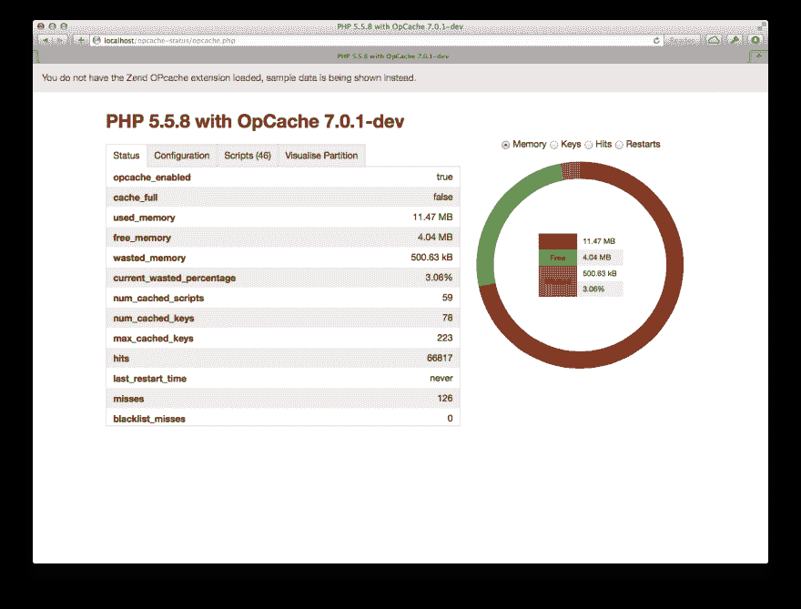

# 优化你的 PHP 应用速度

> 原文：<https://dev.to/elabftw/optimizing-your-php-app-speed-3hd4>

[](https://res.cloudinary.com/practicaldev/image/fetch/s--XDp6-aL4--/c_limit%2Cf_auto%2Cfl_progressive%2Cq_auto%2Cw_880/https://thepracticaldev.s3.amazonaws.com/i/9qah33zb05lc70d5i0b8.jpg)

这篇文章是为 PHP 开发人员准备的。我将向您展示四种轻松提高 PHP 应用程序速度的方法。我将跳过我告诉你使用 PHP 7 的部分，你现在一定知道速度的提高是惊人的…(而且 PHP 5.x 已经停产了，所以…)

TL；DR:-composer 的标志，使用 opcache，使用模板引擎缓存，使用完全限定的函数名。

## 0。使用 Composer 优化

生产和开发环境略有不同。如果我告诉您不应该在 prod 中安装开发依赖项，您应该不会感到惊讶，对吗？

```
composer install --no-dev 
```

Enter fullscreen mode Exit fullscreen mode

这是最基本的。但是你知道你可以优化自动装弹机吗？因为类一旦部署就不会改变，所以您可以向 composer 添加一个标志( **-a** )，这将提高自动加载的速度:

```
composer install --no-dev -a 
```

Enter fullscreen mode Exit fullscreen mode

好吧，但是你会问这有什么用呢？

在[帮助](https://getcomposer.org/doc/06-config.md#classmap-authoritative)中，它说:“Composer autoloader 将只从 classmap 加载类”。它还暗示了“[优化-自动加载器](https://getcomposer.org/doc/06-config.md#optimize-autoloader)”，所以你不必添加它。你可以把它看作是说“嘿，不会添加更多的类，所以你不需要扫描文件系统来寻找新的类，只需要使用自动加载器中的那些就可以了”。

## 1。使用 opcache

当一个 PHP 文件被读取时，它被转换成操作码，然后由引擎执行。因为在 prod 中你的 PHP 文件不会改变，你不想每次都把它们转换成操作码。输入 opcache。

使用 opcache 可以显著提高 PHP 应用程序的速度。确保`opcache_enable=1`在`php.ini`文件中未被注释。它将存储已执行文件的操作码。

但是不要在您的开发环境中启用它；)(除非您启用`opcache.validate_timestamps`并将`opcache.revalidate_freq`设置为 0 (thx u/iluuu))

我推荐使用 [opcache-status](https://github.com/rlerdorf/opcache-status) 工具来监控 opcache 的使用(至少在开始的时候)。

[](https://res.cloudinary.com/practicaldev/image/fetch/s--r8Qb-zYl--/c_limit%2Cf_auto%2Cfl_progressive%2Cq_auto%2Cw_880/https://thepracticaldev.s3.amazonaws.com/i/1r1yu35mlw3km3ss6f6m.png)

## 2。使用带缓存的模板引擎

像 [Twig](https://github.com/twigphp/Twig) 这样的模板引擎可以为生成的 PHP 代码创建一个缓存。这里的速度增益可以是戏剧性的。同样，您只想在 prod 中缓存模板，而不是在 dev 中。但是要确保设置了缓存。关于树枝，参见[文档](https://twig.symfony.com/doc/2.x/api.html#compilation-cache)。

## 3。限定标准函数

通常你的代码是命名空间的(对吗？).那么当你从标准 PHP 库中调用一个函数时会发生什么呢？“编译器”(操作码生成器)将查看当前的名称空间，然后向上，最终使用全局名称空间。这意味着如果您在标准函数前面添加一个“\ ”(因此有效地在全局命名空间中显式地命名它)，它将导致更少的操作码指令，这意味着更快的代码执行。认为这是那些无用的微优化之一，就像单引号和双引号的使用？你是对的，你的应用程序不会突然变得更快(只是很少)，但是如果我们可以节省 CPU 周期，为什么不这样做呢？

还要注意，我更喜欢在`use`块中添加`use function count;`(用于`count()`功能)，这比使用`\`更漂亮。

## 结论

我在这篇文章中展示的这些小东西不会让你的应用程序更快，充其量只会略微提高。您可以将它们视为“良好的实践”,因为如果可以的话，为什么不采取一些速度增益呢？但是如果您想要认真优化您的 PHP 应用程序，请获得一个分析器并优化您的 SQL 查询，因为这是导致问题的原因，而不是这种事情可能带来的几毫秒；)

就这些了，祝编码愉快！

如果你喜欢 PHP，我很乐意为 eLabFTW 项目做贡献，这是一个开源的电子实验室笔记本。=)