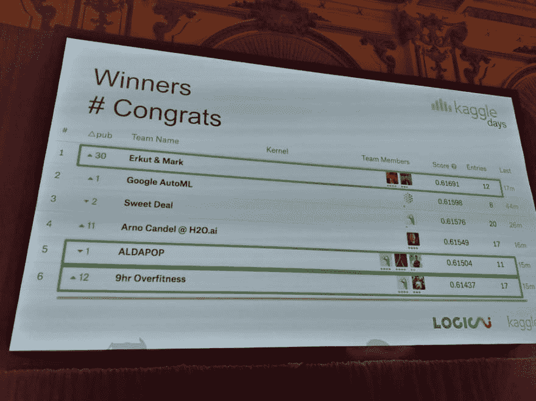

# 将机器学习(ML)模型投入生产的不同方法概述

> 原文：<https://dev.to/julienkervizic/overview-of-the-different-approaches-to-putting-machine-learning-ml-models-in-production-12ae>

将模型投入生产有不同的方法，其好处因具体的用例而异。以客户流失预测的用例为例，拥有一个静态值是有价值的，当有人呼叫客户服务时，可以很容易地查找到该静态值，但是如果对于特定事件，可以使用新获取的信息重新运行该模型，则可以获得一些额外的价值。

通常有不同的方法将模型训练和服务器应用到生产中:

*   **培训**:一次性、批量、实时/在线培训
*   **Serve** :批处理、实时(数据库触发器、发布/订阅、web 服务、inApp)每种方法都有自己的优点和需要考虑的权衡。

## 一次性训练

模型不一定需要不断的训练才能推向生产。通常，一个模型可以由数据科学家专门训练，然后推向生产，直到其性能下降到需要更新的程度。

 
*从 Jupyter 到 Prod*
数据科学家制作原型和进行机器学习往往会在他们选择的环境中操作 Jupyter 笔记本。本质上是 repl 上的一个高级 GUI，它允许您保存代码和命令输出。使用这种方法，从 Jupyter 的一些代码中推出一个特别训练的模型到产品中是非常可行的。不同类型的图书馆和其他笔记本提供商有助于进一步将数据科学家工作台和生产联系起来。

### 模型格式

Pickle 将一个 python 对象转换成一个比特流，并允许它存储到磁盘上并在以后重新加载。它为存储机器学习模型提供了一种很好的格式，前提是它们的预期应用程序也是用 python 构建的。

开放式神经网络交换格式是一种支持跨库和语言存储和移植预测模型的开放式格式。大多数深度学习库都支持它，sklearn 也有一个库扩展，可以将他们的模型转换为 ONNX 的格式。

PMML 或预测模型标记语言，是预测模型的另一种交换格式。像 ONNX 一样，sklearn 也有另一个库扩展，用于将模型转换为 PMML 格式。然而，它的缺点是只支持某些类型的预测模型。PMML 自 1997 年就已经存在，因此有大量应用程序利用这种格式。SAP 等应用程序能够利用 PMML 标准的某些版本，PEGA 等 CRM 应用程序也是如此。

POJO 和 MOJO 是 H2O.ai 的导出格式，旨在提供一个易于嵌入 java 应用的模型。然而，他们非常具体地使用 H2O 的平台。

### 训练

对于模型的一次性训练，模型可以由数据科学家训练和微调，也可以通过 AutoML 库训练。然而，有一个容易复制的设置有助于推进生产化的下一个阶段，即:批量训练。

## 批量训练

虽然在生产中实现模型并不完全必要，但是批量训练允许根据最新的训练不断刷新模型的版本。

批量培训可以从 AutoML 类型的框架中受益匪浅，AutoML 使您能够执行/自动化活动，如特征处理、特征选择、模型选择和参数优化。他们最近的表现与最勤奋的数据科学家不相上下，甚至超过了他们。
 
使用它们可以进行比他们上升之前通常所做的更全面的模型训练:简单地重新训练模型权重。

存在不同的技术来支持这种连续的批量培训，例如，这些技术可以通过混合气流来管理不同的工作流和 AutoML 库，如 tpot，不同的云提供商提供他们的 AutoML 解决方案，这些解决方案可以放在数据工作流中。例如，Azure 将机器学习预测和模型训练与他们的数据工厂产品集成在一起。

## 实时训练

使用“在线机器学习”模型可以进行实时训练，支持这种训练方法的算法包括 K 均值(通过小批量)、线性和逻辑回归(通过随机梯度下降)以及朴素贝叶斯分类器。

Spark 有 StreamingLinearAlgorithm/StreamingLinearRegressionWithSGD 来执行这些操作，sklearn 有 SGDRegressor 和 SGDClassifier 可以进行增量训练。在 sklearn 中，增量训练是通过 partial_fit 方法完成的，如下所示: