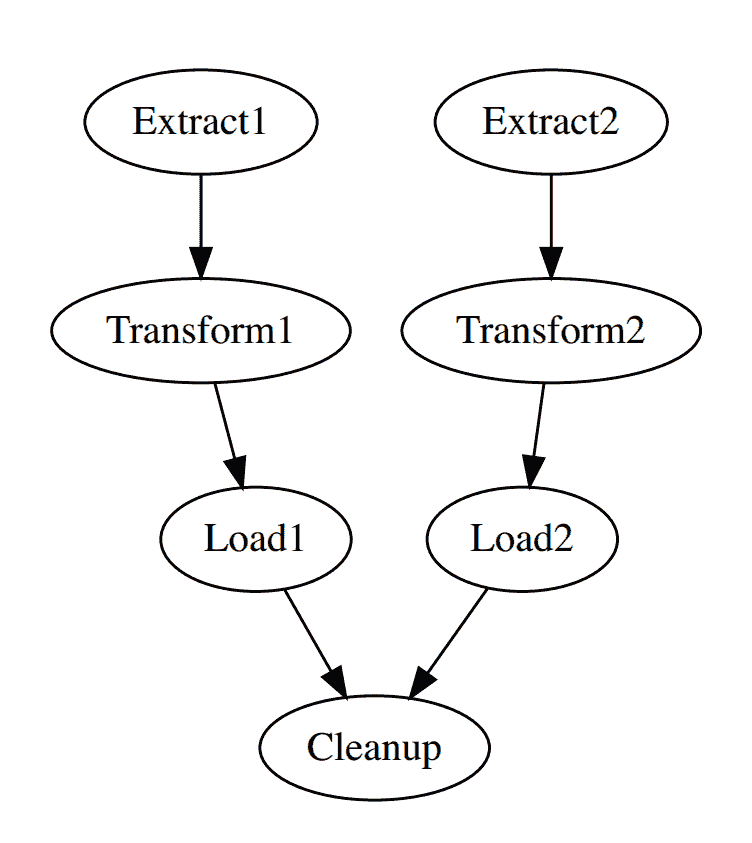

# 用 Jongleur gem 并行化 ETL 工作流

> 原文：<https://dev.to/redfred7/parallelising-etl-workflows-with-the-jongleur-gem--4cnp>

## 我们的任务

我们公司刚刚进行了一场大规模的招聘，刚刚雇佣了 10 万名新员工。人力资源部给我们发来了一份包含员工详细信息的电子表格，要求我们将它们保存在公司员工数据库中。查看数据后，我们注意到在将详细信息插入数据库之前需要采取一些措施，我们提出了以下算法:

*   从电子表格中读取数据
*   将雇员的全名分为名和姓字段
*   给每个员工分配一个唯一的公司编号
*   只要雇员的名和姓少于 255 个字符，就将雇员插入数据库

## 单进程 ETL 管道

然后我们继续编写一个粗糙但有效的 ETL 管道

```
require 'csv'
require 'pg'
require 'ostruct'
require 'securerandom'

@users = []
@conn = PG.connect( dbname: 'testdb' )
DATA_FILE = "data/users.csv"

def extract(data_file)
  CSV.foreach(data_file) do |row|
    user = OpenStruct.new
    user.name = row[0]
    user.email = row[1]
    @users << user
  end
end

def transform
  @users.map! do |usr|
    usr.first_name = usr.name.split[0]
    usr.last_name = usr.name.split[1]
    usr.staff_no = SecureRandom.uuid
    usr
  end
end

def load(usr)
  if( usr.first_name.length < 255 &&  usr.last_name.length < 255)
    @conn.exec_params(
      "INSERT INTO STAFF (FIRST_NAME, LAST_NAME, EMAIL, STAFF_NO) VALUES ($1, $2, $3, $4)",
      [usr.first_name, usr.last_name, usr.email, usr.staff_no]
    )
  else puts "Validation failed for #{usr.first_name}  #{usr.last_name}"
  end
end

extract(DATA_FILE)
transform
@users.each {|usr| load(usr)} 
```

Enter fullscreen mode Exit fullscreen mode

我们的`extract`方法从文件中读取数据，并将其存储在内存中。然后，`transform`方法将全名字段分为名和姓，并为雇员分配一个 UUID。最后，在将数据插入 Staff 表之前，我们的`load`方法确保姓名字段不超过预期长度。

我们测试了我们的脚本，它运行良好，但是所有这些数据处理需要很长时间，我们是完美主义者，希望它能更快。

## 对速度的需要

进入 [Jongleur](https://gitlab.com/RedFred7/Jongleur) 这是一个 Ruby gem，它允许我们创建任务，这些任务作为独立的操作系统进程执行，并且可以以一定的优先级运行。

我们将使用 Jongleur 将我们的 ETL 管道分成两个独立的并行管道，每个管道处理一半的输入数据。我们希望我们的任务图看起来像这样:

[](https://res.cloudinary.com/practicaldev/image/fetch/s--PFeFHacj--/c_limit%2Cf_auto%2Cfl_progressive%2Cq_auto%2Cw_880/https://filedn.com/lBg7bSLnQRakb21qRGSa3pS/jongleur_etl.png)

每个提取、转换和加载任务将完全按照我们在上面的初始算法中描述的那样进行，但是只有一半的电子表格记录。清理任务将在最后开始，在我们的管道运行后清除任何不适当的残留物。

用 Jongleur 表示上面的图是一件简单的事情，创建一个 Ruby Hash:

```
etl_graph = {
  Extract1: [:Transform1],
  Transform1: [:Load1],
  Extract2: [:Transform2],
  Transform2: [:Load2],
  Load1: [:Cleanup],
  Load2: [:Cleanup]
} 
```

Enter fullscreen mode Exit fullscreen mode

然后我们可以告诉 Jongleur 使用我们的任务图

```
Jongleur::API.add_task_graph etl_graph 
```

Enter fullscreen mode Exit fullscreen mode

## 设计注意事项

在创建并行任务之前，我们需要考虑的一件事是如何在作为独立进程运行的任务之间共享数据。共享内存是可以使用的，但是也有一些陷阱，这就是为什么我们将使用美妙的内存数据存储，即 T2 Redis T3。Redis(大部分)是单线程的，这意味着并发请求被顺序且安全地执行(并且非常快)。此外，我们将利用 Jongleur 的一个重要特性，即每个任务都可以访问其前任的进程 id(PID)。这意味着我们可以使用任务的 pid 作为其数据的键。因此，我们的 Extract1 任务可以用自己的 pid 将数据保存到 Redis，当 Transform1 任务启动时，它将确切地知道哪个数据是由它的前身 Extract1 创建的！

## 常见属性

每个 Jongleur 任务类必须从基类`Jongleur::WorkerTask`继承。这意味着我们可以使用这个类来定义我们希望从任何和所有 WorkerTask 实例中访问的数据。在我们的例子中，我们希望任何提取、转换和清理任务都能够访问我们的 Redis 数据存储。为此，我们简单地将 Redis 连接定义为`Jongleur::WorkerTask`层次结构中的一个类变量:

```
class Jongleur::WorkerTask
  @@redis = Redis.new(host: "localhost", port: 6379, db: 15)
end 
```

Enter fullscreen mode Exit fullscreen mode

## 提取

我们的 Extract1 和 Extract2 任务都需要一些共同的功能，即从 csv 文件中解析记录，并将它们保存到 Redis:

```
class Extract < Jongleur::WorkerTask

  DATA_FILE = "data/users.csv"

  def process_row(row, rowno)
    user = {}
    user[:num] = rowno
    user[:name] = row[0]
    user[:email] = row[1]
    user

    @@redis.hset(Process.pid.to_s, "user:#{rowno}", user.to_json)
  end
end 
```

Enter fullscreen mode Exit fullscreen mode

现在，从 csv 文件读取输入数据时，Extract1 和 Extract2 之间唯一的差异出现了。Extract1 将只读取和存储前 50，000 条记录，而 Extract2 将读取和存储剩余的 50，000 条记录。

```
class Extract1 < Extract
  def execute
    CSV.foreach(DATA_FILE).with_index(1) do |row, rowno|
      break if rowno >= 50000
      process_row(row, rowno)
    end
  end
end

class Extract2 < Extract
  def execute
    CSV.foreach(DATA_FILE).with_index(1) do |row, rowno|
      next if rowno < 50000
      process_row(row, rowno)
    end
  end
end 
```

Enter fullscreen mode Exit fullscreen mode

## 转换

每个转换任务都需要使用它的提取前置任务的 pid，以便加载它需要转换的提取记录。然后，它将继续拆分每个记录的名称，为其分配一个 UUID，并将其保存回 Redis:

```
class Transform < Jongleur::WorkerTask
  @desc = 'Transforming'
  def execute
    loader_id = Jongleur::Implementation.get_process_id(predecessors.first)
    users = @@redis.hgetall(loader_id)
    users.keys.each do |usr_key|
      transformed_user = {}
      data = JSON.parse users[usr_key]
      transformed_user[:first_name] = data['name'].split[0]
      transformed_user[:last_name] = data['name'].split[1]
      transformed_user[:staff_no] = SecureRandom.uuid
      transformed_user[:num] = data['num']
      transformed_user[:email] = data['email']
      @@redis.hset(Process.pid.to_s, "user:#{data['num']}", transformed_user.to_json)
    end
  end
end

class Transform1 < Transform; end
class Transform2 < Transform; end 
```

Enter fullscreen mode Exit fullscreen mode

## 装载

Load1 和 Load2 将获取各自的前置转换任务存储的记录，验证姓名长度，并将记录插入人力资源 Postgres 数据库的 Staff 表中:

```
class Load < Jongleur::WorkerTask
  @desc = 'Loading'

  def execute
    loader_id = Jongleur::Implementation.get_process_id(predecessors.first)
    users = @@redis.hgetall(loader_id)
    conn = PG.connect( dbname: 'testdb' )
    users.keys.each do |usr_key|
      data = JSON.parse users[usr_key]
      if( data['first_name'].length < 255 &&  data['last_name'].length < 255 )
        conn.exec_params(
          "INSERT INTO STAFF (FIRST_NAME, LAST_NAME, EMAIL, STAFF_NO) VALUES ($1, $2, $3, $4)",
          [ data['first_name'], data['last_name'], data['email'], data['staff_no'] ]
        )
      else puts "Validation failed for #{usr.first_name}  #{usr.last_name}"
      end
    end

  end
end

class Load1 < Load; end
class Load2 < Load; end 
```

Enter fullscreen mode Exit fullscreen mode

## 清理

我们的清理任务所要做的就是清除之前运行的任务
创建的 Redis 数据

```
class Cleanup < Jongleur::WorkerTask
  def execute
    @@redis.flushdb
    puts "...Cleanup"
  end
end 
```

Enter fullscreen mode Exit fullscreen mode

## 运行我们的管道

我们现在有

1.  定义了我们的任务图，并用它配置了 Jongleur
2.  为我们的任务图中的每个任务实现了一个`#execute`方法

我们现在准备调用 Jongleur 并运行我们的并行管道:

```
API.run do |on|
  on.completed do |task_matrix|
    puts "Jongleur run is complete \n"
    puts task_matrix
    puts "oh-oh" if API.failed_tasks(task_matrix).length > 0
  end
end 
```

Enter fullscreen mode Exit fullscreen mode

输出为:

```
Starting workflow...
starting task Extract1
starting task Extract2
finished task: Extract1, process: 22722, exit_status: 0, success: true starting task Transform1
finished task: Extract2, process: 22723, exit_status: 0, success: true starting task Transform2
finished task: Transform1, process: 22726, exit_status: 0, success: true starting task Load1
finished task: Transform2, process: 22727, exit_status: 0, success: true starting task Load2
finished task: Load1, process: 22729, exit_status: 0, success: true finished task: Load2, process: 22732, exit_status: 0, success: true starting task Cleanup
...Cleanup
finished task: Cleanup, process: 22745, exit_status: 0, success: true Workflow finished
Jongleur run is complete
#<struct Jongleur::Task name=:Extract1, pid=22722, running=false, exit_status=0, finish_time=1546800512.6342049, success_status=true>
#<struct Jongleur::Task name=:Transform1, pid=22726, running=false, exit_status=0, finish_time=1546800518.355283, success_status=true>
#<struct Jongleur::Task name=:Extract2, pid=22723, running=false, exit_status=0, finish_time=1546800512.967079, success_status=true>
#<struct Jongleur::Task name=:Transform2, pid=22727, running=false, exit_status=0, finish_time=1546800519.273847, success_status=true>
#<struct Jongleur::Task name=:Load1, pid=22729, running=false, exit_status=0, finish_time=1546800533.147315, success_status=true>
#<struct Jongleur::Task name=:Load2, pid=22732, running=false, exit_status=0, finish_time=1546800534.1630201, success_status=true>
#<struct Jongleur::Task name=:Cleanup, pid=22745, running=false, exit_status=0, finish_time=1546800534.899818, success_status=true> 
```

Enter fullscreen mode Exit fullscreen mode

Jongleur 向我们详细介绍了每个任务的细节和成功状态。请注意，两个初始任务(Extract1，Extract2)是如何同时开始的，并且每个新任务都是在其任务图上的前置任务完成后才开始的。如果一个任务失败了，不管是什么原因，Jongleur 不会执行它的依赖任务，但是它会继续运行它能运行的任何其他任务。所有任务的状态在由`completed`回调产生的任务矩阵结构中仍然可见。

## 表现

在本文开头运行简单的单进程 ETL 管道产生了以下时间:

`9.55s user 1.40s system 32% cpu 33.494 total`

运行并行琼格勒管道生产:

`19.99s user 5.23s system 89% cpu 27.210 total`

Jongleur 增加了用户时间(我猜是由于使用 Redis ),内核时间也增加了，显然是由于分叉和管理许多进程，但总时间大约是。使用具有两条管道的 Jongleur，速度提高 18%。还要考虑到，在这个例子中，我们只使用了两条平行线，也就是说，我们将数据负载分成两部分。将它分成 4、8 甚至 16 条并行线(取决于我们的 CPU 内核)并因此获得巨大的性能增益是一件简单的事情，使用这里演示的相同逻辑和原理并简单地添加更多任务。

## 琼勒的优点

1.  性能，通过并行化。
2.  隐式优先处理。只有当任务的前置任务成功完成后，Jongleur 才会开始运行该任务。如果任务失败，其相关任务将不会运行。
3.  代码模块化。如果一个任务失败了，不管是什么原因，它都会被 Jongleur 标记为失败，并且它的相关任务不会运行。然而，这不会阻止任何其他任务的运行，这意味着部分失败并不一定意味着完全失败，在这种情况下这是可取的。

## 完整代码

本演示包括的数据文件是[免费提供的](https://gitlab.com/RedFred7/jongleur_etl)

## 未来

请随意为 Jongleur 提出改进和新特性的建议，或者与我讨论如何在您自己的用例中进行尝试:)

*最初发布于[http://bootstrap . me . uk](http://bootstrap.me.uk)T3】*