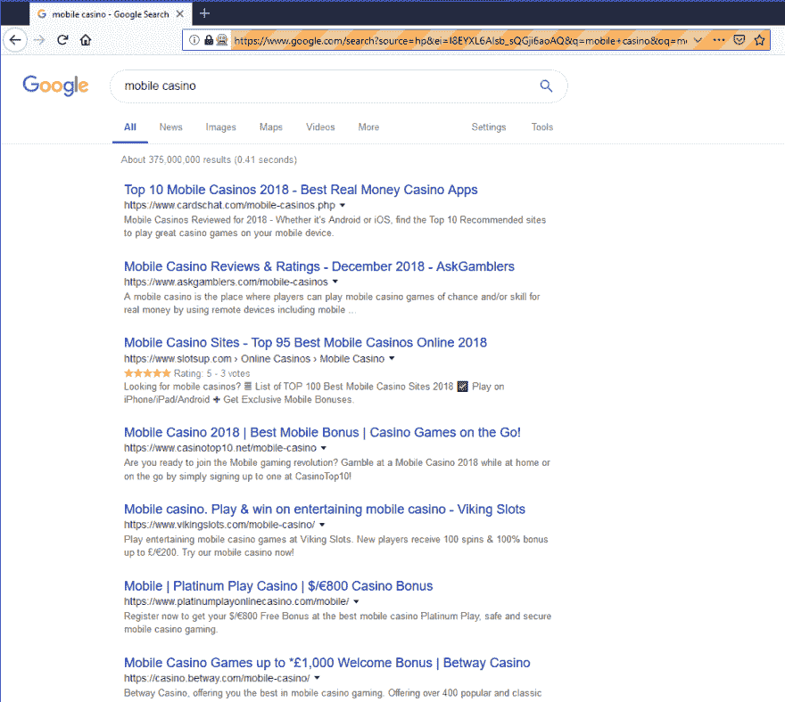
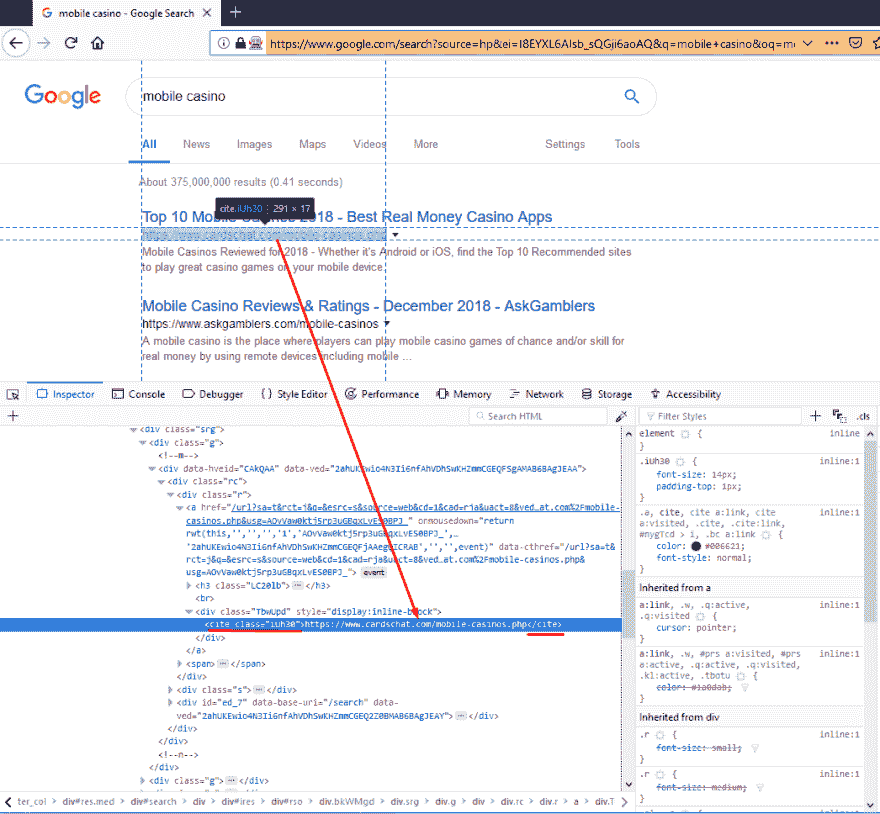
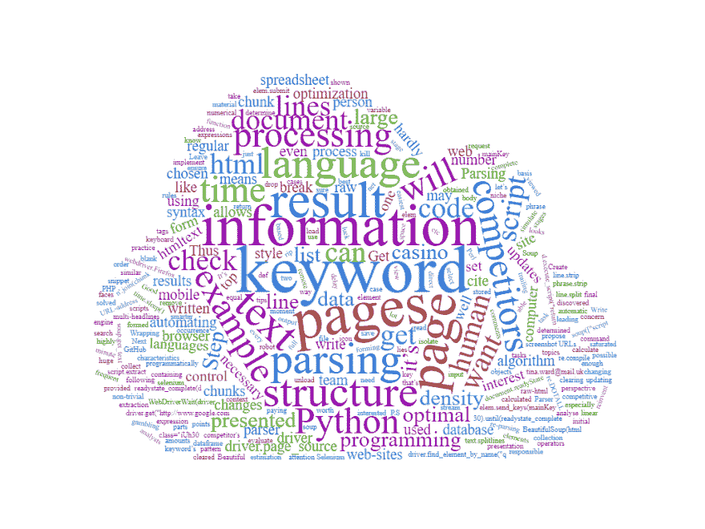

# 赌博中的解析:如何在 15 分钟内写出你的解析器？

> 原文：<https://dev.to/tinaward/parse-in-gambling-how-to-write-your-parser-in-15-minutes-4jlo>

## 第一步——解析:什么？为什么？怎么会？

一般来说，解析是单词序列与语言规则的线性比较。“语言”的概念在这里是在最广泛的背景下考虑的——它可能是人类的语言(例如，英语、德语、日语等。)用于人与人之间的交流。它也可以是一种形式化语言，特别是任何编程语言。网站解析——是对互联网页面上发布的信息进行连续的语法分析。网页上的信息是一个层次化的数据集，使用人类和计算机编程语言来构建。创建一个网站，开发者不可避免地面临确定最佳页面结构的任务。但是在哪里举一个最优页面的例子呢？不要在自动化优化过程的初始阶段重新发明轮子！仅仅分析你的直接竞争对手就足够了，尤其是在像博彩业这样一个饱和且竞争激烈的领域。存在大量的这种数据，因此对于它的提取应该解决许多非平凡的任务，例如:

*   搜索引擎结果的集合；
*   网上提供的大量信息，对于一个人或甚至一组分析人员来说，处理这些信息几乎是不可能的；
*   一个人或者甚至一个协调良好的操作团队都不能提供频繁的更新——维护大量动态变化的信息流，因为有时信息每分钟都在变化，手动更新几乎是不可取的；因此，自动化这一过程可以让您节省时间来监控变化，例如在赌场促销和自动更新您的网站。与人类相比，计算机解析程序可以:
*   快速绕过成千上万的网页；
*   几乎将技术信息从“人”中分离出来；
*   明白无误地选择正确的，丢弃多余的；
*   有效地将最终数据打包成所需的形式。

在大多数情况下，受到额外处理的数据库或电子表格是解析的结果。目前，解析器是用大规模编程语言编写的，如 [Python](https://www.python.org) 、 [R](https://cran.r-project.org) 、C ++、Delphi、Perl、Ruby、PHP。但是我当然选择 Python 作为语法简单的最通用的语言。同时，Python 的独特性在于它的语法。它允许大量程序员阅读别人用 Python 写的代码，没有任何麻烦。

## 步骤 1 P.S. -改进方法

如果你想在未来改进你的脚本或者编写一个更智能的解析器，那么你可能会在这里找到一些有用的提示:[https://www.seleniumhq.org/download/](https://www.seleniumhq.org/download/)，和【https://www.crummy.com/software/BeautifulSoup/bs4/doc/】T2。
结果(无论是数据库还是电子表格)肯定需要进一步处理。然而，对收集到的信息的后续操作并不涉及解析的主题。

## 第二步-软件实现

首先我们来讨论一下算法。我们想得到什么？我们希望获得相对于关键字的最佳文档结构。因此，最成功的结构很可能是由那些位于所选关键字顶部的人呈现的。
因此，即将到来的工作的算法可以分为几个部分:
1)选择一个页面的例子来检查结构:【https://casino-now.co.uk/mobile-casino/】
2)识别一个关键字:**移动赌场**
3)获得一个最优化的竞争对手列表
4)获得他们的页面结构并检查该关键字的优化参数

为了确保请求处理的正确性，我们必须以编程方式设置一个等于页面加载时间的时间延迟。职能机构将是:

`// hidden setup JavaScript code goes in this preamble area const hiddenVar = 42` `def readystate_complete(d): return d.execute_script("return document.readyState") == "complete"`

然后，需要确定我们想要查看输出的关键字，并实现 Selenium 驱动程序来模拟键盘输入:

`// hidden setup JavaScript code goes in this preamble area const hiddenVar = 42` `mainKey = "mobile casino" driver = webdriver.Firefox() driver.get("http://www.google.com") elem = driver.find_element_by_name("q") elem.send_keys(mainKey) elem.submit() WebDriverWait(driver, 30).until(readystate_complete) time.sleep(1) htmltext = driver.page_source`
As the result, the source code of the page shown below will be stored in ‘htmltext’ variable:

It is worth paying attention that the robot icon presented on the screenshot means that at the moment the browser is under remote control, in our case - by Python.

After the raw html text is obtained, it's time to unload the pages for parsing. The easiest way is when you check the code for the element you are interested in, and then use regular expressions to isolate the information you need, forming a list of objects. For example, to collect the URLs of competitors:

Then let’s check the occurrence of the pattern of interest:

And write out regular expression that looks like:`// hidden setup JavaScript code goes in this preamble area const hiddenVar = 42` `pages = re.compile('(.*?)' , re.DOTALL | re.IGNORECASE).findall(str(htmltext))`
As the result, we get a list of top 10 competitors’ pages for the keyword of interest.
Next stage is re-parsing, similar to the above but for each URL-address of the chosen keyword. The results are formed in the dataframe, the full presentation can be viewed at GitHub: [https://github.com/TinaWard/FirstStepForParsing/](https://github.com/TinaWard/FirstStepForParsing/).
The following is only a snippet of code that’s responsible for clearing your raw html document from tags and scripts. From this perspective, the result of this command will be the cleared text of the site, which will be used to calculate the keyword’s density.
`// hidden setup JavaScript code goes in this preamble area const hiddenVar = 42` `html = driver.page_source soup = BeautifulSoup(html) "kill all script and style elements" for script in soup(["script", "style"]): "rip it out" script.extract() "get text" text = soup.get_text() "break into lines and remove leading and trailing space on each" lines = (line.strip() for line in text.splitlines()) "break multi-headlines into a line each" chunks = (phrase.strip() for line in lines for phrase in line.split(" ")) "drop blank lines" text = '\n'.join(chunk for chunk in chunks if chunk)`
The text document will be the result of the parsing script on the basis of which the necessary numerical characteristics are determined to evaluate competitors - for example, keyword density estimation.
The result is presented in the form of a file containing the competitor's page address, html page as well as the document structure and the calculated keyword density:

## 包装完毕

因此，这份材料发现了解析的两个关键点——使用 selenium 的自动浏览器控制和借助 Beautiful Soup 的 raw-html 页面处理。根据最佳实践创建您的网站！祝你好运！
留下评论，提出你想了解更多的话题: [tina.ward@mail.uk](mailto:tina.ward@mail.uk)
文章的 Wordcloud。玩得开心！
[T8】](https://res.cloudinary.com/practicaldev/image/fetch/s--pSOkA4ol--/c_limit%2Cf_auto%2Cfl_progressive%2Cq_auto%2Cw_880/https://thepracticaldev.s3.amazonaws.com/i/zf7anipg6f9vpxj6rnf8.png)