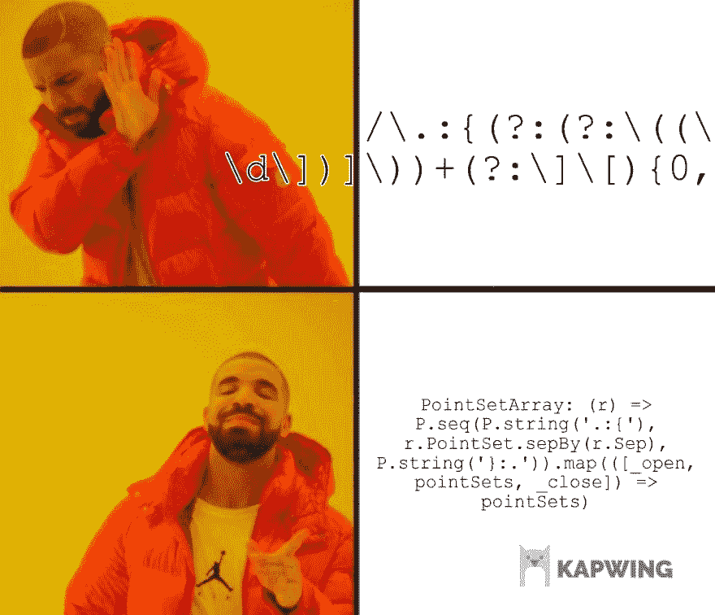

# 解析器组合子很容易

> 原文：<https://dev.to/deciduously/parser-combinators-are-easy-4bjm>

假设我们收到了一些全新的积分。然而，这位点穴大师今天迸发出“创造力”，设计了一个疯狂的传输字符串:

```
const input = '.:{([2 3]][[6 2]][[1 2])][([1 4]][[2 1])][([6 9])}:.' 
```

Enter fullscreen mode Exit fullscreen mode

这显然是疯狂的，你不应该忍受它。可悲的是，她是你在不同大小的集合中唯一的连接点，尽管这些点本身看起来还不错，所以你必须卷起袖子把它们拿出来。

我不知道你，但是我(直到现在！)总是叹口气，在这一点上使用正则表达式，或者开始摆弄字符串操作。会很难看，但会有用的。您可以使用捕获组提取每个列表，然后在捕获中使用另一个正则表达式，或者使用字符串拆分和迭代器来获得您需要的内容。这可能没什么意思，而且最后一眼看去完全难以辨认(除非 regex 真的是你的东西)。

但是等等！还有一个办法！而且比听起来还要简单！
[](https://res.cloudinary.com/practicaldev/image/fetch/s--WGw9prnb--/c_limit%2Cf_auto%2Cfl_progressive%2Cq_auto%2Cw_880/https://i.imgur.com/PiOsDjV.jpg) 
(这是我有史以来第一个迷因！)

看着这个字符串，我们马上就能看出它是什么——一系列的点。棘手的部分是告诉计算机你的意思。有了解析器组合子，我们可以！解析器组合器库允许你定义小的解析器，你可以组合这些解析器来解析任何东西，从这样的字符串到编程语言。解析器组合子最初可能看起来很复杂，因为像`monadic LL(infinity)`这样的短语和某些语言中看起来复杂的语法，但是它实际上非常简单，使用起来非常有趣。如果你让你的零件尽可能小，每个小零件都是可重复使用的。这样，我们就可以用对我们有意义的单位来告诉 JavaScript(或者其他什么东西)我们需要什么。

我用 [Parsimmon](https://github.com/jneen/parsimmon) 库来说明，但是还有许多其他的 JS 库，许多其他语言也有这样的库。

使用 Parsimmon，我们创建了一种包含小型解析器的“语言”，这些解析器由越来越小的解析器组成。这里有一个非常基本的例子:

```
// index.js
const P = require('Parsimmon')

const CrazyPointParser = P.createLanguage({
    Num: () => P.regexp(/[0-9]+/).map(Number)
}) 
```

Enter fullscreen mode Exit fullscreen mode

当我们第一次看到这个字符串时，我们立即理解它最终是一个由*个数字*组成的列表。这是非常基本的单元，我们用`regexp`组合符获取它来匹配指定范围内的一个或多个字符。这是上面提到的小得多的正则表达式——一目了然。每个解析器根据我们想要的数据表示方式完成`map`——在本例中，我们希望这个字符串是一个 JavaScript `Number`。

该代码可通过以下方式进行验证:

```
let a = '23'

try {
    console.log(CrazyPointParser.Num.tryParse(a))
} catch (err) {
    console.log('Oops! ' + err)
} 
```

Enter fullscreen mode Exit fullscreen mode

运行`node index.js`应该输出`23`——而不是`'23'`。我们已经解析了一个数字！现在我们可以在更大的解析器中使用这个解析器。接下来要看的自然单位是点——`[8 76]`。由空格分隔的两个数字。

```
const CrazyPointParser = P.createLanguage({
    Num: () => P.regexp(/[0-9]+/).map(Number),
    Point: (r) => P.seq(P.string('['), r.Num, P.string('  '), r.Num, P.string(']')).map(([_open, x, _space, y, _close]) => [x, y])
}) 
```

Enter fullscreen mode Exit fullscreen mode

`P.seq()`组合子用于将组合子链接在一个序列中进行匹配。这一次，我们作为参数传递的`r`是`rules`的缩写，允许我们引用用这种语言定义的其他组合子。然后，我们只需使用`P.string()`组合子来精确匹配分隔符，并使用我们的`r.Num`组合子来处理数字本身的识别和转换。然后在地图上，我们被传递了一个匹配的每个部分的数组。我们忽略括号和由`P.string()`组合子返回的空格，只返回我们的`Num`组合子为我们处理的值。将测试代码片段更改为:

```
let b = '[78 3]'
try {
    console.log(CrazyPointParser.Point.tryParse(b))
} catch (err) {
    console.log('Oops! ' + err)
} 
```

Enter fullscreen mode Exit fullscreen mode

执行这个命令将会返回`[ 78, 3 ]`。现在，这些点被进一步分组为不同大小的集合，并(莫名其妙地)被字符串`']['`分隔开。我们可以为这个分隔符创建一个迷你解析器，然后利用`sepBy()`组合子来处理这些集合:

```
const CrazyPointParser = P.createLanguage({
    // ...
    Sep: () => P.string(']['),
    PointSet: (r) => P.seq(P.string('('), r.Point.sepBy(r.Sep), P.string(')')).map(([_open, points, _close]) => points)
}) 
```

Enter fullscreen mode Exit fullscreen mode

我们不需要在我们的`Sep`解析器中包含`map`部分——我们只是想按原样返回匹配(稍后会丢弃它)。在我们的`PointSet`解析器中，`r.Point.seqBy(r.Sep)`将返回零个或多个由我们作为数组提供的分隔符分隔的`Point`，去掉分隔符本身。试试看:

```
 let c = '([2 3]][[6 2]][[1 2])'

try {
    console.log(CrazyPointParser.PointSet.tryParse(c))
} catch (err) {
    console.log('Oops! ' + err)
} 
```

Enter fullscreen mode Exit fullscreen mode

这将输出`[ [ 2, 3 ], [ 6, 2 ], [ 1, 2 ] ]`。我们快到了！完整的字符串只是一串`PointSet`，由同一分隔符分隔，两端各有一些褶边帽:

```
const CrazyPointParser = P.createLanguage({
    // ...
    PointSetArray: (r) => P.seq(P.string('.:{'), r.PointSet.sepBy(r.Sep), P.string('}:.')).map(([_open, pointSets, _close]) => pointSets)
}) 
```

Enter fullscreen mode Exit fullscreen mode

就是这样！我们的解析器现在可以成功地解析输入字符串，只需要几行代码。以下是完整的片段:

```
const P = require('Parsimmon')

const input = '.:{([2 3]][[6 2]][[1 2])][([1 4]][[2 1])][([6 9])}:.'

const CrazyPointParser = P.createLanguage({
    Num: () => P.regexp(/[0-9]+/).map(Number),
    Sep: () => P.string(']['),
    Point: (r) => P.seq(P.string('['), r.Num, P.string('  '), r.Num, P.string(']')).map(([_open, x, _space, y, _close]) => [x, y]),
    PointSet: (r) => P.seq(P.string('('), r.Point.sepBy(r.Sep), P.string(')')).map(([_open, points, _close]) => points),
    PointSetArray: (r) => P.seq(P.string('.:{'), r.PointSet.sepBy(r.Sep), P.string('}:.')).map(([_open, pointSets, _close]) => pointSets)
})

try {
    console.log(CrazyPointParser.PointSetArray.tryParse(input))
} catch (err) {
    console.log('Oops! ' + err)
} 
```

Enter fullscreen mode Exit fullscreen mode

输出:

```
$ node index.js
[ [ [ 2, 3 ], [ 6, 2 ], [ 1, 2 ] ],
  [ [ 1, 4 ], [ 2, 1 ] ],
  [ [ 6, 9 ] ] ] 
```

Enter fullscreen mode Exit fullscreen mode

我们甚至可以想象一下——只要把我们的`Point`组合子替换成:

```
 Point: (r) => P.seq(P.string('['), r.Num, P.string('  '), r.Num, P.string(']')).map(([_open, x, _space, y, _close]) => {
        return {
            x: x,
            y: y,
        };
    }), 
```

Enter fullscreen mode Exit fullscreen mode

现在我们得到:

```
$ node index.js
[ [ { x: 2, y: 3 }, { x: 6, y: 2 }, { x: 1, y: 2 } ],
  [ { x: 1, y: 4 }, { x: 2, y: 1 } ],
  [ { x: 6, y: 9 } ] ] 
```

Enter fullscreen mode Exit fullscreen mode

这个解析器很容易被发现，或者完全替换掉组件——每个部分都独立于其他部分工作。

许多语言中都有解析器组合子的库——这里有一个例子，假设我们已经定义了`sep()`和`point()`解析器:
,那么在 Rust 中使用 [`combine`](https://github.com/Marwes/combine) 会是什么样子

```
fn point_set<I>() -> impl Parser<Input = I, Output = Vec<Point>>
where
    I: Stream<Item = char>,
    I::Error: ParseError<I::Item, I::Range, I::Position>,
{
    (char('('), sep_by(point(), sep()), char(')')).map(|(_, points, _)| points)
} 
```

Enter fullscreen mode Exit fullscreen mode

抛开语法不谈，这是一回事——组合任意数量的任意小的解析器来解析您喜欢的任何格式。对于 Rust，还有 [`nom`](https://github.com/Geal/nom) ，它利用宏而不是特征，但最终都是一样的好东西。

有喜欢的解析器组合子库吗？让我知道这件事！