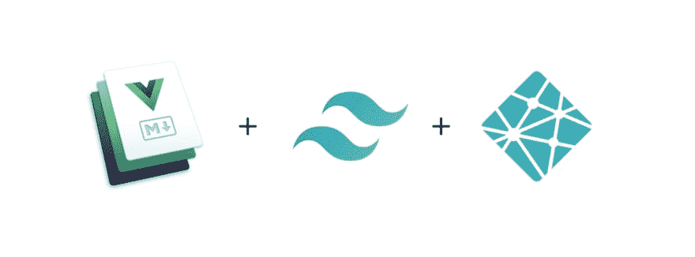
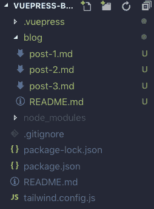
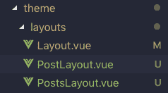
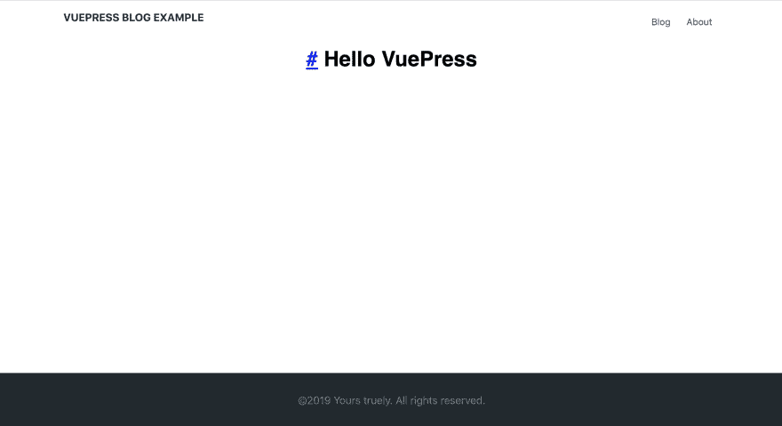
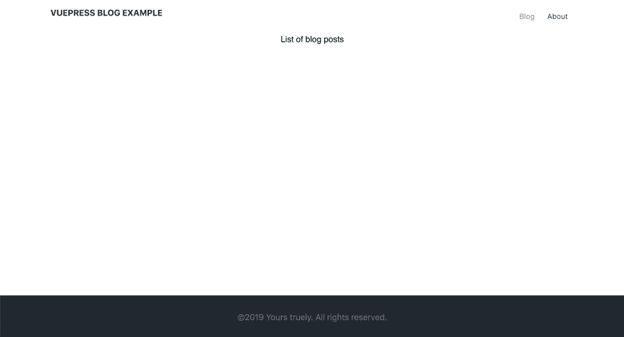
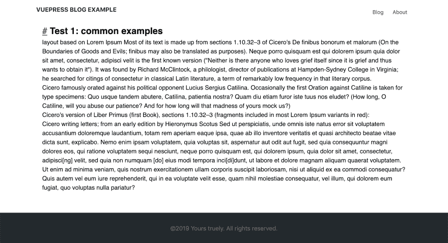
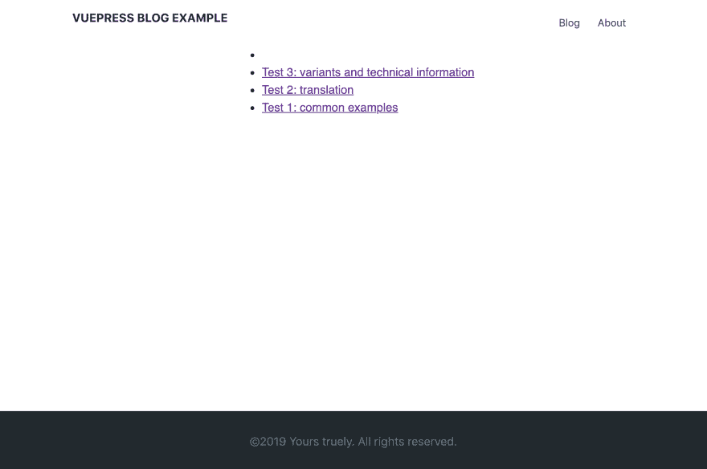
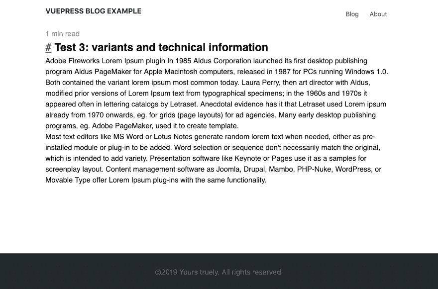

# [第 2 部分]编写并应用自定义 Vuepress 主题

> 原文：<https://dev.to/hyper_yolo/part-2-write-and-apply-a-custom-vuepress-theme-4n3a>

[](https://res.cloudinary.com/practicaldev/image/fetch/s--vhcj941o--/c_limit%2Cf_auto%2Cfl_progressive%2Cq_auto%2Cw_880/https://thepracticaldev.s3.amazonaws.com/i/d63hpoll0toxrq5kqfke.png)

在这一部分，我们将使用 vue.js 为你的主题编写一些组件。

## 0。设置一些虚拟博客帖子

让我们先添加几个示例降价文件。我做了一些给你[下载](https://www.dropbox.com/s/e17miagemc43c2d/blog.zip?dl=0)。解压后将**博客**文件夹放在根目录下。就像你在上一篇文章中创建的 **README.md** 一样，Vuepress 将使用 **README.md** 作为你的 **blog** 文件夹的默认 index.html。我们将使用它来显示博客文章的列表。

[](https://res.cloudinary.com/practicaldev/image/fetch/s--a7sRSkF9--/c_limit%2Cf_auto%2Cfl_progressive%2Cq_auto%2Cw_880/https://thepracticaldev.s3.amazonaws.com/i/crj82i27e4khjxqe9pqy.png)

## 1。创建主题的布局

我们将要创建的主题中有 3 种布局:

*   页面(如主页)
*   文章列表(如博客索引页)
*   帖子详细信息(例如博客帖子)

如果你以前使用过 wordpress/jekyll，你可能熟悉 page v.s post 的概念。一个**页面**是一个没有发布日期的静态页面，它通常像主页一样包含永恒的内容；而**的帖子**则是一篇及时的博文。

在 **layouts** 文件夹中，除了我们在上一篇文章中创建的 **Layout.vue** 之外，再创建 2 个文件: **PostsLayout.vue** ， **PostLayout.vue** 。

[](https://res.cloudinary.com/practicaldev/image/fetch/s--yfh1hBAw--/c_limit%2Cf_auto%2Cfl_progressive%2Cq_auto%2Cw_880/https://thepracticaldev.s3.amazonaws.com/i/8jj85ru14bm68k06wc56.png)

现在让我们给他们每个人一些最低限度的模板。将此添加到**postslayout . vue**T2】

```
<template>
  <div>
    <h1>list of posts</h1>
    <Content/>
  </div>
</template> 
```

Enter fullscreen mode Exit fullscreen mode

并将类似的东西添加到 **PostLayout.vue**

```
<template>
  <div>
    <h1>post detail</h1>
    <Content/>
  </div>
</template> 
```

Enter fullscreen mode Exit fullscreen mode

`<Content />`是一个 Vuepress 组件，它从您的 markdown 文件中加载无槽内容。任何没有被包在中间的东西都会被加载。

如果你不知道，重要的是要知道你只能有一个孩子在`<template>`下，Vue.js 才能正常工作。如果你直接有多个孩子`<template>`，你会得到一个类似**的错误编译模板....组件模板应该只包含一个根元素。**

另外，请注意，在**/博客**中的每个降价文件中，我已经在`frontmatter`中指明了要使用哪些布局

```
--------
layout: PostLayout
-------- 
```

Enter fullscreen mode Exit fullscreen mode

现在，如果你进入[http://localhost:8080/blog/post-1 . html](http://localhost:8080/blog/post-1.html)，你应该会看到如下页面...这意味着您已经将每个布局正确地绑定到帖子上了！耶！
T3T5】

## 2。创建共享组件

现在我们准备添加共享组件，如全局导航和页脚。在**主题**文件夹中，创建一个**组件**文件夹，里面有两个文件: **Nav.vue** 和 **Footer.vue** 。注意，组件文件是大写的，这是一个 vue 惯例。

### 导航

首先简单的事情:让我们给 **Nav.vue** 文件添加一些模板。

```
<template>
  <header>
    <nav
      class="font-sans bg-white text-center flex justify-between my-4 mx-auto container overflow-hidden"
    >
      <a
        href="/"
        class="block text-left no-underline font-bold text-black uppercase"
      >{{$site.title}}</a>
      <ul class="text-sm text-grey-dark list-reset flex items-center">
        <li>
          <a
            class="inline-block py-2 px-3 text-grey-darkest hover:text-grey-dark no-underline"
          >menu</a>
        </li>
      </ul>
    </nav>
  </header>
</template> 
```

Enter fullscreen mode Exit fullscreen mode

如你所见，我们的导航由一个**\ $站点标题**和一些菜单项组成。为了以编程方式生成菜单项，我们首先需要向我们的 **config.js** 添加一个`themeConfig`对象。这就是我们要去的网站菜单数据。

```
module.exports = {
  title: "Vuepress Blog Example",
  description: "just another blog",
  themeConfig: {
    nav: [{ text: "Blog", link: "/blog/" }, { text: "About", link: "/" }],
  },
  postcss: {
    plugins: [
      require("tailwindcss")("./tailwind.config.js"),
      require("autoprefixer"),
    ],
  },
} 
```

Enter fullscreen mode Exit fullscreen mode

现在`themeConfig`将在全局计算的`$site`下可用。你注意到我们已经用它来渲染 **\$site.title** 了吗？

为了编程生成每个菜单项，我们可以利用`v-for`来访问我们刚刚添加到 **config.js** 中的`$site.themeConfig.nav`。此外，每一个链接将提供给我们。我们可以用`:href`给每一项添加内容。

```
<li v-for="item in $site.themeConfig.nav">
  <a
    :href="item.link"
    class="inline-block py-2 px-3 text-grey-darkest hover:text-grey-dark no-underline"
  >{{item.text}}</a>
</li> 
```

Enter fullscreen mode Exit fullscreen mode

`v-for`和`:href`都是 Vue 指令，其中`:href`是`v-bind:href`的简写。第一个简单的意思是:对于`$site.themeConfig.nav`对象中的每一项，渲染这个`<li>`块；后者将`item.link`绑定到一个 vue 渲染的 href。你也可以使用普通的老式`href`，但是那样你就不能访问`item`里面的东西了。

现在你的 **Nav.vue** 应该是这样的:

```
<template>
  <header>
    <nav
      class="font-sans bg-white text-center flex justify-between my-4 mx-auto container overflow-hidden"
    >
      <a
        href="/"
        class="block text-left no-underline font-bold text-black uppercase"
      >{{$site.title}}</a>
      <ul class="text-sm text-grey-dark list-reset flex items-center">
        <li v-for="item in $site.themeConfig.nav">
          <a
            :href="item.link"
            class="inline-block py-2 px-3 text-grey-darkest hover:text-grey-dark no-underline"
          >{{item.text}}</a>
        </li>
      </ul>
    </nav>
  </header> </template> 
```

Enter fullscreen mode Exit fullscreen mode

Vuepress 使用 vue-router 的`router-link`，这比硬编码的`<a>`更可取。当在 HTML5 的历史模式下，`router-link`不会在点击链接时刷新页面，它也逐渐支持 IE 9 的哈希模式。出于所有这些好的原因，我们将把所有的`<a>`替换为`<router-link>`，所有的`href`都替换为`:to`。

```
<template>
  <header>
    <nav
      class="font-sans bg-white text-center flex justify-between my-4 mx-auto container overflow-hidden"
    >
      <router-link
        :to="'/'"
        class="block text-left no-underline font-bold text-black uppercase"
      >{{$site.title}}</router-link>
      <ul class="text-sm text-grey-dark list-reset flex items-center">
        <li v-for="item in $site.themeConfig.nav">
          <router-link
            :to="item.link"
            class="inline-block py-2 px-3 text-grey-darkest hover:text-grey-dark no-underline"
          >{{item.text}}</router-link>
        </li>
      </ul>
    </nav>
  </header>
</template> 
```

Enter fullscreen mode Exit fullscreen mode

### 页脚

页脚没有多少魔力。只需将此模板添加到**footer . vue**T2】

```
<template>
  <footer class="font-sans bg-black text-white py-8 px-4">
    <div class="text-grey-darker text-center">©2019 Yours truely. All rights reserved.</div>
  </footer>
</template> 
```

Enter fullscreen mode Exit fullscreen mode

### 把一切放在一起

因为我们希望每个页面都有导航和页脚，所以我们必须告诉我们的布局在哪里可以找到它们。用以下内容更新**所有布局文件**:

```
<template>
  <div class="flex flex-col h-full">
    <Nav/>
    <Content class="flex-1 max-w-xl mx-auto leading-normal"/>
    <Footer class="pin-b"/>
  </div> </template> 
<script>
import Nav from "@theme/components/Nav";
import Footer from "@theme/components/Footer";
export default {
  components: { Nav, Footer },
  name: "Layout"
};
</script> 
<style lang="stylus">
@import '../styles/theme.styl';
</style> 
```

Enter fullscreen mode Exit fullscreen mode

由于顺风并不是本教程的主要焦点，我已经在模板中包含了一些顺风类，以使一切看起来都不错。用这些 css 更新**主题.风格**，在`@tailwind components;`下

```
body, html, #app {
  height: 100%; /* makes the footer sticked to bottom */
} 
```

Enter fullscreen mode Exit fullscreen mode

到目前为止，您应该有这样的页面。两个菜单项(**博客**和【T2 关于)都是从我们的配置中生成的！

[本地主机:8080](http://localhost:8080/)
[](https://res.cloudinary.com/practicaldev/image/fetch/s--bBcvgoDX--/c_limit%2Cf_auto%2Cfl_progressive%2Cq_auto%2Cw_880/https://thepracticaldev.s3.amazonaws.com/i/4cqtqocag61l3sg0l0w1.png)

[localhost:8080/blog/](http://localhost:8080/blog/)
[T5】](https://res.cloudinary.com/practicaldev/image/fetch/s--Lmmg549E--/c_limit%2Cf_auto%2Cfl_progressive%2Cq_auto%2Cw_880/https://thepracticaldev.s3.amazonaws.com/i/g4f3os3d1esa63xijj63.png)

[localhost:8080/blog/post-1 . html](http://localhost:8080/blog/post-1.html)
[](https://res.cloudinary.com/practicaldev/image/fetch/s--s0D22B0L--/c_limit%2Cf_auto%2Cfl_progressive%2Cq_auto%2Cw_880/https://thepracticaldev.s3.amazonaws.com/i/f4y7tdv71fb3hn1lfxvj.png)

越来越好看了，对吧？

## 3。帖子列表页面

为了显示博客文章的列表，我们可以创建一个全局计算的属性`posts`。将**的`export`更新为** 

```
export default {
  components: { Nav, Footer },
  name: "Layout",
  computed: {
    posts() {
      return this.$site.pages
        .filter(x => x.path.startsWith("/blog/"))
        .sort(
          (a, b) => new Date(b.frontmatter.date) - new Date(a.frontmatter.date)
        )
    },
  },
} 
```

Enter fullscreen mode Exit fullscreen mode

`computed`是 Vue 启动时将被计算的值，当数据改变时它将自我更新。这意味着，你不需要做额外的工作来获得新的价值...多棒啊！在里面，我们将计算出的值保存到名字 **posts** 中。`$site.pages`是 Vuepress globals 中的一个，为您提供网站中的所有页面，包括非博客页面。要获得帖子列表，我只想要`/blog`下的页面。因此，在上面的代码中，我过滤掉了我不需要的页面，然后在返回值之前按日期对结果进行排序。

现在我们可以在模板中利用计算出的属性`posts`。用这段代码片段
替换`<Content />`

```
<ul class="flex-1 max-w-xl mx-auto leading-normal">
  <li v-for="post in posts">
    <router-link :to="post.path">{{ post.title }}</router-link>
  </li> </ul> 
```

Enter fullscreen mode Exit fullscreen mode

此外，在每篇博文的首页添加遗漏的日期。出于本教程的目的，只需伪造一些日期。

```
date: 2019-02-11 
```

Enter fullscreen mode Exit fullscreen mode

如果你现在去 [localhost:8080/blog/](http://localhost:8080/blog/) ，你应该会看到我们的帖子列表显示！
T3T5】

等等，上面怎么会有一个空的列表项？对，因为我们忘了过滤掉**/博客**中的 **README.md** ，这不是博文。

我们再加点逻辑过滤掉:

```
computed: {
  posts() {
    return this.$site.pages
      .filter(x => x.path.startsWith("/blog/") && !x.frontmatter.blog_index)
      .sort(
        (a, b) => new Date(b.frontmatter.date) - new Date(a.frontmatter.date)
      );
  }
} 
```

Enter fullscreen mode Exit fullscreen mode

在 **README.md** (在**博客**文件夹下的那个)中，将`blog_index: true`添加到首页

```
--------
layout: PostsLayout
blog_index: true
-------- 
```

Enter fullscreen mode Exit fullscreen mode

现在如果你再检查一下 [localhost:8080/blog/](http://localhost:8080/blog/) ，空的列表项应该没有了。尝试点击每个帖子链接，看看它是否显示正确的帖子！

## 4。使用 Vuepress 插件

我一直觉得 Medium.com 的阅读时间信息非常有用，所以让我们添加类似的功能。幸运的是，已经有一个 vuepress 插件存在，所以我们不必自己写。

```
npm install -D vuepress-plugin-reading-time 
```

Enter fullscreen mode Exit fullscreen mode

将`plugins: ['vuepress-plugin-reading-time']`添加到您的 **config.js** 中。

将你的 **PostLayout.vue** 中的`<Content/>`替换成这个:

```
<article class="flex-1 mx-auto leading-normal container">
  <label class="text-grey-dark">{{$page.readingTime.text}}</label>
  <content />
</article> 
```

Enter fullscreen mode Exit fullscreen mode

瞧啊。刷新你的任何一个博客详细页面，你会看到上面灰色的阅读时间:
[](https://res.cloudinary.com/practicaldev/image/fetch/s--yEYT0kFQ--/c_limit%2Cf_auto%2Cfl_progressive%2Cq_auto%2Cw_880/https://thepracticaldev.s3.amazonaws.com/i/c8qaev7jnjqkl4ymwbzn.png)

如你所见，在 Vuepress 中添加/使用插件超级简单和强大。目前还没有很多可用的插件，所以很可能你必须自己编写。

### 处理外部节点包

通常每个帖子上都有一个发布日期，我们可以通过在首页添加一个`date`来轻松完成。但是输出仍然需要被解析成人类可读的格式，Vuepress 还不支持这种格式。

我们可以使用额外的工具如 [moment.js](https://momentjs.com/) 来帮助:

```
npm install moment 
```

Enter fullscreen mode Exit fullscreen mode

在 **PostLayout.vue** 中，添加呈现日期的模板，它会呈现类似于 **2019-02-13T00:00:00.000Z** 的内容。

```
<label class="text-grey-dark">{{$page.frontmatter.date}}</label> 
```

Enter fullscreen mode Exit fullscreen mode

为了解决这个问题，让我们将`moment`包加载到我们的布局中。用这些更新`<script>`:

```
import moment from "moment"
import Nav from "@theme/components/Nav"
import Footer from "@theme/components/Footer"
export default {
  components: { Nav, Footer },
  name: "Layout",
  methods: {
    formateDate(date) {
      return moment(date).format("MMM Do YYYY")
    },
  },
} 
```

Enter fullscreen mode Exit fullscreen mode

然后将其应用到模板上

```
<label class="text-grey-dark">{{formateDate($page.frontmatter.date)}}</label> 
```

Enter fullscreen mode Exit fullscreen mode

现在您应该会看到类似于`Feb 13th 2019`的人类可读的日期格式！

## 5。包扎

唷，你做到了！我知道这是一个很长的教程，但是如果你坚持下去，你会学到很多概念，包括

*   如何为 Vuepress 创建自定义主题
*   如何在你的主题中使用基本的 Vue 指令
*   如何使用外部节点模块
*   如何使用 vexpress 插件

接下来，我们将学习如何在 Netlify 上部署它。很简单，我保证！[走吧，第三部](https://dev.to/hyper_yolo/part-3-final-wrap-up-and-deploy-to-netlify-2362)

* * *

这是一个来自我的网站的交叉帖子。查看原文和更多内容！