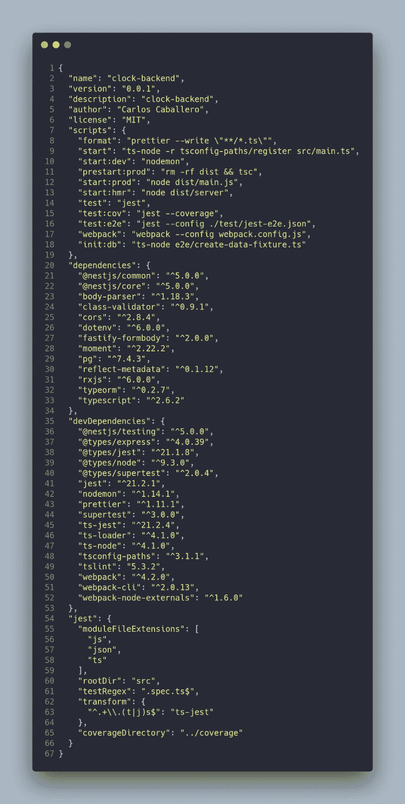
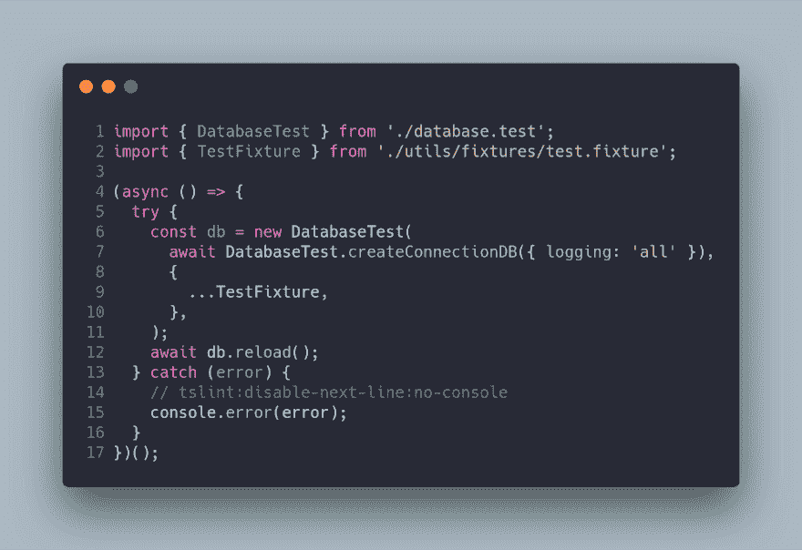
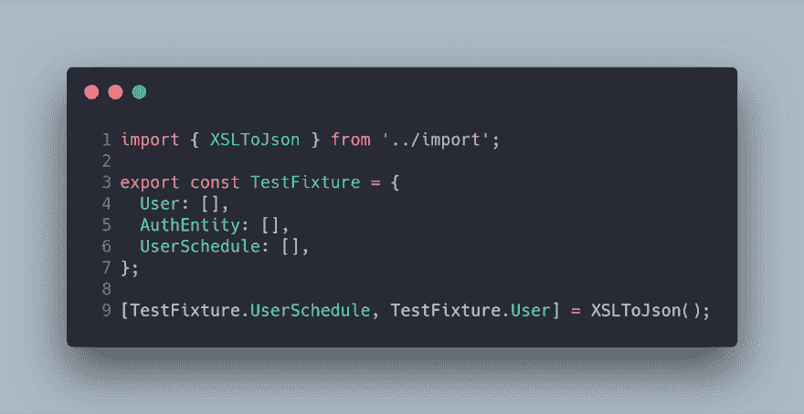
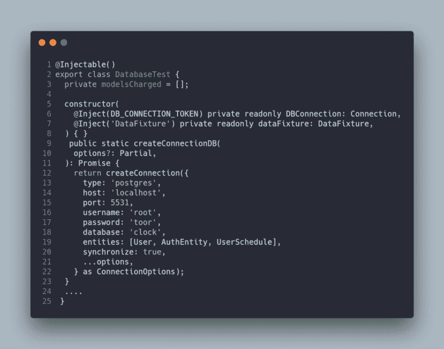
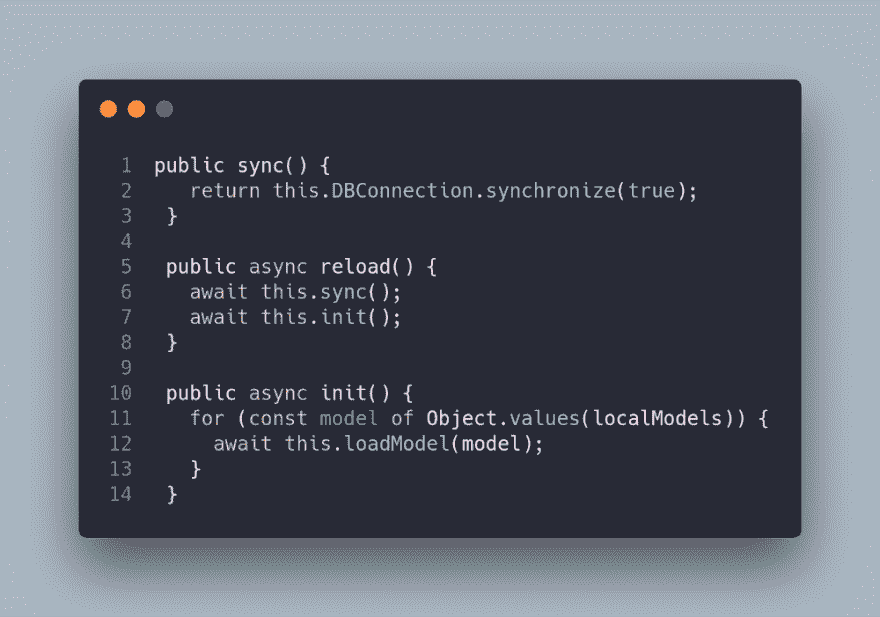
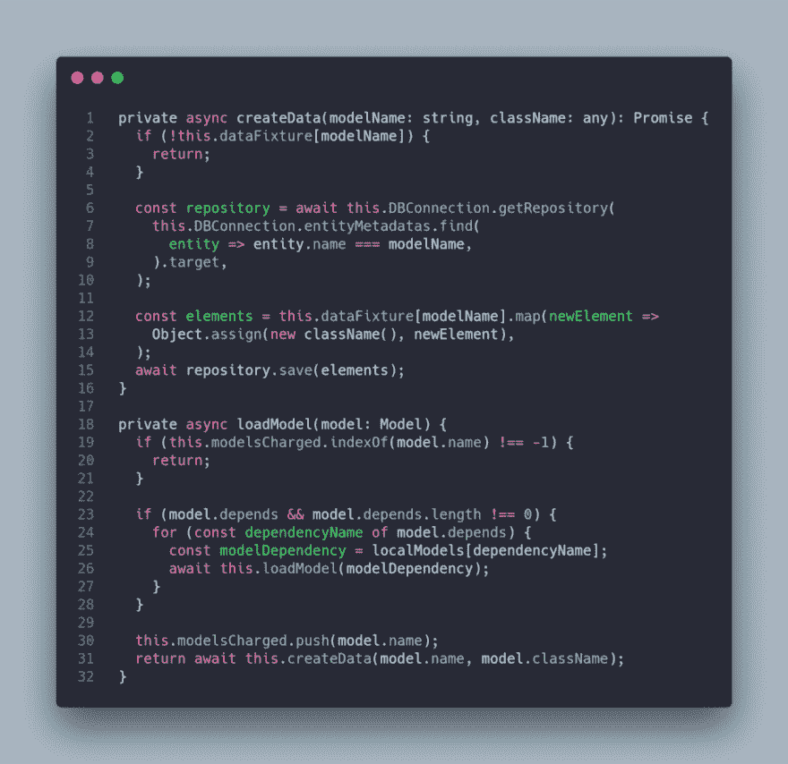
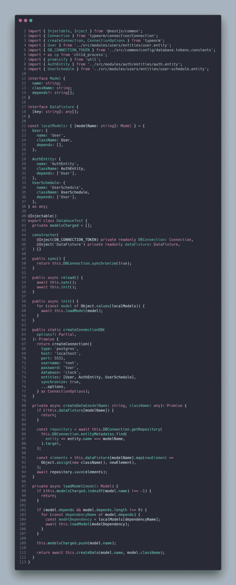
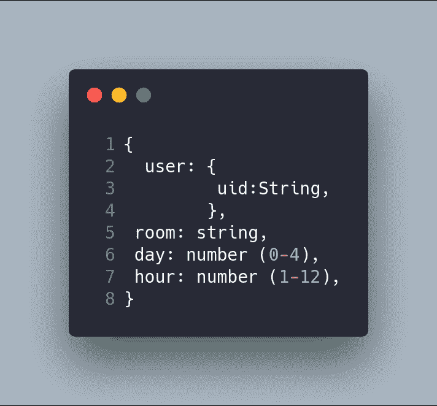
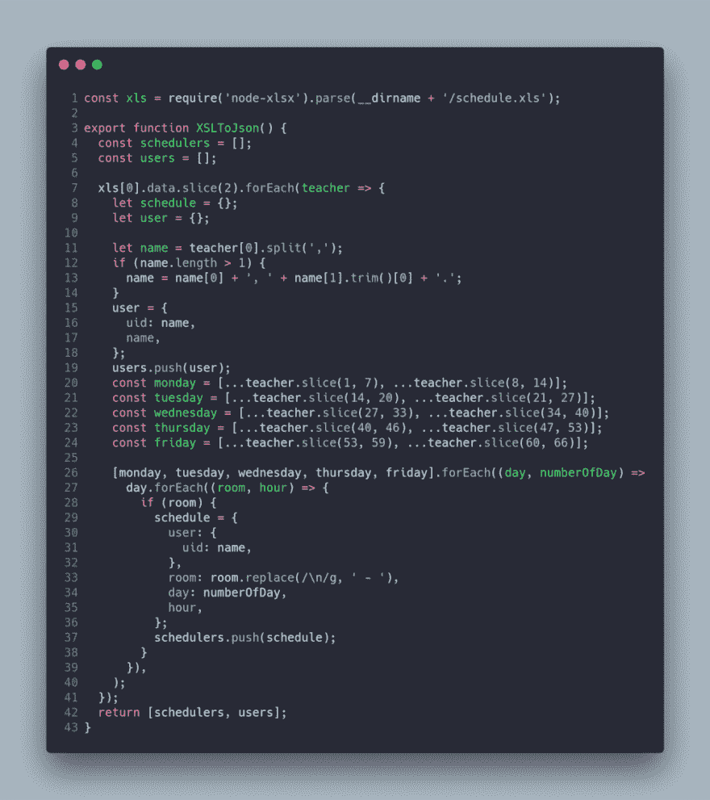

# 第五部分。上下班打卡系统:种子数据库和迁移数据

> 原文：<https://dev.to/carlillo/part-5-clock-inout-system-seed-database-and-migration-data-320m>

这篇文章是我正在描述的一个上下班打卡系统的系列文章的一部分
如果你想了解更多，你可以阅读下面的文章:

*   第一部分。上下班打卡系统:图表。
*   第二部分。上下班打卡系统:基本后端— AuthModule。
*   第三部分。上下班打卡系统:基本后端—用户模块。
*   第四部分。上下班打卡系统:基本后端应用模块。
*   第五部分。打卡系统:种子数据库和迁移数据
*   第六部分。上下班打卡系统:基本前端。
*   第七部分。打卡/下班系统:使用 docker/docker-compose 部署后端(nestJS)。
*   第八部分。上下班打卡系统:使用环境部署前端(角度 2+)。
*   第九部分。测试:后端测试—单元测试—服务
*   第十部分。测试:后端测试—单元测试—控制器
*   第十一部分。测试:后端测试— E2E 测试
*   第十二部分。测试:前端测试—单元测试
*   第十三部分。测试:前端测试—集成测试

在之前的帖子中，已经描述了打卡系统后端的开发，但是没有数据证明我们的后端已经成功开发。

因此，在这篇文章中，我将描述我如何创建了一系列脚本
(typescript)，这些脚本允许从旧软件(MS excel)的
客户端提供的 Excel 表中填充数据库。

第一步是在 **package.json** 中添加一个 **npm 脚本**，它允许使用 **node-ts** 在 [TypeScript](http://www.typescriptlang.org/) 中执行我们的脚本。因此，我们脚本的执行将是执行命令 **npm run init:db** 。

脚本 **create-data-fixture** 是一个自执行函数，它基于 **DatabaseTest** 创建一个
新对象，并调用方法 **db.reload()** 。使用两个参数创建
函数**数据库测试**:

**数据库**(将用于存储数据的数据库)
的连接，如果我们要使用不同的数据库，每次执行时会有所不同。当我们想让不同的数据库并行运行模拟数据的 e2e(端到端)测试时，这个事实很有趣。 **DataFixture** ，它是一个对象，包含将要插入数据库的信息(**用户**和**用户-日程**)。

因此，最简单的文件是 **TestFixture** ，一旦数据从数据映射脚本(也将由我们开发)的 XLS 文件中导入和加载，它就会导出数据。

另一方面， **database.test.ts** 文件负责加载数据库中的伪造数据。也就是说，**用户**和**用户时间表**将从 **test.fixture** 文件中取出。然后我们将描述这个文件，因为它非常重要:

*   **DatabaseTest** 类使用 DI(依赖注入)接收数据库连接和来自 **test.fixture** 文件的模拟数据。
*   初始化 **modelsCharged** 属性，该属性存储已经加载到数据库中的模型，并且不必重新加载它们。
*   **createConnectionDB** 方法是静态的，用于从类外部连接到数据库。这样，当注入类时，连接就已经成功建立了。

下一步是构建初始化、重新加载和同步数据库的基本方法。

接下来，模型被加载，它被一个接一个地递归执行，获取不同模型之间的现有依赖关系的信息。

概括地说，显示了完整的 **database.test** 文件。

### 奖金追踪

接下来我们将展示 **XLSToJson** 方法，它只是将 excel 的每一行转换成需要由 TypeORM 导入的不同 Json 对象。值得注意的是，每个开发者都必须从他们的 XLS 中改编 **XLSToJson** 函数。

首先，我们需要安装 **node-xlsx** 包，它允许我们与 XLS 文件进行交互。下面是第一个版本，它使用了几个 **forEach** 循环来遍历并构建一个类似于下面的数据结构:

*   [调度程序，用户]在哪里
*   调度程序是以下类型的对象:

*   用户是以下类型的对象:

下面的代码，我认为它不是最干净的版本，我认为当系统完成后，作为未来的帖子，我会对它进行很好的重构。如果有人想推进这项任务，提出以下几点:

1.  根据执行的任务提取函数，而不是一个大的、单一的函数。
2.  将隐藏经典数据结构的 **forEach** 方法替换为功能上更合适的方法，如 **reduce** 。

### 简历

‌In 在这篇文章中，我解释了我的**种子数据库**，它由一系列
脚本组成，允许我在数据库中加载任何数据结构。为了从
Excel 导入，已经创建了一个特定的脚本，将 XLS 文件转换成 JSON。

GitHub 项目是[https://github.com/Caballerog/clock-in-out](https://github.com/Caballerog/clock-in-out)。
这个帖子的 GitHub 分支是[https://GitHub . com/Caballerog/clock-in-out/tree/part 5-seed-database](https://github.com/Caballerog/clock-in-out/tree/part5-seed-database)。

* * *

最初发布于[www . carloscaballero . io](https://carloscaballero.io/part-5-clock-in-out-system-seed-database-and-migration-data/)2018 年 12 月 21 日。