# 第九部分。打卡上班/下班系统:测试:后端测试

> 原文：<https://dev.to/carlillo/part-9-clock-in-out-system-testing-backend-testing-3imk>

这篇文章是我描述上下班打卡系统的一系列文章的一部分，如果你想了解更多，你可以阅读下面的文章:

*   第一部分。上下班打卡系统:图表。
*   第二部分。上下班打卡系统:基本后端— AuthModule。
*   第三部分。上下班打卡系统:基本后端—用户模块。
*   第四部分。上下班打卡系统:基本后端应用模块。
*   第五部分。打卡系统:种子数据库和迁移数据
*   第六部分。上下班打卡系统:基本前端。
*   第七部分。打卡/下班系统:使用 docker/docker-compose 部署后端(nestJS)。
*   第八部分。上下班打卡系统:使用环境部署前端(角度 2+)。
*   第九部分。测试:后端测试—单元测试—服务
*   第十部分。测试:后端测试—单元测试—控制器
*   第十一部分。测试:后端测试— E2E 测试
*   第十二部分。测试:前端测试—单元测试
*   第十三部分。测试:前端测试—集成测试

## 简介

这是第一个关于测试的帖子，也可能是第一个关于**质量评估** (QA)的帖子。这个项目从一开始就没有使用**试驾开发** (TDD)进行开发，但我目前正在测试阶段。感谢测试阶段，我发现了很多小错误，如果这个项目已经投入生产，这些小错误可能会成为一个大问题。事实是，该项目将在接下来的几周内进入生产模式。这些测试对于修复这次发现的几个 bug 会非常有用。

测试的第一步是决定我应该测试什么？任何人都可以对你说，你必须测试整个应用程序，你必须获得接近 100%的覆盖率，但事实是你不需要测试整个应用程序，但你必须测试软件的最关键部分。你的软件的这些部分的价值可能接近 90%或 70%，这取决于你的应用程序。

在我们的例子中，我将描述我们应该测试:

*   服务:

1.  app.service。

2.  用户服务。

3.  授权服务

*   控制器:

1.  app.controller

2.  用户.控制器

因此，在我们的项目中，不需要测试 d to、常量、实体和模块，因为这些测试很难，价值也很小。

后端使用 NestJS 框架开发，该框架使用 Jest 作为测试工具。此外，NestJS 包括一个强大的测试包，它模拟了一个类似于角度测试包的环境。

## 服务测试

在这篇文章中，我将描述服务单元测试。该测试是**测试金字塔**中最简单的测试。我对测试领域的初学者的建议是，您应该开始对服务进行单元测试，因为这些都是小功能，它们有独特的任务，很容易被隔离。因此，它们是最简单、最容易测试的。

[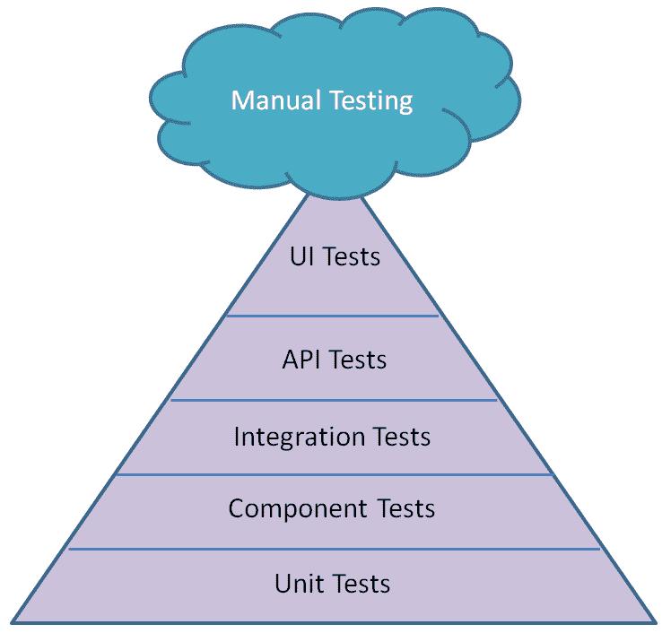](https://res.cloudinary.com/practicaldev/image/fetch/s--x-ityhFh--/c_limit%2Cf_auto%2Cfl_progressive%2Cq_auto%2Cw_880/https://cdn-images-1.medium.com/max/2000/0%2ARuN5s7cMjVG2wA2L.png)

## App 服务

我们要测试的第一个服务是 app.service.ts，它使用两个服务:AuthService 和 UserService。因此，我们的测试套件必须检查 app.service 将使用正确的参数调用服务。

第一步包括我们将要开发的每个测试的初始配置。因此，app.service.ts 在其构造函数中需要两个服务(AuthService 和 UserService ),这两个服务将是间谍。来自@nestjs/testing 的测试包提供了 createTestingModule 方法，该方法创建了一个要测试的测试模块。在这个 testingModule 中，providers 数组由 AppService 和两个使用工厂创建的 spies 组成。以下代码向您展示了这一初始配置:

[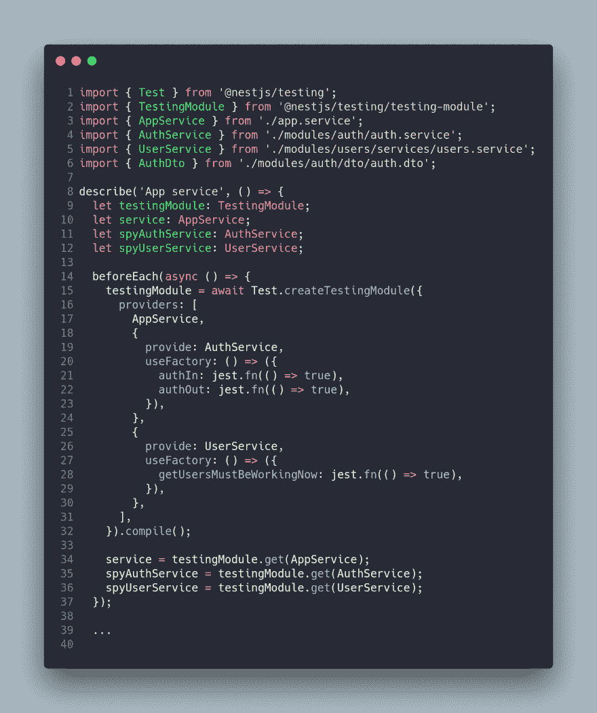](https://res.cloudinary.com/practicaldev/image/fetch/s--q1nmhTAv--/c_limit%2Cf_auto%2Cfl_progressive%2Cq_auto%2Cw_880/https://cdn-images-1.medium.com/max/3040/1%2Ax6MJpxZrY-lit2ZpPOWBbQ.png)

下一步包括知道我们想要测试什么。主要思想是独立于任何其他函数/方法来测试每个函数/方法。因此，以下方法是 app.service.ts 中代码的一部分。

[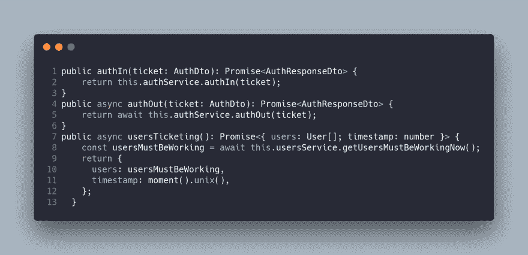](https://res.cloudinary.com/practicaldev/image/fetch/s--jviU1UZ8--/c_limit%2Cf_auto%2Cfl_progressive%2Cq_auto%2Cw_880/https://cdn-images-1.medium.com/max/3480/1%2AUM9Sx3JebcndEFD4qEostQ.png)

authIn 和 authOut 方法应该检查是否使用正确的参数调用了 authService。在我们的例子中，测试是单元，因此，方法 this.authService.authIn 和 this.authService.authOut 不应该使用真正的函数/方法来调用，这就是为什么我们对这些方法使用 spies 的原因。测试函数的代码如下:

[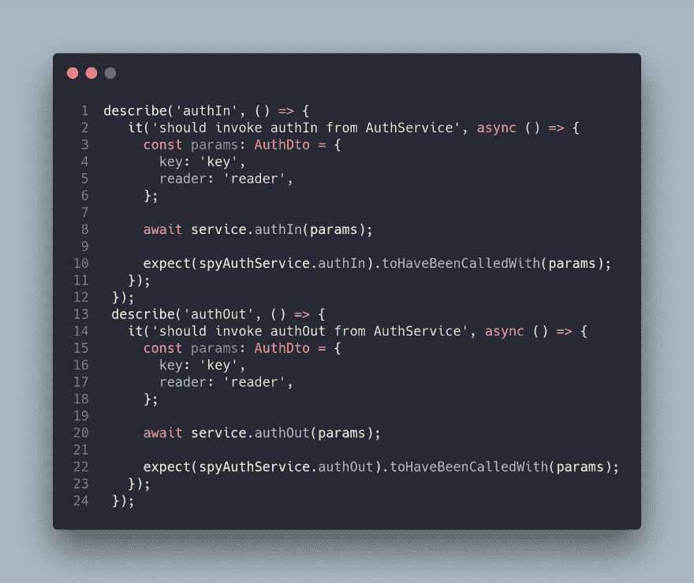](https://res.cloudinary.com/practicaldev/image/fetch/s---P0Wlv8X--/c_limit%2Cf_auto%2Cfl_progressive%2Cq_auto%2Cw_880/https://cdn-images-1.medium.com/max/2944/1%2Aypj9PTe8CSyXfcIS9aPvFw.png)

在前面的测试中，您可以注意到 expect 与方法 authIn 和 authOut 相关，它们检查这些方法是否被调用，参数是否正确。在这些方法中，方法 authIn 或 authOut 中抛出的错误是不相关的，因为在这些方法中，责任被委托给其他服务。

与用户粘贴方法相关的测试如下:

[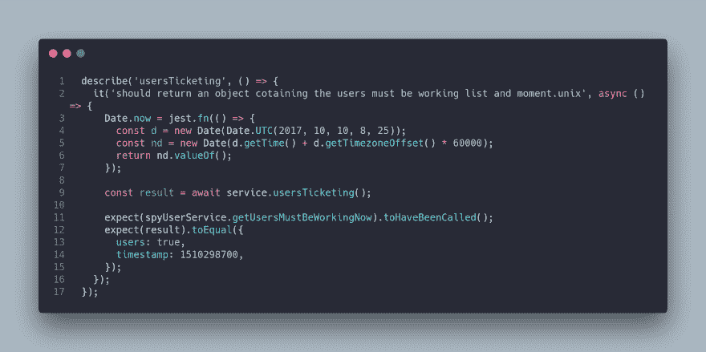](https://res.cloudinary.com/practicaldev/image/fetch/s--TqwLozyp--/c_limit%2Cf_auto%2Cfl_progressive%2Cq_auto%2Cw_880/https://cdn-images-1.medium.com/max/4096/1%2AZ03NkUUMq-aSLOqqKHS9fw.png)

在这种情况下，创建一个 spy，在执行函数 now from Date 时使用。在这种情况下，请在同一天返回(测试必须是纯的，不依赖于外部因素)。因此，在这个测试中，我们需要检查 getUsersMustBeWorkingNow 方法是否已被调用，以及 usersTicketing 方法的结果是否是一个包含关键用户的对象，这些关键用户的值是否在 spy UserService 中提供，以及被模拟的日期的时间戳。

## 用户服务

测试用户服务的过程与在 app.service.ts 中使用的过程相同，因此，第一步是创建测试模块，该模块包含将在下面的测试中使用的 spy 和服务。

[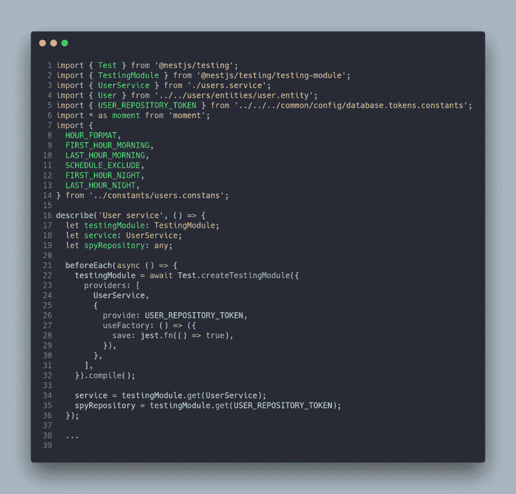](https://res.cloudinary.com/practicaldev/image/fetch/s--oErgftOe--/c_limit%2Cf_auto%2Cfl_progressive%2Cq_auto%2Cw_880/https://cdn-images-1.medium.com/max/3716/1%2AXaVDsPVh8pmCoLNjoWGZYw.png)

第一种方法非常简单，因为使用的技术与 app.service.ts 中的技术相同。因此，要测试的代码如下:

它的测试套件只检查方法 save 是否是用正确的参数(用户原型和初始参数)调用的，如下面的代码所示:

[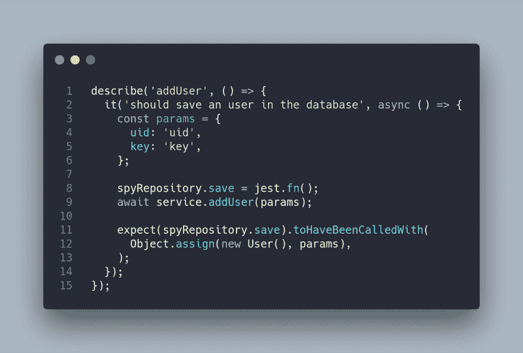](https://res.cloudinary.com/practicaldev/image/fetch/s--J02ksr1O--/c_limit%2Cf_auto%2Cfl_progressive%2Cq_auto%2Cw_880/https://cdn-images-1.medium.com/max/2704/1%2A6yBB6L8UxyyjVfZlTj6V7A.png)

下一个要测试的方法是调用 TypeORM ORM，如下所示:

[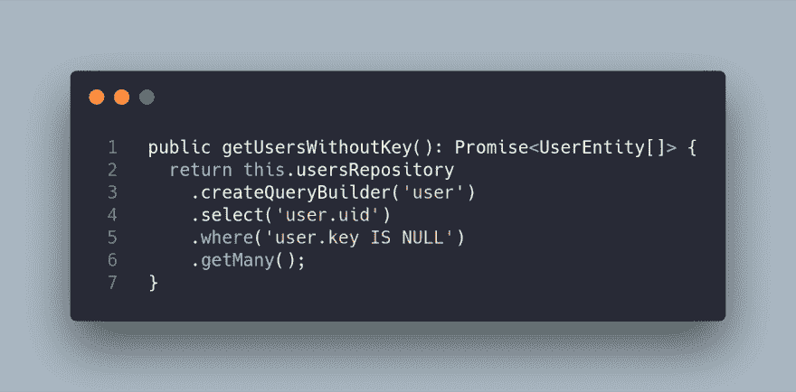](https://res.cloudinary.com/practicaldev/image/fetch/s--jBdk34xH--/c_limit%2Cf_auto%2Cfl_progressive%2Cq_auto%2Cw_880/https://cdn-images-1.medium.com/max/2536/1%2AsFghvDgWDqfrfzw-n_1hlg.png)

在这个测试中，我们需要使用链式响应从用户库中检测每个方法。所以，做这件事的方法我们使用 Jest 提供的工厂。

[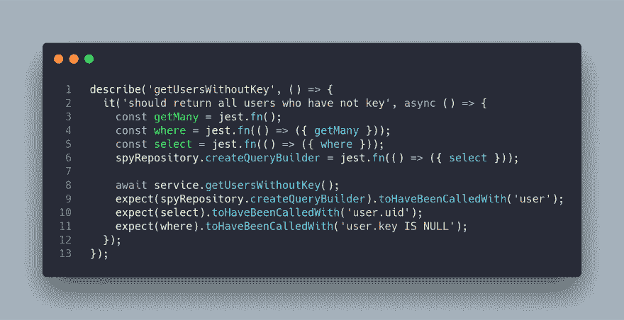](https://res.cloudinary.com/practicaldev/image/fetch/s--7KEdeDsw--/c_limit%2Cf_auto%2Cfl_progressive%2Cq_auto%2Cw_880/https://cdn-images-1.medium.com/max/3280/1%2Axh6miGfI-lIJ6VM5EcuOQQ.png)

如你所见，我们正在检查 TypeORM 中的每个方法，这些方法被调用了，哪些参数被调用了，简单快捷。

下面的方法可能有一个著名的**代码味道**(长方法)，但是如果你仔细阅读该方法，你会注意到它是一个很好的数据库查询调用，并且代码没有**代码味道**。

[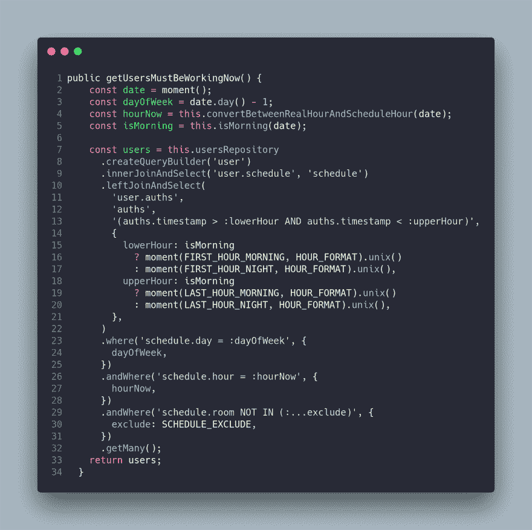](https://res.cloudinary.com/practicaldev/image/fetch/s--XB3OoKNr--/c_limit%2Cf_auto%2Cfl_progressive%2Cq_auto%2Cw_880/https://cdn-images-1.medium.com/max/3212/1%2Ak8BtYAgyOVeypMp2WIoidQ.png)

查询有几个参数组合，但是测试是相同的，因此要做这个测试，我们需要测试中的输入和输出表。Jest 有一个名为 each 的参数，可以用来参数化我们的测试。

下表列出了:

[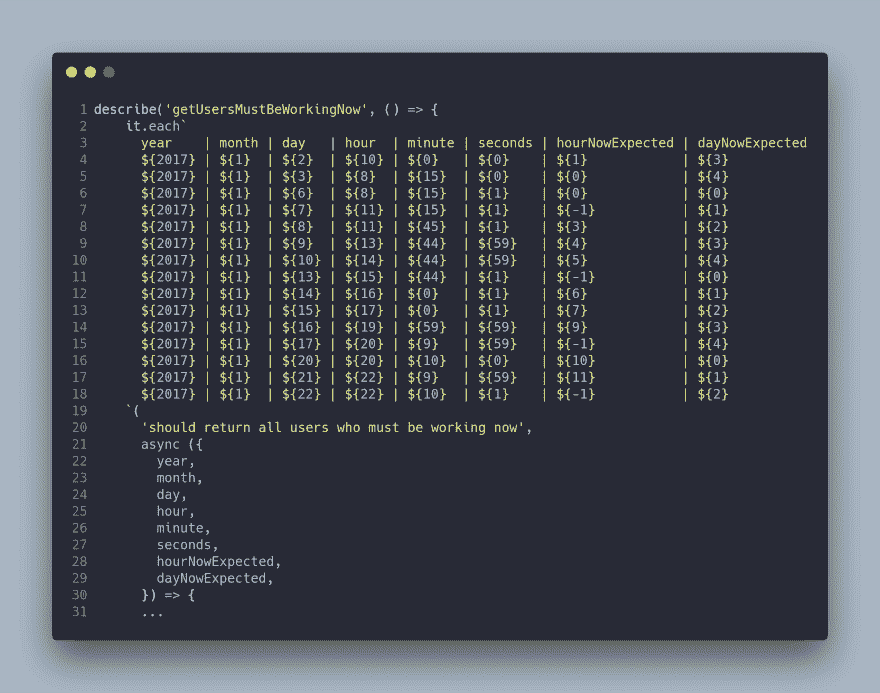](https://res.cloudinary.com/practicaldev/image/fetch/s--sIlrWirI--/c_limit%2Cf_auto%2Cfl_progressive%2Cq_auto%2Cw_880/https://cdn-images-1.medium.com/max/3784/1%2ADWUpBlflF9p4OKAqhiAArg.png)

您可以看到我们表格中用于测试的参数如下:

*   **year** :对应于我们想要测试用户是否在建筑物中的时刻的年份。

*   **月**:对应于我们想要测试用户是否在建筑物中的时刻的月份。

*   **day** :对应于我们想要测试用户是否在建筑物中的时刻的日期。

*   **小时**:对应于我们想要测试用户是否在建筑物中的时刻的小时。

*   **分钟**:对应于我们想要测试用户是否在建筑物中的时刻的分钟。

*   **秒**:对应于我们想要测试用户是否在建筑物中的时刻的秒。

*   **hourNowExpected** :使用其他参数列表返回方法的小时。

*   **dayNowExpected** :应使用其他参数列表返回方法的日期。

我们的测试需要很多间谍来测试 ORM，表中的预期值用于检查 privates 方法是否返回将用于 ORM 查询的值。如果私有方法是公共的，测试会更容易，但是测试不应该改变原始代码(只有在发现 bug 时)。

[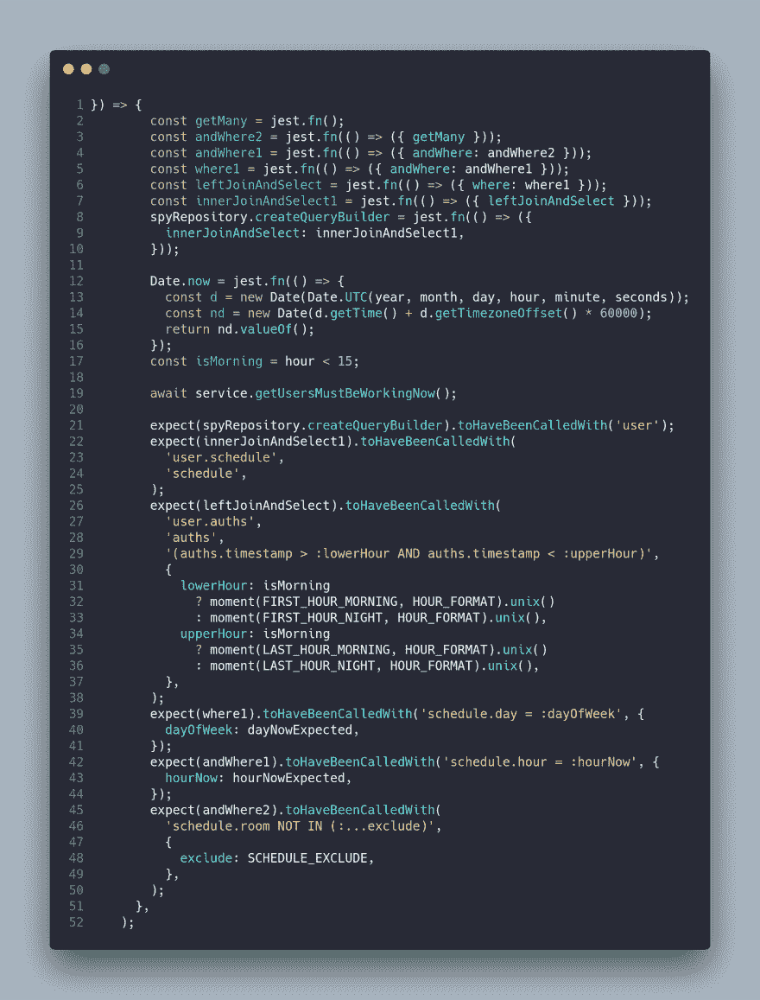](https://res.cloudinary.com/practicaldev/image/fetch/s--p536BRF2--/c_limit%2Cf_auto%2Cfl_progressive%2Cq_auto%2Cw_880/https://cdn-images-1.medium.com/max/3416/1%2ABWOhk2kZEcbdhGXnFLkQ3g.png)

测试的第一部分是创建间谍来检查它是否使用正确的参数被调用。然后，调用 service . getusersmustbeworkingnow()方法。最后，有一个期望列表，它检查 ORM 的方法是使用正确的参数调用的。

因此，这个测试的最终代码如下:

[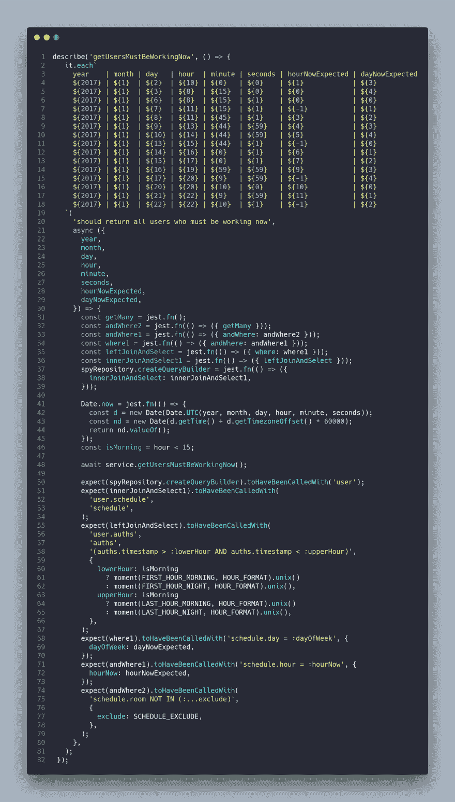](https://res.cloudinary.com/practicaldev/image/fetch/s--Ay-5KVbP--/c_limit%2Cf_auto%2Cfl_progressive%2Cq_auto%2Cw_880/https://cdn-images-1.medium.com/max/3784/1%2AeaP25aa7elrwqvKManY2yg.png)

## 认证服务

要测试的最后一个服务是 auth.service.ts。要使用的技术与前面的测试类似。因此，每个测试的第一步是配置初始化。

[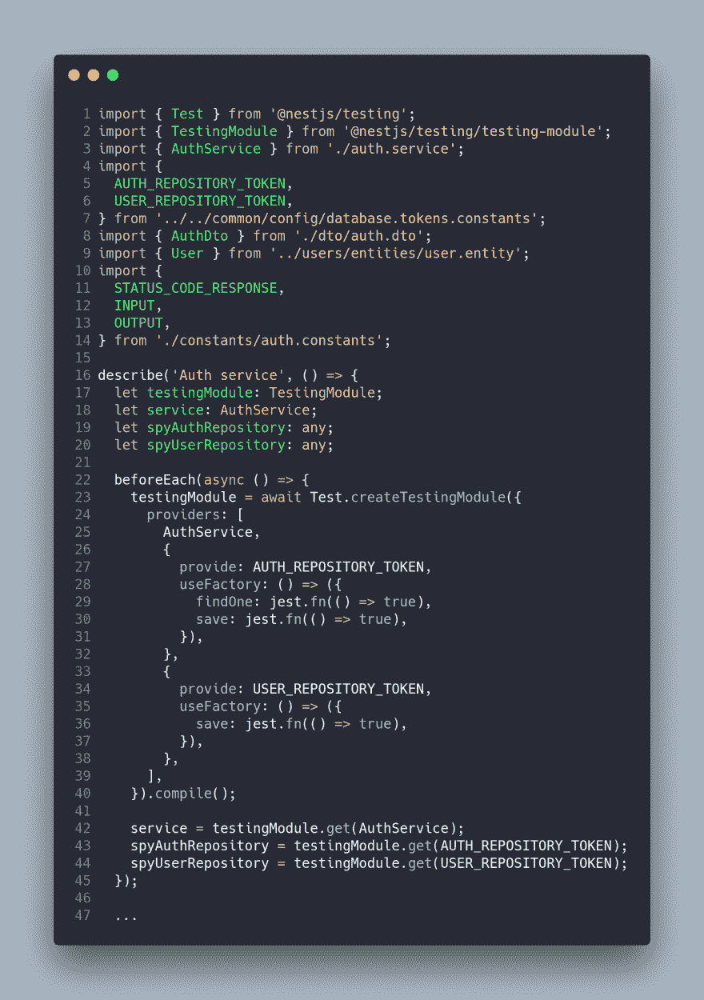](https://res.cloudinary.com/practicaldev/image/fetch/s--5Zk-RpPN--/c_limit%2Cf_auto%2Cfl_progressive%2Cq_auto%2Cw_880/https://cdn-images-1.medium.com/max/2908/1%2A5Eg1U50h-QL8EyfLIZe7yA.png)

要测试的代码如下:

[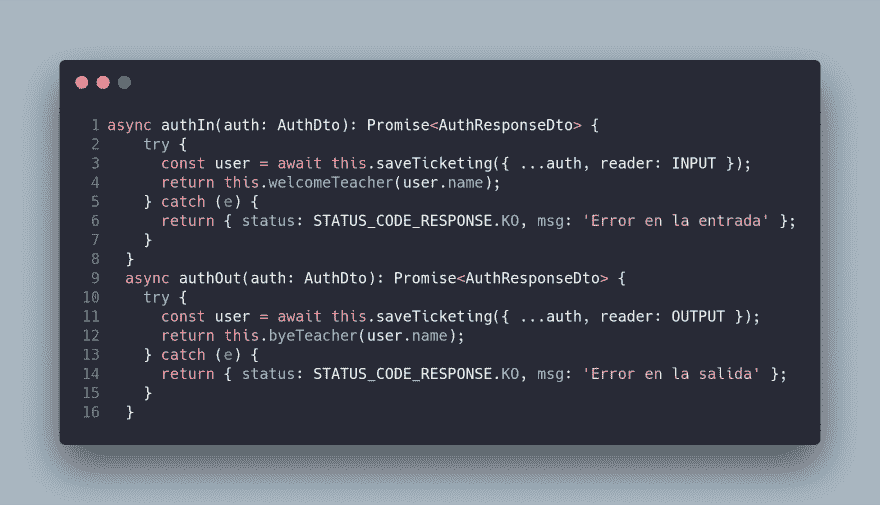](https://res.cloudinary.com/practicaldev/image/fetch/s--nX1xxNqL--/c_limit%2Cf_auto%2Cfl_progressive%2Cq_auto%2Cw_880/https://cdn-images-1.medium.com/max/3312/1%2Ajiz9mRIxJ1NYOTndqoikog.png)

您可以看到，有几个私有方法无法直接测试，因为私有方法类似于将代码复制/粘贴到公共方法中。因此，这些方法没有测试套件。

私有方法如下:

[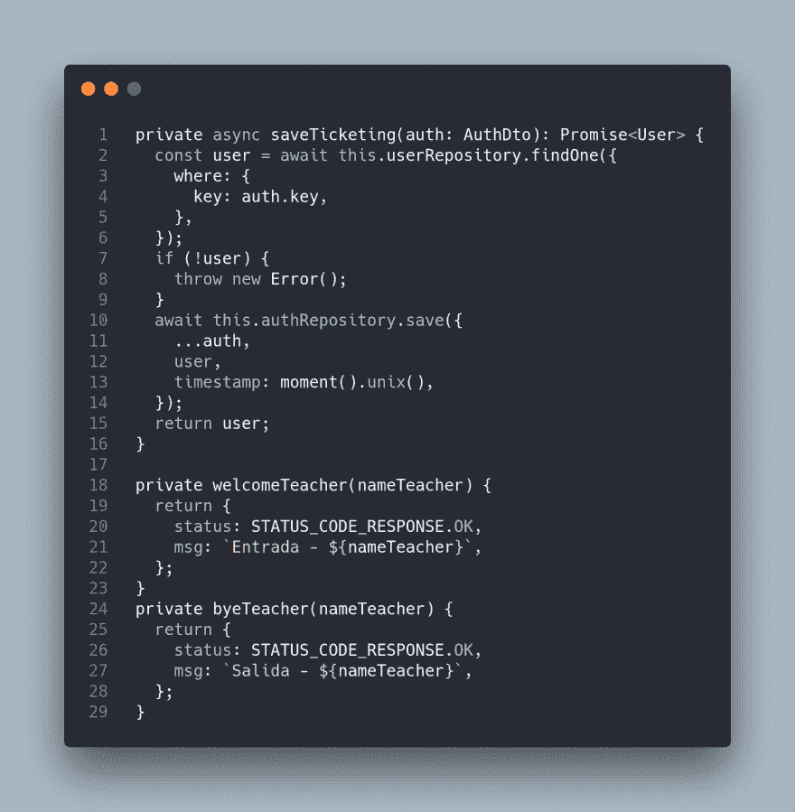](https://res.cloudinary.com/practicaldev/image/fetch/s--pdHBU7y2--/c_limit%2Cf_auto%2Cfl_progressive%2Cq_auto%2Cw_880/https://cdn-images-1.medium.com/max/2776/1%2Awr6G74F2ZZUfr-6wLQZ12A.png)

在我们的方法 authIn 和 authOut 的测试套件中，有三个不同的测试代表了一个场景，如下所示。

1.  authIn。

*   应该有认证和回复问候。

*   当找不到用户时应该返回错误。

*   出现意外错误时应返回错误。

1.  authOut。

*   应该保存身份验证并返回 bye。

*   当找不到用户时应该返回错误。

*   出现意外错误时应返回错误。

授权码如下:

authOut 代码如下所示:

[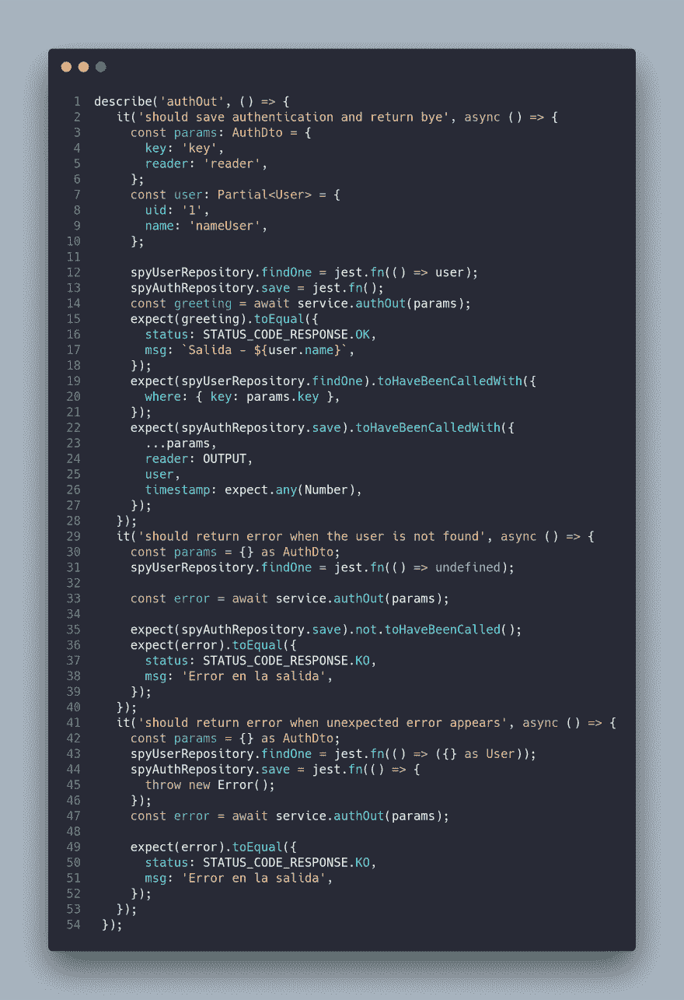](https://res.cloudinary.com/practicaldev/image/fetch/s--fZuJdxD4--/c_limit%2Cf_auto%2Cfl_progressive%2Cq_auto%2Cw_880/https://cdn-images-1.medium.com/max/3176/1%2At49o_jALC35a2hRpTObpJg.png)

## 结论

在这篇文章中，我解释了如何使用 jest 和 NestJS 框架测试后端服务。这段代码最有趣的特点是，我们可以使用 spies 来隔离我们的测试，我们可以创建一个输入和输出表来自动化许多相同但使用不同参数的测试。

在下一篇文章中，我将向您展示如何对控制器进行单元测试。

*   GitHub 项目是[https://github.com/Caballerog/clock-in-out](https://github.com/Caballerog/clock-in-out)。

*   这个帖子的 GitHub 分支是[https://GitHub . com/Caballerog/clock-in-out/tree/part 9-back end-unit-test](https://github.com/Caballerog/clock-in-out/tree/part9-backend-unit-test)。

*最初发布于[www . carloscaballero . io](https://carloscaballero.io/part-9-clock-in-out-system-testing-backend-unit-test-services/)2019 年 3 月 15 日。*