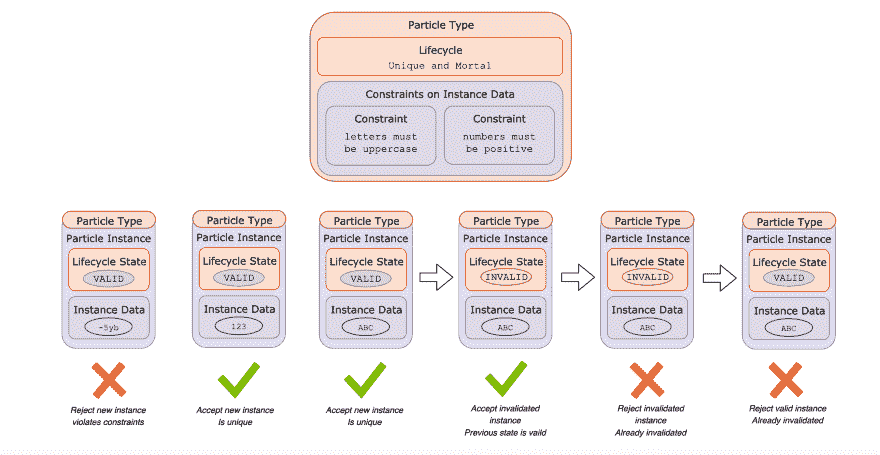

# 粒子类型

> 原文：<https://dev.to/radixdlt/particle-types-137j>

# 简介

粒子类型描述了粒子状态机的定性方面，它是实例的内容结构和生命周期以及允许的内容状态转换的组合。粒子类型进一步定义了其粒子实例必须包含的数据，以及它们必须遵守哪些约束才能被接受和存储。粒子类型通常具有共同的属性，这些属性要求它们的约束以某种方式工作，例如可以唯一标识某个类型的粒子实例的属性。粒子的这些不同的、共同的性质被称为夸克。

总之，颗粒类型的两个定性方面是:

-夸克:独特的属性这种粒子类型实现了
-约束:应用于要接受的粒子实例的约束

# 夸克

一个粒子可能具有的基本的、独特的性质叫做夸克。它们是所有粒子的基础，也是底层速度引擎的接口。粒子类型可以实现这些夸克，从而接受它们提供的约束。

| 夸克名 | 意义 | 限制 |
| --- | --- | --- |
| 可辨认的 | 粒子实例是唯一可识别的 | 只能是一个具有所提供标识符的粒子实例，必须是有效的基数资源标识符 |
| 代替的 | 粒子实例是可替换的，可以互相交换 | 涉及粒子实例的事务必须累加 |
| 负有责任的 | 粒子实例可以驻留在基数帐户中 | 粒子实例必须存储在基数帐户中 |
| 可拥有的 | 基数帐户可以拥有粒子实例 | 只有粒子实例的所有者才能使其无效(即消耗) |

# 约束

除了夸克提供的基本约束，粒子类型还可以实现自己的约束。这些约束是使用约束 Scrypt 语言实现的。约束脚本是为特定粒子类型注册约束的脚本。

# 约束结构

约束是对粒子类型的要求，该类型的所有粒子实例必须满足该要求才能被接受并与原子一起存储。约束针对单个粒子实例进行验证，并且可以基于:

-仅包含带有“require”的粒子实例，
-包含带有“requireIndexed”的粒子实例(对于可索引的)标识符的所有粒子实例，
-包含带有“require”的相同内容的所有粒子实例。
约束的结构被定义为:

> on()
> 要求|要求索引|要求

其中>要求是约束对>施加的要求。需求的输出(即返回值)必须是结果类型，这是的枚举

-成功(无消息)
-错误(有消息)。

尽管返回值是必需的，但为了简洁起见，可以省略最后的成功语句，因为它是隐式默认值。

# 举例

考虑一个示例约束脚本，它强制 MyParticle 符号必须

-exist and be non-empty
-全大写
-长度在一定范围内(MIN_SYMBOL_LENGTH 和 MAX_SYMBOL_LENGTH)
由于这个约束 Scrypt 只需要有问题的粒子实例，所以用 require()实现为无状态需求。

> on(my particle)
> require(my particle->{
> String symbol = my particle . symbol
> if！符号
> 错误“符号:无或空”

```
 if symbol.chars().anyMatch(isIllegalSymbolChar)

      error "Symbol: must be all uppercase."

```
if !symbol.length in MIN_SYMBOL_LENGTH..MAX_SYMBOL_LENGTH
  error "Symbol: invalid length, must be between + MIN_SYMBOL_LENGTH + " and " + MAX_SYMBOL_LENGTH  + " but is " + symbol.length()

success // can be omitted 
```

}) 
```

# 
  
粒子实例

粒子实例描述了粒子状态机的定量方面，即实际的实例状态。它们是特定粒子类型的实例，因此必须遵守其粒子类型约束和生命周期状态机才能被接受。粒子实例存储其粒子类型所需的所有定量状态(即实例状态),并且可以转换到该粒子类型允许的任何状态(生命周期状态和数据状态)。粒子实例不携带任何定性信息——由粒子类型定义的定性方面“存储”在原子模型中。考虑定义粒子有限状态机(FSM)的粒子类型和该 FSM 的两个实例的以下示例:

[](https://res.cloudinary.com/practicaldev/image/fetch/s--U9eDnU0F--/c_limit%2Cf_auto%2Cfl_progressive%2Cq_auto%2Cw_880/https://blobscdn.gitbook.com/v0/b/gitbook-28427.appspot.com/o/assets%252F-LMPbV3hGbTEzGtYlH-m%252F-LeRu7aG9YTXyZd6UFTb%252F-LeS76fwQhdY6xGxufPw%252FScreenshot%25202019-05-09%252012.04.36.png%3Falt%3Dmedia%26token%3Dd29dd7cd-2458-44fb-8ed9-0bdd7887a98a)

在本例中，定义了一个生命周期唯一且为“凡人”的粒子类型和两个玩具约束。请记住，粒子生命周期是唯一的，而凡人强制执行唯一的、无效的粒子实例，可以观察到违反生命周期状态机的实例被拒绝。类似地，违反实例数据的玩具约束的粒子实例(如果实例数据是字母，则全部大写；如果是数字，则全部为正数)将被拒绝。接受没有违规的粒子实例。

# 用户定义的粒子类型

目前粒子在 Radix 核心和库中是硬编码的，也就是说，如果不修改源代码，就不能添加新的粒子类型。Atom 模型的积木式设计将使我们能够支持用户定义的粒子类型，甚至是在 Radix 分类帐中定义为粒子实例的粒子类型。这将要求粒子类型的所有相关部分都适应数据驱动的格式，包括约束 Scrypt 语言的定义。因此，这种扩展需要在规划、设计、实施和测试方面做大量工作，因此是一个长期特征。

# 加入 Radix 社区

[电报](https://t.me/radix_dlt)普通聊天
[不和](https://discord.gg/7Q7HSZZ)开发者聊天
[Reddit](https://reddit.com/r/radix) 普通讨论
[论坛](https://forum.radixdlt.com/)技术讨论
[推特](https://twitter.com/radixdlt)发布公告
[电子邮件](https://radixdlt.typeform.com/to/nyKvMV)简讯每周更新
邮件[hello@radixdlt.com](//hello@radixdlt.com)普通查询