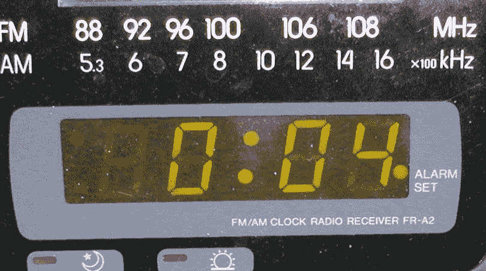

# Perl 每周挑战#1:翻译字母和计数。

> 原文：<https://dev.to/jj/perl-weekly-challenge-1-translate-letters-and-count-4cdf>

这是第一次 perl 每周挑战的第一部分。

[](https://res.cloudinary.com/practicaldev/image/fetch/s--xUmx8hnz--/c_limit%2Cf_auto%2Cfl_progressive%2Cq_auto%2Cw_880/https://thepracticaldev.s3.amazonaws.com/i/vpk1ffqle21qtsf1jr3t.jpg)

> 我还没有查看其他已经发布的解决方案，但是我很确定他们会遵循这些路线，至少在 Perl 6 中是这样。

挑战如下:

> 编写一个脚本，将字符串“Perl Weekly Challenge”中的字符“E”替换为“E”。同时打印字符“e”在字符串中出现的次数。

这很简单，几乎直接来自于 [Perl 6 文档:`StrDistance`](https://docs.perl6.org/type/StrDistance) 。

```
my $changes = (my $pwc = ‘Perl Weekly Challenge’) ~~ tr/e/E/;
say $pwc;
say +$changes; 
```

可以打高尔夫，也可以不打高尔夫。这里的基本技巧是我正在动态定义一个变量`$pwc`，这样我就可以对它应用 [`tr`](https://docs.perl6.org/syntax/tr%24SOLIDUS%24SOLIDUS%24SOLIDUS) 。我可以使用 [`.trans`](https://docs.perl6.org/routine/trans) ，因为在 Perls 中总是有不止一种方法可以做到这一点，但是这样我就无法获得统计变化的次要效果。我可以用 tr 做到这一点，它具有(Rakudo-only，不管那是什么意思，因为只有一个 Perl 6 编译器，这是 Rakudo)返回一个`StrDistance`对象的良好的次要效果，该对象可以在 number 上下文中返回更改的数量。这就是为什么我们将更改后的字符串保存在`$pwc`中，将*更改对象*保存在 changes 中。最后一行通过在前面放一个`+`来实现数字上下文化。

如果你想在任何一个 Perls 中崭露头角，就去[https://perlweeklychallenge.org](https://perlweeklychallenge.org)开始编码吧！