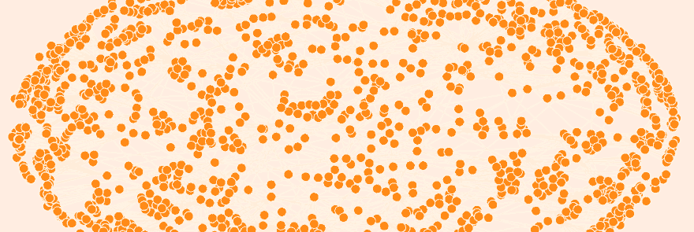

# 个人计算史

> 原文：<https://dev.to/tuned/personal-history-of-computing-gh6>

### 数字编程的哲学基础

#### 一些介绍性的词语

> “工具后，只对他的手有反应；在机器之后，涵盖复杂的任务和操作，但服从他的意志；在这里，他将根据明显合理的标准，委托自动机代替他自己进行管理和思考。”马丁，1988 年

* * *

#### 我—论当代社会

> “如果你想要和平，就准备让你自己自由”
> “Si vis pacem para remissionem”
> “Se vuoi la pace，prepara la liberazione”——a .卡皮蒂尼

作为年轻鲁莽的穴居人，在这个新的新石器时代的能力，我们努力寻找微弱的火，由其他一些上级祖先捐赠。它们与一种新的机器结合在一起——信息意识(crafter)。完全沉浸在媒体中会追踪我们的决定在政治个人主义单个行动达到临界量后的三个世纪利用电子设备。有价值的少数群体(如我或任何其他个人)的火焰可以到达人们手中，并得以延续。我们又一次涉水前行，带着微弱的火焰从一个营地走到另一个营地，努力去回忆，去清晰地再现人类的认知。

这种持续的智力(拉丁文——inter+Lego:collect，gather [2])过程，是典型的数字化高暴露工作(通信工作、金融、编码、编程、工程、自动化...)为框架和“理论”的“游牧”方式提出了新的色调。主要是因为不动可以发现教条主义，因为过时几乎是无处不在的威胁:为了避免这一点，我们试图建立工具来建立这种逻辑*‘楣构’*(我们档案的基石？[11] )[3]，这肯定是一个数学，物理，算法，最后，复杂的工具。让我们重复一下，看看在高度互联的数字网络背景下，通过定义“理论”“系统”和“框架”这些词，我们能说些什么。这有助于建立一个卡尺，用适量的主观性公平地衡量现实:一种可计算性的存在主义(我们将定义为存在搜索)。知识网络(数字媒体网络)在逻辑思维和自我上拉了什么弦？我们想要论证的是，数字网络本身的控制论结合，以及它们的新语言，人工的或自然的。我们利用真实性的概念为这些结构绘制形状，以突出提供形状翻译信息的网络中的个体可能性。

让我们以这个起始数据为例:对于现在计算机显示器上的每一帧(1920×1080 像素)，我们捕捉到的信息量与早期整个电信网络在几个月内传输的信息量相同(1920×1080×32 比特可以包含大约 1，300，000 条消息)。这种度量单位(位)既有逻辑基础，作为决策搜索过程的度量，也有物理基础，作为一组信号在线路上的表达(如果考虑电话号码在电话时代早期如何寻址接收者，第一个假设是明显的)。由于我们习惯于基于自然语言(社会经济)背景的工具，我们面对、隐藏、处理大量数字信息的问题。对所需工具的一些普遍误解是缺少*认知更新*；幸运的是，新的理论和框架来拯救我们了，它们只是很难找到，并且很难持续不断地更新它们。我们正从知识来源的匮乏走向知识来源的过度丰富。这意味着我们在“框架”内不断调整我们的过滤能力，目的是理解媒体，互联网。当一名赛车手意识到他/她的引擎活塞的运动时，我们都需要认识论结构来与数字机器交互并堆叠信息，我们感觉到网络的“呼吸”和上升或下降的电流。通往认识论结构的道路意味着世界范围内的“逻辑的哲学协调”,基于这些主要组成部分:同一反馈回路中的数学和人文主义。这就是全球软件产品的现状。这种领悟是什么状态？我们需要以一种保存多样性的方式来解开它，同时在一个共同的层面上跳舞，我们需要存在的独特性，这是搜索空前数量的知识来源的结果。最终，框架，像大多数工具一样，结合了知识来简化使用，甚至提供黑盒使用。这种用法有什么不同吗？

被称为认知输入(隔阂)的第三方用户体验的感觉，乘以我们使用的令人难以置信的数字媒体集，是描述从框架到框架转移的必要性的 quippus [4]的中心结。运动/过程本身变成了科学(系统思考[5])，元技能(阅读、写作、学习，可能非常快)的重要性激增。这些体验中的每一个都需要在传递体验的媒介上精细调整的表征(阅读)和二元决策(写作)，以允许理解。反馈回路在人和媒介/机器之间舞动，第三个空间在中间，界面。阅读一个允许通过界面与媒体互动的适当的表示(有人称之为循环网络空间，或者，在过去的一些非常怪异的时代，是意志表示[6])，是一个了解代码、语言和元语言的问题，当今的任何事情，社会经济交流，都是在这些代码、语言和元语言上运行的。我们称这种解决问题的方式(也叫管理火)为“媒介驱动的存在搜索方法”，以区别于理论(或证明)驱动的知识方法。这方面的一些日常实践是研究、“代码素养”或更一般的模式识别。这不是通过观察单位的明显行为而发生的(听起来是理论驱动的，不是吗？)，而是通过研究他们大量使用的工具(一种更“理论化”的方法)和他们如何被单元利用，这可能是获得复杂性概念的一些要点的一种方法。计算模型、媒体、社会中这种流动的首选载体是*科学话语* [8]，在这种情况下，是自然语言和人工语言(算法)的混合；为此我们需要吸收控制论和计算机科学的工具。作为一个初学者，我们在这里要做的是描述“框架”“方法”和“技术”在这个新环境中的实际含义。

#### II —游牧法:连续差分调整

> “人类的人工制品(工具或机器)通常看不到如此复杂的原因是，在建造这些人工制品时，我们实际上倾向于使用专门选择的程序，只给出足够简单的行为，让我们能够看到它将实现我们想要的目的。”沃尔夫勒姆，2002 年

直到现在，链式生产(福特主义-泰勒主义)一直是大规模发展的方式。因为不久以前，工业已经发展了完全自动化的设备，甚至工业的整个部分；他们专门通过由少数技术人员控制的机器来确定产量。通过劳动力的重新分配和自动化任务和计算的改进，这种从工具到机器人的转变无疑为服务行业的企业打开了诱人的前景。这些设施生产的商品已经占领了市场，并在我们的生活中找到了一席之地——形状和材料，但最重要的是，因为它们承载着巨大的非物质知识。它们如何影响人们的心理学和社会学？对个人领域有什么影响？要一致地使用它们，哪一级别的适应是必要的？这些软件密集型对象(在这种情况下，软件旨在作为产品中体现的非物质附加值)与泰勒主义商品相比，带来了一种特殊的认识论风格，这使它们成为新的知识代谢的顶级载体。这是一种趋势，对于 3D 打印产品和最终的未来 SPIMEs(部署在自动化工业反馈回路上的基于云的蓝图[7])来说，这种趋势变得更加明显。SPIMEs 最终是“完全人工的存在-搜索”，而人类是现今，在认知的语境下，*“人机存在-搜索”*。

“成为”[9]，*成为-搜索*的过程对我们来说，是调整我们在逻辑思维中使用的形状，旨在“对不同类型的转换进行连续分析”(M. Foucault，1978，在我们的解释中，我们假设“转换”是阿什比[10]所定义的含义);可能最重要的一组转换是*框架/范式转换*，这种转换似乎更经常发生在表现为高度互联网络的认知系统中(有人称之为观点的“流动性”)。超越固定的“通过强加他的目的论来规划经验世界的形态”。我们在这里假设，这是一个*过程*，离开了将转变解释为不连续的方式，

> “……目的是从认识论中去除极权主义历史的术语，代之以差异分析。”福柯

最后，这种方法是公认媒体的典型。实验的现代方法(一种“基于证据的认识论”或完整的形式逻辑，见证了哥德尔的第一个裂缝)是一种目的论的强加(一种行动和反应的机械系统)。根据福柯和沃尔夫勒姆的说法，在我们对抽象和具体物体的表征中，我们需要新的“稳定”的形状，他们的设计者使用一种对经验世界的单边图式，强加了一种对现实的表征。随着制作和编码越来越流行，我们正在目睹表现方式的变化。编程概念如何使范式转换成为可能？这种范式转换如何触及我们的认知？互联网这个元工具(编程语言、协议、数据管道)的分类帐是如何从根本上改变人们从事科学的方式的？一些要点:更少的稳定性，在选择资源方面更多的决策，更强大的框架(形状和/或转换的集合)但是更容易进化和/或过时。最终可能是我们面临的最大问题:我们如何应对高度频繁的框架/范式转变的社会？

计算科学(参见计算语言学或计算生物学，遗传学，...)具有“寻找代码”多于寻找理论的性质吗？这种搜索主要涉及数学和哲学著作，以达到一个可怕的概念突破(Hofstadter，1976 年总结)，通过广泛分布的互联网实现认知。这个揭秘曲目的关键词是“媒介”二字。媒介作为载体、工具、机器/媒介(目的论循环的系统部分):人机和界面的交织:一种处理知识形态中不断增加的高度的方式。这是一个关于我们目前所能说的关于存在搜索的概述；拿起我们上面句子的第一部分:“人机”或“机器思维”，这取决于我们，数字密集型工作者，给出一个实际的例子，说明通过语言、框架、软件范例，人类和计算设备之间适当的(真实的、可信的)合作意味着什么。

[1][https://www . scientific American . com/article/Claude-e-Shannon-founder/](https://www.scientificamerican.com/article/claude-e-shannon-founder/)
【2】[https://en.wiktionary.org/wiki/lego#Latin](https://en.wiktionary.org/wiki/lego#Latin)
【3】[https://en.wiktionary.org/wiki/architrave#English](https://en.wiktionary.org/wiki/architrave#English)
【4】[【https://en.wiktionary.org/wiki/khipu#Quechua](https://en.wiktionary.org/wiki/khipu#Quechua)
【5】[https://en.wikiversity.org/wiki/Systems_Thinking](https://en.wikiversity.org/wiki/Systems_Thinking)
【6】[http://critical-of-pure-reason . com/schopenhauers-key-concepts-1-re presentation-vostellung/【关键词](http://critique-of-pure-reason.com/schopenhauers-key-concepts-1-representation-vostellung/)

copyright @ Lorenzo github.com/Mec-iS 2007-2019
这是在这里发表的博文[的重新编辑、更正和完整版本](https://medium.com/@lorenzogotuned/personal-history-of-computing-part-1-3bc340c80072)