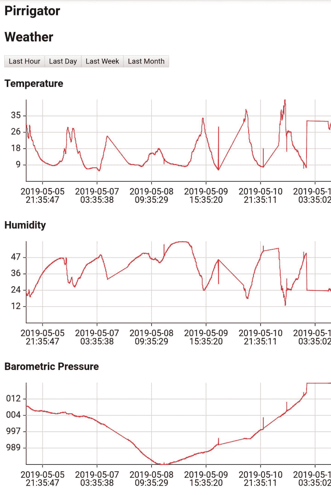

# Pirrigator，第 6 部分:一分钱一分货...

> 原文：<https://dev.to/neilgall/pirrigator-part-6-in-for-a-penny-2pde>

在我的上一篇文章中，我概述了如何通过 JSON API 收集、存储和提供所有数据。我转过身来看着制作一个查看数据的前端——我脑子里的想法一直是“画漂亮的图表！”-我不得不冒险进入网络开发，这是我真正的新手领域。我确实专业地做了六年的移动应用程序，所以我熟悉一些前端开发，我用 React 写了一些玩具，我尝试过 Elm，我可以在我目前的工作中对 Angular + Typescript UI 进行非常简单的更改，但除此之外，我已经远离 web 开发很多年了。

因此，最大的问题是我可以用什么技术来构建前端。我再次想到我学习 Rust 的最初目标，以及众所周知的事实，Rust 可以编译成 WebAssembly 并可以在浏览器中运行，但我不知道这种技术是否已经可以使用。我谷歌了一下“rust web 前端”,发现了这个主题的 Reddit 讨论。这又链接到 [Markus Kohlhase](https://github.com/flosse) 的优秀 [Rust web 框架比较](https://github.com/flosse/rust-web-framework-comparison#frontend-frameworks-wasm)文档。

不出所料，这个领域有很多活动。知道我想画图表后，我浏览了前端框架，寻找一个带有 SVG 示例的图表，唯一的一个是 [Draco](https://github.com/utkarshkukreti/draco) 。我花了一个晚上的时间浏览这些例子，并且从 Iron 服务器上提供了 SVG 时钟的例子。

我在这里做了一个可能很有趣的选择，没有向 web 服务器添加静态文件挂载，而是将我需要的三个文件的二进制 blobs 构建到服务器二进制文件中。我有两个原因。首先，部署很简单，因为总有一个文件要复制到设备上。第二，虽然我没有广泛分享地址，因为它运行在一个非常低端的设备上，离我家 20 米远的地方 wifi 连接很差，但端口是通过我的路由器对互联网开放的。将服务器可以访问的数据限制为 Rust 代码可以生成的数据，这似乎是最大化 Rust 安全声明的好处的一个好方法。一个方便的例子是 [lazy-static-include](https://lib.rs/crates/lazy-static-include) ,它将二进制 blobs 构建到发布版本中，但在运行时在调试版本中从源文件中加载它们。我确实在我的开发笔记本电脑上构建了这个应用程序，并禁用了硬件访问，因此我可以测试数据库和服务器端的东西，所以这给了我两个世界的最佳选择。

随着从 Iron webserver 成功地提供 SVG 时钟，我开始用自己的 UI 替换这个 UI，很快就遇到了麻烦。在加载 WASM blob 时，web 控制台显示某个`__wbg_error`处理程序的链接错误。我谷歌了一下这个，阅读了更多的 wasm-bindgen 指南，甚至浏览了源代码，但是没有找到。看起来 Draco 还没有达到一个成熟的水平来解决像简单调试这样的事情。

回到 Markus 的比较文档，我查看了单个 web 框架的*流行度*，意识到一开始忽略这一点有点像小学生的错误。最受欢迎的框架是 [Dodrio](https://github.com/fitzgen/dodrio) ，但是示例代码看起来太低级了，我不喜欢。我确实想要一些能够提供 Elm 和 React 所提供的那种抽象的东西。

下一个最受欢迎的框架是 [Seed](https://seed-rs.org/) ，我不得不说我真的印象深刻。文档很棒，以正确的顺序介绍了概念(尽管并不是所有的都是最新的)，API 也很好使用。这是从我编写的少量基于 Draco 的代码到使用 Seed 的直接翻译。很快，我就有了一个简单的用户界面，可以从服务器上查询大量的历史传感器数据，并在表格中显示出来。然后我开始编写一个 SVG 图表组件来绘制 2D 线图。几个小时后，我有了基本的图表！

[](https://res.cloudinary.com/practicaldev/image/fetch/s--R_JCxfOY--/c_limit%2Cf_auto%2Cfl_progressive%2Cq_auto%2Cw_880/https://thepracticaldev.s3.amazonaws.com/i/o6y9mctne8d45bi322bd.png)

我非常喜欢用 Seed 分解 UI 的方式。大致遵循 Elm 架构，在根上，UI 是一个模型，一个将模型转换成虚拟 DOM 树的视图函数，以及一个从消息更新模型的更新函数。为了分解成更小的单元，我真的希望这些单元按照它们自己的模型和消息工作，Seed 提供了工具来简化这一过程。

我把主界面分成了天气和传感器子模块。主模型变成

```
struct Model {
    weather: weather::Model,
    sensors: sensors::Model
} 
```

Enter fullscreen mode Exit fullscreen mode

顶层事件类型只是包装了可能的下层事件:

```
enum Message {
    Weather(weather::Message),
    Sensors(sensors::Message),
} 
```

Enter fullscreen mode Exit fullscreen mode

这个视图只是呈现子模块视图，关键的是，使用消息实例构造函数将子模块的事件类型映射到更高层的事件类型。

```
fn view(model: &Model) -> El<Message> {
    div![
        h1!["Pirrigator"],
        model.weather.render().map_message(Message::Weather),
        model.sensors.render().map_message(Message::Sensors)
    ]
} 
```

Enter fullscreen mode Exit fullscreen mode

更新反向工作，解开顶层消息，通过子模块传递底层消息，然后将结果包装回顶层结构。从根本上说，这是一个`fmap` :

```
fn update(msg: Message, model: &mut Model) -> Update<Message> {
    match msg {
        Message::Weather(msg) => model.weather.update(msg).map(Message::Weather),
        Message::Sensors(msg) => model.sensors.update(msg).map(Message::Sensors)
    }
} 
```

Enter fullscreen mode Exit fullscreen mode

这很棒，因为它允许您分解成自包含的单元，甚至可以将这些单元的多个实例实例化到更大的 UI 中。非常适合桌子、格子等。

因为数据来自服务器，所以天气模型本身就是一个枚举，表示数据可能处于的状态。

```
pub enum Model {
    NotLoaded,
    Loading,
    Loaded(Vec<WeatherRow>),
    Failed(String)
} 
```

Enter fullscreen mode Exit fullscreen mode

render 函数显示一个标题，一些按钮用于选择加载数据的时间范围，其余取决于数据状态:

```
pub fn render(&self) -> El<Message> {
    div![
        h2!["Weather"],
        button![simple_ev(Ev::Click, Message::Fetch(HOUR)), "Last Hour"],
        button![simple_ev(Ev::Click, Message::Fetch(DAY)), "Last Day"],
        button![simple_ev(Ev::Click, Message::Fetch(WEEK)), "Last Week"],
        button![simple_ev(Ev::Click, Message::Fetch(MONTH)), "Last Month"],
        match self {
            Model::NotLoaded =>
                p!["Select a time range"],
            Model::Loading =>
                p!["Loading..."],
            Model::Failed(e) =>
                p![e],
            Model::Loaded(data) =>
                div![
                    h3!["Temperature"],
                    chart(data, true, &|r| r.temperature).render().map_message(|_| Message::Fetch(HOUR)),
                    h3!["Humidity"],
                    chart(data, true, &|r| r.humidity).render().map_message(|_| Message::Fetch(HOUR)),
                    h3!["Barometric Pressure"],
                    chart(data, false, &|r| r.pressure).render().map_message(|_| Message::Fetch(HOUR))
                ]
        }
    ]
} 
```

Enter fullscreen mode Exit fullscreen mode

这段代码最好的一点是很难看出哪里可以写 bug。您只能在有数据要呈现的状态下呈现数据。您只能在错误状态中显示错误。有多少 ui 因为未能[使不可能的状态不可表示](https://www.youtube.com/watch?v=IcgmSRJHu_8)而犯了这个错误？。

chart 函数使用提供的 lambda 从天气数据中提取一个轴，并构建一个`Chart`子模型，然后立即进行渲染。与顶层一样，图表模块的消息随后被映射到天气模块消息中。现在，我的图表模块实际上并不产生任何消息，但是当它产生消息时，它已经一路深入到了根。

```
fn chart(data: &Vec<WeatherRow>, y_origin_zero: bool, f: &Fn(&WeatherRow) -> f64) -> chart::Chart {
    chart::Chart {
        width: 600,
        height: 200,
        y_origin_zero,
        data: data.iter().map(|r| chart::DataPoint { time: r.timestamp, value: f(r) }).collect()
    }
} 
```

Enter fullscreen mode Exit fullscreen mode

我不打算浏览图表代码。写起来很有趣，但是相当容易理解，因为它只是构建了一堆 SVG 元素。将数据缩放到 SVG 坐标需要一些算术运算(还要处理我的 X 轴由`SystemTime`对象组成的事实，但是 [chrono](https://github.com/chronotope/chrono) 机箱在这里非常有用)。

天气子模块的更新功能很有趣，因为它更新当前状态。为此，有必要取消对`&mut self`引用的引用:

```
pub fn update(&mut self, msg: Message) -> Update<Message> {
    match msg {
        Message::Fetch(t) => {
            *self = Model::Loading;
            Update::with_future_msg(self.fetch(t)).skip()
        }
        Message::Fetched(rows) => {
            *self = if rows.is_empty() { Model::NotLoaded } else { Model::Loaded(rows) };
            Render.into()
        }
        Message::Failed(e) => {
            *self = Model::Failed(e.as_string().unwrap_or("Unknown error".to_string()));
            Render.into()
        }
    }
} 
```

Enter fullscreen mode Exit fullscreen mode

sensors 模块的工作方式非常类似，但是它需要通过一个 API 调用获取传感器名称列表，然后分别获取每个名称的数据。按照同样的模式，我将所有这些状态编码到模型中。

在我和德拉科的错误开始后，这是一种快乐的工作。ui 本质上是有状态的，能够考虑并显式编码代码可能处于的完整状态集，这是对我们的巨大改进。除了将数据缩放到图表中的一些错误之外，总的来说这是一个“如果它编译成功”的场景。

在它启动和运行之前，只剩下两个主要组件。我有三个传感器，但只有两个水阀，因为我买的三个中有一个坏了。因此，我需要一些额外的配置来定义灌溉区，它们如何映射到传感器和阀门，以及一些应该如何加水的参数(例如，每天下午 6 点后，直到湿度读数达到一定的百分比)。然后是一个最终的后端模块来执行这个逻辑，并在数据库中存储灌溉事件，还有一个 UI 来显示每个区域何时添加了水。

最后要安装的组件是番茄植株。现在是五月中旬，我最好抓紧时间！

[GitHub](https://github.com/neilgall/pirrigator/)