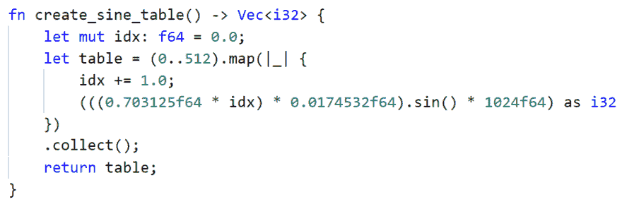

# 等离子体生锈:另一个网络组装实验

> 原文：<https://dev.to/jeremylikness/plasma-gets-rust-y-another-webassembly-experiment-10d2>

#### 使用 Rust 编译的 Wasm 构建等离子画布效果。

我一直在做项目，以便更好地学习和理解 [WebAssembly](https://webassembly.org/) (简称 Wasm)。使用等离子效果的 [JavaScript 实现](https://jsfiddle.net/jeremylikness/1xfh3c25/)作为“黄金标准”,我开始在 Wasm 中复制这个效果。我第一次尝试用的是围棋。你可以在这里阅读《T4》。在我的研究中，我发现 [Rust](https://www.rust-lang.org/) 是理想的测试语言，因为它已经被[专门优化](https://opensource.com/article/19/2/why-use-rust-webassembly)来构建 Wasm 模块。

👀观看现场演示[这里](https://blazorhealthapp.z5.web.core.windows.net/plasma-rust.html)🔗看完整的源代码[这里](https://github.com/JeremyLikness/PlasmaWasmRust)

> 声明:我不是一个资深的 Rust 程序员，所以随着时间的推移，我可能会发现代码可以以更好的方式编写/重构。如果我遇到这种情况，我会发布我的调查结果的后续。如果你有生锈的经验，我欢迎你的反馈。

带着我对 C 和 C++的预知，我开始学习这门语言，并掌握了另一个实验。

<figure> 

<figcaption>锈片</figcaption>

</figure>

### 设置环境

有几个步骤来设置您的环境，以构建 Rust 应用程序，并专门针对 WebAssembly。为了学习如何做，我遵循了优秀的在线书籍/教程:

🔗[Rust 和 WebAssembly 简介](https://rustwasm.github.io/book/introduction.html#rust--and-webassembly-)

我建议您从这里开始，这样会更容易理解我的解决方案中的活动部分:

##  [耶路撒冷](https://github.com/JeremyLikness) / [等离子风暴](https://github.com/JeremyLikness/PlasmaWasmRust)

### 用 Rust 编译的 WebAssembly 实现等离子体效果。

<article class="markdown-body entry-content container-lg" itemprop="text">

# 等离子 WASM 锈

这是我的`Go`实现的一个端口等离子锈。它用的是`wasm-pack-template`。检查 Azure 管道定义以了解构建细节。

<g-emoji class="g-emoji" alias="eyes" fallback-src="https://github.githubassets.cimg/icons/emoji/unicode/1f440.png">👀</g-emoji> [现场试玩](https://jlikme.z13.web.core.windows.net/wasm/PlasmaWasmRust)

对于完整的演练，请阅读:[等离子体生锈:另一个 WebAssembly 实验](https://blog.jeremylikness.com/plasma-gets-rust-y-another-webassembly-experiment-bde6abf3061c)。

> 这个库是使用免费的 Azure 管道不断构建和部署的。如果你对它是如何设置和配置为自动构建并部署到低成本 Azure 存储静态网站感兴趣，请阅读[使用 Azure 管道从 GitHub 部署 WebAssembly 到 Azure 存储静态网站](https://jlik.me/fzk)。

</article>

[View on GitHub](https://github.com/JeremyLikness/PlasmaWasmRust)

### 实现防锈代码

基于早期的实验，我选择在 Rust 中构建等离子体效果的数据，但在 JavaScript 中进行渲染。幸运的是，Rust 有一个非常成熟的 WebAssembly 环境，对两者之间的互操作提供了大量支持。在这里，我创建了一个结构来保存颜色信息和等离子体效果所需的数据。`#[wasm\_bindgen]`标签自动创建从 JavaScript 访问结构所必需的胶水。