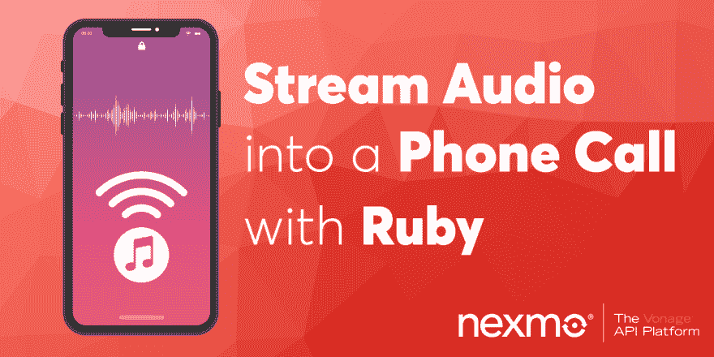

# 使用 Ruby 向电话播放流式音频

> 原文：<https://dev.to/vonagedev/play-streaming-audio-to-a-phone-call-with-ruby-2m43>

[](https://res.cloudinary.com/practicaldev/image/fetch/s--Q3LTAcns--/c_limit%2Cf_auto%2Cfl_progressive%2Cq_auto%2Cw_880/https://www.nexmo.com/wp-content/uploads/2019/01/Stream-Audio-into-a-Phone-Call-with-Ruby-1200x600.png)

## [T1】简介](#intro)

在本帖中，我们将探讨如何将音频文件流式传输到正在进行的电话通话中。将音频文件流式传输到呼叫中有许多用例，使用 Nexmo Voice API 和 Nexmo Ruby gem，这是一个相对简单的过程。无论你是想通过电话与人分享音乐，还是想分享工作会议的片段，你都可以通过几行 Ruby 和 Nexmo 来实现。

这篇博文的源代码可以在 GitHub 上找到。

## 先决条件

要阅读这篇文章，你需要:

*   一个 [Nexmo 账户](https://dashboard.nexmo.com/sign-up)
*   Ruby 2.5.3 或更新版本
*   宝石
*   [辛纳特拉](https://github.com/sinatra/sinatra)
*   Nexmo CLI

## 配置您的 Nexmo 账户和应用

让我们从购买一个可以用于测试的电话号码开始。我们将使用 Nexmo CLI 购买该号码。

```
nexmo number:buy --country_code US 
```

Enter fullscreen mode Exit fullscreen mode

请保存您刚刚购买的电话号码。我们将在代码中使用它。

我们还将使用 Nexmo CLI 创建一个新的应用程序。我们需要创建一个应用程序来使用语音 API。

```
nexmo app:create "Test Application 1" http://example.com/answer http://example.com/event --keyfile private.key 
```

Enter fullscreen mode Exit fullscreen mode

通过执行该命令，我们现在已经创建了一个名为“Test Application 1”的新应用程序，并定义了三个参数:

*   `answer_url`:我们的应用程序交付管理呼叫的 Nexmo 呼叫控制对象(NCCO)
*   `event_url`:当`call_status`改变时，Nexmo 异步发送事件信息
*   这是我们存储身份验证所需的私钥的地方。

我们将在代码中重新定义`answer_url`和`event_url`。值得注意的是，它们需要是 Nexmo 平台可以访问的**外部可访问的**URL。对于我们的本地安装，我们可以使用 ngrok 使我们的本地服务器对外可用。你可以在[这篇博文](https://www.nexmo.com/blog/2017/07/04/local-development-nexmo-ngrok-tunnel-dr/)中找到更多关于使用 Nexmo 和 ngrok 的信息。

`nexmo app:create`命令还为我们提供了一个应用程序 ID，我们稍后将在代码中使用它，以及我们获取的新电话号码。

## 设置我们的凭证

至此，我们已经获得了创建应用程序所需的信息。我们将创建一个 Sinatra web 服务器，为四个路由、三个`GET`请求和一个`POST`请求提供服务。`GET`请求发起电话呼叫，向 Nexmo 平台提供 NCCO 指令，并传输一个静默文件以保持呼叫畅通。一旦被应答，`POST`请求就将音频流式传输到呼叫。

要访问我们的 Nexmo 帐户并验证我们自己，我们需要提供正确的凭据。您应该注意安全地存储它们，并避免将它们签入源代码控制。在这个例子中，我们将使用`dotenv` gem 将我们的凭证存储为环境变量，并在我们的代码中相应地访问它们。我们首先创建一个名为`.env`的文件，并将以下内容放入其中:

```
NEXMO_API_KEY=
NEXMO_API_SECRET=
NEXMO_APPLICATION_ID=
NEXMO_APPLICATION_PRIVATE_KEY_PATH=private.key
NEXMO_TO_NUMBER=
NEXMO_NUMBER= 
```

Enter fullscreen mode Exit fullscreen mode

您的`NEXMO_API_KEY`和`NEXMO_API_SECRET`是在本演练开始时注册一个 Nexmo 帐户时提供给您的。您可以在您的[帐户设置](https://dashboard.nexmo.com/settings)中重新访问它们。您的`NEXMO_APPLICATION_ID`是当您使用 Nexmo CLI 创建新应用程序时返回给您的内容。同样，您的`NEXMO_APPLICATION_PRIVATE_KEY_PATH`是您在使用 CLI 初始化新应用程序时指定的文件的文件路径。在我们的例子中，它是`./private.key`。您的`NEXMO_NUMBER`是您购买的电话号码，`NEXMO_TO_NUMBER`是您希望拨打的电话号码。

如果你把这个提交给 GitHub，请确保创建一个`.gitignore`文件，并在其中添加`.env`，以确保你的证书不会被意外地发布到网上。

## 使用 Ruby 向通话发送流式音频

让我们创建一个名为`server.rb`的新文件，确保我们需要必要的依赖项并加载我们的`dotenv`环境变量:

```
require 'sinatra'
require 'nexmo'
require 'dotenv'
require 'json'

Dotenv.load 
```

Enter fullscreen mode Exit fullscreen mode

接下来，我们将利用这些凭证和 Nexmo gem 初始化一个新的 Nexmo 客户端实例。

```
client = Nexmo::Client.new(
  api_key: ENV['NEXMO_API_KEY'],
  api_secret: ENV['NEXMO_API_SECRET'],
  application_id: ENV['NEXMO_APPLICATION_ID'],
  private_key: File.read(ENV['NEXMO_APPLICATION_PRIVATE_KEY_PATH'])
) 
```

Enter fullscreen mode Exit fullscreen mode

至此，我们已经有了一个经过认证的 Nexmo 客户端实例，并定义了我们的流音频。我们遗漏了什么？当然是电话了！

首先，让我们获取我们的`ngrok`外部可访问的 URL，我们将使用该 URL 使我们的服务器对 Nexmo 可用，以接收我们的呼叫指令并向其发送呼叫状态更新。一旦你安装了`ngrok`，打开一个新的控制台窗口，从命令行执行`ngrok http 4567`。这将在端口 4567 上启动一个新的`ngrok`服务器，与我们的 Sinatra 服务器并行，后者也运行在端口 4567 上。您将会看到一个显示给您的状态，它包含在`Forwarding`参数下的`ngrok` URL。继续将该 URL 复制并粘贴到`server.rb`中的`BASE_URL`常量变量中。

```
BASE_URL = 'PASTE URL HERE' 
```

Enter fullscreen mode Exit fullscreen mode

当我们定义变量时，让我们继续设置流式音频文件的路径，我们将它定义为一个`CONSTANT`变量。

```
AUDIO_URL = "#{BASE_URL}/voice_api_audio_streaming.mp3" 
```

Enter fullscreen mode Exit fullscreen mode

我们现在可以创建一个到`/new`的 URL 路径，当被访问时将开始电话呼叫。

```
get '/new' do
  response = client.calls.create(
    to: [{ type: 'phone', number: ENV['NEXMO_NUMBER'] }],
    from: { type: 'phone', number: ENV['NEXMO_TO_NUMBER'] },
    answer_url: ["#{BASE_URL}/answer"],
    event_url: ["#{BASE_URL}/event"]
  )
  puts response.inspect
end 
```

Enter fullscreen mode Exit fullscreen mode

上面的`get /new`动作使用提供的`to:`、`from:`、`answer_url:`和`event_url:`参数创建了一个新的电话呼叫。

`to:`和`from:`参数需要一个`type`和一个`number`。在我们的例子中，两者的`type`是`phone`。`answer_url`和`event_url`需要是外部可访问的 URL，Nexmo 平台可以分别从其接收指令和向其发送呼叫状态更新。

一旦我们发起电话呼叫，Nexmo 访问`answer_url`路径寻找呼叫指令。我们也需要创建那个动作。该操作将以 JSON 的形式呈现和交付指令。这些指令提供了`action`，一个无声音频文件的 URL 路径，该文件将在后台播放并保持连接打开，还有一个`loop`参数，我们将其设置为`0`。

```
get '/answer' do
    # Provide the Nexmo Call Control Object (NCCO) as JSON to the Nexmo Platform
    content_type :json
    [{ :action => 'stream', :streamUrl => ["#{BASE_URL}/stream/silent"], :loop => 0 }].to_json
end 
```

Enter fullscreen mode Exit fullscreen mode

此时，我们需要再创建一个`GET`路径来传递我们在 NCCO 指令中指定的无声音频文件:

```
get '/stream/silent' do
    # Stream a silent file in the background to keep the call open
    send_file File.join(settings.public_folder, 'silence.mp3')
end 
```

Enter fullscreen mode Exit fullscreen mode

最后，我们还创建了一个到`/event`的`POST`路径，该路径接收来自 Nexmo 平台的呼叫状态，并在应答后发送流音频。该操作解析接收到的数据，并使用`status`参数来确定呼叫何时被应答。呼叫的状态从`started`变为`ringing`，然后变为`answered`，最后当它断开时变为`completed`。一旦`status`到达`answered`，我们的代码就会播放音频文件。我们还从接收到的数据中接收到该呼叫的唯一标识符`uuid`，这是我们将流式音频注入该特定呼叫所必需的。

```
post '/event' do
  data = JSON.parse(request.body.read)
  response = client.calls.stream.start(data['uuid'], stream_url: [AUDIO_URL]) if data['status'] == 'answered'
  puts response.inspect
end 
```

Enter fullscreen mode Exit fullscreen mode

因此，通过这个`POST`动作，我们已经完成了应用程序的创建。现在，我们只需要从命令行运行`ruby server.rb`来启动我们的服务器，并确保我们初始化了 ngrok 以使我们的本地服务器可以被外部访问。一旦完成，继续从你的网络浏览器导航到`http://localhost:4567`，你就会接到电话。当您接听电话时，音频将开始流动。

## 结论

在大约 40 行代码中，我们创建了一个功能完整的 web 服务器，它可以呼叫任何电话号码，并在呼叫中播放音频流。使用 Nexmo Voice API 可以做更多的事情，您可以在 [Nexmo 开发人员平台](https://developer.nexmo.com/voice/voice-api/overview)上完全探索它。

如果你对这篇文章有任何疑问，欢迎发送电子邮件给[devrel@nexmo.com](mailto:devrel@nexmo.com)或[加入 Nexmo 社区 Slack 频道](https://developer.nexmo.com/community/slack)，我们在那里等待并准备好提供帮助。