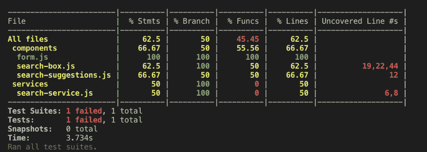

# 开玩笑

> 原文：<https://dev.to/calflan/playing-withjest-5hdn>

[](https://res.cloudinary.com/practicaldev/image/fetch/s--TzUYyZEU--/c_limit%2Cf_auto%2Cfl_progressive%2Cq_auto%2Cw_880/https://thepracticaldev.s3.amazonaws.com/i/jmgr4mv7gzs7s6kqxcsf.png)

我最近开始玩 Jest 来取乐，看看它与我通常用来测试我的 React 组件的堆栈(Jasmine(用酶)和作为测试运行程序的 Karma)相比如何。我听说过很多关于 Jest 以及它如何基本上完成 Jasmine 所做的所有事情的好消息(因为它是基于 Jest 的)…现在脸书已经对它进行了修改，并在它的基础上扩展了 Jasmine 的功能。

## 快捷方便

当我从头开始构建一个应用程序时，我注意到的 Jest 的第一个也是最有用的优点之一是，我能够快速地设置它并继续编写测试。以前我不得不安装 Jasmine，然后安装 Karma，还有 Karma 的配置文件，你必须弄乱它们。有了玩笑，事情就简单多了。简单地 npm i jest，然后在 npm 测试脚本中将 jest 命令添加到 package.json 中，如下所示:

```
"scripts": {
  "test": "jest --coverage"
} 
```

你就完了。运行测试也快得离谱，因为您不再需要启动调用 Karma 的 Node.js 进程。

你可能已经注意到在我的`package.json`中添加了与`jest`命令配对的`--coverage`。这允许您拥有完整的代码覆盖，因此当您运行您的测试时，您应该得到如下所示的输出:

[](https://res.cloudinary.com/practicaldev/image/fetch/s--VRJOUE2---/c_limit%2Cf_auto%2Cfl_progressive%2Cq_auto%2Cw_880/https://thepracticaldev.s3.amazonaws.com/i/awhw40xb5v5d8bdgtwv7.png)

现在，您可以在最底部看到 Jest 运行了一个测试套件，该套件由于这样或那样的原因而失败，但在它上面可能会有一个指示，说明某些测试失败的原因。在上表中，它详细说明了我的代码有多少已经测试过，有多少没有测试过。所以有可能是一些未测试的代码导致了我的测试失败。它还将这些数据保存为一个可以在浏览器中打开的文件，在浏览器中可以准确地看到哪些代码行没有在任何组件中进行测试。太棒了。所有值和您所要做的就是将- coverage 追加到 jest 命令中。注意:你也可以用 Karma 来做这件事，但是我认为这还是值得一提的，因为我们已经在谈论测试了！

## 熟悉度

关于它的第二个很酷的事情，尤其是如果你像我一样从 Jasmine(用 Enzyme)过渡的话，就是你仍然可以用和 Jasmine 完全一样的方式写测试，并且用它使用所有相同的工具(就我目前所见)。这意味着你心爱的酶“山”和“浅”仍然可以被调用…

### 酵素仍是你的朋友

有了 Jest，你仍然可以使用 AirBnB 广受欢迎的 React 测试工具——酵素。Enzyme 做了很多很酷的事情，但我想提到的一件很酷的事情是它允许你在测试中浅层渲染组件的能力。浅层渲染一个组件基本上意味着你只渲染组件本身，而不是它的所有子组件。这对于 Jest 的最佳特性(在我看来)特别有用——快照测试，我很快就会谈到。
如果你要使用 Enzyme，你可能需要建立一个`jestsetup.js`文件。这里是我的样子:

```
import Enzyme, { shallow, mount } from 'enzyme';
import Adapter from 'enzyme-adapter-react-16';

Enzyme.configure({ adapter: new Adapter()});

global.shallow = shallow;
global.mount = mount; 
```

这不是使用 enzyme 的必要条件，但是如果您希望能够在测试中使用 shallow 和 mount 方法，而不必每次都导入它们，那么这就是如何在全局范围内共享它们。

除此之外，在你的`package.json`中，你需要告诉 Jest 这个安装文件在哪里，就像这样:

```
"jest": {
  "setupFiles": [
    "./tests/unit/jestsetup.js"
  ],
  "snapshotSerializers": [
    "enzyme-to-json/serializer"
  ]
} 
```

## 快照测试

开玩笑地说，快照测试让 Jasmine 的转变变得有价值。随着快速设置和您现在可以消除 Karma 的事实，在 Jest 中编写快照测试是非常简单和快速的。简而言之，快照测试将基本上捕获组件的整个输出(因此浅层渲染在这里是有用的)，然后当测试运行时，它将把捕获的内容与实际输出进行比较。所以你覆盖了组件中代码的每一个区域。

## 失败的快照

如果快照测试由于代码中的错误而失败，这将很容易被测试发现。因此，我们只需修复问题，重新运行测试，并检查快照测试是否再次通过。但是，您可能会想，如果对组件中的代码进行了更改，会发生什么情况呢？快照不会过期吗？是的，但是 Jest 有一个解决方案。有时，由于代码中的有意更改，快照测试可能会失败，因为更新组件的快照不再与测试的原始快照匹配。要解决这个问题，只需运行 jest - updateSnapshot 命令，快照就会更新。当然，这是你必须小心的地方，不要为仍然有错误行为的组件记录快照。因此，只有当你对代码中不再有 bug 感到满意时才更新你的快照，也就是说，你的单元测试通过了。

## 多次快照测试

在玩 Jest 的时候，我创建了一个应用程序，允许用户在搜索框中输入搜索词，然后这个搜索框点击一个 API 端点并返回一些结果。然后，我使用 props 将这些结果传递给另一个组件，并在那里显示它们(一个搜索结果组件)。因此，我的组件会有几种不同的状态，这取决于它是否填充了来自 API 的数据。因此，结合这一点，Jest 允许我进行多个快照测试，以适应组件的不同状态。一个例子可能如下:

```
it('matches snapshot', () => {
  //Assertions here
});

//Then another test for when the component has props >>>>

it('matches snapshot after receiving props', () => {
  //Assertions here
}); 
```

## 我接下来打算看什么

我还没有深入研究 Jest 中的嘲弄是如何工作的，但是如果我的假设是正确的，我应该仍然能够使用 Jasmine spy 进行嘲弄——因为 Jest 允许您使用其他 Jasmine 约定。