# PMS5003ST 仪表板

> 原文：<https://dev.to/mrchoke/pms5003st-dashboard-424f>

#### Arduino IDE，节点板，PMS5003ST，WebSocket，VueJs，和 SPIFFS

<figure>[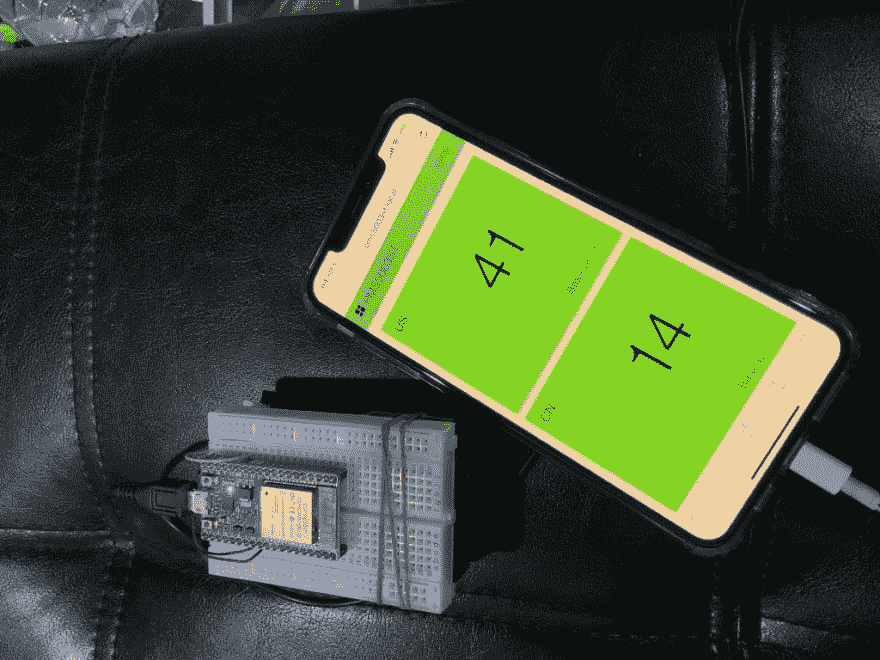](https://res.cloudinary.com/practicaldev/image/fetch/s--AvoyVaG4--/c_limit%2Cf_auto%2Cfl_progressive%2Cq_auto%2Cw_880/https://cdn-images-1.medium.com/max/1024/1%2A2rLEP9tWsndzzHn5Brh5Gg.jpeg)

<figcaption>【aqi】，由 Lib 编写的人计算为</figcaption>

</figure>

。

我的描述可能不太详尽，因为这段时间很少，而且是个初学者，很多故事都是这样的。

上次记录了 WebServer 在为 ESP32 系列 MCU 制作 Dashboatd 时的使用情况，在此过程中，我想到了一个有趣的主意，想把一个大工具塞进 tab 中。

[https://www.youtube.com/embed/4vR5PxSzSaQ](https://www.youtube.com/embed/4vR5PxSzSaQ)

### 工具

*   [espasync web server](https://github.com/me-no-dev/ESPAsyncWebServer)→**Arduino/libraries**
*   [ESPAsyncTCP](https://github.com/me-no-dev/ESPAsyncTCP)→**Arduino/libraries**
*   [Arduino-esp 32 fs-plugin](https://github.com/me-no-dev/arduino-esp32fs-plugin)→**Arduino/tools**
*   [vuejs](https://vuejs.org)→【JavaScript 框架设计器】用于编写 UI
*   SPIFFS →将仪表板放在这里而不是嵌入到代码中

### 示例代码

```
[https://github.com/mrchoke/ESP32\_PMS5003ST\_Dashboard](https://github.com/mrchoke/ESP32_PMS5003ST_Dashboard) 
```

Enter fullscreen mode Exit fullscreen mode

#### 将包含 3 个 dir

*   APMODE →示例使用与上一步相同的访问点模型
*   客户端→连接到 WiFi，我使用两种类型:WPA2 企业到移动 Wifi
*   DashboardVueJs →它将是 VueJs 的源代码，它使用 lib，并且示例来自很多可能不太漂亮的地方:p

它会有一点额外的方法:上传文件到 SPIFFS 中，安装在 web 上，没什么棘手的。

**Plantower PMS5003ST**

<figure>[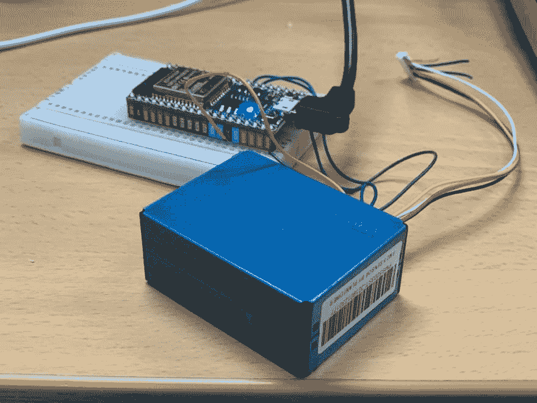](https://res.cloudinary.com/practicaldev/image/fetch/s--U2XjR3Qm--/c_limit%2Cf_auto%2Cfl_progressive%2Cq_auto%2Cw_880/https://cdn-images-1.medium.com/max/1024/1%2Aq8gW7259lphmR0bSWCxlDg.jpeg)

<figcaption>PMS 5003 ST</figcaption>

</figure>

你的 PMS5003ST 刚来看过才艺表演很有意思

*   PM 1 值 0 2.5 和 10μg/m㎡提供了两个 CF1 和 ATO 值，我仍然不知道该取哪一个值，因为这两个值外的测量时间是足够不同的，但是如果牛。
*   每种尺寸 0 的粉尘量值。3 0.5 1.0 2.5 5 10 这将包含 pcs / dl 值
*   甲醛的单位是 mg/mг，通常这个值在空气中很少，除非实验室里有溶剂，指甲油，钢笔，写字板。
*   购买的体温似乎低于实际值约 3 度
*   相对于房间里的空气净化器来说，它的购买价值是相当不同的，但并不多。

### PMS5003ST 库

我用这个人的
的东西

```
[https://github.com/i3water/Blinker\_PMSX003ST](https://github.com/i3water/Blinker_PMSX003ST) 
```

Enter fullscreen mode Exit fullscreen mode

在那里计算完成了 aqi。git clone 来了，把它放在库中，然后把我的代码放到运行中。

### 草图样本

#### APMODE

```
/\*\*
 \* Test by MrChoke
 \* APMODE
 \*\*/

#include \<WiFi.h\>
#include \<WebServer.h\>
#include \<ESPmDNS.h\>
#include \<SPIFFS.h\>
#include \<AsyncTCP.h\>
#include \<ESPAsyncWebServer.h\>

#include "BLINKER\_PMSX003ST.h"

//pin (RX16,TX17)
HardwareSerial pmsSerial(2);

BLINKER\_PMSX003ST pms;

const char \* domain = "pms5003st";

const char\* ssid = domain;
const char\* password = "1234567890";

unsigned long Timer1;

AsyncWebServer server(80);
AsyncWebSocket ws("/ws");

// Read CPU Temp

#ifdef \_\_cplusplus
extern "C" {
#endif
uint8\_t temprature\_sens\_read();
#ifdef \_\_cplusplus
}
#endif
uint8\_t temprature\_sens\_read();

// WebSocket

void onWsEvent(AsyncWebSocket \* server, AsyncWebSocketClient \* client, AwsEventType type, void \* arg, uint8\_t \*data, size\_t len){
 if(type == WS\_EVT\_CONNECT){
 Serial.printf("ws[%s][%u] connect\n", server-\>url(), client-\>id());
 client-\>text(JsonPMS());
 } else if(type == WS\_EVT\_DISCONNECT){
 Serial.printf("ws[%s][%u] disconnect: %u\n", server-\>url(), client-\>id());
 } else if(type == WS\_EVT\_ERROR){
 Serial.printf("ws[%s][%u] error(%u): %s\n", server-\>url(), client-\>id(), \*((uint16\_t\*)arg), (char\*)data);
 } else if(type == WS\_EVT\_PONG){
 client-\>text(JsonPMS());
 Serial.printf("ws[%s][%u] pong[%u]: %s\n", server-\>url(), client-\>id(), len, (len)?(char\*)data:"");
 } else if(type == WS\_EVT\_DATA){
 // not implement yet
 }
}

// Start Sensor

void StartPMS(){
 Serial.println(F("\nStart"));

pmsSerial.begin(9600);
 pms.begin(pmsSerial);
 // pms.wakeUp();
 pms.setMode(PASSIVE);
 Serial.println(F("PMS5003ST Start.."));

}

// Read into Json

String JsonPMS(){
 pms.request();
 if(!pms.read()){
 return "{\"status\":\"error\"}";
 }
 String data = "{";
 data += "\"system\": [";
 data += "{\"name\": \"temp\",\"val\":" + String((temprature\_sens\_read() - 32) / 1.8) + "}";
 data += ",{\"name\":\"mem\",\"val\":\"" + String(esp\_get\_free\_heap\_size()/1024) +" KB\"}";
 data += "]";
 data += ",\"aqi\": [";
 data += "{\"name\":\"us\",\"val\":" + String(pms.getAQI(AQI\_BASE\_US)) + ",\"level\":" + String(pms.getAQILevel(AQI\_BASE\_US)) + ",\"base\":\"" + String(pms.getMainPollu(AQI\_BASE\_US)) +"\"}";
 data += ",{\"name\":\"cn\",\"val\":" + String(pms.getAQI(AQI\_BASE\_CN)) + ",\"level\":" + String(pms.getAQILevel(AQI\_BASE\_CN)) + ",\"base\":\"" + String(pms.getMainPollu(AQI\_BASE\_CN)) +"\"}";
 data += "]";
 data += ",\"cf1\": [";
 data += "{\"name\":\"pm1.0\",\"val\":" + String(pms.getPmCf1(1)) +"}";
 data += ",{\"name\":\"pm2.5\",\"val\":" + String(pms.getPmCf1(2.5)) +"}";
 data += ",{\"name\":\"pm10.0\",\"val\":" + String(pms.getPmCf1(10)) +"}";
 data += "]";
 data += ",\"ato\": [";
 data += "{\"name\":\"pm1.0\",\"val\":" + String(pms.getPmAto(1)) +"}";
 data += ",{\"name\":\"pm2.5\",\"val\":" + String(pms.getPmAto(2.5)) +"}";
 data += ",{\"name\":\"pm10.0\",\"val\":" + String(pms.getPmAto(10)) +"}";
 data += "]";
 data += ",\"pcs\": [";
 data += "{\"name\":\"pcs0.3\",\"val\":" + String(pms.getPcs(0.3)) +"}";
 data += ",{\"name\":\"pcs0.5\",\"val\":" + String(pms.getPcs(0.5)) +"}";
 data += ",{\"name\":\"pcs1.0\",\"val\":" + String(pms.getPcs(1)) +"}";
 data += ",{\"name\":\"pcs2.5\",\"val\":" + String(pms.getPcs(2.5)) +"}";
 data += ",{\"name\":\"pcs5.0\",\"val\":" + String(pms.getPcs(5)) +"}";
 data += ",{\"name\":\"pcs10.0\",\"val\":" + String(pms.getPcs(10)) +"}";
 data += "]";
 data += ",\"env\": [";
 data += "{\"name\":\"formaldehyde\",\"val\":\"" + String(pms.getForm())+"\"}";
 data += ",{\"name\":\"temp\",\"val\":\"" + String(pms.getTemp())+"\"}";
 data += ",{\"name\":\"humidity\",\"val\":\"" + String(pms.getHumi())+"\"}";
 data += "]";
 data += ",\"network\": [";
 data += "{\"name\":\"mac\",\"val\":\"" + String(WiFi.macAddress())+"\"}";
 data += ",{\"name\":\"ip\",\"val\":\"" + (WiFi.softAPIP()).toString() +"\"}";
 data += "]";

 data += "}";
 return data;
 data = String();
}

// Start mDNS

void StartDNS() {
 if (!MDNS.begin(domain)) {
 Serial.println("Error setting up MDNS responder!");
 while(1) {
 delay(1000);
 }
 }
 Serial.println("mDNS responder started");
 MDNS.addService("http", "tcp", 80);
}

//Start WebServer and WebSocket

void StartWeb(){
 ws.onEvent(onWsEvent);
 server.addHandler(&ws);

// Test Scan WiFi
 server.on("/scan", HTTP\_GET, {
 String json = "[";
 int n = WiFi.scanComplete();
 if(n == -2){
 WiFi.scanNetworks(true,true);
 } else if(n){
 for (int i = 0; i \< n; ++i){
 if(i) json += ",";
 json += "{";
 json += "\"rssi\":"+String(WiFi.RSSI(i));
 json += ",\"ssid\":\""+WiFi.SSID(i)+"\"";
 json += ",\"bssid\":\""+WiFi.BSSIDstr(i)+"\"";
 json += ",\"channel\":"+String(WiFi.channel(i));
 json += ",\"secure\":"+String(WiFi.encryptionType(i));
 json += "}";
 }
 WiFi.scanDelete();
 if(WiFi.scanComplete() == -2){
 WiFi.scanNetworks(true);
 }
 }
 json += "]";
 request-\>send(200, "application/json", json);
 json = String();
 });

server.serveStatic("/", SPIFFS, "/").setDefaultFile("index.html");
 server.onNotFound({
 Serial.printf("NOT\_FOUND: ");
 if(request-\>method() == HTTP\_GET)
 Serial.printf("GET");
 else if(request-\>method() == HTTP\_POST)
 Serial.printf("POST");
 else if(request-\>method() == HTTP\_DELETE)
 Serial.printf("DELETE");
 else if(request-\>method() == HTTP\_PUT)
 Serial.printf("PUT");
 else if(request-\>method() == HTTP\_PATCH)
 Serial.printf("PATCH");
 else if(request-\>method() == HTTP\_HEAD)
 Serial.printf("HEAD");
 else if(request-\>method() == HTTP\_OPTIONS)
 Serial.printf("OPTIONS");
 else
 Serial.printf("UNKNOWN");
 Serial.printf(" http://%s%s\n", request-\>host().c\_str(), request-\>url().c\_str());

if(request-\>contentLength()){
 Serial.printf("\_CONTENT\_TYPE: %s\n", request-\>contentType().c\_str());
 Serial.printf("\_CONTENT\_LENGTH: %u\n", request-\>contentLength());
 }

int headers = request-\>headers();
 int i;
 for(i=0;i\<headers;i++){
 AsyncWebHeader\* h = request-\>getHeader(i);
 Serial.printf("\_HEADER[%s]: %s\n", h-\>name().c\_str(), h-\>value().c\_str());
 }

int params = request-\>params();
 for(i=0;i\<params;i++){
 AsyncWebParameter\* p = request-\>getParam(i);
 if(p-\>isFile()){
 Serial.printf("\_FILE[%s]: %s, size: %u\n", p-\>name().c\_str(), p-\>value().c\_str(), p-\>size());
 } else if(p-\>isPost()){
 Serial.printf("\_POST[%s]: %s\n", p-\>name().c\_str(), p-\>value().c\_str());
 } else {
 Serial.printf("\_GET[%s]: %s\n", p-\>name().c\_str(), p-\>value().c\_str());
 }
 }

request-\>send(404);
 });

// for dev
 DefaultHeaders::Instance().addHeader("Access-Control-Allow-Origin", "\*");
 server.begin();
}

// Start Access Point

void StartWiFi(){
 Serial.println();
 Serial.println();
 Serial.print(F("Configuring access point... "));
 Serial.println(ssid);

 WiFi.softAP(ssid, password);
 WiFi.softAPsetHostname(domain);
 Serial.printf("AP IP address: %s\n",WiFi.softAPIP().toString().c\_str());
}

void setup() {
 Serial.begin(115200);
 // mount FS
 if(!SPIFFS.begin()){
 Serial.println("SPIFFS Mount Failed");
 }
 StartPMS();
 delay(500);
 StartWiFi();
 StartWeb();
 StartDNS();
}

void loop() {

// if has Client Sent them all every 3sec

 if (millis() - Timer1 \>= 3000) {
 Timer1 = millis();
 if(ws.count()) {
 // Serial.println(ws.count());
 ws.textAll(JsonPMS());
 }

 }

} 
```

Enter fullscreen mode Exit fullscreen mode

#### 所用技术

除了需要的传感器 lib 之外，还提供了一种技术，它是这个 ESPAsyncWebServer 的 lib，它的功能比 ess 的 webserver lib 更丰富。

```
server.serveStatic("/", SPIFFS, "/").setDefaultFile("index.html"); 
```

Enter fullscreen mode Exit fullscreen mode

我把它放在 upload 上了。我可以从这里开始阅读，把它定义为 index。html 完全可以和其他静态文件 gzip 进行缩小，这可以看出我可以把 VueTifyJs 作为一个简单的例子，但它需要削减容量。

除了 SPIFFS 方便之外，它还可以制作成 WebSocket 和事件源，如果它要播放的话，它会更有趣。在【233】中试着写。

```
onWsEvent() 
```

Enter fullscreen mode Exit fullscreen mode

我刚学会用一个简单的方法:当我第一次接触的时候，我把价值发给你。

```
void loop() {

// if has Client Sent them all every 3sec

 if (millis() - Timer1 \>= 3000) {
 Timer1 = millis();
 if(**ws.count()**) {
 // Serial.println(ws.count());
**ws.textAll(JsonPMS());**
 }

 } 
```

Enter fullscreen mode Exit fullscreen mode

如果没有连接，它就不会将值发送出去。

### 骨牌

经过一段时间的研究，我选择了在 SPIFFS 中存储 html 文件的方法，而不是声明变量，但还需要一点额外的方法，即必须坚持。com/me-no-dev/arduino-esp32fs-plugin 然后按照说明进行安装

1.  转到“releases”页面
2.  选择 zip 格式的最新版本。
3.  看看在我们的 arduino 目录中是否有目录工具，如果没有，就创建一个添加。
4.  进入工具并破解那里的 zip
5.  关闭--重新打开 arduino ide
6.  在“工具”菜单上查看它会看到菜单上的增量

<figure>t1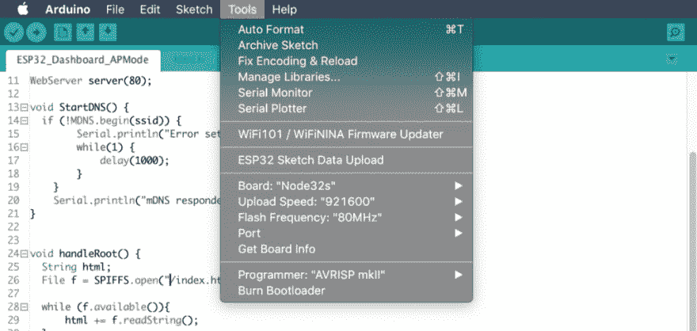T2

<figcaption>菜单 ESP32 草图数据上传增加</figcaption>

</figure>

。

### 文件上传

如何将文件存储在 spiffs 中，让我们在项目中创建一个名为 data 的目录，然后将设计的 html 文件放在存储中。当我们调用此菜单时，它将

<figure>[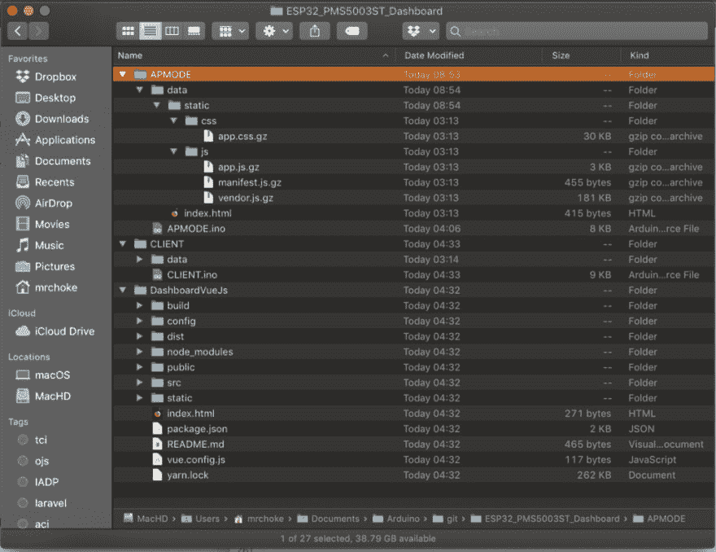](https://res.cloudinary.com/practicaldev/image/fetch/s--EvdCqMG2--/c_limit%2Cf_auto%2Cfl_progressive%2Cq_auto%2Cw_880/https://cdn-images-1.medium.com/max/1024/1%2AhhwUqpNnD92CbqtTBM1MYg.png) 

<figcaption>【项目结构】t5⾹T6⾹。</figcaption>

</figure>

当网页设计完成并完成 gzip 时，让我们通过点击
菜单来上传更多的文件。

```
Tools -\> ESP32 Sketch Data Upload 
```

Enter fullscreen mode Exit fullscreen mode

> 如果我们打开序列监视器或序列监视器，可能是 error，请先关闭它。

存储在 SPIFFS 中的文件将保留，即使我们重新上传了几个或更多的草图，因此，如果我们不更改页面，也不需要频繁上传。

### 仪表盘

在我使用的示例中，这将是一个 VueJs + VueTifyJs 和 WebSocket，可以通过源代码示例进行研究，对人们来说可能不是很完整。

#### dev 仪表板法

进入 Dashboard 目录，为 dev
安装各种软件包。

```
yarn install 
```

Enter fullscreen mode Exit fullscreen mode

首先完成我的上传草图，以便 WebSocket 在 MCU 内部启动，然后开发人员可以通过可能的方式与 MCU 保持联系。js〔t0〕型

```
let hname = process.env.NODE\_ENV === 'production' ? location.host : 'pms5003st.local'; 
```

Enter fullscreen mode Exit fullscreen mode

如果无法通过 mDNS 找到主机名，请更换 pms5003st。本地是 MCU 的 IP，而不是

设置完成后，请尝试
。

```
yarn dev 
```

Enter fullscreen mode Exit fullscreen mode

要在 dev 模式下运行 dashboard，如果没有碰撞端口，它可以通过
方式从 web 浏览器进入。

```
http://localhost:8080 
```

Enter fullscreen mode Exit fullscreen mode

如果 Dashboard 能够与 MCU 保持联系，那么我们应该有一个值来显示它。如果它还不能获取数据，请尝试查看 IP 和查看 MCU 是否正常工作。

<figure>[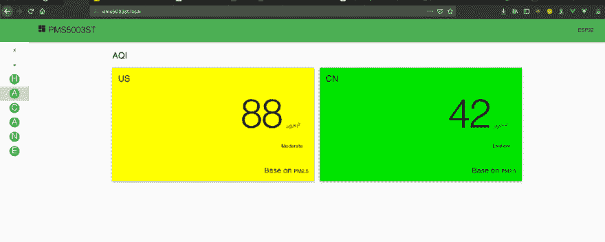](https://res.cloudinary.com/practicaldev/image/fetch/s--QM0SBymE--/c_limit%2Cf_auto%2Cfl_progressive%2Cq_auto%2Cw_880/https://cdn-images-1.medium.com/max/1024/1%2AejkQ3WStQS2H7tAi4paMaw.png) 

<figcaption>登陆页面</figcaption>

</figure>

<figure>[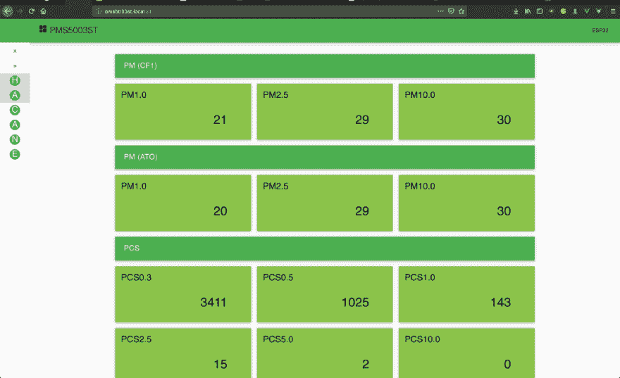](https://res.cloudinary.com/practicaldev/image/fetch/s--ASIJ-Ka7--/c_limit%2Cf_auto%2Cfl_progressive%2Cq_auto%2Cw_880/https://cdn-images-1.medium.com/max/1024/1%2AeOy6SruRzR-ESxpUqydOiQ.png) 

<figcaption>页面包括接收的各种值</figcaption>

</figure>

。

一旦我们完成了定制，它就提供了构建产品

。

```
yarn build 
```

Enter fullscreen mode Exit fullscreen mode

请注意，这个尺寸不要太大，后面的 gzip 不应超过 2M。当构建完成后，web 将被保存在 dist 中。让所有的 copy 在这里输入。去吧。

```
cd data
gzip -9 -r static 
```

Enter fullscreen mode Exit fullscreen mode

完成后，关闭序列监视器，上传到 spiffs 上，然后执行测试呼叫。

<figure>[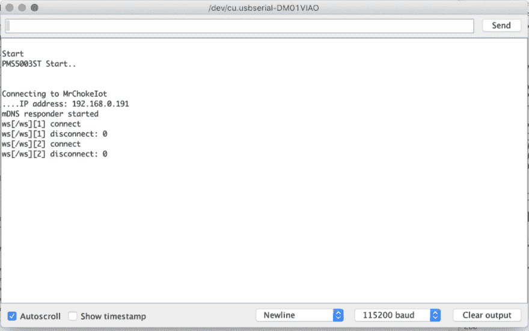](https://res.cloudinary.com/practicaldev/image/fetch/s--kpuKZzHl--/c_limit%2Cf_auto%2Cfl_progressive%2Cq_auto%2Cw_880/https://cdn-images-1.medium.com/max/1024/1%2AlOCOn9Oqfxe2s-H56cL-vg.png) 

<figcaption>通过串行监视程序中显示的 IP 输入</figcaption>

</figure>

。

<figure>[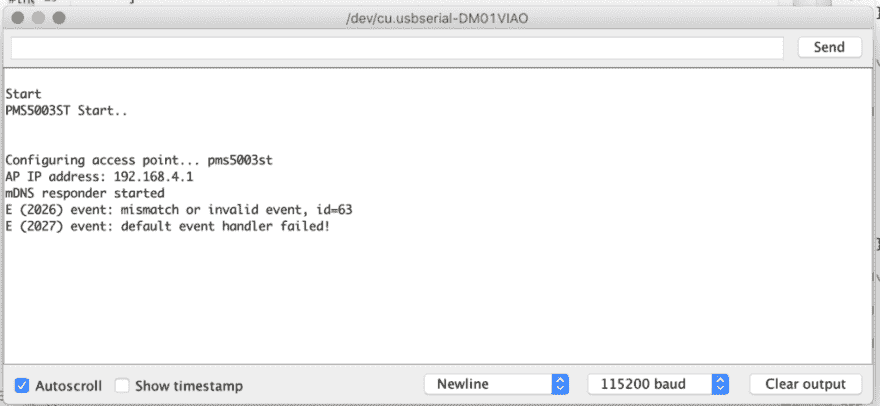](https://res.cloudinary.com/practicaldev/image/fetch/s--0qAt1e7_--/c_limit%2Cf_auto%2Cfl_progressive%2Cq_auto%2Cw_880/https://cdn-images-1.medium.com/max/1024/1%2A6vij5PdgYVgCELCxe9IBnA.png)

<figcaption>AP mode IP defaultจะเป็น192 . 168 . 4 . 1</figcaption>

</figure>

```
[http://mcu\_ip](http://mcu_ip) 
```

Enter fullscreen mode Exit fullscreen mode

或者

```
http://pms5003st.local 
```

Enter fullscreen mode Exit fullscreen mode

在某些网络中，通过名称的调用可能会受到限制，例如，如果网络限制访问，则可能无法调用，但就测试而言，如果释放 APMODE，则调用该名称。

[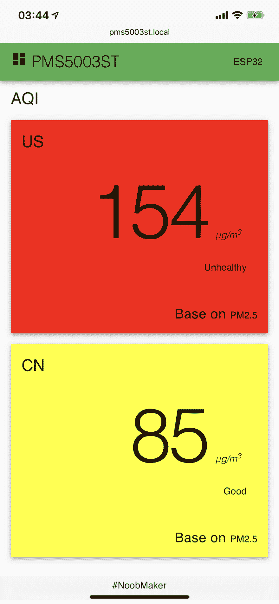](https://res.cloudinary.com/practicaldev/image/fetch/s--xKCQIbg_--/c_limit%2Cf_auto%2Cfl_progressive%2Cq_auto%2Cw_880/https://cdn-images-1.medium.com/max/1024/1%2A4NTnGX6RwTeiMCB8lRWH7g.png)

[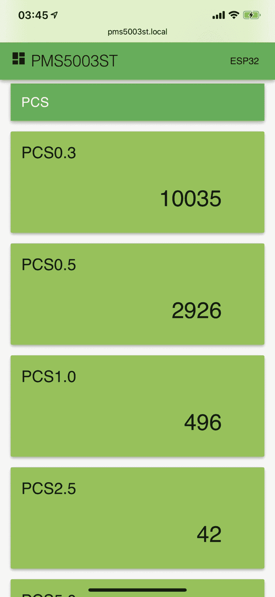](https://res.cloudinary.com/practicaldev/image/fetch/s--ADfDBjS---/c_limit%2Cf_auto%2Cfl_progressive%2Cq_auto%2Cw_880/https://cdn-images-1.medium.com/max/1024/1%2AmQ-B72Vfs_sIZjInoW-7yw.png)

[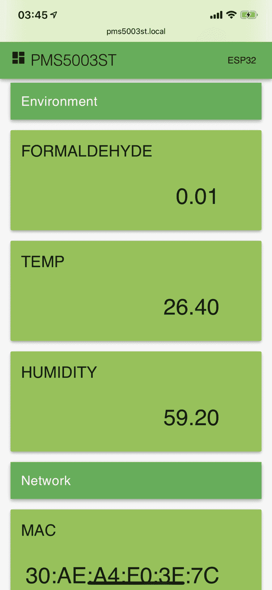](https://res.cloudinary.com/practicaldev/image/fetch/s--O5xj-ry1--/c_limit%2Cf_auto%2Cfl_progressive%2Cq_auto%2Cw_880/https://cdn-images-1.medium.com/max/1024/1%2Ast6UJVji0GiVlo4VjLP5JA.png)

[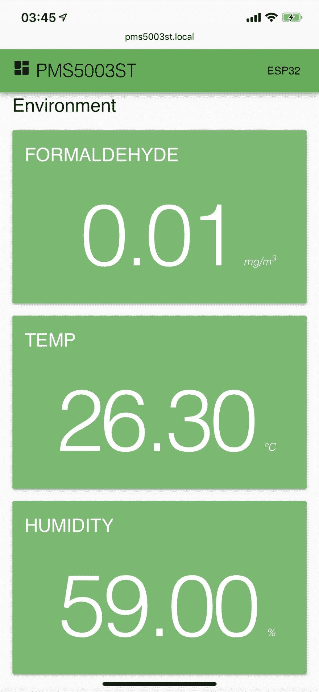](https://res.cloudinary.com/practicaldev/image/fetch/s--R52-qg_A--/c_limit%2Cf_auto%2Cfl_progressive%2Cq_auto%2Cw_880/https://cdn-images-1.medium.com/max/1024/1%2A12Cula0xbQb66NWHuWDLyQ.png)

[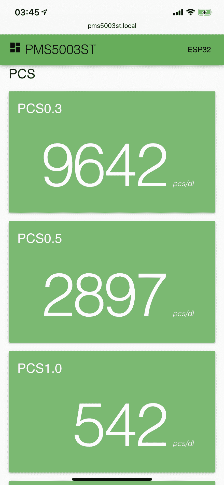](https://res.cloudinary.com/practicaldev/image/fetch/s--r7LzaVZI--/c_limit%2Cf_auto%2Cfl_progressive%2Cq_auto%2Cw_880/https://cdn-images-1.medium.com/max/1024/1%2AAfwqDRWMKkQEARMmo13GhQ.png)

[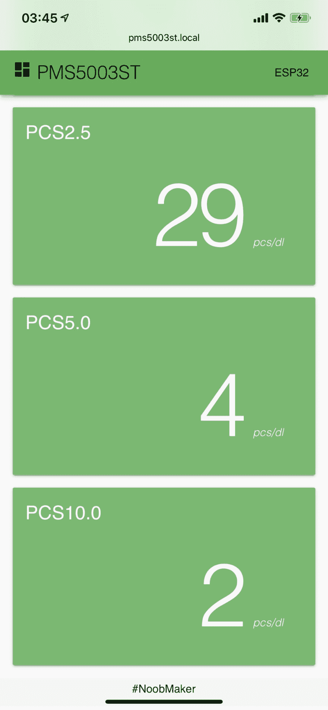](https://res.cloudinary.com/practicaldev/image/fetch/s--o9K8Qfen--/c_limit%2Cf_auto%2Cfl_progressive%2Cq_auto%2Cw_880/https://cdn-images-1.medium.com/max/1024/1%2AJQZDeLcfCeZPQhKZu4EdKA.png)

[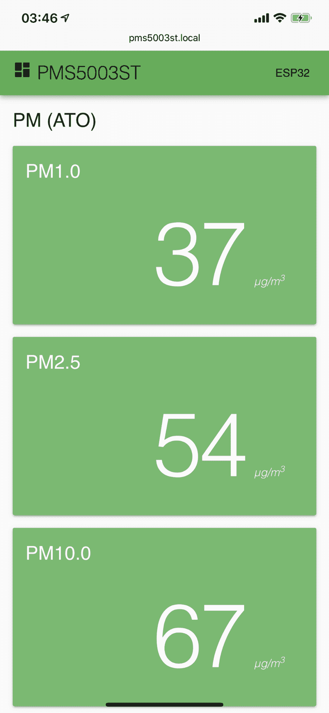](https://res.cloudinary.com/practicaldev/image/fetch/s--e10jSTtU--/c_limit%2Cf_auto%2Cfl_progressive%2Cq_auto%2Cw_880/https://cdn-images-1.medium.com/max/1024/1%2AvDrEPpjmavVA3j3q0XdKXQ.png)

[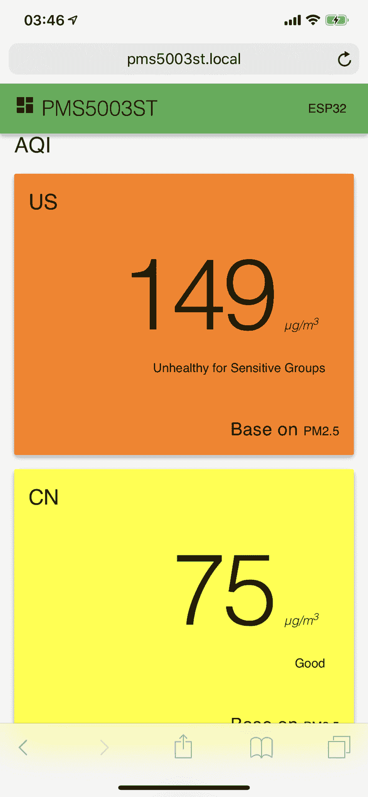](https://res.cloudinary.com/practicaldev/image/fetch/s--2wZqvlLw--/c_limit%2Cf_auto%2Cfl_progressive%2Cq_auto%2Cw_880/https://cdn-images-1.medium.com/max/1024/1%2ALsSNlyyyj9wwEMvnk9ThbA.png)

[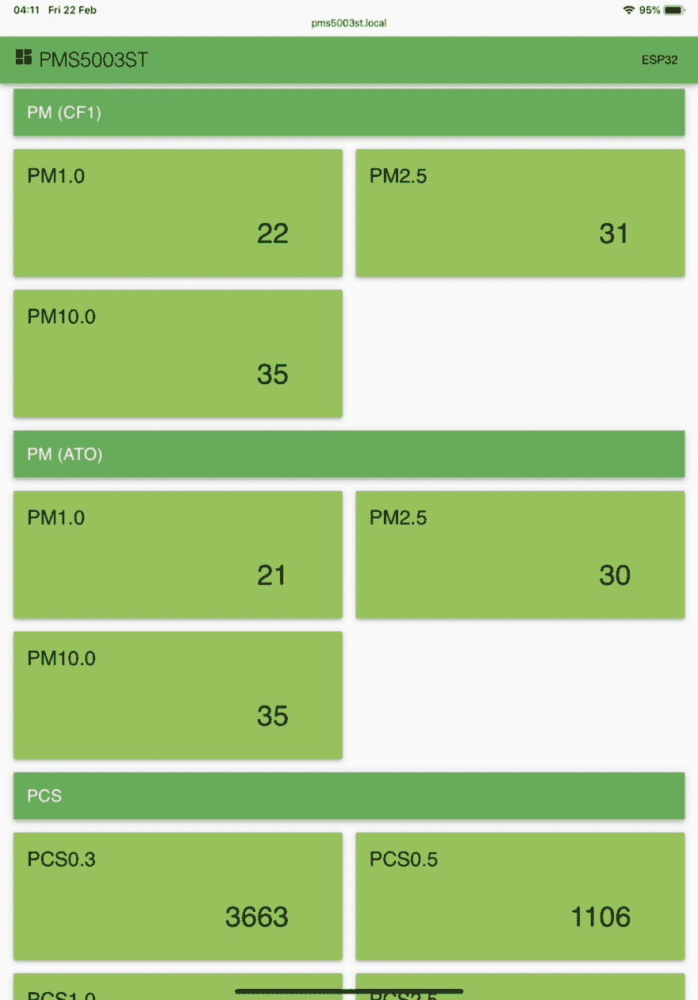](https://res.cloudinary.com/practicaldev/image/fetch/s--Mn654VnF--/c_limit%2Cf_auto%2Cfl_progressive%2Cq_auto%2Cw_880/https://cdn-images-1.medium.com/max/1024/1%2A36HeeJZDR8RVnKvMBpHLHA.png)

<figure>[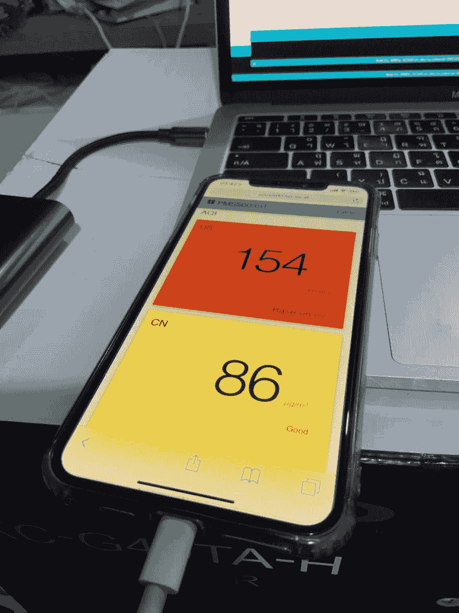](https://res.cloudinary.com/practicaldev/image/fetch/s--uMWgwUEN--/c_limit%2Cf_auto%2Cfl_progressive%2Cq_auto%2Cw_880/https://cdn-images-1.medium.com/max/1024/1%2AbBnAKiL5gPwBJ5HiiBUxJA.jpeg)

<figcaption>【ui】</figcaption>

</figure>

。

> 如果你想进行测量，可以用火柴点燃，或者用尘土。

* * *