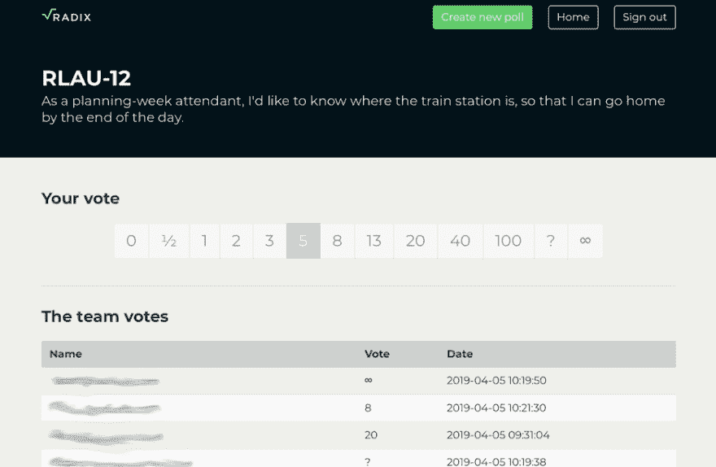

# 扑克规划应用程序

> 原文：<https://dev.to/radixdlt/poker-planning-application-25hh>

# 扑克策划应用

继续看看我们内部黑客马拉松的结果，拉斯洛和我(达米安)决定建立 Radix Planner，一个允许在 Radix 上运行远程规划扑克(也称为 Scrum poker)的项目。

# 什么事？

规划扑克是一种游戏化的技术，对于估计完成软件开发的不同活动和阶段所需的工作量很有用。如果我们都围坐在一张桌子旁，我们通常会写下我们的估计(或使用编号卡)，并将它们面朝下。只有在每个人都提交了他们的评估后，卡片才会显示出来，时间工作量才会被估计为平均值。以这种方式操作是有用的，这样可以避免锚定的认知偏差，即大声说出的第一个数字为随后的估计树立了一个先例。

# 它是如何工作的？

Radix Planner DApp 通过客户端前端操作，结果存储在分类帐中。DApp 虽然很简单，但它允许用户对一个用户故事进行投票。一旦记录了投票，页面就会更新以显示该故事的当前投票，如下所示:

选票通过 Radix [消息传递](https://docs.radixdlt.com/alpha/learn/platform/buildability#messaging)系统记录到分类账中。这允许消息从一个帐户传输到另一个帐户，或者允许建立一个非用户帐户，允许用户发送和接收来自生成的消息组的消息。出于 Radix Planner 的目的，投票以 JSON 字符串的形式从一个用户帐户发送到一个注册为特定用户故事投票地址的帐户。

除了使用钱包而不是电子邮件地址之外，我们还想做一些事情来增加 DApp。为了让它更加用户友好，我们可以有内置的功能，如投票编辑或多次投票，允许用户改变主意。也有可能将它与 Atlassian 的吉拉集成，以便自动导入用户故事，从而更容易对它们进行投票。

从开发的角度来看，我们可以使用令牌而不是消息来传输和存储投票。这将允许用户投票时自动生成令牌。此外，我们使用电子邮件地址作为用户帐户的基础。然而，由于时间限制，我们没有内置用户名或密码验证，这意味着用户可能会被模拟。为了解决这个问题，我们可以使用 UniqueID 或者从电子邮件地址切换到私人钱包作为密钥的种子。

# 用例

黑客马拉松的关键方面是理解我们如何构建利用 Radix 堆栈的应用程序，但这些应用程序也具有可以更广泛应用的概念。每天都有数不清的投票和调查在进行，虽然在小型可信团队中进行的投票和调查可能不需要存储在不可变的分类账上，但在某些调查中，拥有完整且可视的投票历史记录肯定会很有用。也有一些情况，人们希望匿名投票，但不希望任何人负责收集选票。

此外，Radix Planner 的特性(如投票机制)可以用于运行在 Radix 上的其他 DApps。这包括像赌博，一个受欢迎的 DLT 活动，和治理。

注意:由于这个项目是为了与内部 betanet 交互而构建的，我们将只在公共 betanet 上线后才开放源代码。

有问题吗？给我或者拉斯洛在[不和谐组](https://discord.gg/CZ6WMfW)上留言，或者你可以在我们的[电报频道](https://t.me/radix_dlt)问他们。

加入我们的邮件列表，在我们达到重要里程碑时获得通知-[在此订阅](https://radixdlt.typeform.com/to/nyKvMV)！