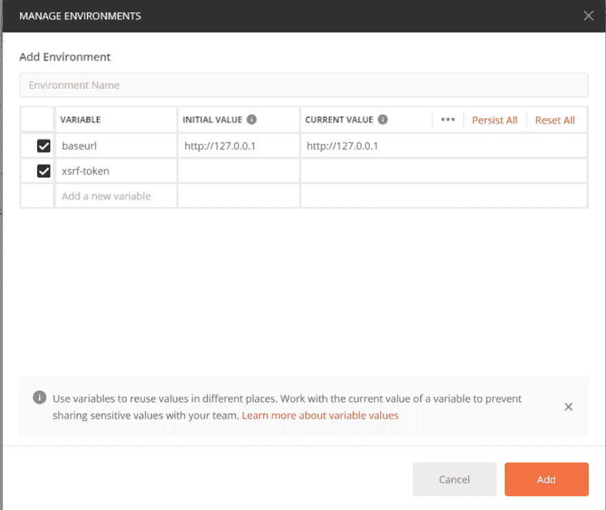

# Postman、Ajax 端点和 XSRF 令牌

> 原文：<https://dev.to/ankursheel/postman-ajax-endpoints-and-xsrf-tokens-190l>

使用防伪令牌是保护您的网站免受 XSRF(跨站点请求伪造)攻击的一种非常常见的方式。然而，使用 Postman 测试 ajax 端点确实很困难。如果您的请求中没有正确的令牌，您将得到一个 ***401 未授权的*** 错误。

这是我最近碰到的事情。那么，我做了什么？

* * *

## 序言

我想我可以为了测试而禁用验证。很长一段时间，我就是这么做的。我的超级科学过程由以下步骤组成。

1.  通过注释掉验证代码来禁用验证。
2.  重建解决方案。
3.  启动本地服务器。
4.  使用邮递员测试。如果需要，进行修复。
5.  重新启用验证。
6.  重建代码。
7.  船。

现在，我不知道你怎么想，但是仅仅看着它就让我感到难过，这不仅仅是因为它不允许我在部署的代码上测试端点。不，仅仅为了测试的目的而部署关闭了验证的代码不是我想做的事情。

我不停地想，一定有更好的方法来做这件事。当然，我不是唯一想这么做的人。因此，我做了任何优秀工程师都会做的事情——打开浏览器，搜索 stack overflow 和 google。我找到了几篇文章，但没有一篇真正对我有用。

自从我写这篇文章以来，有些东西显然对我起了作用，但是，在此之前，我们先了解一下对外行人有用的一些背景知识。

* * *

## 什么是 XSRF 又名 CSRF 又名海上冲浪又名跨站请求伪造？

当网站允许经过身份验证的用户执行敏感操作，但不验证用户本身是否正在调用该操作时，就会出现 XSRF 漏洞。相反，它们只验证请求来自授权用户的浏览器。这可能会使网站遭受攻击，因为用户的浏览器中已经存储了一个经过验证的身份验证 cookie。

防止 CSRF 攻击最常见的方法是使用 CSRF 令牌

* * *

## 什么是防伪(XSRF)令牌？

防伪标记是一种防止跨站脚本攻击的方法。它是为发送给客户端的每个 HTML 表单生成的唯一随机密钥。

它的工作方式是

1.  每当用户请求包含表单数据的页面时，服务器都会生成一个唯一且不可预测的防伪标记。
2.  提交表单时，客户端会发回令牌。
3.  服务器验证令牌，如果令牌不匹配，则拒绝请求。

* * *

## 应用是什么样子的？

我们的应用程序构建于 ASP.NET，使用 Razor 页面。我们可以在 Razor 页面中添加防伪标记的方法之一是在表单中使用`@Html.AntiForgeryToken()` helper 函数。这只是添加了一个包含令牌的隐藏表单字段。添加的表单域类似于

```
<input name="__RequestVerificationToken" type="hidden" value="HCT7cStZ5BVk3sFWdlYRsaPN2K2xUHwRc-AAEn1tIq02yWO1QSUuAiNuH4pCg6M7JgV3xZjysixJHhkqoGhOTTG8bgk0H3VWi5XpJgntnt2uc-xXwXwSOta9hBNMJQxo5JznbmiBtxPkwSx-GqxXsw2"/> 
```

注意隐藏输入的名称-***_ _***。我们以后会需要它。

我们还将假设 URL 的格式为*[http://127 . 0 . 0 . 1/page](http://127.0.0.1/page)*
当用户按下提交按钮时，它会发送到*[http://127 . 0 . 0 . 1/page-Ajax-action](http://127.0.0.1/page-ajax-action)*。页面上的表单本身有两个字段*名字*和姓氏

* * *

## 亚达亚达。但是我怎么测试呢？

说得够多了，让我们启动 Postman 并设置它，这样我们就可以测试我们的 ajax 端点了。

* * *

## 创造环境

[](https://res.cloudinary.com/practicaldev/image/fetch/s--gWSy0-gG--/c_limit%2Cf_auto%2Cfl_progressive%2Cq_auto%2Cw_880/https://ankursheel.com/wp-content/uploads/2019/05/environment.png) 邮递员环境

* * *

## 设置我们的请求

[](https://res.cloudinary.com/practicaldev/image/fetch/s--0wTANb0w--/c_limit%2Cf_auto%2Cfl_progressive%2Cq_auto%2Cw_880/https://ankursheel.com/wp-content/uploads/2019/05/post-ajax.png) 邮递员投递请求

如果你想知道`{{xsrf-token}}`是什么意思，它基本上是一种告诉 Postman 这个值将来自 *xsrf-token* 变量的方式。

* * *

## 设置防伪令牌变量

现在，由于为每个请求都生成了防伪令牌，所以我们可以在每次想要访问 ajax 端点时使用一个预请求脚本来设置 *xsrf-token* 环境变量的值。

这就是我们的预请求脚本的样子

```
var url = pm.environment.get("baseurl");
pm.sendRequest(`${url}/page`, function(err, response) {
    if (err) {
        return console.error(err);
    } else {
         var body = response.text();
         const html = cheerio(body);
         var allInputs = html.find('input[name="__RequestVerificationToken"]');
         var input = allInputs.first();
         var token = input.val();
         pm.environment.set("xsrf-token", token);
     }
}); 
```

让我们一个一个地分解它

*   第 1 行:我们从环境变量中获取 *baseurl* ，并将其存储在 *url* 中
*   第 2 行:我们向包含表单的页面发送一个请求，我们指定回调函数接收两个参数——一个错误(如果有的话)和一个响应。
*   第 3-4 行:如果有错误，将错误记录到控制台。
*   第 6 行:从响应对象获取主体
*   第 7 行:使用 Postman 内置的对 cheerio 的支持来解析 body。要了解更多关于 cheerio 的信息，请访问 [Cheerio](https://cheerio.js.org/)
*   第 8 行:使用 cheerio 查找正文中所有的`input[name="__RequestVerificationToken`实例。
*   第 9 行:如果页面上有多个实例，取第一个实例。
*   第 10 行:从输入中获取值
*   11 号线。用令牌值设置 *xsrf-token* 环境变量

## 现在我们测试

现在，如果我们发送一个请求，我们可以从 ajax 端点获得 200 响应。我们也可以看到我们的环境是什么样的

[](https://res.cloudinary.com/practicaldev/image/fetch/s--1YhERvmh--/c_limit%2Cf_auto%2Cfl_progressive%2Cq_auto%2Cw_880/https://ankursheel.com/wp-content/uploads/2019/05/updated-environment-1-1024x253.png) 更新环境变量

* * *

这有帮助吗？这对你有用吗？请在评论中告诉我。

* * *

这篇文章最先出现在游戏程序员、旅行者和美食家安库尔·谢尔的网站上