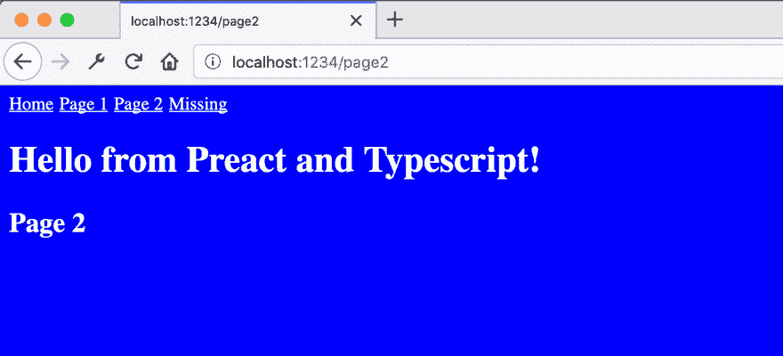

# 使用打字稿和包裹预先执行项目

> 原文：<https://dev.to/denysvuika/preact-project-with-typescript-and-parcel-nj0>

## 简介

这篇文章旨在帮助你快速建立项目。我将指导您完成以下步骤:

*   创建项目脚手架
*   与[打字稿](https://www.typescriptlang.org/)整合
*   构建并运行简单的 [Preact](https://preactjs.com/) 应用程序
*   创建为生产运行和构建的脚本
*   造型支架
*   应用程序路由

此外，在文章的底部，您将获得一个到 GitHub 库的链接，其中包含最终结果。

## 创建项目脚手架

让我们首先创建一个名为`preact-getting-started`的新项目文件夹，或者您选择的任何其他名称。

```
mkdir preact-getting-started
cd preact-getting-started 
```

在本文中，我将使用一个超快的 [Yarn](https://yarnpkg.com) 包管理器。
如果你用的是 NPM，我强烈推荐你看一看。

您可以通过运行以下命令建立一个新项目:

```
yarn init --yes 
```

因此，您应该得到一个包含项目最少信息的`package.json`文件。
您需要这个文件来存储元数据和第三方库依赖项。

### 配置 Git

如果您打算在您的项目中使用 Git，运行以下命令在当前文件夹中初始化一个新的 Git 存储库:

```
git init 
```

接下来，在项目根文件夹中创建一个`.gitignore`文件，内容如下:

```
node_modules
dist
.cache 
```

它指示 Git 不要将特定的文件夹提交给源代码存储库。

## 与类型脚本集成

要配置 [TypeScript](https://www.typescriptlang.org/) 支持，首先需要安装“TypeScript”库:

```
yarn add typescript -D 
```

之后，在项目根中创建一个`tsconfig.json`文件，其内容来自下面的清单:

```
{  "compilerOptions":  {  "outDir":  "./dist",  "sourceMap":  true,  "noImplicitAny":  true,  "module":  "es6",  "moduleResolution":  "node",  "target":  "es6",  "jsx":  "react",  "jsxFactory":  "h"  },  "include":  ["./src/**/*"]  } 
```

这是支持与 Preact 集成的最低 TypeScript 配置。现在让我们看看创建和运行一个简单的应用程序需要什么。

## 构建并运行简单的 Preact 应用程序

下一步，我们需要安装一个 [Preact](https://preactjs.com/) 和 [Parcel](https://parceljs.org/) bundler 库。

[包](https://parceljs.org/)是一个速度惊人的零配置 web 应用捆绑器
，它允许你专注于构建你的应用，而不是花时间
配置捆绑和打包过程本身。
请务必查看[文档](https://parceljs.org/getting_started.html)部分
以了解所有精彩功能的细节。

```
yarn add parcel-bundler -D
yarn add preact 
```

现在，创建一个`src`文件夹，并将下面的`index.html`文件放入其中:

```
<html>
  <body>
    <div id="root"></div>
    <script src="./index.tsx"></script>
  </body>
</html> 
```

正如您在上面的代码片段中看到的，我们有一个名为`root`、
的应用程序占位符`div`元素，以及您接下来要创建的`index.tsx`文件的导入:

```
import { h, render } from 'preact';

const App = () => <h1>Hello from Preact and Typescript!</h1>;

render(<App />, document.getElementById('root')); 
```

为了简单起见，我们显示了一个带有虚拟字符串的“heading”元素。

## 创建脚本以运行和构建生产

通常，您将在两个主要场景中使用 package CLI 命令:
在开发过程中本地运行应用程序，
以及构建发布工件，也称为“生产构建”

您可以通过在`package.json`文件:
中提供`scripts`部分来自动化这个过程

```
{  "scripts":  {  "start":  "parcel src/index.html",  "build":  "parcel build src/index.html"  }  } 
```

要使用轻量级 web 服务器在本地运行应用程序，请运行以下命令:

```
npm start 
```

您应该看到下面的输出，注意您可以用来浏览应用程序的 URL 地址:

```
Server running at http://localhost:1234
✨  Built in 1.68s. 
```

导航到 [http://localhost:1234](http://localhost:1234) ，应用程序看起来类似下图:

[](https://res.cloudinary.com/practicaldev/image/fetch/s--nFuF8U_G--/c_limit%2Cf_auto%2Cfl_progressive%2Cq_auto%2Cw_880/https://thepracticaldev.s3.amazonaws.com/i/y6lybubq1n8vcwv1w5ry.png)

这几乎是你开始开发所需要的全部。默认情况下，应用程序在“监视”模式下运行。这意味着每次你修改代码时，浏览器页面都会刷新，你会看到更新后的应用程序在运行。

## 造型支持

package bundler 使应用程序的样式化变得非常简单。
比如你可以导入一个 SCSS 文件，包裹负责在后台安装
和使用`sass`模块。现在让我们来看看实际情况。

用以下内容创建一个`src/styles.scss`文件:

```
$primary-color: white;
$secondary-color: blue;

body {
  color: $primary-color;
  background-color: $secondary-color;
} 
```

出于演示的目的，我们创建了两个 SASS 变量，并更改了 body 元素的样式。
你现在需要做的就是将风格导入到你的应用程序中，例如`index.tsx`文件:

```
import { h, render } from 'preact';
import './styles.scss';

const App = () => <h1>Hello from Preact and Typescript!</h1>;

render(<App />, document.getElementById('root')); 
```

启动您的应用程序或切换到正在运行的应用程序，注意应用程序现在看起来有所不同:

[](https://res.cloudinary.com/practicaldev/image/fetch/s--oCX-HCa8--/c_limit%2Cf_auto%2Cfl_progressive%2Cq_auto%2Cw_880/https://thepracticaldev.s3.amazonaws.com/i/g99inq32kbsqvwwrkxgt.png)

这就是[包](https://parceljs.org/)支持造型的行动！
正如你所看到的，集成过程发生在幕后，
你关注的是风格和主题，而不是`sass`模块设置和配置。

## 申请路由

现代单页面 web 应用程序的另一个重要特性是“路由”
让我们看看如何让您的 Preact 项目具备必要的路由功能。
为此，我将使用 [preact-router](https://github.com/developit/preact-router) 库。

```
yarn add preact-router 
```

切换到`index.tsx`文件，创建几个简单的组件来模拟应用程序的不同页面。

```
const Home = () => <h2>Home Page</h2>;
const Page1 = () => <h2>Page 1</h2>;
const Page2 = () => <h2>Page 2</h2>;
const Error = () => <h3>Error</h3>; 
```

现在，您可以导入`Router`组件，并定义页面，如下面的清单所示:

```
import { Router } from 'preact-router';

const App = () => (
  <div>
    <h1>Hello from Preact and Typescript!</h1>

    <Router>
      <Home path="/" />
      <Page1 path="page1" />
      <Page2 path="page2" />
      <Error default />
    </Router>
  </div>
); 
```

有了上面的代码，你每次访问 [http://localhost:1234/](http://localhost:1234/) 的时候，都应该在主屏幕上看到`Home`组件。
`Page1`组件可以通过`/page1`访问，所有缺失的路径，比如`/missing`，
应该最终显示`Error`组件的内容。

### 页面导航

让我们快速制作一个 Header 组件来看看导航是如何工作的。

```
const Header = () => (
  <header>
    <nav>
      <a href="/">Home</a>
      <a href="/page1">Page 1</a>
      <a href="/page2">Page 2</a>
      <a href="/missing">Missing</a>
    </nav>
  </header>
); 
```

接下来，为链接添加一些样式，以考虑我们之前所做的主题设置:

```
header {
  nav {
    a {
      color: $primary-color;
      margin-right: 5px;
    }
  }
} 
```

最后，让我们将`Header`组件放在页面顶部的`Router`元素之外。
在这种情况下，你可以在每个应用程序页面上使用标题链接。

```
const App = () => (
  <div>
    <Header />
    <h1>Hello from Preact and Typescript!</h1>

    <Router>
      <Home path="/" />
      <Page1 path="page1" />
      <Page2 path="page2" />
      <Error default />
    </Router>
  </div>
); 
```

运行应用程序并单击各种标题链接。
注意内容如何根据路线而变化。

[](https://res.cloudinary.com/practicaldev/image/fetch/s--_TaKi_rH--/c_limit%2Cf_auto%2Cfl_progressive%2Cq_auto%2Cw_880/https://thepracticaldev.s3.amazonaws.com/i/esm4r0jpceynsi2c0cqp.png)

至此，您的应用程序模板已经准备好了，
您可以保存它以备将来重用或继续扩展它。

## 总结

正如你所看到的，开始使用 [Preact](https://preactjs.com/) 和 [TypeScript](https://www.typescriptlang.org/) 是琐碎的，
和[package](https://parceljs.org/)bundler 使整个过程变得轻松愉快。

你可以通过下面的链接在 GitHub 上找到这个项目的最终例子:

##  [丹尼斯武卡](https://github.com/DenysVuika) / [预先行动-开始](https://github.com/DenysVuika/preact-getting-started)

### Preact、Typescript 和 Parsel 入门。

<article class="markdown-body entry-content container-lg" itemprop="text">

# Preact、TypeScript 和 Parcel 入门

这是一个示例项目，随附于以下文章:[Preact Project with TypeScript and package](https://denys.dev/preact-project-with-typescript-and-parcel/)

## 带纱运行

```
yarn install
yarn start
```

## 和 NPM 一起跑步

```
npm install
npm start
```

## 在浏览器中测试

导航到 [http://localhost:1234](http://localhost:1234) 地址查看应用程序。

</article>

[View on GitHub](https://github.com/DenysVuika/preact-getting-started)