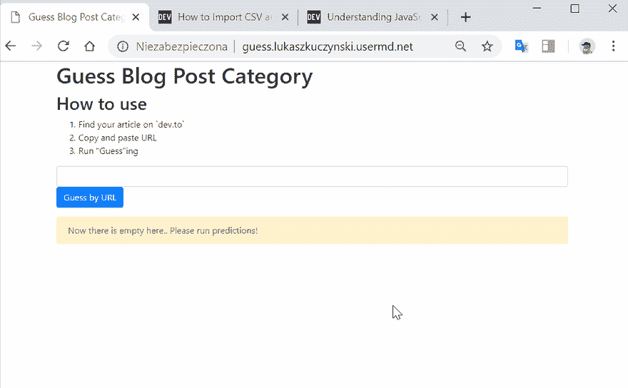
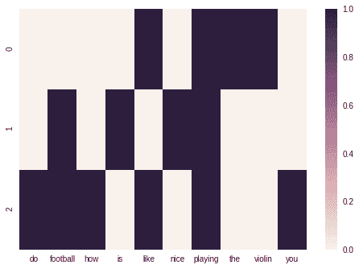
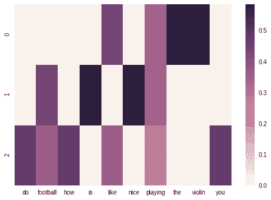

# 预测开发到帖子

> 原文：<https://dev.to/lukaszkuczynski/predicting-devto-posts-21pk>

以下是我为自己选择的完整小型端到端数据科学项目的简短描述。我一直想玩文本数据，所以我选择创建自己的语料库。我稍后将使用它在其上应用一些机器学习。看看我如何预测一些博客文章的类别。

## 目标

最近我学习了机器学习(ML)。有很多可能的应用领域:分析视频、图像、语音和文本。最后一个似乎最吸引我。在线内容每天都在增长。我们要读的东西太多了。自然语言处理(NLP)是数据科学对这个问题的回应。我这个小项目的内容来自一个很棒的开发者社区博客: **dev.to** 。为了显示基本的 ML，我将根据 *dev.to* post 内容猜测标签。因此，我将运行监督学习。简而言之:我正在粘贴一个帖子的内容，它应该会告诉我这是关于“java”还是“python”。我的作品的效果是一个 web 应用程序，所以可以随意使用它[这里](http://guess.lukaszkuczynski.usermd.net)。为了简单起见，我只使用了 4 个主要类别。看看这个生活演示 gif:

[](https://res.cloudinary.com/practicaldev/image/fetch/s--KvXbF1Pf--/c_limit%2Cf_auto%2Cfl_progressive%2Cq_66%2Cw_880/https://lukaszkuczynski.github.io/assets/img/posts/guess.gif)

## 文集

什么是*文集*？在 NLP 世界中，它是一组文档。我们稍后将分析这些文档。做任何一个 ML 项目，你都必须从一些要分析的东西开始。用一些数据。在自然语言处理中，你必须得到一些文本。从一些互联网门户网站上抓取它们并不是强制性的。你可以从内置的语料库开始，因为它们是这里描述的库[的一部分。在我的例子中，我想使用`dev.to`数据，所以我将使用他们公开的 API。我将创建自己的语料库。数据采集的过程是我的 GitHub 项目的一部分。用 Python 做这件事太简单了，我可以使用很棒的库，比如`BeautifulSoap`和`requests`。](https://www.nltk.org/book/ch02.html)

## 鞠躬

*BoW* 首字母缩写代表*袋字*。这是一种简单的文本矢量化方法。它的名字来源于我们放所有单词的袋子的想法。我们不关心它们是如何排序的。我们只需要将我们的文本矢量化。这是在文本上应用任何 ML 算法之前的先决条件。那么这个向量对于一个简单的句子来说是什么样的呢？以 Scikit Learn library 中的一个`CountVectorizer`为例，让我们看看它是如何将文本转换成矢量的。

```
sentences = [
  "I like playing the violin",
  "Playing football is nice",
  "How do you like playing football?"
]

from sklearn.feature_extraction.text import CountVectorizer
import operator
vectorizer = CountVectorizer()
X = vectorizer.fit_transform(sentences)
vocabulary = vectorizer.vocabulary_.items()
vocabulary_sorted = sorted(vocabulary, key=operator.itemgetter(1))
print("vocabulary is:")
print(vocabulary_sorted)
print("matrix resulted is:")
print(X.toarray()) 
```

结果将是:

```
vocabulary is:
[('do', 0), ('football', 1), ('how', 2), ('is', 3), ('like', 4), ('nice', 5), ('playing', 6), ('the', 7), ('violin', 8), ('you', 9)]
matrix resulted is:
[[0 0 0 0 1 0 1 1 1 0]
 [0 1 0 1 0 1 1 0 0 0]
 [1 1 1 0 1 0 1 0 0 1]] 
```

让我们看看当我们把它想象成热图时是什么样子:

[](https://res.cloudinary.com/practicaldev/image/fetch/s---86OOwuE--/c_limit%2Cf_auto%2Cfl_progressive%2Cq_auto%2Cw_880/https://lukaszkuczynski.github.io/assets/img/posts/count-heat.png)

由于我们将很快生产一个模型，我们希望它质量好。我们将执行一个 *Tf-Idf* (术语频率-逆文档频率)转换。这意味着我们要考虑这个词在文档中出现的频率(TF)和在其他文档中出现的频率(IDF)。在`sklearn`中应用这种变换会产生一个与我们之前看到的略有不同的矩阵:

```
vocabulary is:
[('do', 0), ('football', 1), ('how', 2), ('is', 3), ('like', 4), ('nice', 5), ('playing', 6), ('the', 7), ('violin', 8), ('you', 9)]
TfIdf matrix resulted is:
[[0\. 0\. 0\. 0\. 0.44451431 0.
  0.34520502 0.5844829 0.5844829 0\. ]
 [0\. 0.44451431 0\. 0.5844829 0\. 0.5844829
  0.34520502 0\. 0\. 0\. ]
 [0.4711101 0.35829137 0.4711101 0\. 0.35829137 0.
  0.27824521 0\. 0\. 0.4711101 ]] 
```

和视觉化

[](https://res.cloudinary.com/practicaldev/image/fetch/s--O1_tEn1w--/c_limit%2Cf_auto%2Cfl_progressive%2Cq_auto%2Cw_880/https://lukaszkuczynski.github.io/assets/img/posts/tfidf-heat.png)

输出矩阵现在几乎没有什么不同。这是因为我们关心术语在整个数据集中出现的频率。在我们这里 *TfIdf* 推广像*小提琴*这样的稀有乐器，贬低像*演奏*这样的流行乐器。

## 机器学习

准备好向量后，我们可以在此基础上应用数学。在监督学习中，我们必须找到一个将输入向量 X 与标签 y 相匹配的函数。有了我们处理的数据的结构和种类，就需要应用正确的算法，而不仅仅是随机算法。如果你正面临这个问题，找到这个 [`sklearn`备忘单](http://scikit-learn.org/stable/tutorial/machine_learning_map/index.html)。在我的例子中，我正在对文本数据进行分类。我发现许多有经验的数据科学家倾向于使用朴素贝叶斯。经过几次尝试，我发现它也很有用。你可以在这里查看我的[笔记本。记住，对于文本数据，我们使用多项式而不是高斯算法。这是模型训练过程中的一个片段。](https://github.com/lukaszkuczynski/data-analysis/blob/master/devto/cluster_devto_articles.ipynb)

```
import pandas as pd
from sklearn.naive_bayes import MultinomialNB
from sklearn.model_selection import train_test_split

def train_naivebayes(X, y):
  X_train, X_test, y_train, y_test = train_test_split(X, y, random_state=0)
  bayes = MultinomialNB()
  bayes_model = bayes.fit(X_train, y_train)
  y_pred = bayes_model.predict(X_test) 
```

请在我的报告中找到[完整的代码库。](https://github.com/lukaszkuczynski/guess)

## 部署

一旦你的模型准备好了，就可以和别人分享了！用 Azure 或者 AWS 都可以。他们通常有现成的 Docker 容器，你只需要把你的模型放在里面，他们神奇地把它公开为一个 REST 服务。然而，当我第一次展示一些模型时，我希望一切都在掌控之中。这就是为什么我决定自己在 web 应用程序中构建我的模型。这就像将构建块序列化为文件，然后将这些文件上传到服务器一样简单。你可以去那里查看[我的应用部署](http://guess.lukaszkuczynski.usermd.net)。

## 吸取教训

我认为这个项目并不完美。我测量了模型的准确性，它在 80%左右。为了获得更好的结果，我们可以:

*   使用另一种算法，即集成算法，或调整现有算法
*   拥有比数百个条目更多的数据(更多的数据总是意味着:更好)
*   更好地清理数据

我很高兴看到用`sklearn`处理数据是多么美好的经历。Python 提供了必备的 ML 工具带。我也尝到了 ML 问题的全栈。我收集、分析、拟合模型，并最终部署它。