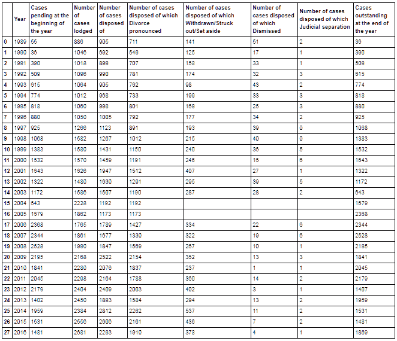
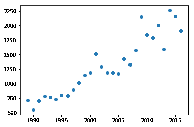

# 使用线性回归(ML)预测毛里求斯的离婚率

> 原文：<https://dev.to/abdurrahmaanj/predicting-divorce-pronounced-in-mauritius-using-linear-regression-ml-4g0o>

这里有一个关于线性回归的帖子，机器学习的第一步。我们将使用 python 来预测我的国家毛里求斯的离婚案件

## 什么是线性回归

回归只是意味着预测。

阅读关于这两篇 dev.to 文章的更多内容

*   Apoorva Dave 的第一部分
*   Apoorva Dave 的第二部分

## 我们的数据

我们将从[这里](https://data.govmu.org/dkan/?q=dataset/divorce-cases-island-mauritius-republic-mauritius)下载我们的 csv。第一个。我把它改名为离婚. csv

## 开辟 Jupyter

让我们导入我们的库

```
import pandas as pd
import matplotlib.pyplot as plt
from sklearn import linear_model
# psst inspect sklearn to see what other models there are 
```

Enter fullscreen mode Exit fullscreen mode

让我们看看我们的数据

```
df = pd.read_csv('<path-to-file>/divorce.csv')
df 
```

Enter fullscreen mode Exit fullscreen mode

给了我们

[](https://res.cloudinary.com/practicaldev/image/fetch/s--2tIkbtb7--/c_limit%2Cf_auto%2Cfl_progressive%2Cq_auto%2Cw_880/https://thepracticaldev.s3.amazonaws.com/i/0mtuu3jmpx7nai4tveln.png)

我们将预测*栏中宣布离婚的案件数量*

但是让我们看看我们的数据

```
plt.scatter(df['Year'], df['Number of cases disposed of which Divorce pronounced']) 
```

Enter fullscreen mode Exit fullscreen mode

我们得到了

[](https://res.cloudinary.com/practicaldev/image/fetch/s--EvA1oDAy--/c_limit%2Cf_auto%2Cfl_progressive%2Cq_auto%2Cw_880/https://thepracticaldev.s3.amazonaws.com/i/wy82q175t9kz6amknkeg.png)

让我们训练我们的模型

```
reg = linear_model.LinearRegression()
reg.fit(df[['Year']], df['Number of cases disposed of which Divorce pronounced']) 
```

Enter fullscreen mode Exit fullscreen mode

并预测 2017 年

```
reg.predict([[2017]])# it was 1,921 
```

Enter fullscreen mode Exit fullscreen mode

我们得到

```
array([ 2140.22222222]) 
```

Enter fullscreen mode Exit fullscreen mode

## 得到 m 和 c

由于线性回归只是一条直线(实际上整个机器学习世界只是一些数学)，我们可以得到系数(我们的 m)和截距(我们的 c)

系数由
给出

```
reg.coef_ 
```

Enter fullscreen mode Exit fullscreen mode

输出

```
array([ 57.79118774]) 
```

Enter fullscreen mode Exit fullscreen mode

并被
拦截

```
reg.intercept_ 
```

Enter fullscreen mode Exit fullscreen mode

输出

```
-114424.60344827584 
```

Enter fullscreen mode Exit fullscreen mode

## 构建自己的预测函数

我们现在可以构建一个简单的函数来预测，而不需要经过 ml

```
def devdotto_predict(year_):
    # m * x + c
    return 57.79118774 * year_ + -114424.60344827584 
```

Enter fullscreen mode Exit fullscreen mode

并使用它

```
devdotto_predict(2017) 
```

Enter fullscreen mode Exit fullscreen mode

我们得到

```
2140.222223304154 
```

Enter fullscreen mode Exit fullscreen mode

比较上面

## 结论

理解概念的话机器学习超级容易！

封面 img 信用:照片由 Xavier Coiffic 在 Unsplash 上拍摄
毛里求斯的真实照片