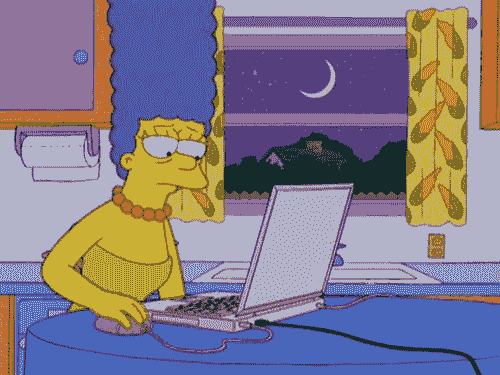

# 热情的开发人员的优先事项

> 原文：<https://dev.to/rionmonster/priorities-of-a-passionate-developer-5dg5>

*这篇文章最初发表在[我的博客](http://rion.io)上。*

任何和我在一起的人都知道我对我的工作充满热情，如果你正在读这篇文章，你可能也有一点这样的想法。

开这个博客的一个重要原因是试图分享我遇到的一些陷阱，这样我就可以设置一个警告标志，这样我后面的人就不会掉进去了。这也是为什么我花了无数小时/天/周的时间在 Stack Overflow 这样的论坛和网站上回答问题，为开源做贡献，并试图指导其他开发者的原因。我一直希望将我对制作软件的热爱传递给其他人，并以某种蝴蝶效应的方式，使我们的整个领域成为一个更好的地方。

这一切的关键是激情，但激情往往是有代价的。

## 家庭

如果你有一个家庭，那么这无疑应该是你的第一要务。在你和他们相处的时间里，不应该有任何代码或工作，如果你开始发现自己感觉与工作脱节或无法关掉工作开关，那么你可能需要考虑一个可以提供更好平衡的改变。尽管在过去提到过，我不能强调下面的广告有多糟糕:

不要成为那样的人。

生活不像代码，如果事情不顺利，你可以稍后回来重新编写它——你不会再有机会看到你的孩子长大，我非常怀疑你会回头看，希望你花时间工作，而不是阅读睡前故事。生命是短暂的，尤其是对孩子来说，它过得如此之快，所以好好利用它，确保花时间和那些在项目完成后很久还在那里的人在一起。

## 睡眠

我们都看过描述黑客和其他软件变种的电影。灯光昏暗的房间，桌子上散落着山露水的空罐头盒，一个人的侧影在深夜戏剧性地敲打着键盘。在我们这个领域，很容易转变成这样并不罕见。我会知道；我一直都这么做。

睡眠很重要，非常重要。如果你不这么认为，只要想想我们所有人都花了很大一部分时间去做这件事，那么这背后一定有什么东西。就我个人而言，我花了太长时间才意识到它有多重要。我轻松地度过了每晚 2-5 小时睡眠的大学时光，并认为会一直这样。我只有 32 岁，但我可以自信地说“我太老了，不适合那种狗屎”。如果我试着花一周的时间睡上那么一小会儿，我会想象我会看到和感觉到这样的事情:

就像你的机器需要偶尔重启一样，你的大脑也是如此。

写软件是辛苦的，写出来不能够想清楚是不可能的。软件工程通常包括找出解决问题的方法，这通常需要相当多的脑力。你需要一些睡眠来让你的大脑安定下来，整理自己，这样第二天你就可以起来处理那些问题。此外，任何有经验的软件开发人员都知道，在你的职业生涯中，你的大脑无疑会在睡梦中帮助你解决一些棘手的问题。

> 我:我到底要怎么弄清楚这件事？我试过 X 和 Y，跟吉姆和鲍勃谈过，给乔恩·斯基特发了邮件，似乎都没用。
> 
> *睡着了*
> 
> **大脑**:嘿！我们来看一些代码！
> 
> **我**:说真的脑子？现在吗？我一整天都在想这个问题，我们也要梦到它？
> 
> 大脑:我只是打断你的话，但是认真尝试使用 KNN 算法，我很确定它会有效。

这些类型的顿悟很少产生于小睡或一两个小时的睡眠，所以值得好好休息一晚。正如我前面提到的，写软件是很难的，每天不停地推动你的大脑，不给它一个放松的机会，这对你的精神和身体都没有好处。

你不会每天都跑马拉松，所以不要试图对你的大脑这样做。投资一个好的床垫、枕头和所有这些东西，你的身体、头脑、同事和代码库都会感谢你的。

## 飞船

因此，我们认为照顾好自己的健康和身体非常重要。拥有朋友、爱好，甚至只是偶尔停下来写代码，都是至关重要的。但是如果你在这里，阅读这篇文章，那么你可能至少有点关心写软件，并且比一般人做得更好。

找到时间可能很难，但是有很多方法可以主动和被动地成为更好的软件开发人员。我脑海中的一个快速列表可能是这样的:

*   开源 -我知道你可能会看到这个并说“Rion，我没有时间做开源项目。”这很好。开源生态系统是*如此*广阔，以至于你不需要做出贡献就能发现其中的价值。在 GitHub 这样的网站上有数不清的令人惊奇的项目，你可以公开浏览和查看代码。我知道这可能看起来没什么价值，但是阅读代码会帮助你更好地编写代码。
*   播客(podcast)——如果你在一个通勤的环境中，这是必须的。有一些不可思议的面向开发者的播客，如[编码模块](https://www.codingblocks.net/)，它们适用于开发世界中的几乎每一个领域，也有一些令人惊叹的通用播客，它们关注整体开发。
*   在线视频内容 -在线上有太多的付费和非付费视频内容。像 Pluralsight 这样的网站可以让你有机会向世界级的专家学习任何主要技术的细节。YouTube 也是一个找到你想学的任何内容的好地方。

这些只是提高你手艺的几种方法，无论是主动的还是被动的，每一点都可以有所不同。如果你发现你的一天中有一些小部分是可以安排的(比如割草，坐在车里上下班等等)。)，这些都是成为更好的开发人员的绝佳时机。

## 等等

每个人的优先事项都是独特的，并且极易发生变化。现在对我来说重要的事情，现在对你来说可能不重要(或者可能永远不重要)。如果你在一年前、五年前、十年前问我，这三种情况会产生截然不同的结果——这完全没问题！

试着围绕工作和你的手艺确定优先事项，但不要让它们妨碍你最重要的工作——快乐地生活。他们总是有更多的代码要写，更多的 bug 要修复，还有另一个特性要实现。