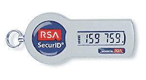
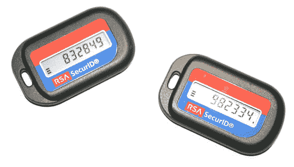
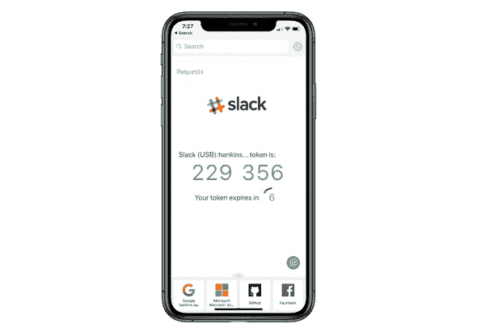
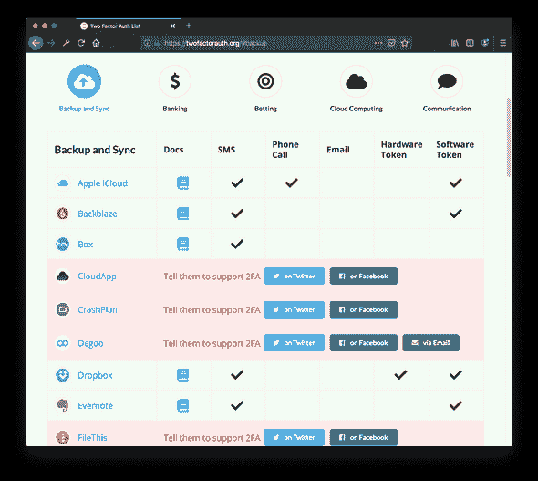

# 隐私和安全系列，第二部分:多因素身份验证

> 原文：<https://dev.to/jayhankins/privacy-and-security-series-part-ii-multi-factor-authentication-2b42>

在[上一篇隐私与安全系列文章](https://jayhankins.me/2019/privacy-and-security-series-part-i-password-managers/)中，我提到了密码管理器的重要性。面对几乎每天都在发生的数据泄露和凭据转储，您需要一种策略来保护自己。单因素密码认证很弱，但密码管理器是一种方便的工具，可以帮助您锁定您的在线帐户并定位漏洞，以便一个泄露的凭据不会给攻击者提供“通往王国的钥匙”。这都是为了防止访问您的帐户，人。

对了，3 月份新闻爆料 8fit 在 2018 年 7 月出现数据泄露。虽然违规事件发生在 7 月，但凭据列表直到 2019 年 2 月才出现在黑暗网络上出售。我的身份证明，以及大约 1500 万其他人的身份证明，被泄露了。多亏了[有了](https://haveibeenpwned.com)的帮助，专家们一知道，我就知道了。如果你没有报名参加我上次提到的的[，我再次推荐它。](https://jayhankins.me/2019/privacy-and-security-series-part-i-password-managers/)

除了遵守密码管理器最佳实践，您还可以通过多因素身份验证为您的在线帐户带来另一层安全保护。欢迎来到第 2 部分，这是关于多因素身份验证，为什么它有用，以及如何正确设置它。

## 什么是多因素认证(MFA)？

当系统需要验证您的身份时，它可以使用各种因素或信息来验证您的身份。许多系统只使用一个因素，比如单个密码。

多因素身份认证是依靠多个因素来验证您的身份的认证。许多东西可能是因素:安全问题、一次性密码、PIN 等。例如，你在美国主要银行网站上看到的一种常见的多因素身份认证方案包括发送到你手机上的密码和一次性通行码。或者，正如维基百科指出的:

> 双因素认证的一个很好的例子是从 ATM 机取款；只有银行卡(用户拥有的东西)和 PIN(用户知道的东西)的正确组合才允许进行交易。

多因素认证策略变得越来越普遍。双因素身份认证(2FA)通常包括密码(因素 1)和令牌码(因素 2)。2FA 策略有时被称为“你知道的东西(T0)密码(T1)和你拥有的东西(T2 令牌(T3))

2FA 其实已经有一段时间了，尤其是在企业和政府中。许多人都用过或者至少见过 [RSA SecurID](https://en.m.wikipedia.org/wiki/RSA_SecurID) ，这可能是 2FA 最畅销的硬件令牌。T3】1T5T7】2T9】

<figure> 

<figcaption>RSA SecureID 是一个流行的硬件令牌品牌。</figcaption>

</figure>

<figure> 

<figcaption>Authy 是一款流行的认证器 app，功能是软件令牌和推送认证器。</figcaption>

</figure>

### 为什么要用 MFA？

基本上，多因素身份验证的优势在于它为您提供了密码之外的额外安全层。更一般地说，当你的一个因素受到损害时，MFA 会保护你。

假设您仅使用用户名/密码组合登录您的 Google/Gmail 帐户。这是一个因素，密码。如果泄露了，**100%的认证因素都会受到危害。你的账户被黑了。**

 ****但是**，如果使用 MFA，密码泄露，只有 **50%** 的 auth 因素被攻破。攻击者仍然不知道或无法获得第二个因素。例如，如果您的第二个认证器是您的(未被攻击的)智能手机，并且它在您的口袋中，那么攻击者将不会具备所有因素，也不会进入。你的帐户是安全的。

MFA 是*特别是*对那些讨厌的有密码长度或字符限制的网站有用。我们[都知道](https://jayhankins.me/2019/privacy-and-security-series-part-i-password-managers/),`Correct.horse-battery$Staple`是比`M@nc#3$ter`更好的密码……但是对于那些只支持 16 个字符的网站来说,【A-z1-9 】,第二个认证因子将会大大提高你的安全性。

## 如何设置 MFA

希望我已经让你相信 MFA 是重要的…下一步是为你自己设置它。幸运的是，我们不是唯一意识到 MFA 好处的人。主要的在线服务提供商现在都启用了 2/MFA，您可能之前已经被提示过设置它。

可能您需要做的第一件事是选择 MFA 令牌类型。你可以选择一个或多个，这取决于你的需求。

### MFA 令牌的类型

*   **SMS** -短信排在第一位*不是因为它最安全，而是因为它最受欢迎。许多许多网站现在提供短信一次性密码，不幸的是，有时他们只提供一次性密码。但是，短信一次性密码总比没有强！*
*   **软件令牌** -根据时间加密函数和令牌密码生成一次性密码的软件，该密码由服务提供商在您设置 2FA 时提供给您。最常见的是 TOTP(基于时间的一次性密码)生成器。当您使用密码或二维码设置验证器应用程序时，您使用的是 TOTP 软件令牌。
*   **硬件令牌**——有各种各样的硬件令牌。有些是 OTP 生成器，只需按一下按钮就可以生成代码，而其他的像 RSA 令牌这样的生成器则是始终开启的，并通过一系列 TOTP 代码进行循环。
*   **推送认证** -推送认证是由 Duo、Authy、Google 推广的 MFA 因子。基本上，推送通知会发送到你的智能手机，你可以通过相应的应用程序批准或拒绝请求。例如，谷歌可以向任何安装了 Gmail 或谷歌应用程序的 iOS 设备发送推送认证通知。
*   **以及更多** - Yubikeys 是一种流行的硬件令牌类型。它们有多种操作模式，包括 TOTP、U2F、Fido 和其他选择协议，还有一个基于钥匙序列号的专用 Yubico 代码，以及一个用于智能卡协议的 PIV 模式。另一个名为 Krypton 的应用程序模拟硬件 U2F 密钥，可以支持 SSH 登录的 MFA。

***短信怎么了？*** 短信是最流行的，但可能是最弱的 MFA 形式。这是因为攻击者很容易让你的手机运营商相信他们就是你，运营商会给他们提供一张新的 SIM 卡，从那时起，攻击者就会收到你的短信和一次性密码。我很快在谷歌上找到了[的两个](https://medium.com/@CodyBrown/how-to-lose-8k-worth-of-bitcoin-in-15-minutes-with-verizon-and-coinbase-com-ba75fb8d0bac) [案例](https://medium.com/coinmonks/the-most-expensive-lesson-of-my-life-details-of-sim-port-hack-35de11517124)，在这些案例中，手机运营商是薄弱环节，允许未经授权的用户获得你账户的 SIM 卡。我推荐阅读这两篇文章来了解全部细节。

## 在哪里设置 MFA

理想情况下，你可以在任何地方建立 2FA！也就是说，您至少应该在这些设备上启用 2FA:

*   您的网络邮件
*   金融时报
*   医疗保健/保险网站
*   社交媒体账户

我希望，第一点是显而易见的。如果攻击者得到了你的电子邮件凭证，你就完了。这是因为您的电子邮件可能会被用来接收所有其他帐户的密码重置电子邮件。

金融、医疗保健和保险网站都保存着各种敏感数据，这些帐户的泄露会很快对您的生活产生重大影响。最好将这些因素综合考虑，以获得额外的安心。

最后，我认为社交媒体账户受到 MFA 的保护是很重要的。如果有人黑了你的社交媒体账户，对你进行虚假宣传，这可能会造成难以置信的损害。你的角色可能会受到损害，所以我认为社交媒体是一个需要额外安全的高风险环境。

这里有一个了解哪些在线服务支持 MFA 的好资源:[https://twofactorauth.org/](https://twofactorauth.org/)。我建议浏览列表中的每个服务，并为您拥有的所有服务启用 2FA。

PCMag(嘿，还记得他们吗？曾经喜欢那本杂志)有一篇关于如何为 30 多种不同的在线服务建立 2FA 的非常透彻的文章。

## 常见问题

1.  **有没有推荐具体的 2FA 认证器 app？不，我发现它们都差不多。比起 TOTP 应用程序(比如 Google Authenticator ),我更喜欢 U2F 或推送通知授权，但我在这是唯一选择的服务中使用 Authy。**

2.  **这是不是有点不方便？**
    什么更不方便，必须输入 2FA 代码还是你的账户被盗？一天(一周/一天/一小时)输入几次 MFA 代码是值得的，因为这种做法可以让你的账户更加安全。

3.  **登录应用程序怎么样？**
    这有点需要注意。使用 OAUTH2 登录 web 服务的现代应用程序通常**不**需要任何特殊处理。实际上，它们是通过在线服务的 MFA 登录来保护的。例如，在 iPhone 上添加一个 Gmail 账户会加载一个 Google 登录流页面。
    另外，旧的应用程序可能需要静态生成的密码来绕过 MFA 登录流程。例如，通过 IMAP 协议使用 Gmail 将需要谷歌所说的“应用程序密码”。
    您必须向您的在线服务查询如何处理每种情况，但一般来说，如果您无法访问登录提供商的页面(例如 Google 登录流)并在应用程序的表单字段中键入凭据，您将需要获得一个静态密码。

4.  **SMS 2FA 为什么不好？**
    一般来说，短信 2FA 就可以了。我不确定短信协议的安全性，但我的意思是，各种政府机构可能会拦截你的短信代码，这可能是安全的。他们想吗？可能不会，但我不知道我的读者在忙些什么。
    更大的危险来自你的手机运营商本身——攻击者似乎很容易通过社交工程获得你*账户的 SIM 卡。然后，突然之间，给你发的短信会发到他们的手机上，他们会收到那些短信 2FA 码。确保你已经认真对待手机运营商的安全问题。避免使用安全问题的真实答案，并确保您打开了任何锁。一些运营商允许您设置密码或 PIN，这是处理帐户上的任何更改所必需的。*

5.  如果我丢失了令牌(或手机)会怎么样？不幸的是，这个问题没有简单的答案。你让攻击者越难进入你的账户，如果你失去了一个认证因素，你就越难进入你的账户。
    当您通过在线服务启用 2FA 时，他们通常会为您提供备份代码以供打印和保存。保留这些备份代码非常重要，否则你可能没有其他方法进入。
    我的个人策略包括在万一(我希望不太可能)丢失我的主要授权码时，在安全的地方多放一些优比卡。

6.  **使用手机作为认证令牌的其他优点和缺点是什么？**
    手机是开始二元认证的好方法，可以通过短信或 TOTP 认证应用程序。认证应用通常更好。维基百科上有一个很棒的[章节](https://en.m.wikipedia.org/wiki/Multi-factor_authentication#Use_of_mobile_phones)的优点和缺点。**TL；dr:** 如果你的数据连接不稳定，手机可能不是一个很好的选择，而且短信发送通常也不稳定。由于动态口令是在设备上生成的，TOTP 认证器应用克服了这个问题。

## 下次

还有…大概就是这样了！感谢阅读第二部分。关于多因素身份验证，我们还可以说更多，我们会说的！在第三部分，我们将讨论主要针对 Yubikey 的高级多因素策略。(剧透:我在收购 Yubikeys 之前就开始写这篇文章了……)你觉得我们安全吗？你还什么都没看到。

* * *

1.  我并不特别想知道这是真的还是假的，我所知道的是 SecurIDs 过去和现在都无处不在。我妈妈在 90 年代末/2000 年代初有一个，她不从事技术工作，所以 2FA 不是最近才开发的，也不是书呆子开发的。(有人有当时信用卡大小的 RSA 令牌的图片吗？我不太记得它看起来像什么，但我想它是白色的…我渴望看到一张怀旧的照片。)
    ↩

2.  您知道 SecurID 系统过去有“胁迫 PIN”的概念吗？这是一个 PIN，它提供了访问权限，但也为 sysadmin 记录了一条消息，告知用户被强制进行身份验证。

    > 在旧版本的 SecurID 上，可能会使用“强制 PIN ”,这是一种替代代码，它会创建一个安全事件日志，显示用户被强制输入其 PIN，同时仍然提供透明的身份验证。使用胁迫 PIN 将允许一次成功的认证，之后令牌将自动被禁用。“强制 PIN”功能已被否决，在当前支持的版本中不可用。想象一下导致该功能发明的情况！这真是一场枪战。
    > ↩**