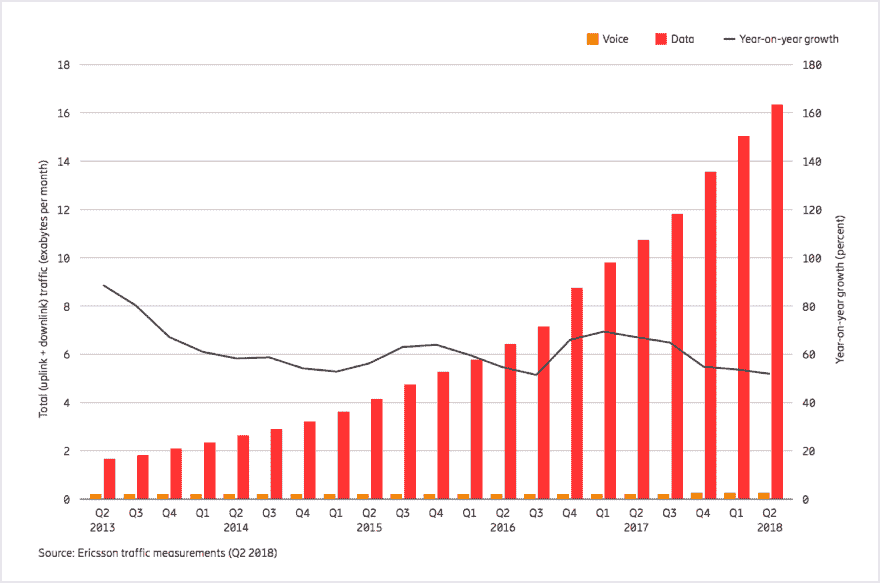
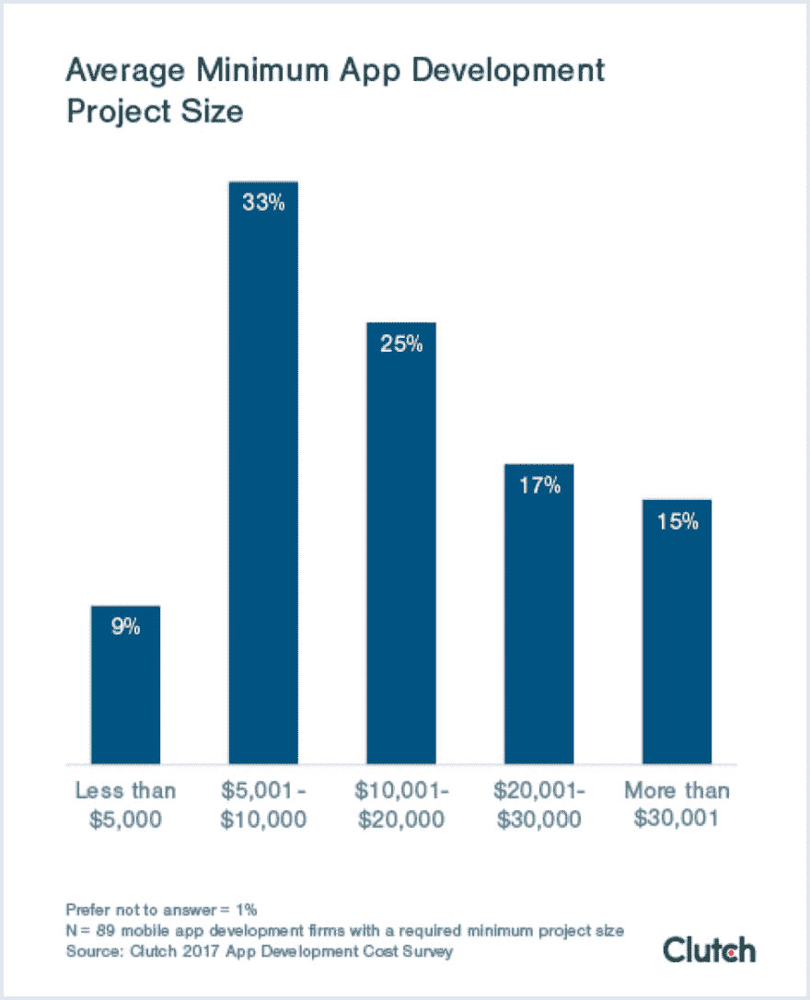
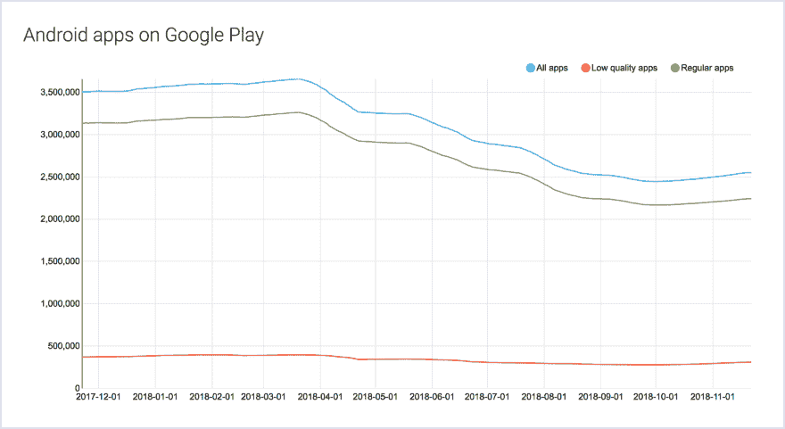

# 渐进式网络应用 vs 本地应用。第一部分

> 原文：<https://dev.to/codicacom/progressive-web-apps-vs-native-apps-part-1-4ggg>

如今，我们每个人都无法想象没有我们的好朋友-移动设备的生活。我们相信你每天至少会检查几次智能手机。

多年来，本地(或混合)移动应用是公司接触移动用户的唯一选择。然而，最近情况发生了戏剧性的变化。PWA 技术已成为任何规模的企业与活跃移动用户互动的替代选择。

本文的目的是比较本地移动技术和渐进式 web 技术。此外，我们将为您提供以下问题的答案:

*   您的企业何时应该建立 PWA
*   当原生移动应用是最佳选择时。

在第一部分中，我们想告诉你诸如**应用创建、分发、安装和用户参与**等问题。所以，让我们开始吧。

## 什么是 PWA？

渐进式网络应用指的是谷歌的创新技术。长话短说，PWAs 包含了最好的本地移动和网络技术。

你可能想知道为什么移动用户如此重要。以下是显示 2013 年 Q2 奥运会和 2018 年 Q2 奥运会之间全球移动数据消费趋势的统计数据。

来源:[爱立信移动记录](https://www.ericsson.com/assets/local/mobility-report/documents/2018/emr-q2-update-2018.pdf)

因此，这也是企业需要关注移动用户的原因之一。

PWA 作为一个网站工作，但提供几乎完整的原生移动应用程序体验，包括推送通知、离线工作和屏幕响应页面。

这就是谷歌对企业主和用户利益的定义:

*   提高转化率:快速加载页面可以防止用户放弃应用程序，帮助他们快速找到他们想要的东西。
*   增加参与度:推送通知可即时提醒用户新内容。
*   工作可靠:由于预先缓存，PWAs 即使在没有连接的情况下也能工作。

参见:[什么是渐进式 Web 应用程序，以及它们如何使您的项目受益](https://www.codica.com/blog/what-are-pwas-and-their-benefits)

## PWAs 和原生应用:详细对比

### 1。应用程序创建和上市

原生应用
实际上，一个 Android 和 iOS 的原生移动应用开发需要两个团队，每个系统一个团队。即使两个系统的应用程序同时开发，也需要更长的时间来确保两个应用程序的功能相同。因此，创建原生应用程序需要相当多的时间和成本。

以下是 2017 年离合器应用程序开发成本调查的统计数据，显示平均应用程序开发成本约为 5000 美元至 10000 美元。

来源:[离合器](https://clutch.co/app-developers/resources/cost-build-mobile-app-survey?utm_source=brainhubeu)

通过应用商店提交和批准是原生移动应用发布的一个单独部分。该产品将不得不经历一个缓和期，这通常需要时间。对于 Google Play 市场，可能需要几个小时，而对于苹果应用商店，可能需要 2 到 4 天。虽然幅度不大，但这延迟了你的应用在市场上的推出。

反之亦然。创建 PWA 只需要一个专业的 web 开发团队。问题是，它实际上是一个网站，尽管有一些原生应用程序的功能。

该选项将应用程序的创建和启动速度提高了 2 倍，原因有二:

PWA 仍然是一个网站，尽管速度加快了。创建一个应用程序唯一需要的是一个熟练的程序员团队。他们将处理 PWA 技术部分，如服务人员、灯塔等。

不需要通过商店验证，因为你正在建立一个网站。你不必将你的应用提交给任何商店，也不必等待它被批准。

总结一下。PWA 更具成本效益和时间效益。原生移动应用的构建成本更高，商店的验证过程也需要更多时间。

### 2。应用分发

**手机 App**
最初，我们来看看一些数字。
目前， [Google Play 市场](https://play.google.com/store?hl=en)拥有超过 250 万个应用。

来源: [Appbrain](https://www.appbrain.com/stats/number-of-android-apps) (数据有效期为 2018 年 11 月)

这对你意味着什么？市场上还有数以百万计的其他应用。如果您希望潜在用户安装您的应用程序，您应该使您的应用程序符合以下条件之一:

*   独一无二；
*   极有价值；
*   容易被注意到，也就是付费推广的意思。

**PWA**
跟 PWAs，分配的过程完全不同。用户将在谷歌上搜索产品或服务，并找到你的渐进式网站，这将建议用户在主屏幕上添加它。

谷歌搜索优化已经完全实现了移动优先指数化，比应用搜索优化效果更好。

有关系吗？当然可以！您的 PWA 可能会在 Google 搜索结果中排名靠前，这使它更容易被发现。

### 3。装置

**原生应用**
要安装你的手机应用，一般用户需要:

1.  在数以百万计的应用中找到你的服务；
2.  下载安装；
3.  只有现在他们才能打开并使用它。

以下是用户安装 PWA 的简单步骤。

1.  通过任何搜索引擎找到你的 PWA 网站；
2.  打开它；
3.  当弹出提示出现时，允许“添加到主屏幕”。(IOS 用户必须使用浏览器菜单中的“添加到主屏幕”选项)；
4.  该应用程序在主屏幕上随时可用。

### 4。用户参与度

吸引用户是任何商业领域的关键部分，尤其是如果你正在建立一个电子商务或订阅发布平台。

你的用户参与度越高，他们在你的平台上花费的时间就越多，购买的东西也就越多。如何让他们订婚？

最强大的参与工具之一是推送通知。这些消息通过安装的应用程序发送到用户的移动或桌面设备上，提醒用户有新的进货、销售或其他消息。

推送通知只会发送给允许应用程序发送通知的用户。他们帮助你与你的消费者保持联系，并让他们了解最新情况。因此，用户更有可能访问在线商店或检查服务，看看有什么新的。

**原生应用**
在原生移动应用中，推送通知功能的可用性并不取决于设备的操作系统或型号。不管这些因素如何，用户都会收到它们。

在 Progressive Web 应用程序中，推送通知也是可用的，但仅适用于 Android。这可以通过服务人员来实现:当渐进式 Web 应用程序没有运行时，他们可以发送通知。

## 结论

在这里，我们向您展示了文章的第一部分，涵盖了诸如**应用创建、分发、安装和用户参与**等挑战。第二部分即将推出，届时我们将向您介绍离线工作、设备电源和存储、设备功能访问以及更新和维护。

敬请关注，点击此处阅读全文:[渐进式网络应用 vs 本地应用](https://www.codica.com/blog/progressive-web-apps-vs-native/)。