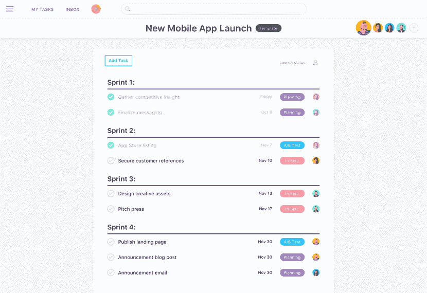
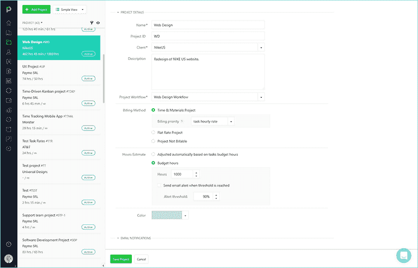
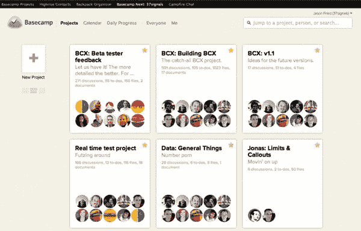
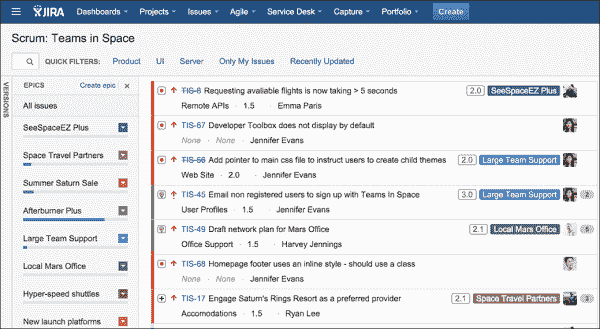
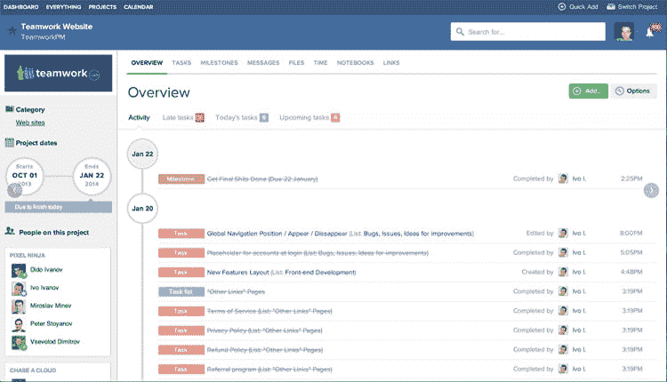

# 小型团队的项目管理工具

> 原文：<https://dev.to/eric_smith09/project-management-tools-for-small-teams-1n0n>

根据 Capterra 的一份报告，59%的美国员工认为沟通是他们团队取得成功的最大障碍。在顺利的日子里，同时管理多个项目和健康的沟通是困难的，当不想要的问题出现时，这是绝对不可能的。

项目管理是一门艺术，它将所有移动的部分编排成一个具体的计划。而做到这一点并不是一件容易的事情。但是成功的项目经理是如何做到如此毫不费力的呢？使用最好的项目管理工具。

在我作为项目经理的职业生涯中，我遇到了一些最好的工具，它们帮助我进行完美的项目规划和高效的团队协作。然而，没有通用的规则，不同的工具可以完美地满足不同团队规模的需求。

如果具体说创业公司，团队规模小，项目敏捷性高，团队协作真的很关键。在本文中，我列出了一些适用于这种情况的最佳项目管理工具。

# 1。阿萨纳

列表是不可避免的，也是组织信息最著名的方式。这就是为什么待办事项是任何项目管理不可或缺的一部分。有很多待办事项清单，尽管 Asana 是我最喜欢的一个。管理[体式](https://asana.com/)上的待办事项很容易，同时创建并与你的团队分享它们。

此外，Asana 有一个非常简单的界面，所以你不会花太多时间浏览软件。对于每个待办事项，Asana 为您提供了创建子任务、定义每个任务、添加类别标签和附加文件的选项。

# 2。佩莫

如果你是一家服务公司，开发票和时间跟踪是你的项目管理系统的两个重要特性需求。Paymo 是一款优秀的软件，可以直接与客户合作。免费版只允许单用户访问。然而，如果你是一个小团队或自由职业者，这是最好的。

它帮助您跟踪财务状况，组织项目时间表，并创建待办事项列表。同时还包括看板板、时间追踪、文件共享、Adobe CC 扩展、报表、三张发票。

# 3。基地营

成功的项目管理都是关于正确的团队协作。只是在过去的几年里，项目经理们才意识到，在团队协作中，电子邮件并不是一个高效的工具。如果你在谷歌上搜索过项目管理工具，我敢肯定你一定见过 [BaseCamp](https://basecamp.com/) 。

Basecamp 是我工作的洛杉矶的应用程序开发人员的最爱。其简单的留言板、本地聊天应用和内部文件共享选项使 Basecamp 成为队友和客户的突出选择。

# 4。吉拉

吉拉为你提供了看板、敏捷和 Scrum 计划板以及许多其他特性，允许开发团队与他人共享和集成他们的数据。它还有详细的报告工具和定制的仪表板，让您全面了解各个项目的进度。

吉拉最引人注目的功能之一是其可定制的工作流程。通过应用程序集成，自动化工作流也很容易。除此之外，它有 900 种可能的应用程序集成，以满足您的动态需求。

# 5。协力

如果你是一家拥有远程团队的初创公司，那么[团队合作](https://www.teamwork.com/)项目管理工具最适合你。通过让您创建团队成员状态更新，让远程员工知道他们同事的日程安排，这在将远程团队聚集在一起方面最有效。

它还具有客户服务功能，包括分配报价机的选项，在一个地方查找客户的电子邮件等。除此之外，私人消息和使项目细节私人化的选项使团队合作成为一种有吸引力的项目管理工具。

项目管理确实是应用程序开发行业不可或缺的一部分。做对了才是关键！在 Twitter [@Eric_Smith09](https://twitter.com/Eric_Smith09) 上与我联系，让我知道你是否使用任何其他工具以及原因。