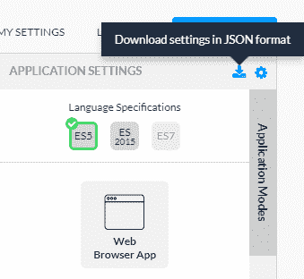
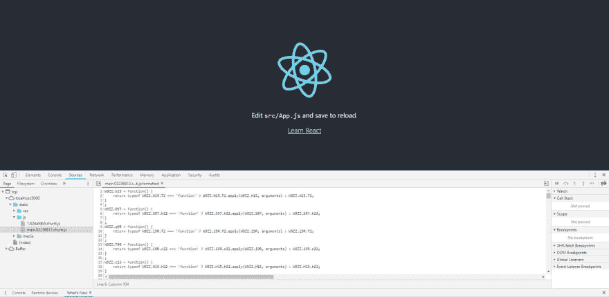

# 用 Jscrambler 保护 React.js 源代码

> 原文：<https://dev.to/jscrambler/protecting-your-reactjs-source-code-with-jscrambler-36nn>

React.js 是最流行的 JavaScript 库之一。2018 年“JavaScript 现状”调查将 React 列为首选的[前端框架](https://2018.stateofjs.com/front-end-frameworks/overview/)，65%的受访者表示他们已经使用过它，并将再次使用。

凭借其优雅的编程风格、丰富的包生态系统和良好的文档，React 已经找到了驱动大型企业应用程序的方法。具体来说，开发者调查发现 **18%使用 React 的应答者为拥有超过 1000 名员工的公司工作**。

众所周知，JavaScript 的本质意味着它不能被加密，很容易在客户端被访问，甚至被篡改。

> 因为 React 支持企业级应用程序，所以它需要 Jscrambler 这样的企业级安全解决方案。

本教程将在几分钟内解释如何将 Jscrambler 无缝集成到 React 的构建过程中。您将学习如何使用最先进的多态混淆技术，以及密码锁和自我防御功能来保护 React 源代码。

## 先决条件

将 Jscrambler 正确集成到 React 构建过程中只需要做两件事:**创建 React 应用**和**配置 Jscrambler** 。我们将在下面强调这两者。

### 如何创建一个 *React* 应用程序

出于本教程的目的，我们将使用一个`create-react-app`样板应用程序。首先，我们需要使用 npm:
来安装它

```
npm i -g create-react-app 
```

这将下载`create-react-app`并使用最新 React 版本所需的所有依赖项进行全局安装。

现在，我们准备创建样板应用程序，它将作为本教程的基础。使用以下命令创建这个新应用程序:

```
create-react-app react-jscrambler-boilerplate 
```

安装完成后，我们可以运行新创建的样板应用:

```
cd react-jscrambler-boilerplate
npm start 
```

我们新的 React 应用程序将在开发模式下运行，并在`localhost:3000`出现。在进入下一步之前，检查是否一切就绪。关于`create-react-app`的进一步帮助，参见[官方文档](https://reactjs.org/docs/create-a-new-react-app.html)。

[](https://res.cloudinary.com/practicaldev/image/fetch/s--zd5clPpK--/c_limit%2Cf_auto%2Cfl_progressive%2Cq_auto%2Cw_880/https://thepracticaldev.s3.amazonaws.com/i/kmyspzukjlq677y03neu.jpg)

我们的 *React* 应用程序的基础项目结构如下:

```
react-jscrambler-boilerplate/
|-- package-lock.json
|-- package.json
|-- yarn.lock
|-- build/
| |-- static/
| | |-- css/
| | |-- js/
| | |-- media/
|-- node_modules/
|-- public/
|-- src/ 
```

*   `package.json`包含所有与 npm 相关的配置，如依赖关系、版本和脚本。

*   `src`目录包含了应用程序的所有源代码。然后构建源代码并打包到`build`目录中。构建完成后，我们受保护的 HTML 和 JavaScript 文件将放在这里。

### 如何配置 Jscrambler

Jscrambler 的所有配置将驻留在一个文件中:`.jscramblerrc`。因此，我们需要创建这个文件来指定我们希望使用的转换。

实现这一点的最快方法是通过 Jscrambler 网络应用程序。在那里，创建一个新的应用程序。现在，在*应用模式*选项卡中，选择语言规范和应用类型。接下来，选择你想要的转换(检查*模板*和*微调*标签)。在本教程中，我们将选择*模糊*模板。如果您在这些步骤中需要帮助，请参考我们的[指南](https://blog.jscrambler.com/jscrambler-101-how-to-use-the-cli/?utm_source=dev.to&utm_medium=referral)。

现在，我们只需下载一个包含所有配置的 **JSON 文件，它将只用于快速获得所需的设置。**

<center></center>

现在，让我们在 React 项目的根文件夹中创建一个名为`.jscramblerrc`的新文件。打开我们刚刚下载的`jscrambler.json`文件，将其所有内容复制到`.jscramblerrc`文件中。在此之后，我们只需在`.jscramblerrc`中添加两个新的区段，即`filesSrc`和`filesDest`(见下文)。您最终的`.jscramblerrc`文件应该是这样的:

```
{  "keys":  {  "accessKey":  <ACCESS_KEY_HERE>,  "secretKey":  <SECRET_KEY_HERE>  },  "applicationId":  <APP_ID_HERE>,  "filesSrc":  [  "./build/**/*.html",  "./build/**/*.js"  ],  "filesDest":  "./",  "params":  [  {  "name":  "whitespaceRemoval"  },  {  "name":  "identifiersRenaming",  "options":  {  "mode":  "SAFEST"  }  },  {  "name":  "dotToBracketNotation"  },  {  "name":  "deadCodeInjection"  },  {  "name":  "stringConcealing"  },  {  "name":  "functionReordering"  },  {  "options":  {  "freq":  1,  "features":  [  "opaqueFunctions"  ]  },  "name":  "functionOutlining"  },  {  "name":  "propertyKeysObfuscation"  },  {  "name":  "regexObfuscation"  },  {  "name":  "booleanToAnything"  }  ],  "areSubscribersOrdered":  false,  "applicationTypes":  {  "webBrowserApp":  true,  "desktopApp":  false,  "serverApp":  false,  "hybridMobileApp":  false,  "javascriptNativeApp":  false,  "html5GameApp":  false  },  "languageSpecifications":  {  "es5":  true,  "es6":  false,  "es7":  false  },  "useRecommendedOrder":  true,  "jscramblerVersion":  "5.<X>"  } 
```

因为我们是通过 Jscrambler Web 应用程序直接获得这些信息的，所以我们的`accessKey`、`secretKey`和`applicationId`字段已经被填充了。如果您希望手动检索它们，请参考我们的[指南](https://blog.jscrambler.com/jscrambler-101-first-use/?utm_source=dev.to&utm_medium=referral)。

值得注意的是，`params`部分指定了将用于保护 React 应用程序的转换。**这些可以由您**亲自挑选，通过在 Web 应用程序中选择或手动设置。你可以在这里找到所有可用转换的文档[。](https://docs.jscrambler.com/code-integrity/documentation/transformations?utm_source=dev.to&utm_medium=referral)

您也可以更改`filesSrc`来匹配您需要/想要保护的文件。对于我们的例子——以及所有的 React 应用——我们建议保护`.html`和`.js`文件。当然，随着对项目的更好理解，你可以确定什么是关键的和必要的保护。

通过使用`filesDest: './'`，我们发送保护的文件将被它们的受保护版本覆盖。

## 在构建过程中集成 Jscrambler

使用 CLI 可能是生成您的版本的最常见方式。我们将使用样板应用程序来展示如何将 Jscrambler 集成到构建过程中。

我们与 *Jscrambler* 集成的第一步是安装 [Jscrambler API 客户端](https://github.com/jscrambler/jscrambler/tree/master/packages/jscrambler-cli)。简单跑:

```
npm i jscrambler --save-dev 
```

为了通过 CLI 将 Jscrambler 集成到我们应用程序的构建过程中，我们需要在`package.json`的*脚本*部分创建一个 CLI 钩子。该部分应该如下所示:

```
"scripts":  {  "start":  "react-scripts start",  "build":  "react-scripts build && jscrambler",  "test":  "react-scripts test",  "eject":  "react-scripts eject"  }, 
```

特定的`"build": "react-scripts build && jscrambler"`钩子将在构建过程完成后触发`jscrambler`命令。

为了使这个命令可执行，**我们需要确保我们之前创建的`.jscramblerrc`文件在我们项目的根文件夹**中。

我们现在已经准备好保护我们的代码，并通过 CLI 构建我们的应用程序:

```
npm run build 
```

这将在`build/static/`创建受保护的生产文件。

你完了！现在，您所有的 HTML 和 JavaScript 文件都受到 Jscrambler 的保护，可以防止代码窃取和逆向工程。请记住，您可以随时微调您的保护措施，以管理最终的性能损失。如果是这样，一定要跟着我们的[教程](https://blog.jscrambler.com/jscrambler-101-code-annotations/?utm_source=dev.to&utm_medium=referral)走。

**注意:**如果你已经弹出了你的项目，你也可以使用 Jscrambler [webpack 插件](https://github.com/jscrambler/jscrambler/tree/master/packages/jscrambler-webpack-plugin)来保护文件。

## 测试受保护的 React 应用

最后一步，让我们检查应用程序是否在新保护的源代码下成功运行。从安装所需的依赖项开始:

```
npm i -g serve 
```

接下来，让我们简单地将应用构建文件部署到本地开发服务器:

```
serve -s build 
```

现在，您应该能够在终端上看到，您可以在两个端口上运行这个服务器。一个是公开可用的，另一个是特定于您的机器的。

打开提供的 URL，您的应用程序将在浏览器中启动。

现在，您可以查看受保护文件的外观。这可以简单地通过打开浏览器的调试器并从“Sources”选项卡打开文件来实现。受保护的代码应该如下所示:

[](https://res.cloudinary.com/practicaldev/image/fetch/s--LV4nIP8_--/c_limit%2Cf_auto%2Cfl_progressive%2Cq_auto%2Cw_880/https://thepracticaldev.s3.amazonaws.com/i/3gibi73lub7dhjkzq8lo.jpg)

## 结论

毫无疑问， *React* 是大众的最爱，从个人开发者到大型企业。

如果您正在构建具有敏感逻辑的 React 应用程序，想要防止**逆向工程、许可违规和篡改**，像 Jscrambler 这样的安全解决方案是必须的。

将 Jscrambler 集成到 React 的构建过程中很简单，并且能够使用最复杂的**多态混淆**、**密码锁**和**自卫**功能来保护您的代码。

这一切都带有高级支持，因此如果您有任何问题，请务必[联系 Jscrambler 支持团队](//mailto:support@jscrambler.com)！