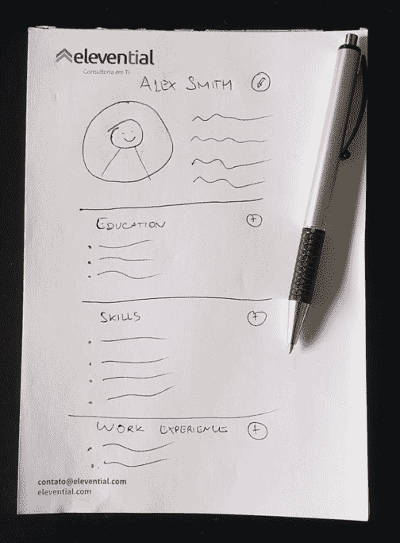
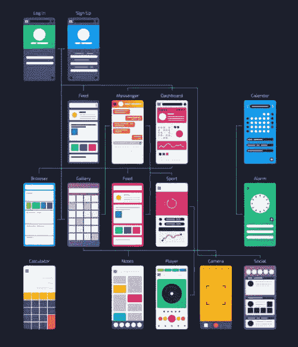
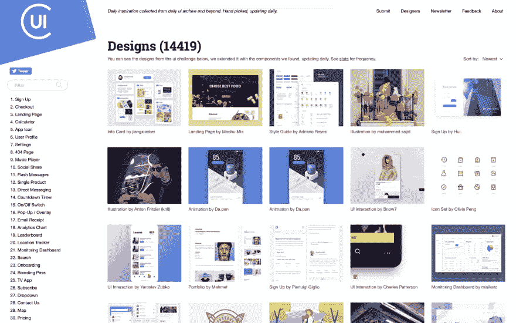
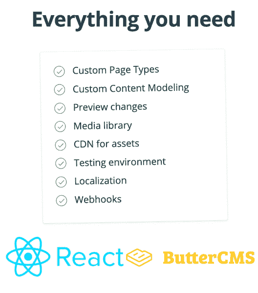

# 使用 React 为前端开发人员构建最佳实践原型

> 原文：<https://dev.to/pineapplecontent/prototyping-best-practices-using-react-for-front-end-developers-4l55>

对于客户来说，对他们想要开发的应用程序只有一个模糊的想法是很常见的。他们可能只是在尝试一种不完整的商业模式，而且很多时候缺乏技术背景。作为一名首席技术官，能够处理这种情况可以在一个沮丧的客户和一个成功的产品之间改变游戏规则。

一个软件，在其概念中，是一个简单的抽象概念。你 *想象* 你想实现什么，但是你做不到 *直到* 它出现(至少部分出现)。这就是为什么前端开发人员的工作真的很重要——它在你的客户 *想象的* 和他们 *看到的* 之间架起了一座桥梁。

通过快速向客户展示一些东西 *视觉* 你可以收集更多相关的反馈，避免早期陷阱，并显著增加成功的可能性。此外，您的客户可能不会关心出色的后端工作，因为他们无法直接看到它！对于非技术人员来说，现实是 UI 会造成更大的影响。

这篇文章旨在为你提供一个简单的指南，告诉你如何使用 [React](https://reactjs.org/) 有效地构建前端应用的原型。您将在这里找到的信息是在几年的咨询工作中汇编的，包含许多客户的反馈。

*ButterCMS 是一个基于 API 的 CMS，用于 React 应用。 **[使用我们的 Node.js API 客户端，在几分钟内将 ButterCMS 添加到您的 React 应用程序](/react-cms/)** 。*

# 适合工作的工具

当追求效率时，必须使用正确的工具。这不是关于 2019 年哪种技术或框架对你的项目更好(T2)的辩论，而是关于给定你的堆栈的选择(在我们的情况下，反应)什么工具可以提高你的速度(T3)。

## 启动器

你不想在这个阶段浪费时间优化你的 webpack 或者安装 Babel 插件，所以推荐一个好的入门工具。有很多，但我会强调以下:

*   [创建-反应-应用](https://facebook.github.io/create-react-app/) :用一个命令行，启动一个反应应用。它有插件功能，也有改变高级设置的能力。它由 React 团队维护，因此您可以期待持续的开发和改进。它不那么固执己见，这意味着您仍然需要对它进行一些调整(例如，添加路由)。
*   [GatsbyJS](https://www.gatsbyjs.org/) :创建速度极快的应用程序，这些应用程序具有出色的特性，如预抓取、代码分割和开箱即用的离线支持。自带路由解决方案，并使用 GraphQL 作为获取数据的接口。(*既然我们在这里，你也应该看看[如何使用 ButterCMS](/blog/how-to-use-gatsby-with-a-headless-cms)* )
*   [NextJS](https://nextjs.org/) :类似于 Gatsby，但专注于服务器端渲染，这意味着增强的 SEO 功能(尽管在原型中你可能对此不太感兴趣)和通用渲染(JavaScript 无处不在)。

事实是，你和他们中的任何一个都会相处得很好。就我个人而言，我喜欢在项目前端繁重(意味着大量静态页面和很少与服务器连接)的情况下使用 Gatsby。如果我需要更多的自由来使用我想要的图书馆，CRA 将是我的选择。最后，如果我更关心后端，并且愿意在那里使用 JavaScript，NextJS 非常适合。

## 部署

做前端工作最大的好处之一就是部署和分享变得琐碎。有许多免费的解决方案可以让你在几分钟内部署好你的原型。

你可以用[Netlify](https://www.netlify.com/)[现在](https://zeit.co/now) 和 [浪涌](https://surge.sh/) (等等)来实现。他们都将掩护你，并提供 HTTPS 支持，自定义域和持续发展。特别是，我非常喜欢 Netlify，并且发现它们的部署过程极其琐碎。只需连接你的 GitHub 或 BitBucket 帐户，输入你的代码，然后等待几秒钟，直到你的应用程序可以在互联网上使用。

创建一个拥有自定义域名的静态网站并与你的客户分享的能力是无价的。这是一个很好的策略，让他们接近开发，请他们帮助测试多个设备，并因此让他们收集反馈并更早地发现错误。

# 最开始

现在你已经决定了你的入门，并且能够在 5 分钟内部署并与你的客户分享一个“Hello World ”,是时候开始为你的 React 应用设计你的 UI 了。

T6】

作为一名非设计师，我的第一直觉是起草一份界面的草图。这个过程帮助我把一些抽象的东西变成具体的。

假设您的客户想要开发一个简历应用程序，用户可以在其中填写个人信息、工作经历、相关技能和教育背景。停下来几分钟，试着在你的脑海中描绘这个应用程序。每个部分是如何显示的？你认为用户需要上传照片吗？你见过做类似于 T2 的事情的软件吗？如果是这样，有什么好的？

以下是我想到的:

<figure>

<figcaption>A simple and rough draft can help you as a starting point</figcaption>

</figure>

如你所见，我不是巴勃罗·毕加索。不过没关系——我对最终的设计还不感兴趣，只是一个基础布局。一旦有了这些，我就可以开始定位 HTML 元素，添加一些 [CSS](/blog/how-to-take-your-css-to-the-next-level "Overview of modern CSS") ，并获得一些反馈。

### 寻找灵感

有一个起点是好的，但你不想展示一个看起来像是 1996 年开发的应用程序。为了给你的素描增添一点魅力，你可以开始寻找灵感了。

T4】

正如我已经提到的，一个好的开始方式是找出具有相似功能的应用程序。在我们的例子中， [LinkedIn](https://www.linkedin.com "LinkedIn") 肯定是匹配的。**重要:** ***你不想做副本*** **。但是如果你的用户能够很容易地与这个界面联系起来，这就是一个成功。注意时尚趋势。细节在这里真的很重要:填充、字体大小、文本和背景颜色、阴影等等。**

搜索特定的用户界面设计也是一个好主意。一个很好的网站是[收集用户界面](http://collectui.com "Collect UI")。虽然我并不指望能创作出精美的动画，但我确实从他们的图库中获得了很多好的灵感。

<figure>

<figcaption>CollectUI</figcaption>

</figure>

最后，还有一些库提供了一些常见的 React 组件，如按钮、表单组件、标题等。我最喜欢的一个是 [语义 UI React](https://react.semantic-ui.com/ "Semantic UI") ，可扩展可定制。挑选一个好的收藏可以节省你很多时间。

## 从 HTML 和 CSS 开始

是时候将草图和你的灵感转化为代码了。你在应用程序的具体性上又前进了一步。做这件事的最好方法是什么？

更简单的方法是只从 HTML 和 CSS 开始，即使你使用的是 React starter。开始放置 DOM 元素，尝试不同的风格。更改位置、颜色、边框。聚合 UI 的相关部分，但不要试图过度工程化:不需要开始将 UI 分解成多个 React 元素或关心可重用性。当然，这是必须的。但是此时此刻，把你的思想从框架细节中解放出来，关心你的应用程序应该如何反应 *看起来* 。

在这个阶段，我避免加入太多互动或特效。如果你设想在按钮上有一个华丽的悬停效果，或者想动态地给你的简历添加技能，那就暂时把这个放在一边。

当心会增加复杂性的第三方库-不需要安装令人敬畏的[react-drop zone](https://github.com/react-dropzone/react-dropzone)包，尽管让用户在这一点上添加新的头像会很酷。首先，你可能还有很多未解决的问题——如果头像应该被添加到“我的帐户”页面呢？或者如果客户需要裁剪照片的能力呢？不同的图像扩展呢？最终，现在不是合适的时机。第二，区分优先次序:如果你没有时间了，你是愿意用占位符头像来完成整个布局，还是选择允许拖放的半生不熟的页面？

## 不要大意

迄今为止，我的大部分建议都很实用。你应该专注于完成一个布局，并能够与你的客户分享。很可能，你的截止日期很短(就像每个截止日期一样)。你很想创作出脑海中出现的第一个设计，把它放在 Netlify 中，然后通过电子邮件发送 URL。

不要这样做。

虽然我听起来很矛盾，但有一个很好的理由: *你不希望你的工作被认为是懒惰或鲁莽的* 。留下良好的第一印象非常重要，否则你会让你的客户感到沮丧。这并不意味着你需要在征求反馈之前重做你的设计十次——但是请记住，你将会被你的 UI 质量所评判，即使你发誓“这只是初稿，当然还会改进”。

当你的设计看起来足够专业，并且当你把它与你的灵感进行比较时，它看起来不像是一个本科生匆忙完成的，你就可以走了。

# 添加交互性

至此，你应该对你的 React 应用需要做什么有了更好的理解。是时候把这个网页转化成一个 web app 了。让乐趣开始吧！

## 低垂的果实

从小处着手。你的客户希望你能在最短的时间内完成哪些功能？这些是理想的初始候选人。

在我们的草图中，每个部分的右侧都有一个加号按钮。假设一个需求是向其中动态添加项目。React 让这种行为变得非常简单，很难想象没有这个功能的应用程序。如果您的客户改变了主意，想要添加新的项目，比如说，通过模态窗口，您不会浪费太多时间。

## 不要炫耀

毫无疑问，JavaScript 是开发中最复杂的部分，这就是为什么你要控制住它。虽然你可能已经为你正在构建的软件设想了奇特的交互，但是要抵制“炫耀”的诱惑。

首先，你处于复杂逻辑生活的领域。如果您做出了错误的判断，并且某个特性被证明比预期的更难实现，那么您可能会过早地感到沮丧，从而影响最终期限。

第二，你不要给自己设陷阱。假设您希望能够删除部分中的每一项。你打算怎么做？

当然，有很多方法。你可以有一个减号按钮，当鼠标悬停在每一项之后时，它就会出现，当你点击它时，它就会被移除。您也可以在左侧有一个复选框和一个按钮来删除所有标记的项目。如果能够拖动每一件物品并把它们扔进垃圾桶会怎么样？

T4】

三个选项中没有一个必然比另一个好。但是你可以很容易地识别出更简单的。留有较少解释余地的方案是首选。在这个例子中,“删除”按钮应该在哪里？复选框总是可见吗？有必要有一个“全选”选项吗？对于拖放解决方案，移动设备呢？您希望支持所有操作系统吗？垃圾桶应该在哪里？你需要第三方库吗？

确保*你*不是那个给项目增加复杂性的人。

## 关注幸福之路

真实世界的网络应用不应该允许用户为所欲为。例如，如果你在技能部分增加一个新项目，你当然不能增加一篇 2000 字的文章。

尽管如此，这种工作可能很麻烦，价值也不高。如果您的客户想要测试应用程序并验证他们的视图，那么添加一个很长的字符串作为技能项可能还不是一个问题。他们甚至可能没有意识到你正在执行验证！

重要的是你要和你的客户一起定义 *快乐路径* ，也就是用户在没有任何意外发生的情况下陷入的最常见场景。在我们的例子中，可以是用户访问他们的个人资料，用有效信息填充每个部分并保存。这是一个有用且可测试的场景。

把边缘案件留待以后处理。回想一下 [帕累托原理](https://en.wikipedia.org/wiki/Pareto_principle) ，或者 80/20 法则:80%的场景用 20%的工作完成。

# 将 UI 从后端解耦

毫无疑问，后端开发对您的应用程序的成功至关重要。然而，如果你的目标是快速原型化一个界面，你可以没有它。

主要原因是后端带来的大部分优化和改进在现阶段都不是很切题。如前所述，很可能您的客户不太关心您是否使用了正确的 ORM 或 AWS 中的自动伸缩。同样，这并不意味着它们没有价值——只是现在有其他事情需要关注。

## 将 UI 与 API 分离

React 并不固执己见，因此每个开发人员都可以有自己的偏好，比如如何拆分逻辑、创建 UI 元素、管理副作用等等。作为对标准化程序的回应，社区中出现了许多模式，但最终，这是您的责任。

过去，人们会谈论“智能”和“非智能”组件。这演变成了政治上更正确的术语“有状态的”和“纯的”或“容器的”和“表示的”。最终，它们都有相同的目标:将复杂的逻辑和有状态的表示从 UI 中分离出来。

为什么会这样？嗯，“表示”组件更容易实现。它们是简单的 React 组件，对业务逻辑知之甚少或一无所知，更不用说 API 特性了。如果您正在构建一个技能的动态列表，那么如果您从 REST API 或 GraphQL 服务器获取这些信息，您当然可以从开发列表和项目开始，而不必太在意。

## 钩子是你的朋友

丹·阿布拉莫夫 有一个著名的帖子，解释了他对上述话题的看法。不过原帖是 2015 年的 [最近才反应过来推出官方对钩子的支持。T9】](https://reactjs.org/blog/2019/02/06/react-v16.8.0.html)

正如文章中提到的，钩子是关注点分离的另一种方式。不是重用 *组件* ，现在可以重用 *逻辑* 。这种新的范式大大加快了开发。例如，假设您的客户端需要一些键盘快捷键，比如按 Ctrl + N 来创建一个新项目。你已经有了条目的用户界面，可能还有一个 addItem 函数。在这种情况下，你需要做的就是 *把* 所需要的逻辑钩入 UI。 [使用按键](https://usehooks.com/useKeyPress/) 将让你的生活变得轻而易举。

## 为真实数据准备地形

如果你成功地将 UI 从复杂的逻辑或 API 调用中分离出来，开发过程将会变得更加顺利。既然如此，即使您还没有端点，也可以为获取数据准备组件！

假设您想为我们的示例应用程序创建一个“编辑个人资料”页面。这将涉及从 API 获取数据并填充相应的字段。在前端开发方面，你不需要等后端和数据库设置好了再开始做。创建一个模仿 API 响应的模拟对象(这使得设计 API 变得非常重要),并将其输入到您的“纯”或“表示”组件中。

如果您需要保存数据，例如能够编辑个人资料，点击保存并在刷新屏幕时查看更改，尝试本地存储。虽然不建议在生产中使用，但它对原型来说也很好。如果你对钩子感兴趣，有一个[useLocalStorage](https://usehooks.com/useLocalStorage/)钩子可以简化这个过程。

当时机成熟时，在这一阶段取得成功将使切换到真实数据成为一个毫不费力的过程。

# 最终想法

本文包含的所有技巧都是多年前端开发的个人汇编。这并不是某种最终的手册，而是提供如何有效处理客户请求和保持项目质量的指导。

主要要点可以总结为以下几点:

*   ***沟通早*** **。越早得到反馈，你花在重做工作上的时间就越少。当您处于原型开发阶段时，这在某种程度上是可以预料到的，因此有效地这样做将会对您的速度产生积极的影响。**

*   ***避锋芒**。*记住，你可以用 20%的工作覆盖 80%的场景。帮你的客户一个忙，用更少的时间完成更多有意义的功能。

*   ***不要过度渲染*** ***。原型是脆弱的，可能会被修改，有时开发起来会令人沮丧。你不想花太多时间抽象，只是为了发现一切都会改变。***

*   ***设计 API*** ***。客户会先判断界面，所以你应该多花些精力把它做好。然而，确保你有一个清晰的 API 设计，这样，到时候，你就可以无缝地插入前端和后端。***

*[使用 ButterCMS 和 React](/react-cms/ "Use ButterCMS with React") 在你的应用中为博客、页面等启用动态内容*。

T4】

### **[在你的 React app](/react-cms/)** 里试试 ButterCMS