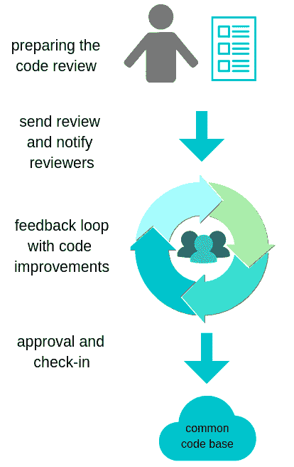
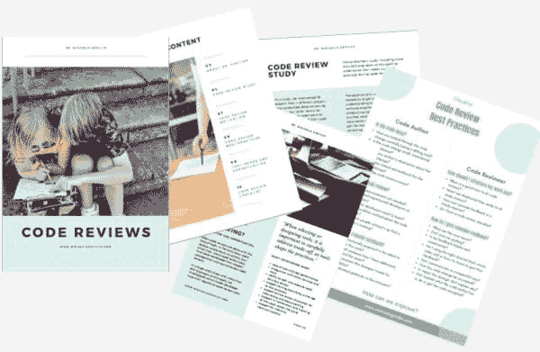

# 微软成熟的代码评审最佳实践

> 原文：<https://dev.to/mgreiler/proven-code-review-best-practices-from-microsoft-aap>

微软等公司遵循哪些代码评审最佳实践来确保[良好的代码评审反馈](https://www.michaelagreiler.com/great-code-review-feedback/)？你如何[在进行代码评审的同时保持高效](https://www.michaelagreiler.com/developer-productivity/)？在这篇文章中，学习来自微软的经过验证的代码评审最佳实践。

代码评审的好处随着代码评审反馈的价值而起伏。如果做得正确，代码评审可以帮助确保高质量的代码库。然而，如果团队没有意识到并且没有遵循代码评审最佳实践，开发人员可能会经历几个[代码评审陷阱](https://www.michaelagreiler.com/code-review-pitfalls-slow-down/)。在最坏的情况下，[审查代码会让你的团队慢下来](https://www.michaelagreiler.com/wp-content/uploads/2019/02/Code-Reviews-Do-Not-Find-Bugs.-How-the-Current-Code-Review-Best-Practice-Slows-Us-Down.pdf)。

我已经在微软的团队中研究和工作了好几年。通过[几个大规模的研究](https://www.michaelagreiler.com/publications/)，我们发现了大量的代码评审最佳实践，它们帮助团队保持生产力并[提升他们的代码评审价值](https://www.michaelagreiler.com/great-code-review-feedback/)。但首先，让我们从头开始。代码评审是什么样子的？

## 典型的代码评审过程

一个典型的基于工具的代码评审过程在工程师准备评审代码时开始。然后，她为代码变更选择相关的审阅者。评审员得到通知，并对代码给出反馈。代码评审作者处理反馈，直到各方都满意为止。然后，将代码签入公共代码库。

<figure> 

<figcaption>典型的工具型代码评审</figcaption>

</figure>

为了确保这个过程是顺利的，而不是变成一场噩梦，重要的是[理解代码审查陷阱](https://www.michaelagreiler.com/code-review-pitfalls-slow-down/)以及你可以遵循哪些代码审查最佳实践来克服它们。

主要的代码审查陷阱是:

*   没有得到有用的反馈，
*   没有足够的时间进行代码审查，
*   代码审查耗时过长，导致等待时间过长。

我在下面介绍的代码评审最佳实践，通过使评审人员的工作尽可能的简单，有助于抵消这些缺陷。它们也有助于评审者专注于提供有价值的反馈。

## 代码作者的代码评审最佳实践

在代码审查中，有两个不同的利益相关者:要求反馈的代码作者和检查代码变更并提供反馈的代码审查者。由于代码评审是从作者开始的，所以我首先为代码作者解释代码评审的最佳实践。

<figure> 

<figcaption>退房 VIP [代码审查电子书](https://www.michaelagreiler.com/code-review-e-book/)我为我的订户准备的。</figcaption>

</figure>

对于我的电子邮件订阅者，我准备了一本独家的**代码评审电子书，其中包括一份清单**，上面有所有的代码评审最佳实践。我还添加了额外的额外见解。你可以在这里申请[代码评审电子书](https://www.michaelagreiler.com/code-review-e-book/)。

## 仔细通读变化

第一个代码评审最佳实践是在提交代码进行评审之前仔细阅读代码变更。没有什么比让几个开发人员检查代码并对您自己可以解决的问题给出反馈更糟糕的了。

这浪费了每个人的时间，而且可能会让你看起来很糟糕。对于未来的代码审查，开发人员也可能不愿意审查您的代码。

因此，请确保您使用代码审查工具或 diff 工具，它们可以突出这个版本和以前版本之间的变化。因为代码以不同的方式呈现，并且突出显示了更改的代码段，所以在发送代码之前，您可以更容易地自己检查代码。

通常，您会看到您实际上忘记了自己所做的更改，或者在要求他人审阅之前突出显示了您应该解决的遗漏问题。

修复问题的最佳时机是在代码被提交审查之前。

<figure> 

<figcaption>在提交评审前彻底检查你的代码
图片由 [Marten Newhall](https://unsplash.com/photos/uAFjFsMS3YY?utm_source=unsplash&utm_medium=referral&utm_content=creditCopyText) 上传 [Unsplash](https://unsplash.com/search/photos/magnifier?utm_source=unsplash&utm_medium=referral&utm_content=creditCopyText)</figcaption>

</figure>

* * *

修复问题的最佳时机是在代码被提交审查之前。 [点击推文](https://twitter.com/intent/tweet?url=https://www.michaelagreiler.com/code-review-best-practices/&text=The%20best%20time%20to%20fix%20issues%20is%20before%20the%20code%20is%20sent%20out%20for%20review.%20&via=mgreiler&related=mgreiler)

* * *

## 以微小的、渐进的变化为目标

作为一名开发人员，您应该始终致力于小的、渐进的和连贯的变更。这种最佳实践在使用代码修订工具时很有帮助，比如 git 或 SVN。

小的、增量的代码变更也是至关重要的代码评审最佳实践，因为其他开发人员必须能够在短时间内理解您的代码变更。

> 10 行代码= 10 个问题。
> 
> 500 行代码=“看起来不错。”
> 
> 代码审查。
> 
> —我是 dev loper(@ iamdevloper)[2013 年 11 月 5 日](https://twitter.com/iamdevloper/status/397664295875805184?ref_src=twsrc%5Etfw)

如果在一次代码评审中发生了几个目的不同的变更[，那么代码评审的任务就变得更加困难](https://www.michaelagreiler.com/code-review-pitfalls-slow-down/)。这也降低了代码评审者发现代码问题的能力。在一些研究中，我们看到代码评审反馈的价值随着被评审的变更的大小而减少。

另一方面，您还希望确保变更是连贯的。很少有代码变更小到无法发送出去的情况。它发生了，但是，不经常。

* * *

代码评审反馈的质量和价值随着变更的大小而降低。 [点击推文](https://twitter.com/intent/tweet?url=https://www.michaelagreiler.com/code-review-best-practices/&text=The%20quality%20and%20value%20of%20code%20review%20feedback%20decrease%20with%20the%20size%20of%20the%20change.%20&via=mgreiler&related=mgreiler)

* * *

## 集群相关变化

另一个代码评审的最佳实践是将相关的代码聚集起来。假设您计划添加一些新功能，修复另一个函数中的错误，并重构一个类。然后，这些变更中的每一个都应该是单独的代码审查。这样，您可以确保代码更改的目的对于审阅者来说是清楚的。一个明确的目标会使评估工作变得更加容易，并增加反馈的价值。

## 形容改变的目的和动机

确保您在代码评审准备期间投入正确时间的一个方法是写一份关于代码变更的描述。通过一个小小的注释，你可以帮助代码审查者理解代码变更的目的以及你为什么要变更它。这种代码评审最佳实践加速了代码评审时间，提高了反馈的质量和价值，并提高了代码评审的参与率。

<figure> 

<figcaption>代码复习不是难题。通过描述代码更改，帮助审阅者关注关键问题。
照片由[汉斯-彼得·高斯特](https://unsplash.com/photos/3y1zF4hIPCg?utm_source=unsplash&utm_medium=referral&utm_content=creditCopyText)拍摄于 [Unsplash](https://unsplash.com/search/photos/puzzle?utm_source=unsplash&utm_medium=referral&utm_content=creditCopyText)
</figcaption>

</figure>

* * *

代码审查不是难题。通过描述代码更改，帮助审阅者关注关键问题。 [点击推文](https://twitter.com/intent/tweet?url=https://www.michaelagreiler.com/code-review-best-practices/&text=Code%20reviewing%20isn%27t%20a%20puzzle.%20Help%20reviewers%20focus%20on%20key%20issues%20by%20describing%20the%20code%20change.&via=mgreiler&related=mgreiler)

* * *

有趣的是，在我们的研究中，我们观察到开发人员非常欣赏代码变更描述。他们实际上希望更多的人来写描述。另一方面，我们看到同样的开发人员并不总是包括描述本身。

其中一个原因是，当你自己写代码的时候，你是如此的关注代码，以至于你认为它是不言自明的。事实是，它不是。

如果你不帮助评审者理解代码，[他们将不能提供有价值的反馈](https://www.michaelagreiler.com/code-review-pitfalls-slow-down/)。

因此，请写下注释，即使它只是说:“更新 API 端点以符合安全法规”。

有了这个笔记，审查代码的工作变得简单了多少？记住，代码审查不是一个难题！

* * *

即使代码变化对你来说微不足道，也要添加描述，这样评审者就知道会发生什么。 [点击推文](https://twitter.com/intent/tweet?url=https://www.michaelagreiler.com/code-review-best-practices/&text=Even%20if%20the%20code%20change%20seems%20trivial%20to%20you%2C%20add%20a%20description%2C%20so%20reviewers%20know%20what%20to%20expect.&via=mgreiler&related=mgreiler)

* * *

## 在提交代码评审之前运行测试

是的，花时间为您的代码更改运行测试。测试不仅是最佳的工程实践，也是代码审查的最佳实践。因为在你要求反馈之前，测试你的代码可以确保代码实际工作。

此外，这表明你尊重代码审查人员的时间。发出明显(如测试所示)不按预期工作的代码不仅令人尴尬，还会扼杀每个人的生产力。所以，先运行测试！

## 自动化能自动化的

由于代码评审的一个主要缺陷是耗时太长，您最好遵循代码评审实践，将可以自动化的事情自动化。

使用样式检查器、语法检查器和其他自动化工具(如静态分析工具)来帮助改进代码。通过这种方式，您可以确保代码审查人员能够真正专注于提供有价值的反馈，而不需要花费时间来评论可以自动发现的问题。

## 跳过不必要的评论

你没看错。有些评论可以跳过。显然，这取决于您的组织策略，但是如果他们允许，您可以考虑跳过代码审查。

但是在出发前停下来，告诉你的团队你不再需要代码评审了。跳过代码审查仅适用于不改变逻辑的琐碎更改，如注释、格式问题、局部变量的重命名或风格修正。

* * *

跳过不必要的代码审查可以提高你的生产力。 [点击推文](https://twitter.com/intent/tweet?url=https://www.michaelagreiler.com/code-review-best-practices/&text=Skipping%20unnecessary%20code%20reviews%20boosts%20your%20productivity.&via=mgreiler&related=mgreiler)

* * *

## 不要选择太多的审核人

您应该为您的代码变更选择合适数量的审查者。如果你想到 4 个人以上的数字，我希望你就此打住。因为在代码评审上增加太多开发人员弊大于利。

一个问题是，如果你增加了太多的开发人员，他们中的每一个人都会觉得不太有责任提供反馈。另一个问题是增加不必要的人员会降低团队的生产力。

一些研究表明，代码评审的最佳实践是只添加两个活跃的评审者。

对于一些代码更改，您希望其他专家(如安全专家或其他团队的开发人员)检查代码。但是，通常情况下，两个活跃的评论者就可以了。

许多代码评审工具允许通知开发人员，而不会让他们成为强制性的评审者。这确保了他们处于循环中，并且知道发生了什么，但是消除了他们对您的代码进行评论的义务。

## 添加有经验的评审员以获得有见地的反馈

研究表明，最有见地的反馈来自于那些曾经为您将要修改的代码工作过的评审人员。他们给出了最有见地的反馈。

评审者已经评审代码的频率会影响给出有用反馈的能力。类似的，有经验的，资深的开发者往往会给出更好的代码评审反馈。

但是，要注意高级工程师的工作量，因为他们往往会被大量添加为审核人员。

* * *

以前更改或审查过代码片段的开发人员会给出最有价值的代码审查反馈。 [点击推文](https://twitter.com/intent/tweet?url=https://www.michaelagreiler.com/code-review-best-practices/&text=Developers%20that%20changed%20or%20reviewed%20pieces%20of%20the%20code%20before%2C%20give%20the%20most%20valuable%20code%20review%20feedback.&via=mgreiler&related=mgreiler)

* * *

## 添加初级开发者让他们学习

代码评审的目标之一是培训和学习，所以不要忘记包括初级开发人员。考虑增加不熟悉代码库的评审员，但是他们将从知识中受益，从而允许知识传播。

## 通知受益于此审核的人员

对于一些人来说，比如项目经理或团队领导，收到关于代码评审的通知(实际上并不需要进行代码评审)是有益的。但是，你必须有意识地决定通知谁。不是每个人都真正关心或者应该关心你的代码审查。

## 不要通知太多人

不要将每个人都添加到通知列表中。只添加那些真正从代码评审过程中获益的人。

我见过一些团队，默认情况下，每个团队成员都被添加到扩展团队的每个代码评审中(+70 人)。这种做法就像没有人加入名单。或者在最坏的情况下，你让你的几个工程师花时间查看数百个代码审查，以确定它是否与他们相关。

## 在评审前给评审者一个提示

一个真正有效的代码评审最佳实践是让你的同事提前知道他们将很快接受代码评审。这种代码评审最佳实践大大减少了周转时间。

因此，尽快让他们知道代码审查即将到来。

* * *

给人们一个代码评审正在进行的提示可以加快评审时间。 [点击推文](https://twitter.com/intent/tweet?url=https://www.michaelagreiler.com/code-review-best-practices/&text=Giving%20people%20a%20heads-up%20that%20a%20code%20review%20is%20on%20its%20way%20can%20speed%20up%20review%20time.%20&via=mgreiler&related=mgreiler)

* * *

## 对建议的改变持开放态度

收到意想不到的评论或反馈可能会让你紧张和防备。试着在心理上做好准备，努力提高自己接受建议和不同观点的能力。总是从假设评论者有最好的意图开始。

<figure> 

<figcaption>如果遇到意想不到的反馈，不要有所防备。
照片由[甜蜜冰淇淋摄影](https://unsplash.com/photos/2VwP6rUzZQ0?utm_source=unsplash&utm_medium=referral&utm_content=creditCopyText)上 [Unsplash](https://unsplash.com/search/photos/danger?utm_source=unsplash&utm_medium=referral&utm_content=creditCopyText)</figcaption>

</figure>

如果一些反馈让你不舒服，试着尽快解决。有时候，进行更多的个人面对面对话来解决一些问题是个好主意。

## 对评审者表示尊重和感谢

代码评审随着团队的反馈文化而起伏。作为一名代码作者，表达感激之情，重视收到的反馈。确保仔细考虑评审者的反馈，并在整个反馈周期中进行沟通。

以尊重的方式告诉评审者你采取了哪些行动，做出了哪些决定。

* * *

代码评审随着团队反馈文化的质量而起伏。 [点击推文](https://twitter.com/intent/tweet?url=https://www.michaelagreiler.com/code-review-best-practices/&text=Code%20review%20rises%20and%20falls%20with%20the%20quality%20of%20the%20team%27s%20feedback%20culture.&via=mgreiler&related=mgreiler)

* * *

但是，创造良好的反馈文化是双向的。自然，代码评审员对文化有很大的影响。因此，让我们仔细看看代码评审员的代码评审最佳实践。

## 代码评审员的代码评审最佳实践

被要求对代码评审给出反馈是一种荣誉，所以你要确保你知道如何给出有价值的代码评审反馈。

在代码审查期间，您不仅可以展示您的技能和知识，还可以指导其他开发人员并为团队的成功做出贡献。没有什么比在[代码审查上投入时间而得不到有价值的反馈](https://www.michaelagreiler.com/code-review-pitfalls-slow-down/)更值得的了。

## 给予尊重和建设性的反馈

尽管这听起来像是一个显而易见的事情，但是代码评审确实将代码作者置于一个易受攻击的位置，所以你必须考虑到这一点。你的工作是提供建设性的、有价值的反馈，但也要以尊重的方式提供。

尤其是使用代码审查工具，请反思你如何以及给出什么样的反馈。伤害别人的感情是很容易的——尤其是以书面形式。太多时候，时间压力可能会让你给出一个可能被误解的草率答案。

## 如有必要，亲自去谈

代码审查工具和聊天工具允许我们以一种异步和轻松的方式与我们的同行交流。但是，在相当多情况下，无论是面对面还是通过语音/视频进行适当的人与人之间的交互都不会更好。

例如，复杂的问题，一旦你找到你的同事或打电话给她，亲自讨论，就能更有效、更积极地解决。这同样适用于有争议的问题或敏感事项。

如果你认为你可能会伤害到某些人的感情，让工程师丢面子，那么写一封私人邮件或寻求与代码作者进行个人讨论可能是一个更好的策略。所以，每当你面临一个复杂的问题或可能伤害一些感情时，重新思考你的沟通渠道并采取相应的行动。

## 确保决策的可追溯性

尽管不太容易追踪的对话，如面对面或视频通话，会对团队动态产生很大影响，但记录讨论内容是很重要的。特别是代码评审结果应该通过使用可追踪的工具，比如代码评审工具，来进行跟踪，以备将来参考。

代码评审工具对于所有简单的事情来说都是正确的沟通渠道，因为它允许整个团队跟进，并且能够在事后查找决策和理解代码开发。

<figure> 

<figcaption>留下你的决定和变化的痕迹有助于理解代码演变
图片由[马腾比约克](https://unsplash.com/photos/GM9Xpgb0g98?utm_source=unsplash&utm_medium=referral&utm_content=creditCopyText)上 [Unsplash](https://unsplash.com/search/photos/trace?utm_source=unsplash&utm_medium=referral&utm_content=creditCopyText)</figcaption>

</figure>

## 总是解释你拒绝改变的原因

实话实说吧。代码作者不会喜欢代码变更被拒绝。所以，重要的是你要考虑周全，用礼貌、建设性和友好的方式解释你的拒绝。

解释你的决定背后的原因不仅有助于代码作者学习和成长，也有助于作者理解你的观点。它还促进了与作者的持续对话。

确切地告诉代码作者她要做什么才能让更改被接受。

* * *

如果你不得不拒绝一个代码变更，确切地解释要发生什么才能使变更被批准。 [点击推文](https://twitter.com/intent/tweet?url=https://www.michaelagreiler.com/code-review-best-practices/&text=If%20you%20have%20to%20reject%20a%20code%20change%2C%20explain%20exactly%20what%20has%20to%20happen%20that%20the%20change%20can%20be%20approved.&via=mgreiler&related=mgreiler)

* * *

## 代码评审提高生产力的最佳实践

对于代码作者和代码评审者来说，在代码评审期间最大的挑战是时间限制。

作为评审者，你可能会发现从日常工作中抽出时间来评审你的同行的代码是一件很有挑战性的事情。但是，如果以正确的方式进行，代码审查会对您和团队非常有益。

## 将代码评审整合到你的日常工作中

安排你的日常事务，留出专门的时间来做代码审查。例如，计划每天从上午 11 点到 12 点进行代码评审。

通过这种方式，您可以确保您可以计算代码评审的时间，并且使它成为您和您的团队的预期活动。每当你对自己的工作进展有所反思或者对自己的工作有所评价的时候，这个计划表都会派上用场。

## 减少任务切换，因为这会降低工作效率

从一项任务转换到另一项任务代价很高。知道每次代码评审来临时你都不会停止你所做的任何事情，确保你可以更专注地工作。

哪个时间段起作用取决于您的工作量、您必须执行的代码评审的数量以及这些评审通常到达的时间。在某些情况下，你的团队受益于两个(较短的)计划评审时间，例如早上和你离开办公室之前。这样，你的同事就不必等你的反馈太久。

<figure> 

<figcaption>任务切换扼杀生产力
图片由[Tim Gouw](https://unsplash.com/photos/1K9T5YiZ2WU?utm_source=unsplash&utm_medium=referral&utm_content=creditCopyText)on[Unsplash](https://unsplash.com/search/photos/problem?utm_source=unsplash&utm_medium=referral&utm_content=creditCopyText)</figcaption>

</figure>

* * *

任务转换会降低工作效率。所以要有专门的代码审查时间。#codereview [点击推文](https://twitter.com/intent/tweet?url=https://www.michaelagreiler.com/code-review-best-practices/&text=%20Task%20switching%20kills%20productivity.%20So%20have%20dedicated%20code%20review%20times.%20%23codereview%20&via=mgreiler&related=mgreiler)

* * *

## 及时给予反馈

由于上下文切换的成本，无论何时弹出通知，都不建议直接进入代码审查。尽管如此，对于您和代码作者来说，及时审查代码还是有一些好处的。

尽快给出反馈可以确保代码作者不会因为等待反馈而受阻。此外，如果作者不得不等待太长时间，她或他就很难记住这些变化并纳入反馈。记住长时间的等待是代码审查的头号陷阱。

成为第一批评审者之一(尤其是当有很多人的时候)也能确保你浏览代码的努力确实增加了价值。如果你是第五个检查代码的人，很可能你不会再添加新的见解了。如果这种情况经常发生，您应该实现代码评审最佳实践，选择更少的评审人员。

## 不要大张旗鼓地频繁复习

研究表明，如果你经常复习，那么每次修改的次数就会少一些，你可以给出更好的反馈。这意味着您不必等到几个代码评审堆积起来才一口气看完它们。相反，您坚持您的时间表，并且一次评审一个代码评审(或者甚至是一个更大的代码评审的一部分)。

如果代码评审通常太大并且花费太长时间，您可以向代码评审作者建议小的、增量的和连贯的变更的代码评审最佳实践。

* * *

不要让代码评审堆积如山，给它们更高质量的反馈。 [点击推文](https://twitter.com/intent/tweet?url=https://www.michaelagreiler.com/code-review-best-practices/&text=Give%20better%20quality%20feedback%20to%20code%20reviews%20by%20not%20letting%20them%20pile%20up.&via=mgreiler&related=mgreiler)

* * *

## 关注核心问题，少吹毛求疵

作为评审者，你的目标应该是帮助解决核心问题，比如 bug、架构问题、结构问题或者会导致可维护性问题的问题。

显然，如果你看到了拼写错误、命名不当的变量或样式问题，你也可以指出来。不过，这不是你的主要任务，可以理解，讨论小问题对代码作者来说没有价值。

## 使用审查清单

另一个代码评审的最佳实践是使用系统化的方法进行代码评审。代码审查清单可以加速和提高您的代码审查性能。不要从头开始做，下载一个现成的列表并定制它来适应你的团队的实践和你的需求。请务必寻找一份针对您的技术堆栈量身定制的清单。

## 代码评审最佳实践清单

现在您已经知道了所有的代码评审最佳实践，以便充分利用代码评审。如果你喜欢这篇文章，考虑订阅我的邮件列表。

我为我的电子邮件订阅者准备了一本独家的[代码评审电子书](https://www.michaelagreiler.com/code-review-e-book/)，帮助你记住代码评审的最佳实践。我还添加了其他关于代码审查的深刻见解和总结。现在就获取 12 页的代码评审洞察。还不是订户？报名就好。

<figure> 

<figcaption>[独家代码评论最佳实践电子书](https://www.michaelagreiler.com/code-review-e-book/)送给我的订阅者。</figcaption>

</figure>

## 接下来:代码评审员的权衡和组织问题

在下一篇博文中，我想与你分享在进行代码评审时你必须牢记的权衡。比如你是偏向复习速度还是复习严谨？此外，我还向您展示了团队和组织应该遵循哪些最佳实践来最大限度地利用代码评审。

## 从不错过一篇文章:注册我的邮件列表

为了不错过我在这个代码评审博客系列中的下一篇文章，请确保您[订阅了我的邮件列表](https://www.michaelagreiler.com/subscribe/)。这样，我会在下一篇博文发表时尽快通知你。

帖子[被证实的代码评审最佳实践](https://www.michaelagreiler.com/code-review-best-practices/)最先出现在[的麦克凯拉医生](https://www.michaelagreiler.com)上。