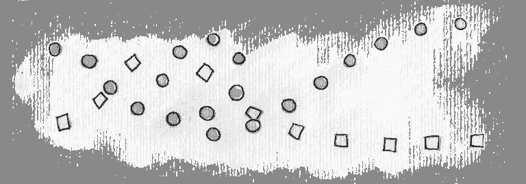
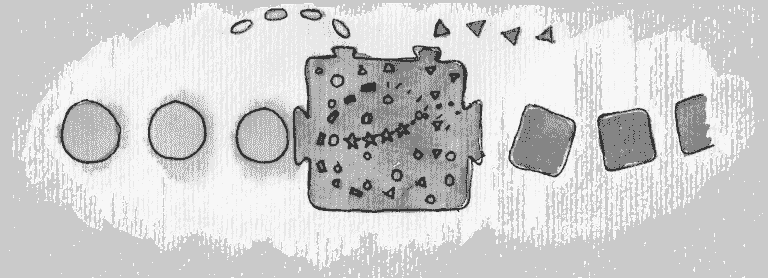
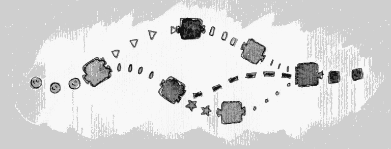

# Java 中纯函数的纯粹幸福

> 原文：<https://dev.to/pietvandongen/pure-bliss-with-pure-functions-in-java-1mba>

写软件很难。
写*好的*软件更难。
写*好，简单的*软件最难。
写*好的，简单的*软件*作为一个团队*是最难的……est。

你不应该需要几个小时来理解一个方法、类或包的作用。如果你甚至开始编程都需要很多精神上的努力，那么在你能产生质量之前，你就会耗尽精力。减少你代码的认知负荷，你就会减少它的错误数量。

“这是纯粹的胡说八道！”你说。“理智的自慰！软件应该模仿现实世界中易变的对象！”

我并不是说你应该去追求一个愿景，然后回来做一个核心的函数式程序员。那不会很有成效。函数式编程和面向对象编程可以很好地互补。

我会告诉你怎么做。

但是首先，让我们来了解一下*什么*和*为什么*它。

## 什么？

纯函数是这样的函数:

1.  …给定相同的输入，总是返回相同的结果。
2.  …没有任何副作用。

简单来说:当调用一个输入为 **A** 的纯函数时，它总是返回 **B** ，不管你调用它的频率、时间和地点。此外，它不做*别的事情*。

[](https://res.cloudinary.com/practicaldev/image/fetch/s--OpYPN8Pc--/c_limit%2Cf_auto%2Cfl_progressive%2Cq_auto%2Cw_880/https://thepracticaldev.s3.amazonaws.com/i/5yi733iw58c4vahfz59u.png)

在 Java 中，一个纯函数可能是这样的:

```
public static int sum(int a, int b) {
    return a + b;
} 
```

Enter fullscreen mode Exit fullscreen mode

如果`a`是`2`，而`b`是`3`，那么结果就是*总是* `5`，不管你调用它的频率有多高，速度有多快，即使是同时调用。

作为反例，这将是一个*不纯的*函数:

```
public static int sum(int a, int b) {
    return new Random().nextInt() + a + b;
} 
```

Enter fullscreen mode Exit fullscreen mode

它的输出可以是任何东西，不管输入是什么。这违反了第一条规则。如果这是一个程序的一部分，这个程序将变得几乎无法推理。

[](https://res.cloudinary.com/practicaldev/image/fetch/s--3Gs4idjm--/c_limit%2Cf_auto%2Cfl_progressive%2Cq_auto%2Cw_880/https://thepracticaldev.s3.amazonaws.com/i/ua0886l34zk1zom33eb7.png)

第二个规则的例子，一个有副作用的函数:

```
public static int sum(int a, int b) {
    writeSomethingToFile();
    return a + b;
} 
```

Enter fullscreen mode Exit fullscreen mode

即使这个方法是静态的并且总是返回相同的值，它也是不纯的。它做的比它宣传的要多。更糟糕的是，它是秘密进行的。

[](https://res.cloudinary.com/practicaldev/image/fetch/s--aZ60MsLF--/c_limit%2Cf_auto%2Cfl_progressive%2Cq_auto%2Cw_880/https://thepracticaldev.s3.amazonaws.com/i/gs5w5e078zp3nxe4l9dw.png)

这些例子可能看起来简单无害。但是杂质增加得很快。

## 为什么？

假设你有一个相当大的程序，你想增加一个新的特性。在你这样做之前，你必须知道它*做什么*。您可能会从查看代码、阅读文档、跟随方法调用等等开始。

当你这样做的时候，你正在创建一个程序的心智模型。你试图适应你头脑中每一个可能的数据流。人类的大脑并不适合这项任务。在这里的一些状态变化，那里的一些条件变化之后，你开始变得有些模糊。

[](https://res.cloudinary.com/practicaldev/image/fetch/s--gTJBrHLf--/c_limit%2Cf_auto%2Cfl_progressive%2Cq_auto%2Cw_880/https://thepracticaldev.s3.amazonaws.com/i/0qxtkd2twnhx8xp44agc.png)

现在我们有了滋生虫子的温床。

那么如何才能防止这种情况呢？首先，通过降低我们程序的复杂性。纯函数在这里会有很大的帮助。

## 如何？

澄清复杂代码的一个好方法是将它分解成更小、更易管理的部分。理想情况下，每一位都有自己的责任。这使得他们更容易推理，特别是如果我们可以孤立地测试他们。

在解开意大利面条的时候，你会注意到你现在能够释放你的一些智力。你正在慢慢抓住问题的核心。每一个可以独立存在的部分都可以被移动，这样你就只剩下程序的精髓了。

找到那个 bug 现在容易多了。添加一个很酷的新功能也是如此。为了使事情更具体，这里有一些指导方针。

### 分区

首先，根据功能划分较大的部分。思考解决方案的各个部分以及它们是如何相互连接的。

[](https://res.cloudinary.com/practicaldev/image/fetch/s--Fcc58Qw---/c_limit%2Cf_auto%2Cfl_progressive%2Cq_auto%2Cw_880/https://thepracticaldev.s3.amazonaws.com/i/w1cb41i9713yd8dkg0a7.png)

### 分手

把那些部分分解成可组装的单元。定义一个可用于从列表中过滤项目的函数，或者一个可重复用于每个项目的操作。也许可以添加助手函数来封装逻辑，否则这些逻辑会隐藏在深度嵌套的代码中。

[](https://res.cloudinary.com/practicaldev/image/fetch/s--xH-BRxqB--/c_limit%2Cf_auto%2Cfl_progressive%2Cq_auto%2Cw_880/https://thepracticaldev.s3.amazonaws.com/i/8rysdenxuxv6dyd7mnkz.png)

### 文档

当你觉得你已经“完成”了一个单元时，就写文档。这将帮助您从不同的角度看到逻辑，并揭示不可预见的边缘情况。如果有必要，添加单元测试来进一步定义程序的意图。

[](https://res.cloudinary.com/practicaldev/image/fetch/s--RDbZNPFx--/c_limit%2Cf_auto%2Cfl_progressive%2Cq_auto%2Cw_880/https://thepracticaldev.s3.amazonaws.com/i/fx9jh3x5tpbe07phcbuo.png)

冲洗并重复。

*done* 的定义是个人化的，可以随着时间的推移而改变。不要过度。如果还是不够清楚，以后你就知道了。如果不是在代码审查期间，可能是在向项目添加新功能时。

到目前为止，一切顺利，对吧？理论总是听起来很棒。但是我们需要一些令人信服的实际例子。

## 举个例子

假设我们有一个销售物联网设备的客户。客户可以在家中安装这些设备，并将其连接到互联网。他们可以通过手机上的应用程序来控制这些设备。

我们的客户希望他们的客户在设备离线一段时间后收到推送通知，这样他们就有机会重新连接设备。如果它保持离线，他们希望定期推送通知，提醒客户重新连接设备。但是不要太频繁，因为他们不希望不稳定的设备导致无休止的警告。

此外，我们的客户希望能够调整发送这些消息的阈值。在运行时，不需要付钱给我们。应该至少有一个阈值，但是可以有任意多个阈值。

使用我们的后端软件，我们可以检测这些物联网设备的在线状态。如果他们离线，我们会保存他们离线的时间。

### 天真的实现

我们如何实现这一点？这个特性在理论上看起来很简单，所以我们可以开始，看看我们能走多远。

在做了一些搭建之后，我们很快找到了问题的核心:确定是否应该为每个离线设备发送通知。听起来很简单，对吧？

```
public void run() {
    // @todo Send notifications for offline devices
} 
```

Enter fullscreen mode Exit fullscreen mode

我们在这里添加一些 for 循环。

```
for (Map.Entry<Device, Instant> offlineDevice : offlineDevices.entrySet()) {
    for (Duration threshold : thresholds) {
        // ...
    }
} 
```

Enter fullscreen mode Exit fullscreen mode

一些 if 语句。

```
if (firstThresholdWasPassed) {
    // ...
} 
```

Enter fullscreen mode Exit fullscreen mode

看起来不错！

等等，最后一个门槛有个特例。

```
if (i == thresholds.size()) {
    // ...
} 
```

Enter fullscreen mode Exit fullscreen mode

哦，一个门槛一个。

```
if (thresholds.size() == 1) {
    // ...
} 
```

Enter fullscreen mode Exit fullscreen mode

糟糕，我们忘记检查每个阈值的通知是否已经发送。在三个地方。

```
if (!lastOfflineNotificationInstant.isPresent()) {
    // ...
} 
```

Enter fullscreen mode Exit fullscreen mode

如果它是在设备离线前发送的呢？

```
if (Duration.between(disconnectInstant, lastOfflineNotificationInstant.get()).isNegative()) {
    // ...
} 
```

Enter fullscreen mode Exit fullscreen mode

[天啊](https://github.com/pietvandongen/pure-bliss-with-pure-java-functions/blob/master/src/main/java/com/pietvandongen/purebliss/offlinedetector/job/naive/OfflineDevicesJobImpl.java#L42)。

[SonarLint](https://www.sonarlint.org/) 口吐白沫，告诉我们要降低 69 的认知复杂度，这里允许 15。[单元测试](https://github.com/pietvandongen/pure-bliss-with-pure-java-functions/blob/master/src/test/java/com/pietvandongen/purebliss/offlinedetector/job/naive/OfflineDevicesJobTests.java)也变得相当复杂，不得不使用外部[时钟](https://docs.oracle.com/javase/8/docs/api/java/time/Clock.html)之类的东西。

[](https://res.cloudinary.com/practicaldev/image/fetch/s--PbckzFRv--/c_limit%2Cf_auto%2Cfl_progressive%2Cq_auto%2Cw_880/https://thepracticaldev.s3.amazonaws.com/i/k59ixxi8ruklsbmdw1zm.png)

我们不能让未来的自己看到这个，他们会杀了我们的！

幸运的是，我们有三步计划。让我们从 1 开始。

### 按功能划分

现在，为了解开这团乱麻。我们的第一步是**按照功能划分**更大的部分，考虑解决方案的各个部分以及它们如何互连。

我们可以通过绘制一个时间线来可视化我们的问题，从设备离线的那一刻开始:

[](https://res.cloudinary.com/practicaldev/image/fetch/s--UvXR89cJ--/c_limit%2Cf_auto%2Cfl_progressive%2Cq_auto%2Cw_880/https://thepracticaldev.s3.amazonaws.com/i/9lqiuthguys59lq30o7m.png) 在时间轴上我们可以绘制各种阈值:

[](https://res.cloudinary.com/practicaldev/image/fetch/s---_0_tQyJ--/c_limit%2Cf_auto%2Cfl_progressive%2Cq_auto%2Cw_880/https://thepracticaldev.s3.amazonaws.com/i/n5gjes7fe5a04o00fn2i.png)

每当我们的作业运行时，我们就到达了时间轴上的某一点。如果我们还没有超过阈值，则不需要做任何事情:

[](https://res.cloudinary.com/practicaldev/image/fetch/s--gGSLqruD--/c_limit%2Cf_auto%2Cfl_progressive%2Cq_auto%2Cw_880/https://thepracticaldev.s3.amazonaws.com/i/t4omltnmhmp6uesal5rm.png)

如果我们确实超过了阈值，我们应该发送一个通知并记住我们发送它的时间:

[](https://res.cloudinary.com/practicaldev/image/fetch/s--vCvYFoM1--/c_limit%2Cf_auto%2Cfl_progressive%2Cq_auto%2Cw_880/https://thepracticaldev.s3.amazonaws.com/i/2dswmqoqgdmo1fa7m972.png)

下次运行作业时，我们应该考虑发送的通知。如果我们已经超过了一个用户已经得到通知的阈值，我们什么也不做:

[](https://res.cloudinary.com/practicaldev/image/fetch/s--I6Ww-8UF--/c_limit%2Cf_auto%2Cfl_progressive%2Cq_auto%2Cw_880/https://thepracticaldev.s3.amazonaws.com/i/vi7735yr2zh40dg8btuj.png)

只有当超过另一个阈值时，我们才能发送另一个通知:

[](https://res.cloudinary.com/practicaldev/image/fetch/s--6JK1FlLC--/c_limit%2Cf_auto%2Cfl_progressive%2Cq_auto%2Cw_880/https://thepracticaldev.s3.amazonaws.com/i/mz4u4ad8pgounfxwgf89.png)

诸如此类。

我们如何用代码来表达呢？看来我们需要知道:

*   我们最后通过了哪个阈值(如果有)。
*   我们为哪个阈值(如果有)发送了最后一个通知。

基本就是这样。如果我们知道这些，我们就可以确定是否应该发送通知。我们解决方案的这两个核心部分涵盖了所有特殊情况和复杂性。

现在，我们需要看看是否可以通过将解决方案分解成可组合的部分来进一步简化它。

### 把它分解成可组合的单位

[](https://res.cloudinary.com/practicaldev/image/fetch/s--zLmnKuz5--/c_limit%2Cf_auto%2Cfl_progressive%2Cq_auto%2Cw_880/https://thepracticaldev.s3.amazonaws.com/i/zuxuuewwqlh0ho60ynzm.png)

上面的两句话看起来非常熟悉，不是吗？那是因为他们是。它们都定义了一个阈值或者什么都没有。他们都需要类似的输入:

*   设备离线的那一刻。
*   阈值。
*   我们目前正在评估的时间点。

现在我们知道了单元的输入和输出，我们可以定义它的签名了。使用花哨的`java.time` API，我们可以这样表达:

```
Optional calculateLastPassedThreshold(Instant start, Instant current, Duration[] thresholds); 
```

Enter fullscreen mode Exit fullscreen mode

我们现在可以使用这个函数来获得我们需要的两个阈值。我说功能了吗？让我们把它变成一个*纯函数*:声明它是静态的，并确保它是确定性的，不会产生任何副作用:

```
static Optional<Duration> calculateLastPassedThreshold(Instant start, Instant current, List<Duration> thresholds) {
    Duration timePassed = Duration.between(start, current);

    if (timePassed.compareTo(thresholds.get(0)) <= 0) {
        return Optional.empty();
    }

    for (int i = 0; i < thresholds.size(); i++) {
        if (timePassed.compareTo(thresholds.get(i)) <= 0) {
            return Optional.of(thresholds.get(i - 1));
        }
    }

    return Optional.of(thresholds.get(thresholds.size() - 1));
} 
```

Enter fullscreen mode Exit fullscreen mode

那里！除了它惊人的纯度，它还有另一个优点:[它可以非常容易地进行单元测试](https://github.com/pietvandongen/pure-bliss-with-pure-java-functions/blob/master/src/test/java/com/pietvandongen/purebliss/offlinedetector/job/brokenup/OfflineDevicesJobTests.java#L78)。你不需要模仿或者外部时钟来测试这部分代码。

你能感觉到你的大脑刚刚恢复了多少空间吗？当对我们的解决方案的其余部分进行编程时，我们可以相信这个函数会做它所说的事情。

那还剩下什么？

我们现在可以为每台设备确定是否应该发送通知。同样，我们可以分离出我们程序的这一部分，使它变得纯净并彻底测试它:

```
static boolean shouldSendNotification(Instant jobStart, Instant deviceOffline, Instant lastNotification, List<Duration> thresholds) {
    Optional<Duration> lastPassedThreshold = calculateLastPassedThreshold(deviceOffline, jobStart, thresholds);

    if (!lastPassedThreshold.isPresent()) {
        return false;
    }

    if (lastNotification.isBefore(deviceOffline)) {
        return true;
    }

    Optional<Duration> lastPassedThresholdNotifiedAbout = calculateLastPassedThreshold(deviceOffline, lastNotification, thresholds);

    return !lastPassedThreshold.equals(lastPassedThresholdNotifiedAbout);
} 
```

Enter fullscreen mode Exit fullscreen mode

或者，更简洁地说:

```
static boolean shouldSendNotification(Instant jobStart, Instant deviceOffline, Instant lastNotification, List<Duration> thresholds) {
    Optional<Duration> lastPassedThreshold = calculateLastPassedThreshold(deviceOffline, jobStart, thresholds);

    return lastPassedThreshold.isPresent() && (lastNotification.isBefore(deviceOffline) || !lastPassedThreshold.equals(calculateLastPassedThreshold(deviceOffline, lastNotification, thresholds)));
} 
```

Enter fullscreen mode Exit fullscreen mode

当您知道设备没有以前发送的通知时，您只需使用:

```
static boolean shouldSendNotification(Instant jobStart, Instant deviceOffline, List<Duration> thresholds) {
    return calculateLastPassedThreshold(deviceOffline, jobStart, thresholds).isPresent();
} 
```

Enter fullscreen mode Exit fullscreen mode

现在剩下的唯一一件事就是在每次我们的作业运行时为每个离线设备调用这些函数:

```
public void run() {
    Instant jobStart = Instant.now();

    offlineDevices.entrySet().stream()
            .filter(offlineDevice -> pushNotificationService
                    .getLastOfflineNotificationInstant(offlineDevice.getKey())
                    .map(instant -> shouldSendNotification(jobStart, offlineDevice.getValue(), instant, thresholds))
                    .orElseGet(() -> shouldSendNotification(jobStart, offlineDevice.getValue(), thresholds))
            )
            .forEach(offlineDevice -> pushNotificationService.sendOfflineNotification(offlineDevice.getKey()));
} 
```

Enter fullscreen mode Exit fullscreen mode

我们正濒临*[iam very smart](https://www.reddit.com/r/iamverysmart/)*——这里的领地。不是每个人都喜欢这种编码风格，可以说它比更传统的风格更难解析。所以我们至少可以记录下我们的部队。

### 记录我们的解决方案

除了与他人友好相处之外，描述我们的代码还可以帮助我们抓住最后一个 bug，或者揭示我们还没有想到的边缘情况。

在我们的例子中，文档很明显是以 Javadoc 的形式出现的，例如:

```
/**
 * Checks whether a notification should be sent by determining which threshold has been passed last for the
 * calculated amount of time passed between the device going offline and the job running.
 *
 * @param jobStart         The instant the job calling this function was started.
 * @param deviceOffline    The instant the device went offline.
 * @param lastNotification The instant the last notification was sent.
 * @param thresholds       The list of notification thresholds.
 * @return True if the notification should be sent, false if not.
 */
static boolean shouldSendNotification(Instant jobStart, Instant deviceOffline, Instant lastNotification, List<Duration> thresholds) {
    // ...
} 
```

Enter fullscreen mode Exit fullscreen mode

单元测试也可以被视为文档，因为它们可以非常精确地定义被测试程序的预期用途。在纯函数的情况下，您经常需要测试一系列不同的输入，[参数化测试](https://github.com/junit-team/junit4/wiki/parameterized-tests)可以派上用场。

在编写测试和文档时，我们将我们的思维从问题转移到解决方案及其用户。从另一个角度来看，我们代码中的微妙问题会被强调出来，并且可以当场修复。

## 事后诸葛亮

很难让别人甚至你自己相信这种方法的价值。粗制滥造的功能比精心制作的软件有更明显的商业价值。

当以这种方式处理现有代码时，您可能会浪费很多时间，却没有增加任何可度量的(短期)价值。试着在每日站立时解释这一点。

另一方面，防止一个错误比修复它更便宜，你的代码越干净，增加一个特性或者发现一个错误所花的时间就越少，特别是如果代码已经有一段时间没有被修改的话。

沿着这条线的某个地方，平衡被打破了。一方面是圣杯，无法实现的完美软件。另一方面，不可维护的意大利面条怪兽在滑动，在截止日期上拉屎，膨胀的预算和摧毁团队。

倾听你的直觉，传达你的意图，倾听你的同伴并互相学习:制作优秀的软件是一个持续的(团队)努力。

## 源代码

本文引用的所有代码都是开源的，可以在它的 [GitHub 库](https://github.com/pietvandongen/pure-bliss-with-pure-java-functions)中找到。请随意查看，修改它并提出更好的解决方案。

## 反馈

我希望听到您的反馈，如[拉动请求](https://github.com/pietvandongen/pure-bliss-with-pure-java-functions/pulls)、[问题](https://github.com/pietvandongen/pure-bliss-with-pure-java-functions/issues)或评论！这里正在进行一些愉快的讨论:

*   [本文在其原博客上的评论部分](https://sharing.luminis.eu/blog/pure-bliss-with-pure-functions-in-java/)
*   [本文在 Dzone 上的评论区](https://dzone.com/articles/pure-bliss-with-pure-functions-in-java)
*   [reddit.com/r/programming](https://www.reddit.com/r/programming/comments/793ejt/pure_bliss_with_pure_functions_in_java/)
*   [reddit.com/r/java](https://www.reddit.com/r/java/comments/793gto/pure_bliss_with_pure_functions_in_java/)

或者你可以在下面发表你的评论。