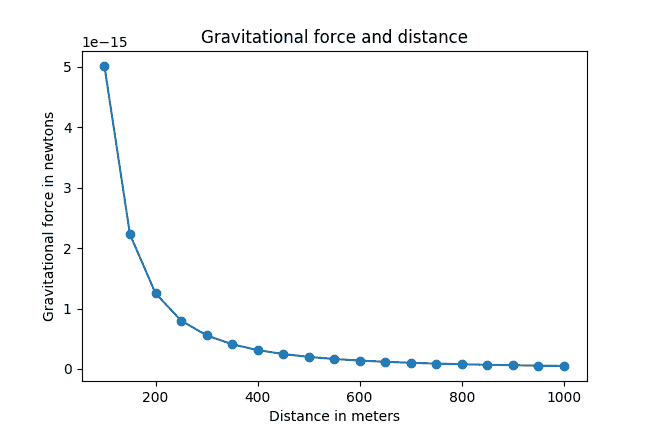

# 数学 Python

> 原文：<https://dev.to/learnbyexample/python-for-maths-2mjl>

上面的图片是使用[用 Python 做数学](https://github.com/doingmathwithpython/code/blob/master/chapter2/Chapter2.ipynb)一书提供的`matplotlib`礼貌代码生成的。

上个月，我有机会为一所文理学院的数学系学生举办初级 Python 研讨会。这是一次很棒的经历，我第一次尝到了 Python 如何应用于数学问题的滋味。这里展示的是一些有用的链接，这些链接是我为学生收集的资源。

# 文档链接

*   [docs.python](https://docs.python.org/3/)
*   [numpy 和 scipy](https://docs.scipy.org/doc/)
*   [matplotlib](https://matplotlib.org/api/index.html)

# 书籍和课程

*   [用 Python 做数学](https://doingmathwithpython.github.io/)
*   [用 Python 做数学](https://maths-with-python.readthedocs.io/en/latest/)
    *   [pdf 版本](https://media.readthedocs.org/pdf/maths-with-python/latest/maths-with-python.pdf)
*   [用 Python 做数学](https://github.com/drvinceknight/Python-Mathematics-Handbook)
*   [Python 科学计算讲座](https://github.com/jrjohansson/scientific-python-lectures)
*   [Python 中的数字信号处理](https://greenteapress.com/thinkdsp/html/index.html)
*   [用于音乐应用的音频信号处理](https://www.coursera.org/learn/audio-signal-processing)
*   [计算机科学中的数学思维](https://www.coursera.org/learn/what-is-a-proof)

# Python 适合初学者

*   [自动 boringstuff](https://automatetheboringstuff.com/2e/)
*   [想 Python](https://greenteapress.com/wp/think-python-2e/)
*   [如何像计算机科学家一样思考:互动版](https://interactivepython.org/courselib/static/thinkcspy/index.html)
*   [全面的 Python 备忘单](https://gto76.github.io/python-cheatsheet/)
*   [stack overflow 上的 Python 技巧和特性](https://stackoverflow.com/questions/101268/hidden-features-of-python)
*   [切片符号和分配](https://stackoverflow.com/questions/509211/explain-pythons-slice-notation)
*   [列出理解](http://treyhunner.com/2015/12/python-list-comprehensions-now-in-color/)
*   [可视化代码执行](http://www.pythontutor.com/visualize.html#mode=edit)
*   [解决问题的技巧](https://ryanstutorials.net/problem-solving-skills/)

# numpy、scipy、matplotlib

*   [从 Python 到 Numpy](https://www.labri.fr/perso/nrougier/from-python-to-numpy/)
*   [高级数字技术](https://nbviewer.jupyter.org/github/vlad17/np-learn/blob/master/presentation.ipynb)
*   [数据科学 Python 笔记本列表](https://github.com/donnemartin/data-science-ipython-notebooks)
*   [犀利的讲稿](https://scipy-lectures.org/)
*   [matplotlib 指南](https://realpython.com/python-matplotlib-guide/)
*   [有效 matplotlib](https://pbpython.com/effective-matplotlib.html)
*   [前 50 名 matplotlib 可视化效果](https://www.machinelearningplus.com/plots/top-50-matplotlib-visualizations-the-master-plots-python/)
*   [matplotlib cheat sheet](https://github.com/juliangaal/python-cheat-sheet/tree/master/Matplotlib)
*   [科学 Python 备忘单](https://ipgp.github.io/scientific_python_cheat_sheet/)
*   [animatplot](https://animatplot.readthedocs.io/en/stable/tutorial/getting_started..html)
*   [基准测试、剖析和优化 Python 代码](https://alimanfoo.github.io/2017/01/23/go-faster-python.html) -包括关于 numpy 的讨论

# 更多资源

*   [职业数学家应该懂什么编程语言？](https://mathoverflow.net/questions/308797/what-programming-language-should-a-professional-mathematician-know)
*   [Python 数学初学者指南](https://wiki.python.org/moin/BeginnersGuide/Mathematics)
*   [有趣的 Jupyter 数学笔记本](https://github.com/jupyter/jupyter/wiki/A-gallery-of-interesting-Jupyter-Notebooks#mathematics)
*   [数学策划资源链接](https://github.com/learnbyexample/curated_resources/blob/master/Education.md#maths)
*   [萨格马斯](https://www.sagemath.org/)
*   [GNU 八度](https://www.gnu.org/software/octave/)

让我知道你最喜欢的 Python 和数学资源。