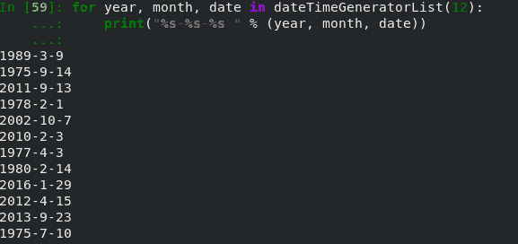

# Python 生成出生日期(测验)

> 原文：<https://dev.to/udomsak/python-generate-birth-date-61g>

今天结束了披萨男孩的工作后(作为送货员/打电话给 [GrabBike](https://www.grab.com/th/en/bike/) )。所以我坐在我的笔记本电脑前，发现我的追随者在 twitter 上谈论“生成出生日期的函数”作为测试。

然后我试着用自己的两个版本解决这个简单的问题，第一个版本使用 yield，第二个版本使用 lambda。

### 版本 1。

我使用 datetime 函数限制当前年份，然后使用 [random()](https://docs.python.org/2/library/random.html) 和 randrange 方法从我在 [range()函数](https://pynative.com/python-range-function/)中限制的范围中获取数字。

```
import random
from datetime import datetime

def genDateOfBirth(number=1):
    CurrentTime = datetime.now()
    Year = random.randrange(1911, CurrentTime.year)
    for item in range(number):
        yield random.randrange(1911,CurrentTime.year), random.randrange(1, 12), random.randrange(1, 31)

dateTimeThatIwant = genDateOfBirth(12)

for year, month, date in dateTimeThatIwant:
    print("GenDate in yyyy-mm-dd  as %s-%s-%s" % (year, month, date)) 
```

### 版本二。

然而，我有一些疑问

*   我能重构我的代码吗？。
*   我可以指定 python 使用计算机的起始年份吗？。

所以用[λ](http://book.pythontips.com/en/latest/lambdas.html)和[列表-理解](https://www.pythonforbeginners.com/basics/list-comprehensions-in-python)复合。

```
 import random
from datetime import datetime
from time import gmtime

# gmtime(0) you will get epoch first year = 1970 
# read more -> https://en.wikipedia.org/wiki/System_time 
startYear = gmtime(0)
CurrentYear = datetime.now()

dateTimeGeneratorList = lambda numberOflist : [(yield random.randrange(startYear.tm_year, currentYear.year), random.randrange(1,12), 
random.randrange(1,31)) for item in range(numberOflist)]

# 12 if number of list that we need to printout . 
for year, month, date in dateTimeGeneratorList(12):
   print("%s-%s-%s " % (year, month, date)) 
```

## 搞定！！但是，我能做得更好吗？:)

[](https://res.cloudinary.com/practicaldev/image/fetch/s--NCdOPJNE--/c_limit%2Cf_auto%2Cfl_progressive%2Cq_auto%2Cw_880/https://thepracticaldev.s3.amazonaws.com/i/s310pzvcb6k43o63o6cp.png)